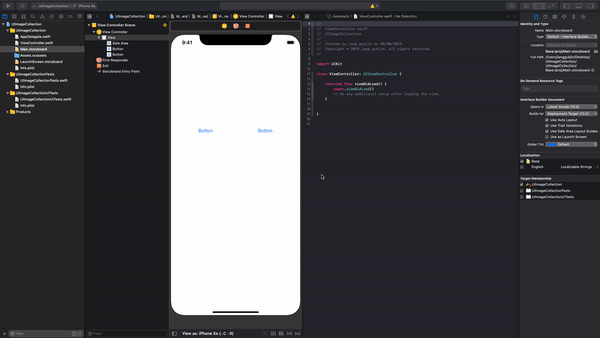
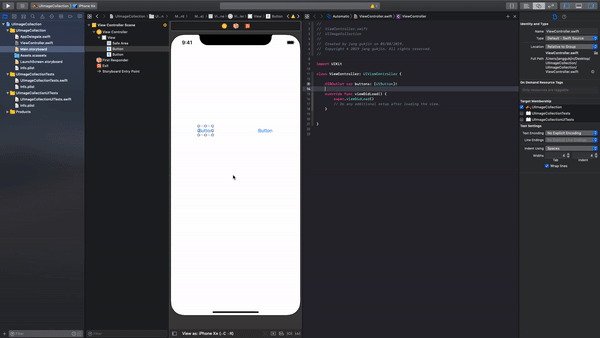
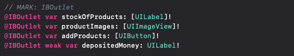
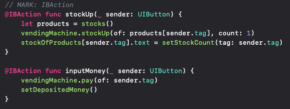
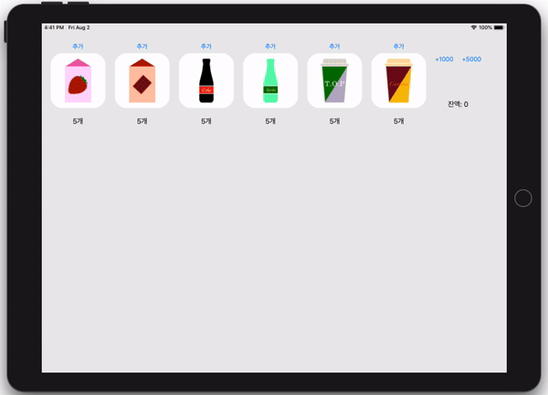

# Step1 - 아이패드앱 (25.7.19)

## 구조

- **DateUtil (struct):** date에 대한 데이터를 가지고 있는 구조체
- **Product (class):** 제품의 속성(brand, capacityl, price, name, date)을 가지는 클래스
- **Milk (class):** Product를 상속하고, brand를 "서울우유"로 가지는 클래스
- **Soda (class):** Product를 상속하고, brand를 "팹시"로 가지는 클래스
- **Coffee (class):** Product를 상속하고, brand를 "맥심"로 가지는 클래스
- **StrawberryMilk (class):** Milk를 상속받고 유통기한을 입력받는 클래스
- **ChocolateMilk (class):** Milk를 상속받고 유통기한을 입력받는 클래스
- **Coke (class):** Soda를 상속받고 칼로리를 입력받는 클래스
- **Sprite (class):** Soda를 상속받고 칼로리를 입력받는 클래스
- **TOPCoffee (class):** Coffee를 상속받고 온도를 입력받는 클래스
- **CantataCoffee (class):** Coffee를 상속받고 온도를 입력받는 클래스


## 해당 Step을 진행하면서 배운 내용

### iOS 메인 런루프 동작, UIApplicationMain()의 역할

[참조: 오늘의 Swift 상식 (앱 생명주기)](https://medium.com/@jgj455/오늘의-swift-상식-앱-생명주기-878dfe51d182)


### macOS, iOS의 프로젝트 템플릿 구조의 차이점

**macOS**

1. AppDelegate

   

   **Cocoa:** Apple에서 iOS, macOS 등의 애플 운영 체제용 앱을 제작할 때 사용하는 프레임워크

   - NSApplicationMain은 UIApllicationMain과 같은 역할을 한다고 보면 된다.

     ```
     int NSApplicationMain(int argc, const char * _Nonnull *argv); 
     // argc: argv의 갯수
     // argv: 앱 시작 시 앱으로 전달된 인자를 포함하는 포인터의 배열
     ```

   - macOS에서는 main()함수로 NSApplicationMain을 사용한다.

   - mac은 기본적으로 프로젝트를 생성하면 Cocoa를 import하며 NSApplicationMain이 호출된다. 그리고 AppDelegate는 NSObject 클래스를 상속받고, NSApplicationDelegate 프로토콜을 채택한다.

2. ViewController

   

   ViewController에서는 NSViewController 클래스를 상속받는다.

   **NSViewController:** nib파일에서 로드 된 View를 관리하는 Controller

   ```swift
   class NSViewController: NSResponder
   ```


**iOS**

1. AppDelegate

   

   프로젝트를 생성하면 UIKit를 import하고 UIApplicationMain이 호출된다. 그리고 AppDelegate 클래스는 UIResponder(UIResponder, NSResponder둘다 NSObject를 상속 받음)를 상속 받고, UIApplicationDelegate를 채택한다.

2. ViewController

   

   ViewController에서는 UIViewController 클래스를 상속받는다.

   UIViewController: UIKit 앱의 View들을 관리하는 객체

   ```swift
   class UIViewController: UIResponder
   ```

   


## 코드 및 결과화면


## 피드백에 대한 개선 내용

| ( 1 )                                                        |
| ------------------------------------------------------------ |
| **피드백 받은 사항:** ViewController에 들어가는 속성들을 접근 제어하지 않았다. |
| **피드백 내용:** private을 우선적으로 고려하는 습관을 가져라 |
| **수정한 내용:** 속성들을 private으로 접근 제어              |


# Step2 - MVC패턴 (4.8.19)

## 해당 Step을 진행하면서 배운 내용

### MVC 패턴

: Model - View - Controller 디자인 패턴으로 앱의 객체를 모델, 뷰, 컨트롤러 세 가지 역할로 할당 한다. 자세한 내용은 Step5에서 정리할 예정(Step3,4에서 알고 가야하는 내용도 있기 떄문)

### IBOutlet Collection

: IBOutlet Collection은 말 그대로 IBOutlet의 Collection으로 수많은 Button, Label, image등을  한번에 관리하는 것이다.

> 버튼을 예시로 들면

1. 아래와 같이 connection이 Outlet Collection인 변수를 만든다.

```swift
@IBOutlet var buttons: [UIButton]!
```

2. 유의할 점은 Collection에 들어가는 버튼들을 전부 지정해줘야한다.



3. buttons라는 [UIButton]을 사용하는 IBAction을 만들어준다.

```swift
    @IBAction func pushButtons(_ sender: UIButton) {
	    // 구현부
    }
```

4. 역시 마찬가지로 Collection에 들어가는 버튼들을 전부 지정해줘야한다.



5. Action을 구현하면 된다.

IBOutlet Collection은 Label, Button, Image 등을 배열로 만든다고 생각하면 된다. 따라서 Action의 내부를 구현할때는 for문을 사용해서 구현해도 되고, 각각을 tag로 구분하여 tag에 따라 구현이 다르게 구현해도 된다.

> 해당 Step에서는 다음과 같이 구현하였다. (tag에 따라 products의 다른 원소에 접근)
>
> 만약 for문을 사용한다면 for button in sender 이런식으로 구현하면 되겠다.

```swift
@IBAction func stockUp(_ sender: UIButton) {
  let products = stocks()
  vendingMachine.stockUp(of: products[sender.tag], count: 1)
  stockOfProducts[sender.tag].text = setStockCount(tag: sender.tag)
}
```

사용해본 결과 반복되는 view들을 관리 할때는 용이하나 특정 객체만을 꼽아 사용하기엔 어려움이 있으므로 이러한 경우에는 따로 구현하는 것이 낫겠다.

### 모서리 둥글게 만들기

해당 Step에서 추가 요구사항으로 각 이미지들의 모서리를 둥글게 만들라하였으며, 이를 코드로 구현해보았다.

1. 먼저 ImageView들을 IBOutlet Collection으로 한번에 묶어주었다.

```swift
@IBOutlet var productImages: [UIImageView]!
```

2. 그 후 viewDidLoad() 내부에 각 이미지의 모서리를 둥글게 하는 코드를 작성하였다.

```swift
for productImage in productImages {
  productImage.layer.cornerRadius = productImage.frame.height/4
}
```

- cornerRadius: layer의 배경에 둥근 모서리를 그릴 때 사용 (길이를 입력받는다. 해당 코드에서는 높이의 1/4을 주었다.)


## 코드 및 결과화면

### 코드

- IBOutlet Collection



- IBAction




### 결과 화면




