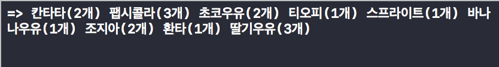
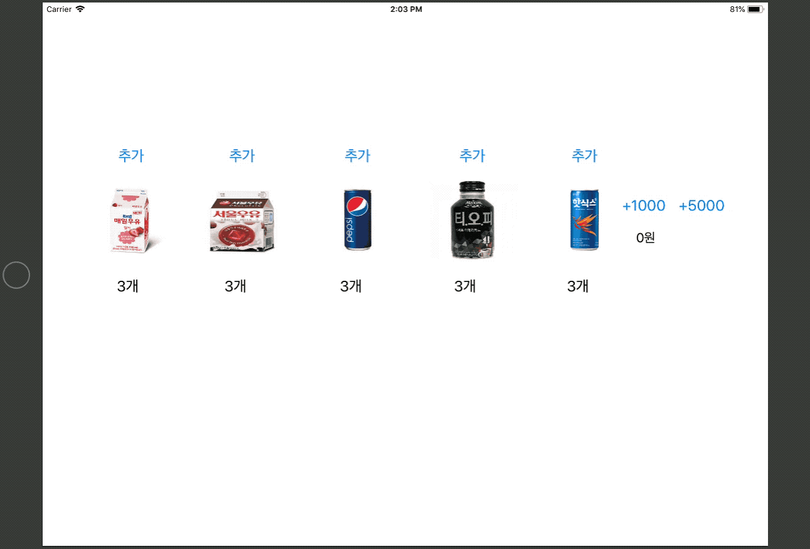
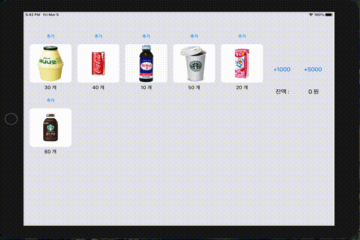
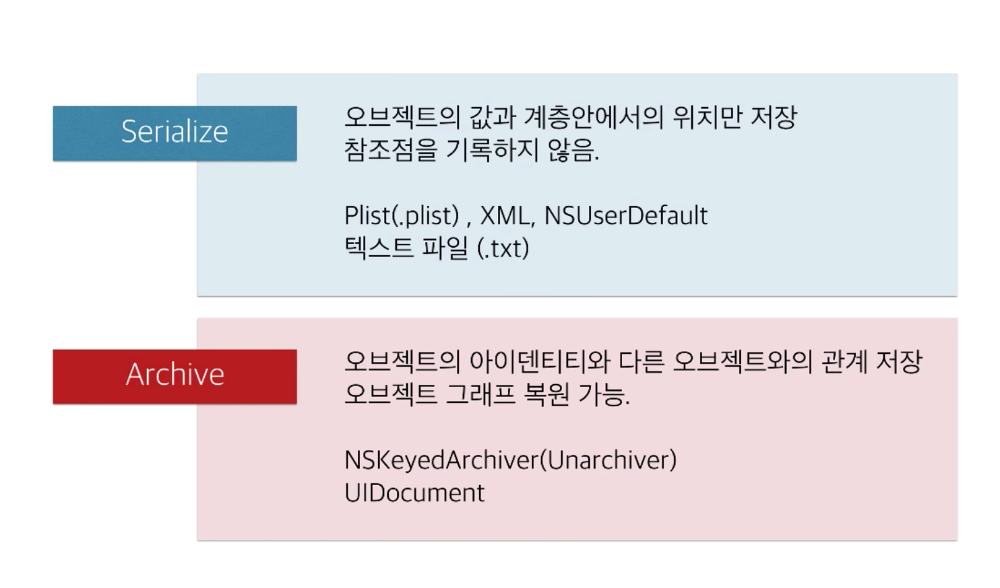
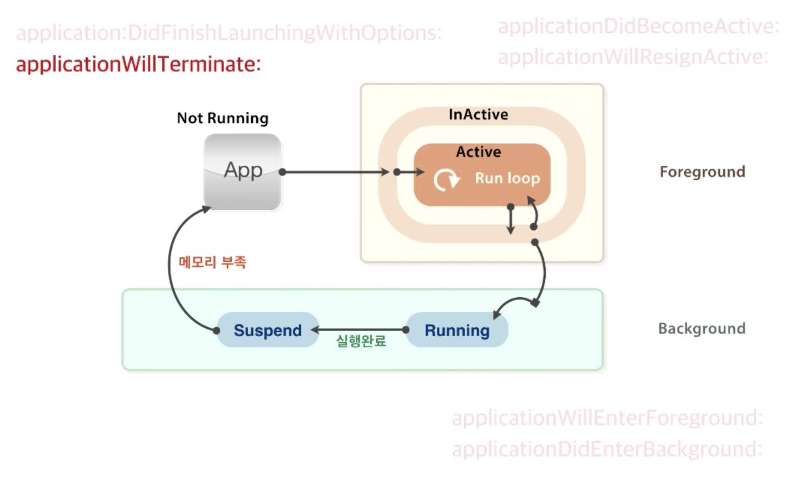
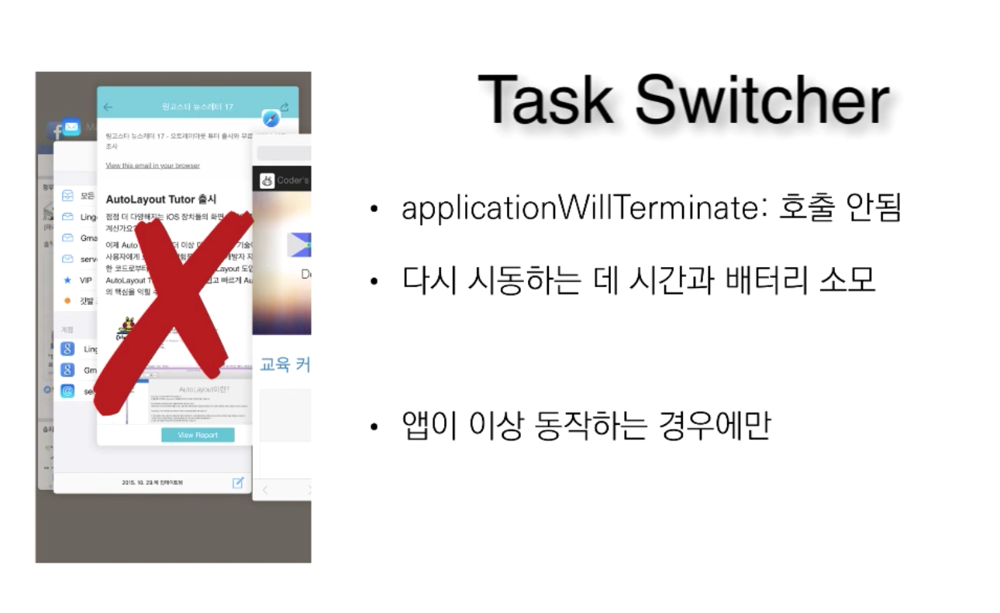

## Step1

### 프로그래밍 요구사항
* 레벨2 VendingMachine 미션의 Main, InputView, OutputView를 제외하고 전체 클래스를 프로젝트로 복사한다.
* 기존 코드들은 MVC 중에서 대부분 Model의 역할을 담당한다.
* iOS 앱 구조는 MVC 중에서도 우선 ViewController-Model 사이 관계에 집중하고, ViewController-View 관계는 다음 단계에서 개선한다.

### 학습꺼리
* iOS 앱을 구성하는 핵심 객체들과 iOS 메인 런루프 동작 이해하기 위해서 애플 [앱 프로그래밍 가이드 문서](https://developer.apple.com/library/archive/documentation/iPhone/Conceptual/iPhoneOSProgrammingGuide/Introduction/Introduction.html#//apple_ref/doc/uid/TP40007072)를 학습한다.
* macOS 프로젝트 템플릿과 iOS 프로젝트 템플릿 구조의 차이점을 학습한다.
* iOS 프로젝트에는 main.swift 가 생략되어 있다.
UIApplicationMain() 함수의 역할에 대해 찾아보고 학습한다.

## Step2

### 프로그래밍 요구사항
* 스토리보드에 다음과 같이 아이패드 앱 화면을 구현한다.
	* 각 상품에 대한 재고 추가 버튼을 추가한다.
	* 각 상품에 대한 이미지를 추가한다.
	* 각 상품에 대한 재고 레이블을 추가한다.
	* 1000원, 5000원 금액을 입력하는 버튼을 추가한다.
	* 현재 잔액을 표시할 레이블을 추가한다.
* 각 상품의 재고 추가 버튼을 누르면 각 상품 재고를 추가하도록 코드를 구현한다.
* 재고 추가 버튼을 누르고 나면 전체 레이블을 다시 표시한다.
* 금액 입력 버튼을 누르면 해당 금액을 추가하도록 코드를 구현한다.
* 금액을 추가하고 나면 잔액 레이블을 다시 표시한다.

### 학습꺼리
* IBOutlet Collection 기능에 대해 학습하고 중복되는 아웃렛을 제거한다.
* UIImageView 에서 이미지를 표시할 때 사각형 코너를 둥글게하도록 변경해본다.

## Step3
### 앱 생명주기와 객체 저장

### 요구사항
* 음료수 자판기 앱 - MVC 요구사항을 구현한 상태로 시작한다.
* 앱 시작부터 종료까지 생명주기를 관리하는 방법을 학습한다. [앱 생명주기 강의 슬라이드](http://public.codesquad.kr/jk/vendingapp-applifecycle.pdf)
* 앱 실행 이후 마지막 자판기 재고 상태와 잔액 등 VendingMachine 객체의 속성을 앱을 종료하더라도 저장하도록 개선한다.
* 앱을 다시 실행하면 마지막 재고 상태를 그대로 복원한다.
* 객체의 속성을 저장하기 위한 아카이브(Archive) 관련된 내용을 학습한다. [아카이브 강의 슬라이드](http://public.codesquad.kr/jk/vendingapp-archive.pdf)
* 실행하고 새로운 화면을 캡처해서 readme.md 파일에 포함한다.

### 프로그래밍 요구사항
* VendingMachine 변수를 ViewController에서 포함하지 않고 AppDelegate로 옮긴다.
* AppDelegate에 선언한 변수를 ViewController에서 접근하기 위한 방법을 찾는다.
	* 힌트. UIApplication.delegate 객체가 AppDelegate의 인스터스임
* 앱 종료(background) 시점 콜백 함수에서 VendingMachine 객체 인스턴스 속성을 저장한다.
	* 저장할 때는 VendingMachine을 아카이브해서 하나의 데이터 값으로 변형한다.
	* 값을 저장하고 복원하는 데에는 UserDefault 라는 파운데이션 라이브러리를 사용한다.
* 앱 시작(activate) 시점 콜백 함수에서 기존에 저장된 값에서 불러와서 VendingMachine 객체 인스턴스를 생성한다.
* 복원할 때는 저장된 데이터 값을 언아카이브해서 VendingMachine 객체를 생성한다.

### 학습꺼리
* 사용자 설정값을 저장하는 UserDefault 클래스에 대해 학습한다.
* UserDefault에서 저장할 수 있는 데이터 타입들을 학습한다.
* [애플 Archive와 Serialization 개발자 문서](https://developer.apple.com/documentation/foundation/archives_and_serialization)를 학습한다.
* [스위프트 4 Encoding, Decoding 개발자 문서](https://developer.apple.com/documentation/foundation/archives_and_serialization/encoding_and_decoding_custom_types)를 학습한다.

* Serialize 간단한 데이터 저장
* Archive 객체의 아이덴티티와 다른 객체와의 관계 저장 

* 복잡한 구동 방식에 코드로 개입할수 있는 방법은 
AppDelegate (앱의 이벤트 대행자)
* 제일 먼저 앱이 실행될때 `didFinishLaunchingWithOptions` 메소드가 실행된다 
	* 여기에 앱 시동시에 해야할 작업들을 넣어둔다 
* 그리고 앱이 InActive에서 Active로 들어올때 `applicationDidBecomeActive` 메소드가 실행된다 
	* 여기서 특정 작업을 한다 
* 앱이 InActive상태로 들어갈때 `applicationWillResignActive` 메소드가 실행되는데
	* 이때는 앱이 백그라운드 상태로 들어갈수도 있으니 준비를 한다
	* 지금 활성화 되어 있는 작업들을 중단시키거나 잠깐 타이머를 멈추거나 하는 작업을 한다 
	* 아직 앱이 백그라운드로 들어가진 않았지만 백그라운드로 들어갈 가능성이 있다는 전제하에 작업을 하는것
* 실제로 앱이 Active 상태로 들어오면 `applicationDidBecomeActive` 메소드를 받을 거고 
* 백그라운드로 들어간다면 `applicationDidEnterBackground`가 되고 마무리 작업을 하게 된다
	* 백그라운드 Running을 해서 하던 작업을 마무리 지을수도 있고 
Running중에 타임아웃이 걸리게 되면 `applicationWillTerminate`
애플리케이션이 종료되기 직전에 마지막에 호출되는 메소드로 마지막 정리 작업을 할수 있다
* 반면에 앱이 Suspand 되어 있다가 메모리 부족 때문에 `applicationWillTerminate` 호출하게 되는 경우도 있다 
	* 이때도 마찬가지로 앱의 마지막 정리 작업을 하는것 

* 이렇게 애플리케이션 라이프사이클 각 단계별로 우리가 개입을 할 수 있도록 메소드가 준비되어 있다 
* 이 안에서 우리가 특정 상황에 맞게 우리가 원하는 작업을 구현할수 있다 

* Task Switcher로 앱을 강제종료 시켜버리는 방식은 `applicationWillTerminate` 호출을 받지 않으므로
앱이 비정상 종료되면서 마지막 작업을 잃게될수도 있다 
* iOS는 시스템이 메모리 압박을 느끼면 알아서 앱을 종료시켜준다 
* iOS가 스스로 최적의 상태를 유지하기 위해 노력한다 굳이 개입해서 앱을 날려버릴 필요가 없다
* iOS앱은 기본적으로 백그라운드에서 자유롭게 동작할수가 없다. 그리고 굉장히 제한되어 있다

### 참고링크
[programmers iOS Swift 입문](https://programmers.co.kr/learn/courses/4)