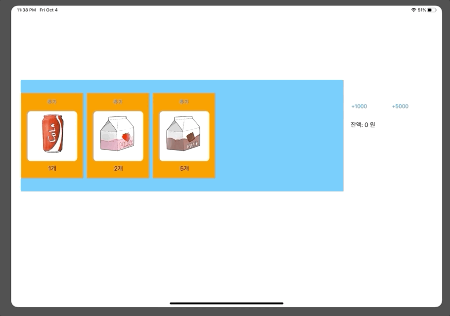
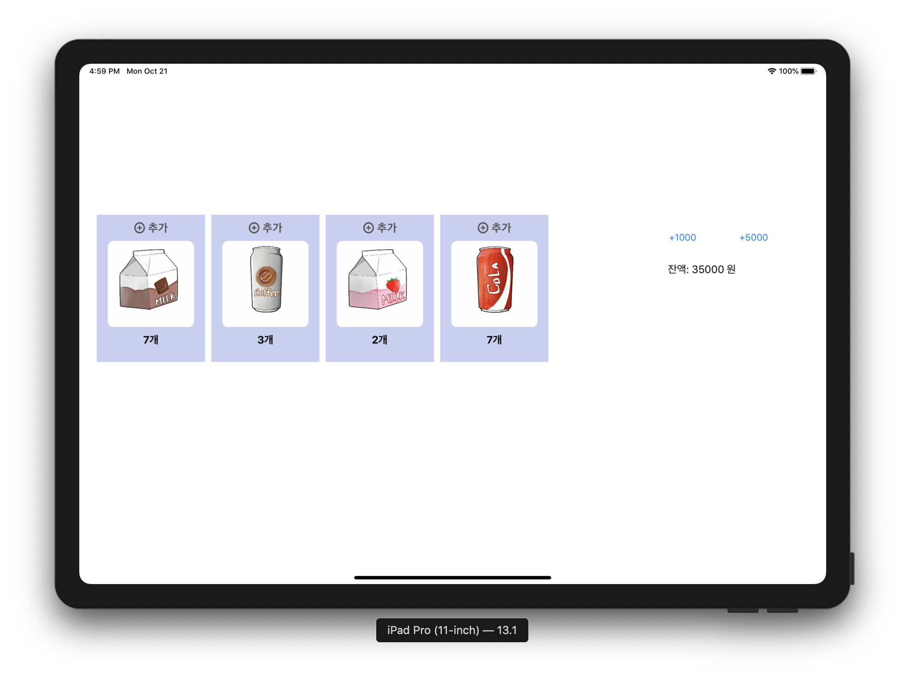
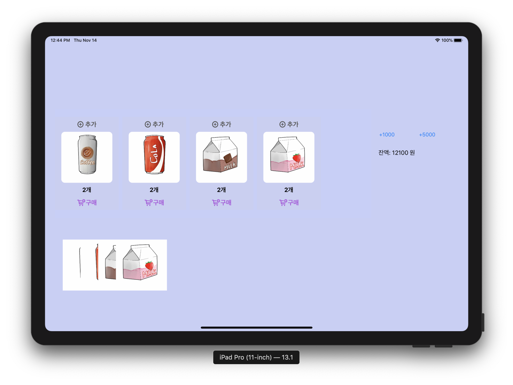
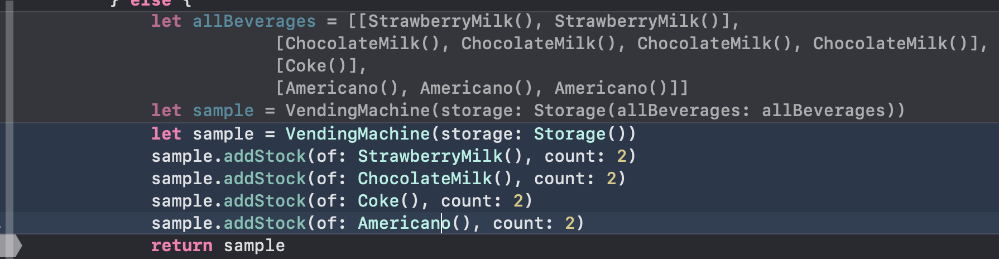
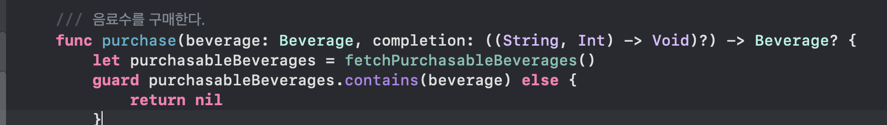
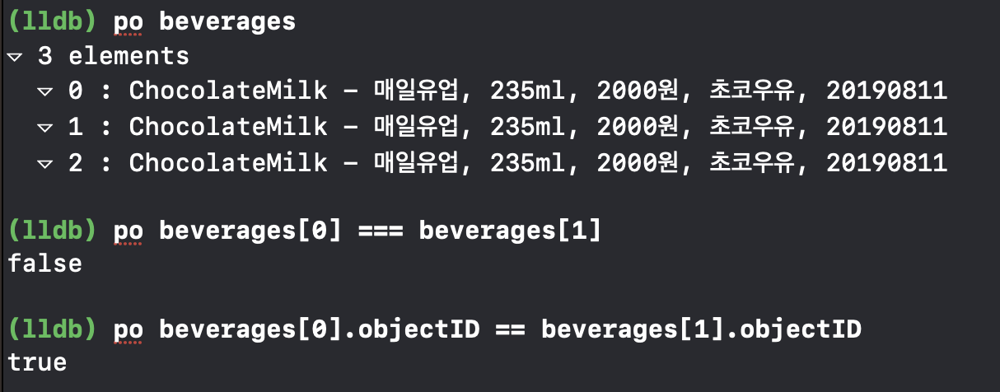
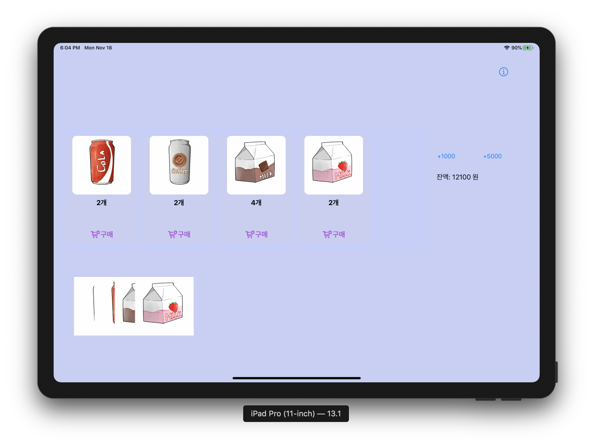
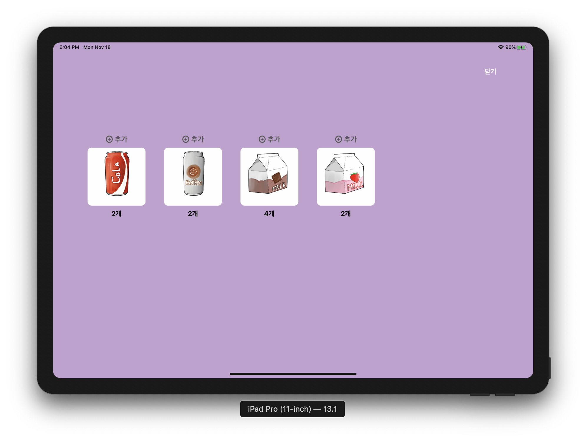

# VendingMachineApp

[1. 아이패드 앱](#1---아이패드-앱)

[2. MVC 패턴](#2---MVC-패턴)

[3. 앱 생명주기와 객체저장](#3---앱-생명주기와-객체-저장)

[4. 싱글톤 모델](#4---싱글톤-모델)

[5. 관찰자(Observer) 패턴](#5---관찰자(Observer)-패턴)

[6. 구매목록 View 코드](#6---구매목록-View-코드)

[7. 관리자 ViewController](#7---관리자-ViewController)

## 1 - 아이패드 앱

###  요구 사항 / 추가 내용

- iOS SingleViewApp 템플릿으로 프로젝트를 생성
- [VendingMachine](https://github.com/cmindy/vendingmachine) 에서 `main`, `Views` 를 제외한 클래스들을 프로젝트로 복사
  - Model의 역할을 담당
- `ViewController`에 `VendingMachine` 객체와 음료수 객체를 추가하고 재고 목록을 출력


### 실행 결과


### 학습 내용

#### The Main Function

- C 기반의 모든 앱의 시작점은 `main`. iOS도 마찬가지로 시작점은 `main` 이다.

- But, iOS에서는 `main` 을 작성하지 않아도 XCode가 기본 프로젝트의 일부로 이 함수를 생성한다.

- ```swift
  #import <UIKit/UIKit.h>
  #import "AppDelegate.h"
  int main(int argc, char * argv[])
  {
      @autoreleasepool {
          return UIApplicationMain(argc, argv, nil, NSStringFromClass([AppDelegate
  class]));
  } }
  ```
  
- `main` 함수는 UIKit 프레임워크에 컨트롤을 넘긴다.

- `UIApplicationMain` 

  - 앱의 핵심 객체 생성
  - 스토리보드에서 앱의 UI를 로드
  - 사용자 지정 코드를 호출해 초기 설정
  - 앱의 런 루프를 실행해 이 프로세스를 처리

#### The Structure of an App

- 앱 시작시  `UIApplicationMain` 함수는 핵심 객체들을 생성하고 앱을 실행한다.

- 모든 iOS 앱의 핵심은 `UIApplication` 객체이다.
  - 시스템과 앱 내의 다른 객체들 간의 상호작용을 원활하게 해 준다.
  - 이벤트 루프와 다른 높은 수준의 앱의 동작을 관리한다.


#### The Main Run Loop

- 앱의 main run loop는 유저와 관련된 모든 이벤트를 처리한다.
- `UIApplication` 객체는 앱 시작 시, 메인 런 루프를 설정한다. 이를 이벤트 처리와 뷰 기반 인터페이스 갱신에 사용한다.
- 앱의 메인 스레드에서 동작한다.
- 관련 이벤트가 들어온 순서대로 순차적으로 처리된다.


- 유저 상호 작용과 관련된 이벤트가 OS에 의해 생성된다.
- UIKit에 의해 설정된 특별한 포트를 통해 앱에 전달된다.
- 앱 안의 이벤트 큐에 이벤트들이 넣어진다.
- 실행을 위해 메인 런 루프에 넣어진다.
- `UIApplication` 객체는 이벤트를 받아서 무엇이 행해져야 하는지 결정을 내리는 첫번째 객체이다.


[⏫ TOP](#vendingmachineapp)

## 2 - MVC 패턴

###  요구 사항 / 추가 내용

- 재고 추가 버튼을 누르면 각 상품의 재고를 추가
  - 재고 추가 버튼 누르고 나면 전체 레이블 다시 표시
- 금액 입력 버튼을 누르면 해당 금액 추가
  - 금액 추가 후 잔액 레이블 다시 표시


### 실행 결과




[⏫ TOP](#vendingmachineapp)

## 3 - 앱 생명주기와 객체 저장

### 요구사항 / 추가 내용

- 
  앱 실행 이후 VendingMachine 객체의 속성(마지막 재고 상태, 잔액 등)이 앱을 종료하더라도 저장되도록 한다.
- 앱을 다시 실행하면 마지막 재고 상태를 그대로 복원한다.

- 앱 종료(background) 시점 콜백 함수에서 VendingMachine 객체 인스턴스 속성을 저장한다.
  - User Default를 사용한다.
- 앱 시작(activate) 시점 콜백 함수에서 기존에 저장된 값에서 불러와서 VendingMachine 객체 인스턴스를 생성한다.
  -  저장된 데이터 값을 언아카이브해서 VendingMachine 객체를 생성한다

### 실행 결과

- 초기 상태


- 백그라운드로 이동 후 재시작


### 학습 내용

#### User Default 

- Finder에서 UserDefault 보기
  - /Users/momo/Library/Developer/CoreSimulator/Devices/(디바이스ID)5C86490A-BB85-4CB5-98B8-2CA20BE99071/data/Containers/Data/Application/(앱ID)A13B0FB4-4A45-48C5-929F-3AFB8DC62246/Library/Preferences/com.cmindy.VendingMachineApp.plist


### 문제 / 해결


- 상속 관계에서 NSCoding 구현시 잘못된 init 사용

- ```swift 
   required convenience init?(coder: NSCoder) {
          let lemonScentContent = coder.decodeInteger(forKey: Keys.lemonScentContent.rawValue)
          
          self.init(lemonScentContent: lemonScentContent)
      }
  ```

- ```swift
      required init?(coder: NSCoder) {
          self.lemonScentContent = coder.decodeInteger(forKey: Keys.lemonScentContent.rawValue)
          
          super.init(coder: coder)
      }
  ```

  - 처음에 NSCoding을 구현했을 때 `required convenience init?` 으로 생성했다.
  - convenience init에서는 같은 클래스에서 다른 이니셜라이저를 호출해야하고 지정 이니셜라이저로 끝맺어야한다.
  - 이전에는 self.init으로 상위 클래스의 프로퍼티를 init하지 않았다.
  - `super.init()`을 호출하지 않아서 객체들의 프로퍼티가 언아카이빙이 아니라 새로 init되었다.
  - super.init()을 호출해 LSP를 지키도록 한다.

- 상속 관계에서 NSCoding 구현시 잘못된 encode

  ```swift
      override func encode(with coder: NSCoder) {
          coder.encode(lemonScentContent, forKey: Keys.lemonScentContent.rawValue)
      }
  ```

  ```swift
      override func encode(with coder: NSCoder) {
          coder.encode(lemonScentContent, forKey: Keys.lemonScentContent.rawValue)
          
          super.encode(with: coder)
      }
  ```

  - 상속관계에 있어서 부모 클래스의 프로퍼티들에 대한 encode도 필요
  - `super.encode(with: coder)`를 추가해 부모 클래스의 프로퍼티도 같이 encode 해 아카이빙 한다.

- NSCoding 구현 시 enum 

  - ```swift 
    class Coffee {
      private let bean: Bean
      enum Bean {
            case robusta
            case arabica
            case liberica
        }
      ...
      
    }
    ```

  - Coffee 클래스에는 bean 이라는 enum 프로퍼티가 있다. 

  - enum은 값타입이기 때문에 NSObject을 상속받을 수 없고 NSCoding 프로토콜을 준수할 수 없다.

  - 다른 프로퍼티처럼 encode, decode를 해줬을 때 아카이빙과 언아카이빙이 되지 않았다.

  - enum에 Codable을 채택해 encode와 decode가 되도록 변경했다.

  - 이 경우, `NSCoder`는 Codable (Encodable, Decodable) 을 알지 못하기 때문에 Codable을 알고 있는 NSKeyedArchiver / NSKeyedUnarchiver로 타입 캐스팅해 값을 encode, decode 한다.

  - `@nonobjc public func decodeDecodable<T>(_ type: T.Type, forKey key: String) -> T? where T : Decodable`

  - ```swift
    enum Bean: String, Codable {
      case robusta
      case arabica
      case liberica
    }
    
    
    override func encode(with coder: NSCoder) {
            guard let coder = coder as? NSKeyedArchiver else {
                return
            }
            try? coder.encodeEncodable(bean, forKey: Keys.bean.rawValue)
            super.encode(with: coder)
        }
        
        required init?(coder: NSCoder) {
            guard let coder = coder as? NSKeyedUnarchiver else {
                return nil
            }
            self.bean = coder.decodeDecodable(Bean.self, forKey: Keys.bean.rawValue) ?? .arabica
            super.init(coder: coder)
        }
    ```

  - 

[⏫ TOP](#vendingmachineapp)

##  4 - 싱글톤 모델

### 요구사항 / 추가 내용

- VendingMachine 객체를 싱글톤으로 변경한다.
- sharedInstance 인터페이스를 통해서 AppDelegate와 ViewController에서 접근한다.


### 실행결과

- 초기상태



- 백그라운드로 이동 후 재시작


[⏫ TOP](#vendingmachineapp)


## 5 - 관찰자(Observer) 패턴

### 요구사항 / 추가 내용

- MVC 패턴에서 Model과 Controller의 직접적인 참조 관계를 끊기 위해서 관찰자(Observer) 패턴을 적용한다
  - viewDidLoad에서 Observe를 등록한다
  - 재고가 바뀌는 Notification을 받으면 화면에 Label을 업데이트한다
  - 추가 버튼을 누르면 해당 음식 재고를 모델에 추가할 때마다 VendingMachine 모델 객체에서는 변화에 대해 NotificationCenter에 post한다.

### 실행결과

- 4. 싱글톤 모델 스텝과 같은 실행 결과

[⏫ TOP](#vendingmachineapp)


## 6 - 구매목록 View 코드

### 요구사항 / 추가 내용

- 구매 목록에 대한 제품 이미지뷰를 동적으로 코드로 직접 View에 추가한다.
  - 특정 제품을 구매할 때마다 해당 제품 이미지를 추가하도록 구현한다.
- 구매 목록도 앱 종료이후에 저장되도록한다.

### 실행결과



[⏫ TOP](#vendingmachineapp)


### 문제 / 해결

- 음료 구매시 특정 개수 이상 구매시 구매가 불가능

  - 

  - Archiving 구현시 UserDefault에 값이 없으면 샘플음료를 추가하고, 값이 있으면 archiving해서 저장된 값들을 불러왔었음

    

  - 

  - 음료 구매시 contains로 구매가 가능한지 판단했었음.

  - 

  - 오브젝트 아이디는 같지만 생성을 ChocolateMilk() ChocolateMilk()로 했었기 때문에 같은 객체가 아님.

  - 그렇기 때문에 contains에서 false가 발생해 nil이 리턴되어 돌아왔었음

- 

  - addStock()을 이용해 한 객체만 생성하고 레퍼런스를 늘리는 방식으로 샘플 음료를 생성해서 해결했다. 


## 7 - 관리자 ViewController

### 요구사항 / 추가 내용

- 새로운 뷰컨트롤러를 추가하고 관리자 화면을 구현한다.
  - 이미지와 재고 추가 버튼을 복사해서 관리자 화면으로 복사하고, 동작하도록 코드를 수정한다.
  - 재고 추가 버튼은 기존 화면에서 삭제한다.
  - 관리자 화면에 [닫기] 버튼을 추가하고, 버튼을 누르면 dissmiss()를 호출한다.


### 실행결과

- 유저 모드



- 관리자 모드



[⏫ TOP](#vendingmachineapp)