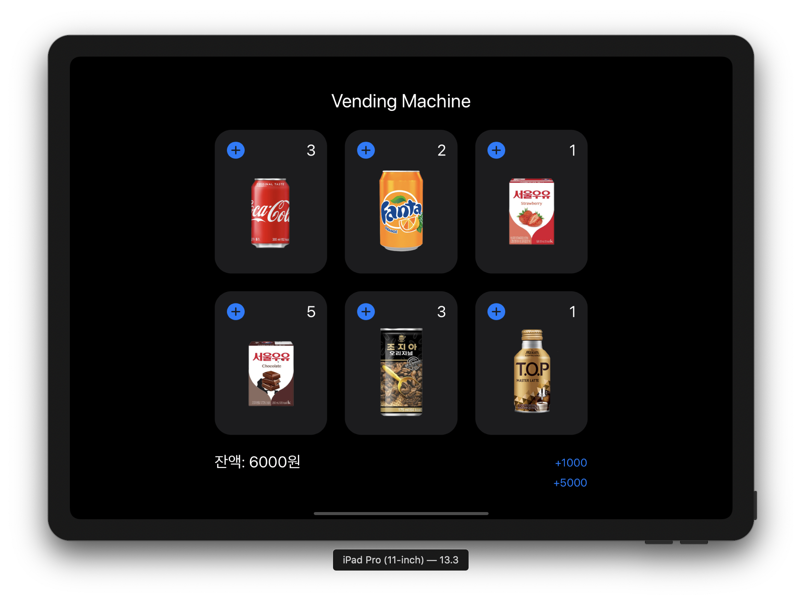

# Vending Machine App

자판기 앱 저장소

## STEP1. 음료수 클래스 설계

* 클래스 Beverage와 이를 상속한 Milk, SoftDrink, Coffee 구현
* 벤딩머신 클래스 구현 및 fill, stockList 기능 추가
* Date formatter 셋업 및 출력 문자열에 날짜 추가

### 개선한 내용

* 프로젝트 템플릿 코드 및 주석 삭제
* 클래스 당 하나의 파일에 작성되도록 수정
* stock list를 직접 생성하지 않고 Array.description을 사용하도록 변경
* DateFormatter가 아니라 Date를 확장하도록 변경
    * 그 안에서 DateFormatter를 이용하여 Date를 문자열로 변환하는 연산 프로퍼티도 구현
    * 외부에서는 연산 프로퍼티에만 접근하도록 변경
* 소프트드링크, 우유, 커피로 분류하지 않고 음료수별 각 서브클래스들을 직접 구현하도록 변경

**실행 결과**

## STEP2. 자판기 기본 동작

* 음료수 클래스 계층을 3단계로 구분.
    * Milk 클래스 구현, 초코/딸기우유를 Milk를 상속하도록 변경
    * SoftDrink 클래스 구현, 콜라/환타를 SoftDrink를 상속하도록 변경
    * Coffee 클래스 구현, TOP/조지아를 Coffee를 상속하도록 변경
    * 접근제한 키워드 지정, 인터페이스 구현 및 테스트
    * 구체적인 하위 클래스들에 대해 매개변수 기본값 제공
* 음료수 배열을 인벤토리 클래스로 추상화
* 자판기 및 인벤토리 클래스에 여러 기능 구현 및 테스트
* 통합 테스트

**가격표**

| 제품     | 가격 |
|----------|------|
| 딸기우유 | 1500 |
| 초코우유 | 1500 |
| 코카콜라 | 1600 |
| 환타     |  900 |
| 티.오.피 | 1200 |
| 조지아   | 1300 |

### 개선한 내용

* 초코우유를 나타내는 더 적합한 프로퍼티로 변경. Bool 대신 확장성이 좋은 Int를 사용하기에도 적절
* canReplaceEnergyDrinks() 이나 isHot() 에서 기준값을 매개변수로 넘기도록 변경
* 인벤토리 에러를 인벤토리 안으로 중첩시킴
* 돈에 관한 로직들을 담당하는 Cashier 새로 생성
* Cashier 테스트 코드 추가
* VendingMachine 테스트 개선
    * Cashier의 행위를 정의한 Calculable 프로토콜을 만들고, VendingMachine은 Calculable을 의존하도록 변경.
    * Calculable 프로토콜을 준수하는 Mock을 만들어서 VendingMachine 테스트
* Beverage 및 하위 클래스들에 각각 hash(into:) 구현
    * 이를 이용하여 테스트 메서드들에서 인스턴스가 같은지를 비교하는 부분들을 모두 개선
* stockList 문자열이 아니라 클로저를 통해 접근하도록 개선
* 음료를 구매할 때도 문자열이 아니라 Beverage 타입을 그대로 활용하도록 개선
* enum이 부적절한 부분은 사용하지 않도록 개선

## STEP3. 자판기 화면 구성

* 음료수 이미지들 추가
* 스토리보드로 화면 구성
* IBOutlet, IBOutletCollection등을 이용하여 스토리보드와 코드 연결
* IBOutletCollection으로 연결된 뷰들에 태그 지정
* Notification을 이용하여 뷰 업데이트 구현
* View Identifier 구현
* 버튼 터치 시 잔액 추가 구현
* 잔액 표시 기능 구현
* 버튼 터치 시 음료수 추가 구현
* 음료수 재고 표시 기능 구현

### 개선한 내용

* Observer들을 관리하는 객체 구현하여 기능 분리
* UIButton을 서브클래싱하고, BeverageFactory는 삭제
    * BeverageFactory에서 하던 일(태그에 맞게 뷰 인스턴스를 생성하는 일)은 버튼 서브클래스로 이동
* 스토리보드에서는 버튼들을 IBAction으로 연결하지 않고, IBOutlet으로 연결하도록 변경
* 인벤토리의 재고를 딕셔너리로 반환하는 함수는 문자열이 아닌 음료수 객체 자체를 키로 갖도록 개선
* 기능이 추가될 때마다 변경되어야 하는 문제가 있었던 ViewIdentifier 타입은 삭제
* 금액 추가 버튼과 음료수 레이블도 적절한 클래스를 서브클래싱하여 구현
* 개선된 모델 코드에 맞도록 테스트 코드도 수정

### 더 개선한 내용

* 뷰 초기화 시점에 버튼마다 다른 동작을 넣어놓기 위해 딕셔너리 이용
* BeverageButton의 switch 비교 구문은 삭제
* BalanceButton과 BeverageLabel에도 적용
* CokeButton, FantaButton 등 각 버튼별로 클래스를 만들어서 각각의 액션을 가지고 있도록 변경.
* ViewController에서는 상위클래스인 BeverageButton의 배열로 관리
* BalanceButton과 BeverageLabel에도 같은 구조 적용

**실행 결과**

