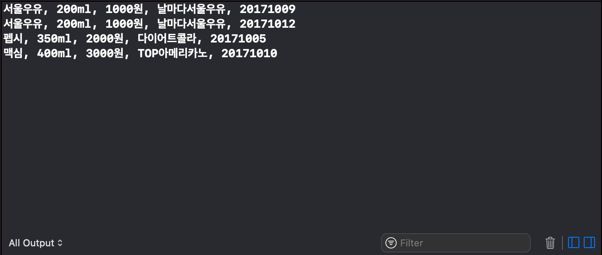
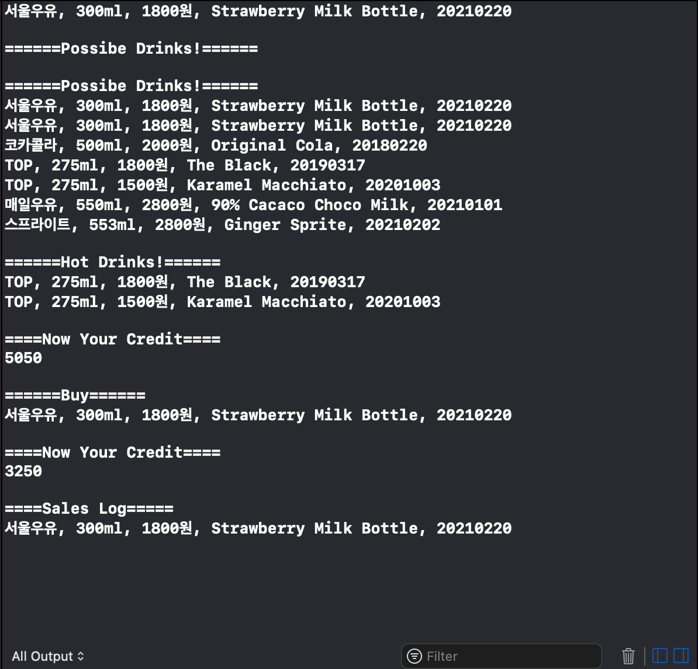
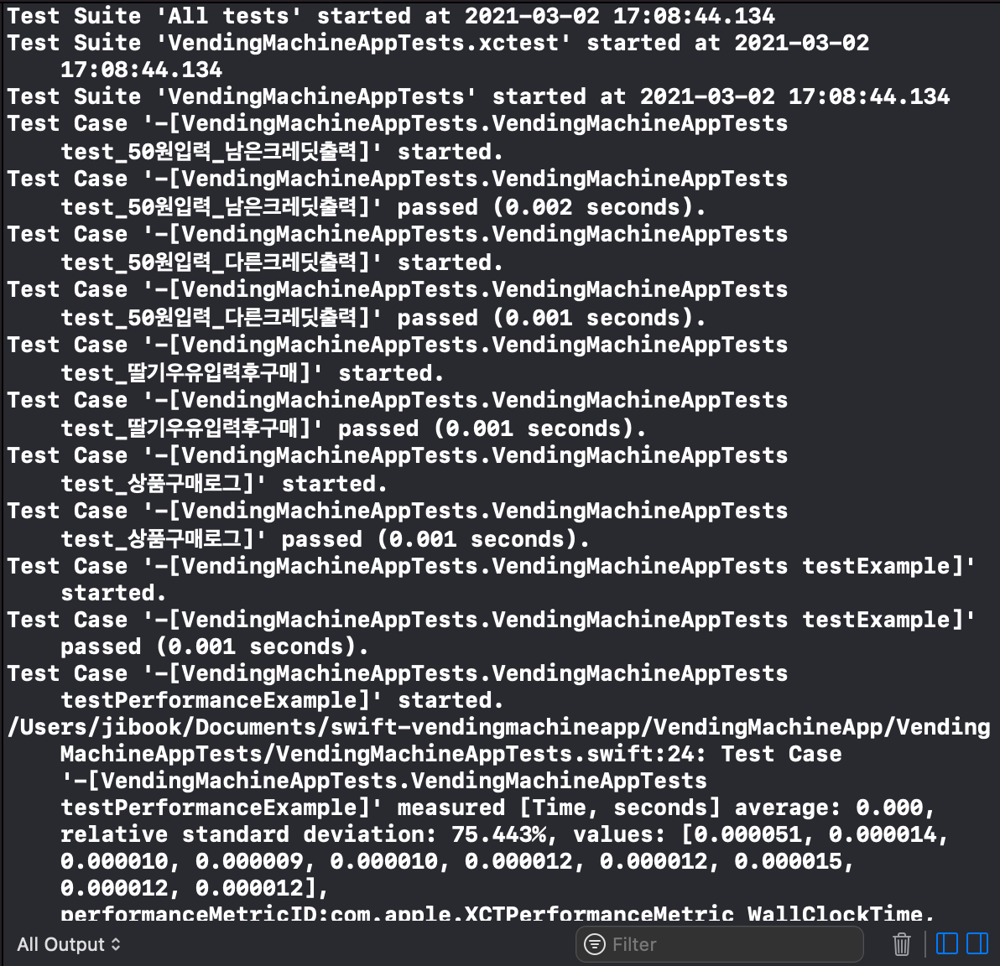

# 🍻 VendingMachine App

## Step01 - 아이패드 앱 (02/24 11:46)

### 실행 화면

### 요구 사항

- 객체지향 프로그래밍 방식으로 아래 예시 음료를 추상화하는 클래스(class)를 설계한다.

- 음료 상품 클래스 출력을 위해서 CustomStringConvertible 프로토콜을 추가하고 구현한다.

- ViewController 에서 특정한 음료수 객체 인스턴스를 클래스별로 구분해서 print() 함수로 출력한다.

### 해결 과정

Drink 상위 클래스에 필수 변수를 가지게 끔 선언 한 뒤

Coffe, Soda, Milk 하위 클래스를 만들어 구분하게 하였습니다.

음료수들을 출력해주기 위해 VendingMachine 객체에서 클로저를 인자로 받는 show 메소드를 구현하였습니다.

String 타입의 날짜를 바로 인자로 받을 수 있게끔 Date 타입을 extension 하여 입, 출력이 용이하게 하였습니다.

## Step02 - 자판기 기본 동작 (03/02 17:09)

### 요구 사항

- 6가지 종류 음료수 상품을 판매하는 자판기 프로그램을 구현한다.
- 자판기 구조체를 테스트하는 유닛테스트를 추가한다.
- XCTest로 단위 테스트를 위해서 테스트 타깃을 추가하거나 설정한다.

### 실행 화면
- TestScenario

    

- XCTest

    