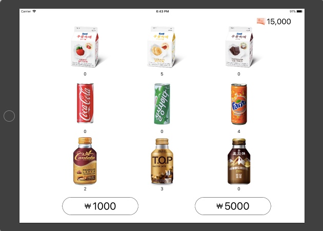

## 음료 자판기 앱

### step-1: 시작하기

#### 요구사항

- 기존 VendingMachine 프로젝트의 Main, InputView, OutputView를 제외하고 전체 클래스를 프로젝트로 복사한다.
- MVC의 Model과 ViewController 사이 관계에 집중한다.
- ViewController 클래스에 VendingMachine 객체를 변수로 추가하고 viewDidLoad() 함수에서 음료수 객체 3종류를 추가하고 재고 목록을 print() 한다.
- iOS 앱을 구성하는 핵심 객체들과 iOS 메인 런루프 동작 이해하기 위해서 [애플 앱 프로그래밍 가이드](https://developer.apple.com/library/content/documentation/iPhone/Conceptual/iPhoneOSProgrammingGuide/Introduction/Introduction.html#//apple_ref/doc/uid/TP40007072)문서를 학습한다.

#### 해결

- iOS 앱을 구성하는 핵심 객체들

  - UIApplication object

    ~~~
    이벤트 루프 및 기타 상위 수준 응용 프로그램 동작을 관리한다. 또한 주요 앱 전환과 푸시 알림과 같은
    특수 이벤트를 커스텀 객체인 위임자에게 보고한다. 서브 클래싱 없이 사용할 수 있다.
    ~~~

  - App delegate object

    ~~~
    커스텀 코드의 핵심이다. 이 객체는 UIApplication 객체와 함께 작동하여 응용 프로그램 초기화,
    상태 전환 및 많은 고급 응용 프로그램 이벤트를 처리한다. 이 객체는 모든 응용 프로그램에 존재할 
    수 있는 유일한 객체이기 때문에 응용 프로그램의 초기 데이터 구조를 설정하는 데 자주 사용한다.
    ~~~

  - Documents and data model objects

    ~~~
    데이터 모델 객체는 앱의 콘텐츠를 저장하며 앱에만 적용된다. 예를 들어 금융 앱은 금융 거래가 포함된 
    데이터베이스를 저장할 수 있지만, 페인팅 앱은 해당 이미지를 만들 수 있는 이미지 객체 또는 그리기 
    명령 시퀀스를 저장할 수 있다. (후자의 경우 이미지 객체는 이미지 데이터의 컨테이너이기 때문에 여전히
    데이터 객체다.) 

    응용 프로그램들은 문서 객체(UIDocument의 사용자 정의 하위 클래스)를 사용하여 데이터 모델 객체 
    일부 또는 전체를 관리 할 수 있다. 문서 객체는 필수는 아니지만 단일 파일 또는 파일 패키지에 속한 
    데이터를 그룹화하는 편리한 방법을 제공한다. 
    ~~~

  - View controller objects

    ~~~
    뷰 컨트롤러 객체는 화면에 나타나는 앱 컨텐츠 프리젠테이션을 관리한다. 뷰 컨트롤러는 단일 뷰와 
    하위 뷰의 집합을 관리한다. 화면에 보여질 때, 뷰 컨트롤러는 앱의 윈도우에 설치하여 볼 수 있게 한다. 

    UIViewController 클래스는 모든 뷰 컨트롤러 객체의 기본 클래스이다. 뷰 로드, 프리젠테이션, 
    디바이스 회전에 따른 뷰 회전, 그리고 몇 가지 다른 표준 시스템 동작을 위한 기본 기능을 제공한다.
    UIKit및 기타 프레임 워크는 이미지 피커, 탭 바 인터페이스, 그리고 네이게이션 인터페이스와 같은 표준 
    시스템 인터페이스를 구현하기 위한 추가 뷰 컨트롤러를 정의한다.
    ~~~

  - UIWindow object

    ~~~
    UIWindow 객체는 화면에서 하나 이상의 뷰 프리젠테이션을 조정한다. 대부분의 앱에는 메인 화면에 
    콘텐츠를 제공하는 오직 하나의 윈도우를 갖고있지만, 외부 디스플레이에 표시된 콘텐츠에 대한 추가 
    윈도우가 있을 수 있다. 앱의 콘텐츠를 변경하려면, 뷰 컨트롤러를 사용하여 해당 윈도우에 표시된 
    뷰를 변경한다. 윈도우 자체를 대체할 수는 없다.
    ~~~

  - View objects, control objects, and layer objects

    ```
    뷰 및 컨트롤은 앱 콘텐츠의 시각적 표현을 제공한다. 
    뷰는 지정된 직사각형 영역에 내용을 그리고 그 영역 내의 이벤트에 응답하는 객체이다. 
    컨트롤은 버튼, 텍스트 필드 및 토글 스위치와 같은 익숙한 인터페이스 개체를 구현하는 특수 유형의 뷰다.
    UIKit 프레임워크는 다양한 유형의 컨텐츠를 표시하기 위한 표준 뷰를 제공한다. 
    또한 UIView (또는 그 자손)를 직접 서브 클래싱하여 고유한 사용자 정의 뷰를 정의 할 수 있다.

    뷰와 컨트롤을 통합하는 것 외에도 앱은 Core Animation 레이어를 뷰와 컨트롤 계층에 통합 할 수 있다. 
    레이어 객체는 실제로 시각적인 컨텐츠를 나타내는 데이터 객체다. 뷰는 레이어 객체를 집중적으로 사용하여
    컨텐츠를 렌더링한다. 인터페이스에 사용자 정의 레이어 객체를 추가하여 복잡한 애니메이션 및 기타 유형의
    정교한 시각 효과를 구현할 수도 있다.
    ```

- iOS 메인 런 루프 동작

  ~~~
  앱의 메인 런 루프는 모든 사용자 관련 이벤트를 처리한다. 
  UIApplication 객체는 실행 시 기본 실행 루프를 설정하고 이를 사용하여 이벤트를 처리하고 뷰 기반
  인터페이스에 대한 업데이트를 처리한다. 이름에서 알 수 있듯이 기본 실행 루프는 앱의 주 스레드에서 
  실행된다. 이 동작은 사용자 관련 이벤트가 수신된 순서대로 순차적으로 처리되도록 한다.
   
  사용자가 기기와 상호 작용할 때 시스템에서 이러한 상호 작용과 관련된 이벤트를 생성하고 UIKit에 의해 
  설정된 특수 포트를 통해 앱에 전달돤다. 이벤트는 앱에 의해 내부적으로 대기열에 넣어지고 실행을 위해 
  메인 런 루프에 하나씩 전달된다. 
   
  UIApplication 객체는 이벤트를 수신하여 수행해야 할 작업을 결정하는 첫 번째 객체다. 터치 이벤트는 
  대개 메인 윈도우 객체에 전달되고, 터치는 터치가 발생한 뷰에 디스패치 한다. 다른 이벤트는 다양한 앱 
  객체를 통해 약간 다른 경로를 취할 수 있다.
  ~~~

### step-2: MVC 패턴

- ~12/4

#### 요구사항

- 스토리보드에 자판기 앱 화면을 구현한다.
  - 각 상품에 대한 재고 추가 버튼을 추가한다.
  - 각 상품에 대한 이미지를 추가한다.
  - 각 상품에 대한 재고 레이블을 추가한다.
  - 1000원, 5000원 금액을 입력하는 버튼을 추가한다.
  - 현재 잔액을 표시할 레이블을 추가한다.

#### 실행화면



#### 피드백 내용

- for-in과 forEach의 차이점
  - forEach 매개변수인 body 클로저의 현재 호출로부터 나가거나 이후의 호출을 생략하기 위해서 break 또는 continue를 사용할 수 없다.
  - 클로저의 return을 사용하면 바디 클로저의 현재 호출만 탈출할 수 있다. 외부 스코프나 이후의 클로저 호출을 생략할 수 없다.
- 뷰 컨트롤러는 그 자체로 재사용이 가능해야 할 만큼 독립적인 단위여야 한다.

### step-3: 앱 생명주기와 객체 저장

- 12/5~7


#### 요구사항

- VendingMachine 변수를 ViewController에서 포함하지 않고 AppDelegate로 옮긴다.
- 앱 실행 이후 마지막 자판기 재고 상태와 잔액 등 VendingMachine 객체의 속성을 앱을 종료하더라도 저장하도록 개선한다.

#### 해결

- 객체 속성을 앱이 종료하더라도 저장하기 위해 아카이빙 사용

  - 객체의 아카이빙은 그 객체의 프로퍼티들을 모두 기록하고 파일시스템에 그 내용을 저장하는 것을 포함한다.

  - 언아카이빙은 아카이브한 데이터로부터 객체를 다시 만든다.

  - 인스턴스들을 아카이빙하고 언아카이빙해야 할 클래스들은 반드시 NSCoding 프로토콜을 따라야 한다.

    ~~~swift
    protocol NSCoding {
      	init?(coder aDecoder: NSCoder)
      	func encode(with aCoder: NSCoder)
    }
    ~~~

  - 위 프로토콜을 따르면 파일시스템에 저장할 수 있는 모델 객체가 생기는 것이다.

  - encode(with:) 메세지를 받으면 인자로 전달된 NSCoder 객체 안에 모든 프로퍼티들을 인코딩할 것이다. 저장 과정 중에 데이터 스트림을 저장하기 위해 NSCoder를 사용할 것이다. 그 스트림은 키-값 쌍으로 구성되어 파일시스템에 저장된다.

  -  모든 iOS 앱은 애플리케이션 샌드박스를 가지며, 이는 파일시스템상의 디렉터리이다. 

    - Documents/ : 앱이 실행 중에 생성한 데이터를 다시 실행 했을 때도 유지할 수 있도록 데이터를 저장하는 디렉터리. 아이튠즈나 아이클라우드와 동기화할 때 백업된다.
    - Library/Caches/ : Documents/ 와 동일하지만, 아이튠즈나 아이클라우드와 동기화할 때 백업되지 않음.

  - 스토리보드 같은 인터페이스 파일에 객체를 추가할 때 객체들은 아카이빙된다. 실행 중에 객체들은 인터페이스 파일에서 언아카이빙되어 메모리에 로드된다. UIView와 UIViewController는 모두 NSCoding 프로토콜을 따른다. 따라서 둘 다 추가적인 작업 없이 아카이빙과 언아카이빙될 수 있다. 

- 애플리케이션 생명주기

  - Not running: 실행 중이 아니다.
  - Active: 앱이 시작한 이후. 화면에 앱의 인터페이스를 표시하고 이벤트를 받을 수 있으며 실행 코드가 이벤트를 처리한다.
  - Inactive: 활성화 상태에서 푸시알림, 전화, 알람 등과 같은 시스템 이벤트를 받으면 일시적으로 중단될 수 있다. 이 이벤트를 처리하기 위해 앱 위에 오버레이가 나타나고 앱은 비 활성화 상태로 진입한다. 코드가 실행되지만 이벤트를 받을 수 없다.
  - Background: 앱은 인터페이스가 보이지 않고 이벤트를 받지 못해도 여전히 코드를 실행할 수 있다. 일정 시간 뒤에 정지상태로 진입합다. 사용자 데이터를 저장하고 모든 공유 리소스를 가능한 빨리 해제해야 한다.

#### 피드백

- 객체 그래프(모델 객체들의 집합)를 아카이브하기 위해서 필요한 경우는 어떤 경우가 있을까요?

  - 앱을 다시 실행해도 데이터가 영구 저장되기 위해 사용한다.

- 아카이브 대신 다른 대안은 뭐가 있을까요?

  - 아카이브의 결점은 아카이브 안의 내용에 접근하려면 전체 파일을 언아카이빙 해야하며, 변경 사항을 저장하려면 반드시 전체 파일을 다시 써야하는 점이다.
  - 반면 코어데이터는 저장된 객체들의 일부분을 가져올 수 있으며, 어떤 객체를 변경한다면 그 파일의 해당 부분만 갱신할 수 있다. 이 경우 파일시스템과 RAM 사이를 오가는 많은 모델 객체를 가지는 경우 앱의 급격한 성능 향상을 가져올 수 있다.
  - 아카이브와 코어데이터는 데이터를 로컬에 저장한다는 공통점이 있고, 원격 서버에 데이터를 저장하길 원한다면 주로 웹 서비스를 이용한다.

- 아카이브를 구현할 때 주의해야 할 점은 뭐가 있을까요?

  ```
  1. 아카이브 할 객체는 NSCoding을 구현해야 한다.
  2. 인코딩 된 값에 지정된 키는 인코딩중인 현재 객체의 범위 내에서만 고유해야 한다. 키가 있는 아카이브는 계층 구조
  이므로 A와 B가 같은 클래스의 인스턴스 인 경우에도 오브젝트 A가 인스턴스 변수를 인코딩하는 데 사용하는 키는 오브젝
  트 B가 사용하는 키와 충돌하지 않는다. 그러나 단일 오브젝트 내에서 서브 클래스가 사용하는 키는 수퍼 클래스에서 사
  용되는 키와 충돌 할 수 있다.
  3. 앱 생명주기에 맞춰 적절한 상태에 아카이브/언아카이브를 해야한다.
  ```

- 특정 객체 인스턴스가 여러 객체에서 중복해서 참조하고 있을 때 아카이브 하면 어떤 현상이 생길까요?

  - 이런 경우 데이터베이스는 relation을 줌으로써 특정 객체 인스턴스가 변경되면 참조하고 있는 연관 값도 변경되는데, 아카이브는 이런 릴레이션 기능이 없으므로, 중복 참조된 값들은 반영되지 않을 것 같다.

#### 학습거리

- UserDefault에서 저장할 수 있는 데이터 타입

  ~~~
  UserDefaults 클래스는 float, double, 정수, 부울 값 및 URL과 같은 일반적인 유형에 액세스하기 위한 편리한
  메소드를 제공한다.
  기본 객체는 NSData, NSString, NSNumber, NSDate, NSArray 또는 NSDictionary의 인스턴스 (또는 컬렉
  션, 인스턴스의 조합)의 속성 목록이어야 한다. 다른 유형의 객체를 저장하려면 일반적으로 객체 유형을 저장하여 
  NSData의 인스턴스를 만들어야 한다.
  변경 가능한 객체를 값으로 설정하더라도 UserDefaults에서 반환되는 값은 변경되지 않습니다. 예를 들어,
  "MyStringDefault"의 값으로 변경 가능한 문자열을 설정하면 나중에 문자열 (forKey :)을 사용하여 검색하는 문자
  열이 변경되지 않는다. 만약 변경할 수 있는 문자열을 기본값으로 설정하고 나중에 문자열을 변경한다면, set (_ : forKey:)을 다시 호출하지 않는 이상 기본값에 변형된 문자열 값이 반영되지 않는다.
  ~~~


### step-4 싱글톤 모델

- 12/8

#### 요구사항

- VendingMachine 객체를 싱글톤(Singleton)으로 접근할 수 있도록 개선한다.

#### 해결 

- VendingMachine 객체를 싱글톤으로 접근하기 위해서는 내부 프로퍼티를 변경하는 mutating 함수를 전부 없애야 했다. 

- 변경 전

  - enableMode 프로퍼티를 만들고 함수 내부에서 Manger 혹은 User 할당 

  ~~~swift
  struct VendingMachine {
    	private var enableMode: EnableMode?
    	...
    	mutating func assignMode(mode: Mode) {
          switch mode {
          case .manager:
              enableMode = Manager(target: core)
          case .user:
              enableMode = User(target: core)
          }
      }
    	...
  }
  ~~~

- 변경 후

  - enableMode 프로퍼티를 없애고 함수 내부에서 모드를 파라미터로 받고 모드에 따라 Manager 혹은 User 생성

  ~~~swift
  struct VendingMachine {
    	static let sharedInstance: VendingMachine = VendingMachine()
    	...
    	func makeMenu(_ mode: Mode) -> MenuContents? {
          var enableMode: EnableMode!
          switch mode {
          case .manager:
              enableMode = Manager(target: core)
          case .user:
              enableMode = User(target: core)
          }
          return enableMode.makeMenu()
      }
    	...
  }
  ~~~

### step-5 Obeserver 패턴

- 12/8~11

#### 요구사항

- ViewController는 viewDidLoad에서 Observe를 등록한다.
- 음식 재고가 바뀌는 Notification을 받으면 화면에 Label을 업데이트한다.
- 추가 버튼을 누르면 해당 음식 재고를 모델에 추가할 때마다
- VendingMachine 모델 객체에서는 전체 음식 재고를 NotificationCenter에 post한다.

#### 피드백

- 튜플과 Data만 있는 ValueObject를 만드는 것은 어떤 기준에서 나누면 좋을까요?
  - 정해진 규칙이 없기 때문에 스스로 기준을 정하도록 노력해야 한다.
- Notification 활용
  - Notification 객체에서 object는 노티를 보내는 sender의미로 사용하고, 값을 넘길 경우는 userInfo를 활용한다.


참고: 애플 공식문서, 아론 힐리가스의 iOS프로그래밍