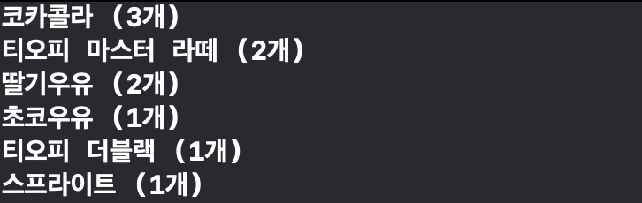

# VendingMachineApp

## 1. 아이패드 앱
### 실행 결과

### 학습 내용
#### main Function
- iOS의 시작점은 `main`
- 직접 만들지 않아도 XCode에서 `main` 기본 제공
- XCode에서 제공된 `main`에서 `UIKit`의 `UIApplicationMain` 호출

#### UIApplicationMain
- `UIApplication`객체 생성
- 스토리보드에서 UI 로딩
- 초기 설정을 위한 코드 호출
- 앱의 실행 루프 동작
- Objective-C에서는 `main.m`에서 실행
  ``` objectivec
	#import <UIKit/UIKit.h>
	#import "AppDelegate.h"
	
	int main(int argc, char * argv[])
	{
    	@autoreleasepool {
        	return UIApplicationMain(argc, argv, nil, NSStringFromClass([AppDelegate class]));
    	}
	}
  ```

- Swift에서는 `AppDelegate.swift`에서 `@UIApplicationMain`로 대체
- `@UIApplicationMain`를 지우고 `main.swift`를 직접 만들어서 실행 가능
- ``` swift
	import UIKit
	
	UIApplicationMain(
		CommandLine.argc,
    	UnsafeMutableRawPointer(CommandLine.unsafeArgv).bindMemory(
            to: UnsafeMutablePointer<Int8>.self,
            capacity: Int(CommandLine.argc)
      	),
    	nil,
    	NSStringFromClass(AppDelegate.self)
	)
  ```
  
#### Main Run Loop
- UIApplication에서 main run loop 설정 
- 사용자 관련 이벤트, UI 업데이트 처리
- main thread에서 실행


1. 유저가 액션을 일으킨다. (터치, 줌인 등)
2. 시스템이 액션에 해당되는 이벤트 생성
3. UIKit을 통해 생성된 Port로 이벤트를 앱으로 전달
4. 이벤트들은 내부 Queue에서 대기하고 있다가 Main run loop에 하나씩 전달