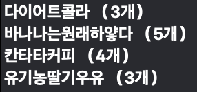
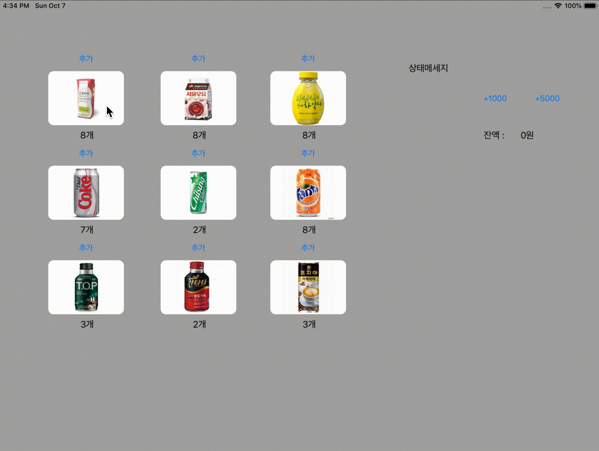

# VendingMachineApp

# Step1
> 이전 자판기 과제에서 main , InputView , OutputView 를 제외한 코드 재사용

### 재사용 하는 과정에서 변경 내용
1. InputView , OutputView 없이 사용
    이전 : Model 역할을 하는 함수 안에서 입력 받고 출력까지 함
    변경 : 매개 변수로 입력 받는 것 대체 , 리턴 사용하여 출력 하는 것 대체
2. For 문 안에 if 조건 하나만 있는 경우에는 for_where 사용하여 대체

### 객체
- AdminMode : 관리자모드
- Beverage : 음료 객체 중 최상위
- Cash : 잔돈 - VendingMachine 객체에서 참조
- Coffee : 커피 카테고리 객체와 하위 객체 존재
- Error : 에러 관련 객체
- History : 구매내역 - VendingMachine 객체에서 참조
- Menu : 메뉴 , 모드 종류 나타내는 객체
- Milk : 우유 카테고리 객체와 하위 객체 존재
- Soda : 탄산 카테고리 객체와 하위 객체 존재
- Stock : 처음 재고를 만들 때 사용되는 객체 (음료를 랜덤으로 만듬)
- UserMode : 사용자모드
- Utility : 각 객체들에서 필요한 유틸리티 모음
- VendingMachine : Controller 역할을 하는 객체

### 첨부파일

# Step2
> 화면 구성 및 버튼과 라벨 기능 활성화

### 작업내용
1. 재고 초기화 할 때 랜덤 생성이 아닌 전체 생성으로 변경 (수량은 랜덤)
2. 재고 추가 및 전체 레이블 다시 표기
3. 잔액 추가 및 레이블 표기
4. 프린트 대신 에러 메세지 출력하는 레이블 생성
5. 이미지 모서리 둥글게 만들기 : CALayer 활용 - [CALayer - Core Animation | Apple Developer Documentation](https://developer.apple.com/documentation/quartzcore/calayer)

### 참고 - CALayer
: 이미지 기반 컨텐츠를 관리하는 객체로서 애니메이션 효과, 계층구조, 모양, 내용 등과 관련한 작업을 할 수 있습니다.

### 첨부파일

# Step3
> UserDefault 와 Arching 을 이용한 데이터 저장

### 작업내용
1. Custom Object (ex: enum) 은 encode 할 때 String 으로 변환 후 decode 할 때 다시 해당 타입으로 변경
2. 데이터 저장 위치
    - 앱 안에서 홈 버튼 두번 클릭해서 끄는 경우 terminate, background 둘다 실행
    - 바탕 화면에서 끄는 경우 background 만 실행
    - 따라서 둘 다 포함되는 background 에 저장 함수 추가
3. 데이터 불러 오기 위치
    - Foreground & becomeActive 에서 불러 오면 쓰기 함수가 중복되어 불러 와서 그런지 버튼이 동작하지 않음
    - 따라서 입 처음 실행될 때(application) 쓰기 함수 추가 , 또한 application이 아닌 다른 곳에 적용하면 앱 실행 시 버튼 누르기 전까지는 수량이나 잔돈이 화면에 표시되지 않음

# Step4
> VendingMachine 싱글톤 객체로 변경

### 작업내용
1. VendingMachine 싱글톤 객체로 변경 및 AppDelegate & ViewController 에서 shared 인터페이스로 접근
2. 싱글톤 구현을 위해 `static let`과 `private init`을 사용
3. UserDefalut 에서 가져온 값을 다시 저장하기 위해 `VendingMachine`에서 `settingDefalut` 함수를 사용

### 싱글톤 패턴
 - 장점
    1. 생성자가 여러 차례 호출되더라도 실제로 생성되는 객체는 하나이며 최초 생성 이후에 호출된 생성자는 최초에 생성한 객체를 반환
    2. 서로 다른 객체에서 호출하더라도 동일한 객체를 생성할 수 있는 디자인 패턴
    3. 고정된 메모리 영역을 얻으면서 메모리 낭비를 방지 할 수 있습니다.
    
 - 단점
    1. 싱글톤 인스턴스가 너무 많은 일을 하거나 많은 데이터를 공유시킬 경우 다른 클래스의 인스턴스들 간에 결합도가 높아지며 객체 지향 설계 원칙 중에 "개방-폐쇄 원칙"에 어긋납니다. (따라서 수정 및 테스트가 어려워집니다.)
    
 - 스위프트에서의 싱글톤
    - objective-c 에서는 dispatch_once_t를 사용하며 이는 App LifeCycle에서 단 한번만 실행하도록 보장해주는 것을 의미하며 Thread Safe를 보장받기 위해 사용합니다. 
    - Thread Safe는 멀티 스레드 환경에서 객체에 동시에 접근이 이루어져도 프로그램 실행에 문제없음을 뜻하며, 동시에 실행되더라도 각 스레드에서의 함수의 수행 결과가 올바르게 나오게 하는 것을 Thread Safe 라고 합니다.
    - 그러나 swift 3.0 부터는 dispatch_once_t를 제공하지 않으며 이를 대신하여 static let 속성을 제공하고 있습니다.
    - let으로 상속을 금지, static으로 공개되어 유일하게 인스턴스에 접근하도록 할 수 있습니다.
    - private init()도 추가하여 외부 접근성을 방지하도록 설정하여 싱글턴을 구현할 수 있습니다.

 - 싱글톤 패턴의 구조체
    - 싱글톤 패턴의 정의는 객체 하나를 바라보게 하는 것이기 때문에 값 복사가 되는 구조체는 싱글톤 패턴에 적합하지 않습니다.
    

### 기타사항
1. 생각보다 구현이 오래 걸린 이유 : 단순히 싱글톤 객체로 변경해놓고 UserDefault의 저장 및 쓰기부분을 변경 및 구현해주지 않아 원하는 방법이 제대로 되지 않았습니다.

### 참고
 - [싱글턴 패턴 - 위키백과, 우리 모두의 백과사전](https://ko.wikipedia.org/wiki/%EC%8B%B1%EA%B8%80%ED%84%B4_%ED%8C%A8%ED%84%B4)
 - [싱글톤 패턴(Singleton pattern)을 쓰는 이유와 문제점](http://jeong-pro.tistory.com/86)
 - [차니의 이야기 :: 블로그](http://faith-developer.tistory.com/68)
 - [스레드 안전 - 위키백과, 우리 모두의 백과사전](https://ko.wikipedia.org/wiki/%EC%8A%A4%EB%A0%88%EB%93%9C_%EC%95%88%EC%A0%84)
 - [swift - What's the difference between Struct based and Class based singletons? - Stack Overflow](https://stackoverflow.com/questions/36788169/whats-the-difference-between-struct-based-and-class-based-singletons)
 - https://swifter.kr/2016/10/03/swift%EC%97%90%EC%84%9C-%EA%B0%84%EB%8B%A8%ED%95%98%EA%B2%8C-%EC%8B%B1%EA%B8%80%ED%86%A4singleton-%EA%B5%AC%ED%98%84%ED%95%98%EA%B8%B0/

# Step5
> Observer Pattern 사용

### 작업내용
1. 옵저버 패턴 등록 & 알림 & 제거 구현
2. 알림과 관련한 `name`은 구조체 사용하여 하드코딩 줄였습니다.
3. `addStock of VendingMachine` 함수에서 알림을 주려 했으나 실행 시점의 차이로 인해 라벨이 한단계(?)씩 밀리는 현상을 보여 `addStock of AdminMode` 함수에 알림을 추가하였습니다.

### Loose Coupling (느슨한 결합)의 장점
 - 객체 간의 의존성이 줄어듭니다. 
 - 유연성과 코드 재사용성이 늘어납니다.
 - 테스트하기 용이합니다.
 - 객체의 변경을 할 때 작은 단위로도 변경 가능합니다.
 - 위에 부분들로 인해 유지보수가 쉬워집니다.
    
### 참고
 - [생각대로 살지 않으면 사는대로 생각한다. :: [C#] 느슨한 결합과 강한 결합 (Loose Coupling VS Tight Coupling )](http://hongjinhyeon.tistory.com/141)
 - [Loose coupling - Wikipedia](https://en.wikipedia.org/wiki/Loose_coupling)
 - [LibQA~](http://www.libqa.com/wiki/11)
 - [결합도(Coupling), 응집도(Cohesion) :: 게으른 엔지니어](http://lazineer.tistory.com/93)

# Step6
> 구매목록 뷰 추가

### 작업내용
1. 구매 버튼 추가 & 버튼 클릭하면 구매 목록 뷰에 추가
2. 구매에 따른 옵저버 푸시 추가 (재고수량 , 잔돈 , 구매목록 뷰 추가)
3. 구매 목록 화면 추가 수량 넘어가는 경우 다음 줄로 넘기기
4. NotificationCenter 의 userinfo 를 이용하여 선택된 음료 객체 전달
5. HistoryList를 이용하여 구매 목록 복원하기

# Step7
> 관리자 화면 추가

### 작업내용
1. 관리자 화면 추가
2. 구매 관련 삭제 in 기본 화면

### 공부내용
 - Common
    - CGRect 을 기본으로 구성되어 있으며 좌표의 기준이 다릅니다.
    
 - Frame
    - superView 를 기준으로 좌표값을 계산해서 위치 변경 가능 및 크기 조절 (subView와 같이 위치 이동)

 - Bounds
    - ScrollView 에서 사용
    - superView 와 상관없이 좌표를 +- 해주면 현재 좌표(0,0)을 기준으로 이동합니다.
    - 예시) 아이패드, 아이폰보다 큰 화면, 그림이 존재하고 좌표를 조정하면 큰 화면, 그림을 기준으로 좌표값을 계산해 이동합니다.

### 참고
 - [frame - UIView | Apple Developer Documentation](https://developer.apple.com/documentation/uikit/uiview/1622621-frame)
 - [bounds - UIView | Apple Developer Documentation](https://developer.apple.com/documentation/uikit/uiview/1622580-bounds)
 - [iOS ) Frame과 Bounds의 차이 (1/2)](https://zeddios.tistory.com/203)
 - [iOS ) Frame과 Bounds의 차이 (2/2)](https://zeddios.tistory.com/231)
 - [Cocoa: What's the difference between the frame and the bounds? - Stack Overflow](https://stackoverflow.com/questions/1210047/cocoa-whats-the-difference-between-the-frame-and-the-bounds)

# Step8
> PieGraph 생성

### 작업내용
1. 구매목록 그래프 구현
2. 라벨이 해당 범위의 중앙에 오도록 좌표 계산

### 아쉬운 점
1. PieGraphView의 Dictionary에서 비교값을 `String(beverageName)`이 아닌 `Beverage` 객체로 하고 싶었지만 Hashable 이 중복된다는 이유로 프로토콜을 따를 수 없었으며 `Beverage` 객체에 `==` 함수를 만들어 값 비교를 해봤지만 되지 않았습니다.

### 참고
 - [View and Window Architecture](https://developer.apple.com/library/archive/documentation/WindowsViews/Conceptual/ViewPG_iPhoneOS/WindowsandViews/WindowsandViews.html#//apple_ref/doc/uid/TP40009503-CH2-SW9)
 - [iOS Drawing Concepts](https://developer.apple.com/library/archive/documentation/2DDrawing/Conceptual/DrawingPrintingiOS/GraphicsDrawingOverview/GraphicsDrawingOverview.html#//apple_ref/doc/uid/TP40010156-CH14-SW1)
 - [iOS ) View/레이아웃 업데이트 관련 메소드](https://zeddios.tistory.com/359)
 - [GitHub - hamishknight/Pie-Chart-View: A simple UIView subclass that creates a pie chart](https://github.com/hamishknight/Pie-Chart-View)

