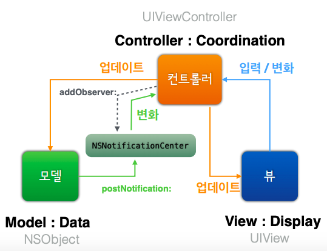

# 자판기 앱

1. <a href="#1-시작하기---아이패드-앱">시작하기 - 아이패드 앱</a>
2. <a href="#2-MVC-패턴">MVC 패턴</a>
3. <a href="#3-앱-생명주기와-객체-저장">앱 생명주기와 객체 저장</a>
4. <a href="#4-싱글톤-모델">싱글톤 모델</a>
5. <a href="#5-관찰자(Observer)-패턴">관찰자(Observer) 패턴</a>
6. <a href="#6-구매목록-View-코드">구매목록 View 코드</a>
7. <a href="#7-Frame과-Bounds">Frame과 Bounds</a>

<br>

## 1. 시작하기 - 아이패드 앱

### 추가내용

- Single View App 템플릿의 VendingMachineApp 프로젝트를 생성했습니다.

- 이전 <a href="https://github.com/popsmile/swift-vendingmachine/tree/popsmile">VendingMachine</a> 프로젝트 에서 View에 관련된 `InputView` 와 `OutputView`  그리고 `Main` 파일을 제외한 나머지 전체 소스파일을 해당 프로젝트로 복사했습니다. 복사한 파일의 코드는 대부분 MVC 중에서 Model의 역할을 담당합니다.
- `ViewController` 클래스에 `VendingMachine` 객체를 변수로 추가하고, `viewDidLoad()`  에서 음료 추가 및 재고 목록을 `print()` 했습니다.

<br>

### 실행결과

> 완성일자: 2018.12.24 11:00

```swift
✅ 언니몰래먹는딸기우유(2개)
✅ 스프라이트(3개)
✅ 칸타타 더치블랙(2개)
```

<br>

### 추가학습

#### The Structure of an App

`UIApplicationMain(_:_:_:_:)` 함수는 앱 시작 시,  핵심 객체인 application obejct 와 application delegate 객체를 생성하고 이벤트를 처리하는 run loop 도 시작시킵니다.

아래 이미지는 iOS 앱의 핵심 객체들의 관계입니다.


<a href="https://developer.apple.com/library/archive/documentation/iPhone/Conceptual/iPhoneOSProgrammingGuide/TheAppLifeCycle/TheAppLifeCycle.html#//apple_ref/doc/uid/TP40007072-CH2-SW1">이미지 출처</a>

<br>

#### The Main Run Loop

iOS 앱의 `main` 함수는 직접 작성하지 않고, Xcode에서 만들어줍니다. 대부분의 경우 이 함수를 수정하지않습니다.

아래 그림은 main run loop 의 구조와 앱에서 일어나는 유저 이벤트가 어떤 방식으로 처리되는지를 보여줍니다. 유저가 기기에 특정 액션을 취하면, 시스템에서 그 액션과 관련된 이벤트를 발생시키고 특정 포트를 통해서 앱으로 전달해줍니다. 전달된 이벤트는 큐에 쌓이고, **main run loop** 에 하나씩 보내져 실행됩니다. 이벤트를 가장 먼저 전달받는 객체는 **UIApplication** 으로, 이후에 무엇을 처리해야할지 결정합니다.


<a href="https://developer.apple.com/library/archive/documentation/iPhone/Conceptual/iPhoneOSProgrammingGuide/TheAppLifeCycle/TheAppLifeCycle.html#//apple_ref/doc/uid/TP40007072-CH2-SW1">이미지 출처</a>

<br>

## 2. MVC 패턴

### 추가내용

- `IBOutlet Collection` 으로 음료의 이미지 뷰와 이미지 레이블을 배열로 묶었습니다. 배열의 순서는  `VendingMachine`  의 `beverageTypes` 배열 순서와 동일하게 담았습니다.
- 아래의 `IBAction` 을 추가하여 각 음료 위의 모든 추가 버튼과 연결해주었습니다. `sender` 는 `UIButton` 으로 지정해주고, 각 버튼 `tag: Int` 에 위의 배열 인덱스와 동일한 값을 할당해주었습니다. 

```swift
@IBAction func addBeverage(_ sender: UIButton) {
    let selected = sender.tag
    guard vendingMachine.add(beverage: selected) else { return }
    showQuantities()
}
```

- 잔액 추가 버튼에 `IBAction`  으로 각각의 금액을 `VendingMachine.insert()` 하도록 추가했습니다.
- 음료 추가 및 금액 추가, 이 두 `IBAction` 실행 후 재고 및 잔액 레이블에 반영되도록 추가했습니다.

<br>

### 실행결과

> 완성일자: 2018.12.27 18:10


<br>

### 추가학습

1. 음료 이미지 뷰의 모서리를 둥글게 처리했습니다.

```swift
@IBOutlet var beverageImages: [UIImageView]!

private func roundImageViews() {
    for image in beverageImages {
        image.layer.cornerRadius = 15
        image.layer.masksToBounds = true
    }
}
```

layer의 아래 프로퍼티 값을 조정하여 모서리를 조정했습니다. `cornerRadius` 는 0.0이 디폴트 값이며, 값이 클 수록 모서리가 둥그렇게 처리됩니다. 

```swift
var cornerRadius: CGFloat { get set }
var masksToBounds: Bool { get set }
```

위의 `masksToBounds` 와 동일한 프로퍼티로 `UIView` 의 `var clipsToBounds: Bool { get set }` 가 있습니다. 

<br>

2. `UIView` 의 `ContentMode` 의 모든 케이스를 적용해보았습니다.

아래 `bottom` 부터 `right` 까지는 모두 컨텐츠가 보여지는 위치를 변경합니다. 컨텐츠의 비율은 모두 그대로 유지합니다.

- bottom


- bottomLeft


- bottomRight


- top


- topLeft


- topRight


- center


- left


- right


<br>


- redraw
  - `setNeedsDisplay()` 메소드를 통해 뷰의 경계가 바뀌었을 때 다시 보여줄 수 있습니다.
  - **뷰의 컨텐츠나 모양이 변경될 수 있는 경우**에만 사용합니다.


- scaleAspectFill
  - 뷰의 사이즈에 맞도록 조정합니다. 뷰의 경계를 모두 채우기 위해, **컨텐츠의 부분이 잘리는 경우**도 있습니다.


- scaleAspectFit
  - 뷰의 사이즈에 맞도록 컨텐츠를 조정합니다. 컨텐츠 측면 비율은 유지합니다. **뷰의 경계의 나머지 부분이 그대로 보여지기때문에** 모서리가 둥그렇게 보이지 않습니다.


- scaleToFill 
  - `ContentMode` 의 **default** 값입니다.
  - 필요한 경우에 뷰의 사이즈에 맞도록 컨텐츠의 측면 비율이 조정됩니다.


<br>

## 3. 앱 생명주기와 객체 저장

### 추가내용

##### 1. `ViewController` 내에 있던 `VendingMachine` 변수를 `AppDelegate` 로 옮겼습니다.

1. ```swift
   class ViewController: UIViewController {
   	private weak var appDelegate: AppDelegate?
       ...
       
       required init?(coder aDecoder: NSCoder) {
           self.appDelegate = UIApplication.shared.delegate as? AppDelegate
           ...
       }
       ...
   }
   ```

   `AppDelegate` 로 옮긴 `VendingMachine` 의 변수를 `ViewController` 에서 접근하기 위해, 위 처럼 **`AppDelegate?`** 변수를 선언하고 `UIApplication.shared.delegate` 인스턴스로 초기화해주었습니다.

   - UIApplication
     - `class var shared: UIApplication` : 앱 인스턴스를 반환합니다.
     - `var delegate: UIApplicationDelegate?` : 앱 인스턴스의 델리게이트 객체

   ```swift
   override func viewDidLoad() {
       ...
       appDelegate?.vendingMachine?.showBalance(with: balanceForm)
   }
   ```

   뷰 컨트롤러에서 위와 같이 `VendingMachine` 변수에 접근합니다.

<br>

##### 2. 앱 종료 및 시작 시점에 콜백 함수에서  `VendingMachine` 을 아카이브/언아카이브하여, 앱이 다시 시작되더라도 자판기의 잔액 및 음료 재고 정보 등이 그대로 유지되도록 추가했습니다.

**Archives and Serialization** <a href="https://developer.apple.com/documentation/foundation/archives_and_serialization">참고</a>

- First Steps

  `VendingMachine` 객체 정보를 저장하기 위해, 내부에 포함된 구조체 및 클래스 객체가 모두 encodable and decodable 하도록 만들어주어야합니다.  

  - Codable

    구조체는 `NSCoding` 프로토콜을 채택할 수 없기때문에, 처음에는 모든 객체가 `Codable` 프로토콜을 채택하도록 구현했습니다. 하지만 여러차례 시도에도, 이 프로토콜로는 객체 내부에 포함된 하위 객체의 정보까지 저장하는데 실패하여... 결국, 아래의 `NSCoding` 으로 변경하여 적용했습니다.

  - NSSecureCoding

    모든 객체를 클래스로 변경하고,  `NSCoding` 을 상속받은 `NSSecureCoding` 프로토콜을 채택하도록 수정했습니다. 각각의 객체 내부에 아래의 프로퍼티와 메소드를 구현해주었습니다. 

    ```swift
    static var supportsSecureCoding: Bool
    func encode(with aCoder: NSCoder) {}
    required init?(coder aDecoder: NSCoder) {}
    ```

    추가로 문자열인 키 값을 저장하고 있는` enum Keys` 도 각각 추가해주었습니다.

    > **힘들었던 점**
    >
    > 인코딩 과정에서 자꾸 `NSKeyedArchiver warning: replacing existing value for key '\(encodingKey)'; probable duplication of encoding keys in class hierarchy` 에러가 발생하여 헤맸습니다. 스위프트 깃허브에서 <a href="https://github.com/apple/swift-corelibs-foundation/blob/master/Foundation/NSKeyedArchiver.swift#L424">해당 로그가 호출되는 부분</a>을 찾아보니, 인코딩 키 값이 이미 딕셔너리에 존재하는 키 값일 때 나타나는 에러였습니다. 모든 코드를 샅샅히 확인한 결과, `enum` 으로 키 값을 케이스별로 선언한 후, 하드 코딩 되어있던 키 값을 고치는 과정에서 두 번 중복하여 입력한 부분이 있었습니다. 작은 실수로 오랜 시간을 헤맸지만, `NSKeyedArchiver` 구현부를 확인하면서 더 자세히 들여다볼 수 있게해준 경험이었습니다.

- Keyed Archivers

  `NSCoder` 의 하위 클래스로, 아카이브 시에 클래스 정보와 인스턴스 변수를 모두 저장합니다.

  - NSKeyedArchiver

    `withRootObject` 아규먼트도 전달된 루트 객체가 담고있는 object graph를 인코딩하여 `Data` 로 리턴합니다.

    ```swift
    let vendingMachineEncoded = try? NSKeyedArchiver.archivedData(
                withRootObject: vendingMachine,
                requiringSecureCoding: false)
    ```

  - NSKeyedUnarchiver

    위의 `NSKeyedArchiver` 로 인코딩되었던 `Data` 를 전달받아 디코딩하여 담고있던 object graph를 리턴합니다. 위 루트 객체로 전달해주었던 객체로 타입캐스팅이 필요합니다.

    ```swift
    let vendingMachine = try NSKeyedUnarchiver
                .unarchiveTopLevelObjectWithData(data) as? VendingMachine
    ```

<br>

**UserDefaults**

유저의 디폴트 데이터베이스로, 키-밸류 쌍으로 값을 저장합니다.

- `class var standard: UserDefaults` : 해당 클래스 객체의 인스턴스에 접근할 수 있는 변수입니다.

- Setting & Getting Default values

  ```swift
  // NSKeyedArchiver로 아카이브한 data: Data를 저장하기
  UserDefaults.standard.set(data, forKey:"vendingMachine")
  
  // NSKeyedUnarchiver로 언아카이브할 data: Data를 가져오기
  let data = UserDefaults.standard.data(forKey: "vendingMachine")
  ```

<br>

### 실행화면

> 완성일자: 2019.01.08 11:50

잔액 및 음료재고가 비어있는 초기상태에서 음료 추가/ 잔액 보충 액션을 취한 후의 실행화면입니다. 앱 종료 후 재시작에도 기존 자판기 데이터가 그대로 복원되어 실행되었습니다.

.gif)

<br>

## 4. 싱글톤 모델

### 추가내용

##### 1. `VendingMachine` 객체를 싱글톤으로 변경했습니다.

- 생성초기화 메소드를 모두 `private` 으로 수정했습니다.

- `static` 프로퍼티를 추가해 `VendingMachine` 인스턴스를 선언해주었습니다.

   ```swift
    class VendingMachine {
      static let shared: VendingMachine = vendingMachineLoaded()
    
      private static let vendingMachieLoaded = { () -> VendingMachine in
          do {
              return try VendingMachineArchiver.load()
          } catch {
              return VendingMachine()
          }
      }
      ...
    }
   ```

<br>

##### 2. `VendingMachineDelegate` 프로토콜을 생성하여 `ViewController` 에서 사용될 부분을 구분하였습니다.

- 음료 재고와 잔액을 포함한 자판기 데이터를 다루는 `VendingMachineDataSource` 를 생성했습니다.

- 방금 언급한 프로토콜을 채택하면서, 잔액 및 재고 추가 등의 자판기 액션을 다루는 `VendingMachineDelegate` 프로토콜을 생성했습니다.

- 싱글톤 객체이기 때문에 바로 접근 가능하지만 인스턴스 참조 시 직접 의존하지 않도록, 의존성을 주입했습니다.

  ```swift
  class ViewController: UIViewController {
      private weak var vendingMachine: VendingMachineDelegate?
      ...
      
      required init?(coder aDecoder: NSCoder) {
          self.vendingMachine = VendingMachine.shared
          ...
      }
      ...
  }
  ```

<br>

### 실행화면

> 완성일자: 2019.01.10 14:20

위 3단계 실행화면과 같아 첨부는 생략했습니다.

<br>

### 추가학습

#### 싱글톤 (Singleton)

- 장점
  - 해당 클래스의 인스턴스가 꼭 하나만 존재해야하는 경우에 사용합니다.
  - 최초 한 번만 생성한 인스턴스 하나를 사용하기 때문에 고정된 메모리 영역만 사용하므로 메모리 낭비를 방지할 수 있습니다. 또한, 두 번째 호출부터는 객체 로딩 시간이 현저하게 줄어 성능이 향상됩니다.
  - 생성된 클래스 인스턴스는 전역에서 사용할 수 있습니다. (하지만, 이것이 싱글톤을 사용하는 주목적이 되면 안된다고 합니다.)

- 단점
  - 테스트가 어렵습니다. 객체 인스턴스가 하나만 존재하므로, 단위별로 객체를 생성하고 테스트할 수 없습니다. `setUp()` `tearDown()` 함수에서 싱글톤 객체의 생성 및 소멸을 일일이 구현해주어야합니다.
  - 싱글톤 객체 인스턴스가 다른 클래스 인스턴스와 상호작용하는 부분이 많아지면, 결합도(Coupling)가 높아져 수정하기 어려워집니다. (SOLID의 Open-Closed Principle 위배)

<br>

## 5. 관찰자(Observer) 패턴

### 추가내용

##### 1. Notification 추가

 `음료추가` 와 `잔액추가` 액션을 `Notification` 으로 등록했습니다.

- `Notification.Name` 을 extension하여 두 액션을 `Notification` 으로 추가했습니다.

  ```swift
  extension NSNotification.Name {
      static let didAddBeverage = Notification.Name("didAddBeverage")
      static let didInsertMoney = Notification.Name("didInsertMoney")
  }
  ```

- 각 액션이 일어나는 메소드에서 해당 `Notification ` 을 `NotificationCenter` 로 post해주었습니다.

  ```swift
  NotificationCenter.default.post(name: .didInsertMoney, object: self)
  ```

<br>

##### 2. Observer 추가

- `ViewController` 가 위 두 가지 `Notification` 을 지켜보도록 `Observer` 로 등록해주었습니다.

  ```swift
  NotificationCenter.default.addObserver(self, 
                                         selector: #selector(showBalance),
                                         name: .didInsertMoney, 
                                         object: vendingMachine)
  ```

- `selector` 에 해당하는 메소드 선언부 앞 쪽에 **@objc** 를 추가해주었습니다.

  `selector` 는 Objective-C의 메소드를 선택하여 실행할 때 사용하고, **#selector()** 키워드로 호출합니다. 아래 `showQuantities()` 메소드가 Objective-C 메소드라는 것을 나타내주기 위해 아래와 같이 추가해줍니다.

  ```swift
  @objc private func showQuantities() {
      ...
  }
  ```

<br>

### 실행화면

> 완성일자: 2019.01.11 13:00

위 3, 4단계 실행화면과 같아 첨부는 생략했습니다.

<br>

### 추가학습

#### 두 가지 Observer 등록 패턴

- `addObserver(_:selector:name:object:)` [자세히보기](https://developer.apple.com/documentation/foundation/notificationcenter/1415360-addobserver)

  위에서 사용한 메소드로, **observer** 역할을 할 객체와 `notification`을 받은 후에 실행할 **selector**를  지정해줍니다. 알림받을  `notification` 의 종류와 `sender` 역할의 객체를 추가로 지정해줄 수 있습니다.

  ```swift
  func addObserver(_ observer: Any, 
          selector aSelector: Selector, 
              name aName: NSNotification.Name?, 
            object anObject: Any?)
  ```

- `addObserver(forName:object:queue:using:)` [자세히보기](https://developer.apple.com/documentation/foundation/notificationcenter/1411723-addobserver)

  이 메소드는 위와 다르게 리턴값이 있습니다. `NSObjectProtocol` 객체를 리턴해주며, 이 객체가 **observer** 로 등록된 객체입니다. 메소드 외부에서나 매개변수로 받는 `block` 내부에서 **removeObserver()**로 해제해줄 수 있습니다.

  ```swift
  func addObserver(forName name: NSNotification.Name?, 
            object obj: Any?, 
             queue: OperationQueue?, 
             using block: @escaping (Notification) -> Void) -> NSObjectProtocol
  ```

<br>

#### Observer 패턴과 MVC 구조

아래 이미지는 Observer 패턴을 활용한 MVC 구조를 나타냅니다. Observer 패턴으로 Model과 Controller 가 **Loose Coupled(느슨하게 결합된)** 관계를 유지하게되면, 각각에서 변경사항이 생기더라도 서로에게 큰 영향을 미치지않고 상호작용할 수 있다는 장점이 있습니다.



[이미지출처](https://codesquad.kr/)

<br>

## 6. 구매목록 View 코드

### 추가내용

##### 1. `구매` 버튼 추가

기존의 `추가` 버튼과 마찬가지로, `UIButton.tag` 값을 활용하여 해당 음료를 구매하는 기능을 추가했습니다.

<br>

##### 2. `NotificationCenter` 를 활용한 구매 이력 이미지뷰 추가

음료 구매 시, 해당하는 이미지뷰를 하단에 차례로 추가하여 구매 이력을 보이도록 구현했습니다. `History.update(purchase: Beverage)` 메소드를 호출하여 구매 이력이 업데이트되는 동시에 `didBuyBeverage` 노피티케이션을 `post` 합니다. 이 때, 구매한 음료 객체의 `className` 과 해당 음료가 `History.purchases` 배열에서 위치하는 `index` 값을 **[AnyHashable: Any]** 딕셔너리에 저장하여 `userInfo` 파라미터로 담아 `post` 합니다.

뷰 컨트롤러는 이 노티피케이션을 전달받으면, 아래의 `selector` 메소드를 호출합니다. 위에서 구매한 음료정보를 담아 보내준  `userInfo` 로부터 `name` 과 `index` 값을 꺼내어 새로운 `RoundedCornersImageView` 를 생성하고 위치를 조정합니다.

마지막으로 현재 루트 뷰에 `addSubview()` 하여, 루트 뷰의 `[subviews]` 에 추가합니다. 이 서브 뷰 배열에 추가되면, 기존의 서브 뷰 요소보다 더 위쪽에 나타나게됩니다. 

 ```swift
@objc private func showPurchase(_ notification: Notification) {
    guard let name = notification.userInfo?["name"] as? String else { return }
    guard let index = notification.userInfo?["index"] as? Int else { return }
    let image = UIImage(named: "\(name).jpg")
    let imageView = RoundedCornersImageView(image: image)
    imageView.relocate(to: index)
    self.view.addSubview(imageView)
}
 ```

<br>

##### 3. 앱 실행 시, 이전 구매 이력 복원

`UserDefaults` 에 저장했던 자판기 객체를 언아카이브하여 내부 프로퍼티인 `History` 객체 또한 복원됩니다.   `History.willAppear()` 메소드 호출 시, 복원한 `purchases` 음료 배열를 이터레이트하면서 `didBuyBeverage` 노티피케이션을 포스트합니다.

<br>

### 실행화면

> 완성일자: 2019.01.14 20:09

음료 구매 시, 해당 음료의 이미지 뷰가 하단에 새로 추가됩니다. 재고가 없거나 잔액이 부족할 시에는 시행되지 않습니다.

.gif)

앱을 종료하고 재실행했을 때, 이전의 구매이력을 나타내는 이미지 뷰가 복원됩니다.

.gif)

<br>

## 7. Frame과 Bounds

### 추가내용

##### 1. `AdminViewController` 추가

자판기 앱을 사용자모드와 관리자모드로 구분하여 사용하고자, 기존 뷰 컨트롤러는 `UserViewController` 로 명명하고 `AdminViewController` 라는 새로운 뷰 컨트롤러를 추가했습니다. `UserViewController` 에 `Info Light` 타입의 버튼을 추가하고, 추가한 뷰 컨트롤러로 Segue를 연결했습니다.

각 뷰 컨트롤러의 `vendingMachine` 프로퍼티의 타입을 각각 `UserMode` , `AdminMode` 로 변경해주었습니다. Segue 전에 호출되는 `prepare()` 메소드에서 `AdminMode` 로 타입캐스팅한 자판기 객체의 인스턴스를 넘겨주도록 추가했습니다.

```swift
class UserViewController: UIViewController {
    private weak var vendingMachine: UserMode?
    ...
    
    override func prepare(for segue: UIStoryboardSegue, sender: Any?) {
        guard let adminViewController = segue.destination as? AdminViewController else { return }
        guard let vendingMachine = vendingMachine as? AdminMode else { return }
        adminViewController.set(vendingMachine: vendingMachine)
    }
}

class AdminViewController: UIViewController {
    private weak var vendingMachine: AdminMode?
    ...
}
```

또한, `AdminViewController` 에 `닫기` 버튼을 추가하고 클릭 시 해당 뷰 컨트롤러를 `dismiss()` 를 호출하도록 추가했습니다.

<br>

##### 2. 재고 추가 기능 이동

기존 `ViewController` 에 `음료구매`/`잔액추가` 기능과 같이 있던 `음료추가` 기능을 `AdminViewController` 로 이동해주었습니다. 특정 동작 후 업데이트 되어야할 레이블이 재고 레이블밖에 없으므로, `inventoryDataChanged` 노티피케이션의 관찰자 역할만 추가해주었습니다.

<br>

### 실행화면

> 완성일자: 2019.01.17 18:08

