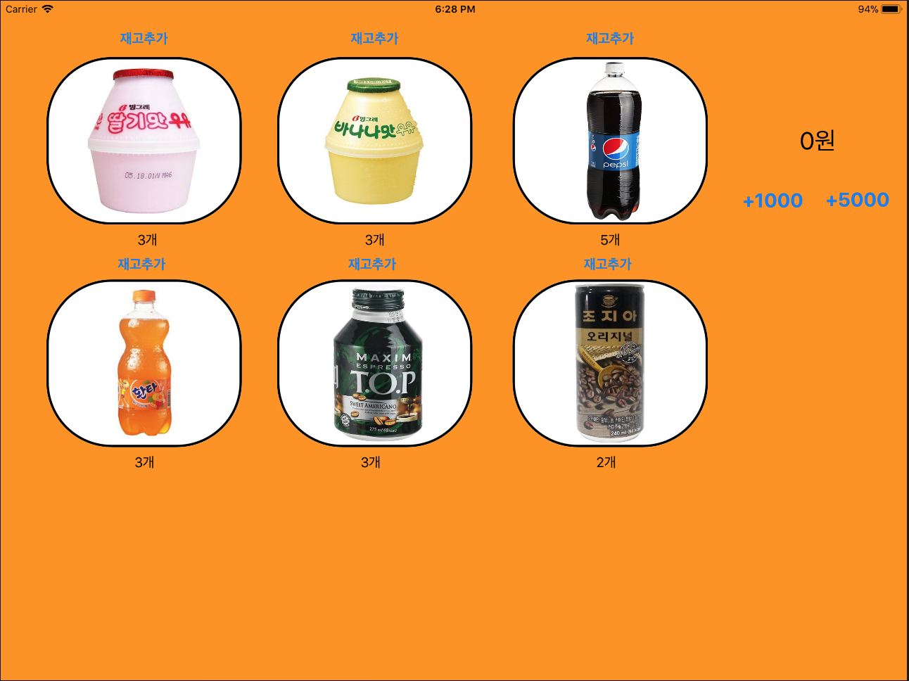
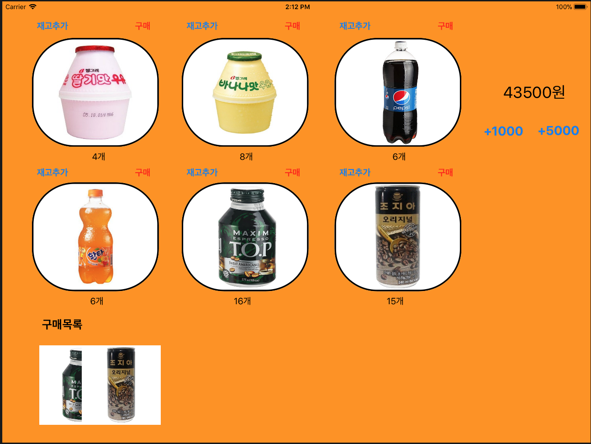
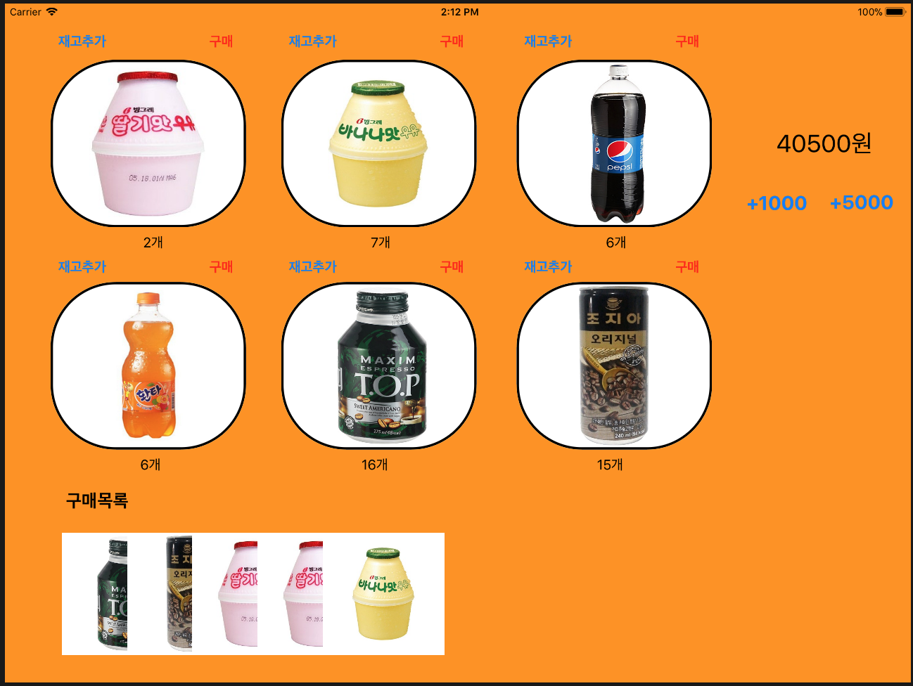

# Making a VendingMachineApp
## - Step 1
## #1. iOS 앱을 구성하는 핵심 객체들(UIKit Framework의 핵심 객체들)
  - **UIApplication : 시스템으로부터 이벤트를 받아 Custom Objects로 이벤트를 전달하고 상위 레이어의 앱 동작을 조정**
    - 메인 이벤트 루프와 같은 것들을 담당하는 객체로 앱 상태 변화나 푸시 메세지 도착처럼 특수한 형태의 이벤트를 우리가 정의한 델리게이트 객체에 전달하여 사전에 정의된 메소드를 호출할 수 있도록 한다.
    - 아래 App delegate 객체 내의 custom logic들은 UIApplication 객체와 상호작용한다.

  - **App Delegate :  App의 초기화, 상태변화, 다른 앱의 기타 이벤트를 핸들링**
    - custom 객체로서 앱 런칭시점에 UIApplicationMain 함수에 의해 생성된다.

  - **View Controller : App의 Contents가 화면에 보이게 하는 역할**
    - 하나의 View Controller 객체는 하나의 뷰와 뷰의 서브뷰를 관리. View Controller 객체는 자신이 관리하는 뷰를 앱의 윈도우에 위치시킴으로써 뷰가 화면에 보여지도록 한다.
    - UIViewController클래스는 여러 View Controller 객체들의 부모클래스이며, 기본적으로 뷰를 로딩하고, 화면에 뷰를 보여지게 하고, 뷰를 전환(디바이스 변화에 따른)하는 등의 기본적인 동작들을 지원

  - **UIWindow : 화면에 보여지는 뷰 객체들을 조정**
    - 화면에 보여지는 Contents를 바꾸기 위해서는 View Controller 를 이용해야 한다. 자체로 Contents를 바꾸지 못함.
    - UIApplication과의 상호작용을 통해 이벤트를 뷰와 View Controller에 전달

  - **View & Control & layer : Contents의 시각적인 표현을 담당**

## #2. App초기화(App Loading Process) 과정 단순화
  1. App 실행: main() 함수 실행됨
  2. main(): UIApplicationMain() 호출
  3. UIApplicationMain(): UIApplication 객체 생성
  4. UIApplication 객체: Info.plist 파일을 바탕으로 앱에 필요한 데이터와 객체 로드
  5. AppDelegate 객체 생성 및 UIApplication 객체와 연결
  6. 이벤트 루프 생성 등 실행에 필요한 준비 진행
  7. 실행 완료 직전, AppDelegate의 ``application(_:didFinishLaunchingWithOptions:)`` 메시지 전송

## #3. iOS 메인 런루프 동작 이해
  - 메인 런 루프 : 앱에 들어오는 이벤트들을 애플리케이션 객체가 처리할 수 있도록 계속해서 라우팅하고, 처리결과로 UI와 상태를 업데이트
    - 이벤트 처리를 위한 loop로 입력소스와 타이머소스를 주로 처리.
      - 입력소스(input source): 다른 thread나 어플리케이션에서 전달되는 메시지 이벤트(비동기식)
      - 타이머소스(timer source): 예정시간이나 반복수행간격에 따라 발생하는 이벤트(동기식)
    - **사용자 이벤트 발생 및 처리과정**

      
        1. 이벤트 발생(터치, 키보드 등)
        2. 시스템에서 port를 통해 앱으로 전달
        3. 이벤트 큐에 등록
        4. 이벤트에 맞는 메소드 실행

    - **전달받은 이벤트를 앱의 run loop에서 처리하는 과정**

      
        1. run loop 대기 중 이벤트 발생(주로 입력소스와 타이머소스 처리)
        2. 정해진 메소드 호출(타이머에서 설정한 시간데 따라)
        3. 메소드 완료 후 변경될 필요가 있는 사항 적용(뷰의 경우 setNeedsLayout, setNeedsDisplay)
        4. runUntil- 메소드에서 정한 시간까지 유지, 할일 없으면 suspend 상태.

## - Step 2



## #1. IBOutlet Collection 기능에 대해 학습하고 중복되는 아웃렛을 제거한다.
  1. 중복되는 요소들 중 하나를 View Controller로 끌어서 IBOutletCollection 만듦
  2. 만든 IBOutletCollection 옆의 동그라미(+) 버튼을 Main.storyboard의 중복되는 요소들로 드래그하여 UI 객체배열 완성
  3. 각 요소를 구분하기 위한 tag 부여
  4. IBAction을 하나 만들어서 각 요소와 연결
  5. IBAction 내에서 IBOutletCollection으로 만든 배열 사용

## #2. UIImageView 에서 이미지를 표시할 때 사각형 코너를 둥글게하도록 변경해본다.
  - Inspector - Drawing - View - clip to Bounds 클릭
  - Identity Inspector > User Defined Runtime Attributes에 키 추가 :
  - 테두리: layer.borderWidth (Number)
  - 테두리색상: layer.borderUIColor (Color)
  - 둥근테두리: layer.cornerRadius (Number)

## #3. Restoration ID (``restorationIdentifier``)
  - restorationIdentifier란? ViewController가 상태복원을 지원할 것인지를 결정하는 식별자
  - 용도 : 특정 뷰 컨트롤러와 뷰의 상태를 저장하고 복원하고자 할 때
  - 사용방법
    1. 코드 :
    ``myViewController.restorationIdentifier = "thiedViewController"``
    2. 인터페이스 빌더 사용 : 인스펙터 활용

## - Step3
## #0. Controller에서 AppDelegate 내부에 선언한 변수 접근하기
  ```swift
  //Controller 내부
  //해당 변수 선언
  var aVariable : object!

  //viewDidLoad() 함수 내부 : delegate할당 및 변수 할당
  let appDelegate = UIApplication.shared.delegate as! AppDelegate
  aVariable = appDelegate.value
  ```
## #1. 앱 생명주기(Application Life Cycle) /
  - **3가지 실행모드, 5가지 상태**, 홈 버튼을 통해 생기는 변화
  - 상태변화 : Not running, Active, Inactive, Background, Suspended
  
    1. not runnig : 실행중이지 않던 프로그램이 실행이 된다
    2. foreground: 앱이 실행 된다
        - (2-1) inactive 사용자 입력 받을 수 없는 상태 ex 알림 떴을때, 시스템 메세지 (베터리 부족합니다 등등)
        - (2-2) active 사용자와 교류 가능 상태

    3. background 홈버튼 눌러서 내리기 (끈거 x. 코드는 실행되고 있음)
    4. suspended 상태 : background로 실행되는 앱은 일정한 이유에 따라 OS가 앱을 끈다. 코드 실행하지 않는 상태로 변경

## #2. 아카이브
  - 모델 객체를 저장하는 방법 중 하나로, 객체의 아카이빙은 그 객체의 프로퍼티들을 모두 기록하고, 파일시스템에 그 내용을 저장하는 것을 포함한다.
  - 언아카이빙 : 아카이브한 데이터로부터 객체를 다시 만든다.
  - **인스턴스들을 아카이방/언아카이빙해야할 클래스들은 모두 NSCoding Protocol을 따라야 한다. 하지만, UIView와 UIViewController는 모두 NSCoding을 이미 따르고 있음.**
  - **필수 메서드인**``encodeWithCoder(_:)``**와** ``init(coder:)``**를 구현해야 한다.**

## #3. 사용자 설정값을 저장하는 UserDefault 클래스와 UserDefault 클래스에 저장할 수 있는 데이터 타입
  - UserDefaults란?
    - 사용자 설정을 저장하는 용도의 직렬화(plist)
    - 저장: UserDefaults.standard.set(data, forKey: MachineStore.Key)
    - 불러오기: let data = UserDefaults.standard.data(forKey: MachineStore.Key)

    ```swift
      func saveChanges(_ machine : VendingMachine) {
      let encodedData = NSKeyedArchiver.archivedData(withRootObject: machine)
      userDefaults.set(encodedData, forKey : "vendingMachine")
  }

  func loadMachine() -> VendingMachine? {
      guard let encodedData = userDefaults.data(forKey: "vendingMachine") else { return nil }
      guard let archivedMachine = NSKeyedUnarchiver.unarchiveObject(with: encodedData) as? VendingMachine else { return nil }
          return archivedMachine
      }
    ```
  - UserDefault 클래스에 저장할 수 있는 데이터 타입
    - UserDefaults 클래스는 float, double, 정수, 부울 값 및 URL과 같은 일반적인 유형에 액세스하기 위한 편리한 메소드를 제공한다.
    - 기본 객체는 NSData, NSString, NSNumber, NSDate, NSArray 또는 NSDictionary의 인스턴스 (또는 컬렉션, 인스턴스의 조합)의 속성 목록이어야 한다.

## - Step4
## #1. 싱글톤 패턴
  - 싱글톤 패턴이란? **매번 똑같은 하나의 인스턴스만 반환하도록 하는 클래스 설계 방식**
    - 싱글톤 패턴(Singleton Pattern)은 단 하나의 인스턴스(객체 혹은 오브젝트)를 만들어 두고 이를 여러 곳에서 쉽게 액세스 할 수 있게 하는것이 목적이다.
    - 특징 : 하나의 인스턴스가 만들어지는 지가 중요하기 때문에, 싱글톤인지 확인하는 과정이 꼭 필요하고 중요하다.
      - 확인하는 방법 : 변수에 접근할 때마다 객체 인스턴스 주소값을 확인!

  - 클래스 경우 싱글톤을 생성하는 방법
    -  init에 private이 걸려있어 직접 선언과 동시 호출을 제한시킨다.
    ```
      class VendingMachine {
    	static var instance: VendingMachine = VendingMachine()
    	private init(){

    	}
    }
    ```
  - 싱글톤 객체의 장점과 단점에 대해 학습한다.
    - 장점
      1. 객체 생성 횟수를 줄일 수 있어 메모리 공간이 절약된다. (힙 메모리가 가벼워진다)
      2. 여러 개의 인스턴스를 생성하는 경우에 비해 인스턴스간의 간섭이 줄어든다.
    - 단점
      1. 의존도를 높이게 되어 한 곳에서의 변경이 다른 부분에 영향을 미치게 될 확률이 높아진다. 즉, 여러 곳에서 참조가 가능하기 때문에 멀티 쓰레드 환경에서 데이터 변경 시 문제가 생길 수 있다.

## - Step5
## #1. 관찰자 패턴
  - 관찰자 패턴이란? **객체 사이에 일 대 다의 의존 관계를 정의 해두어, 어떤 객체의 상태가 변할 때 그 객체에 의존성을 가진 다른 객체들이 그 변화를 통지 받고 자동으로 업데이트될 수 있게 만만드는 것**
  - 적용방법 :
    - ViewController : viewDidLoad() 함수 내 Observer 등록
      ```
      NotificationCenter.default.addObserver(self, selector: #selector(updateInventoryLabels(notification:)), name: Notification.Name("didUpdateInventory"), object: nil)
      NotificationCenter.default.addObserver(self, selector: #selector(updateBalanceLabel(notification:)), name: Notification.Name("didUpdateBalance"), object: nil)
      ```

    - Model(VendingMachine) : 해당 메서드 내부 Observer post 적용
      ```
      NotificationCenter.default.post(name: Notification.Name("didUpdateInventory"), object: self, userInfo: [
      "inventory" : inventory])
      ```

    - ViewController : 라벨 또는 버튼 관련 메서드 Notification 반영
      ```
      @objc private func updateInventoryLabels(notification : Notification) {
          guard let userInfo = notification.userInfo as? [String : Inventory] else { return }
          guard let inventory = userInfo["inventory"] else { return }
          updateInventory(inventory)
      }
      ```

  - 왜 사용하는 것일까? (모델과 컨트롤러가 직접 참조하지 않고 느슨하게 연결된 (loosed coupled) 구조가 왜 좋은 것일까?)
    - 상태 변화를 수신해야 하는 객체가 여러 개거나 전달 받아야 할 정보가 많을수록 객체들이 많아질 수 있고, 그렇게 되면 객체들의 연결이 복잡해지고 강하게 연결될 가능성이 크다. 때문에 옵저버 패턴을 이용하여 최대한 느슨하게 연결할 수 있도록 도와주기 때문이다.

## - Step6
## 구매목록 View 코드
  - 실행화면
    
    
  - 실행이후 구매 목록을 화면 아래 이미지로 추가한다. : viewDidLoad() 내부 updateListOfPurchase() 메서드 추가
    ```
    private func updateListOfPurchase() {
      guard let productsSold = vendingMachine?.generateListOfHistory() else { return }
        var xOfImage = 70
        for oneProduct in productsSold {
            let productImg = UIImage(named : getImgSource(ObjectIdentifier(type(of : oneProduct)))) ?? UIImage()
            let imageView = UIImageView(image : productImg)
            imageView.frame = CGRect(x: xOfImage, y: 650, width: 150, height: 150)
            self.view.addSubview(imageView)
            xOfImage += 80
        }
    }
    ```
  - 특정 제품을 구매할 때마다 해당 제품 이미지를 추가하도록 구현한다. : Notification 등록
    ```
    NotificationCenter.default.addObserver(self, selector: #selector(updateListOfPurchase(notification:)), name: .didUpdateListOfPurchase , object: nil)
    NotificationCenter.default.post(name: .didUpdateListOfPurchase, object: self)
    ```

  - 뷰를 코드로 생성해서 추가하는 것과 스토리보드 상에서 미리 생성하는 것의 차이
    - 코드 생성
      1. 조작 가능: 실행중간에 속성 등 변경 가능하다.
      2. 재사용 가능: 작성한 코드를 재사용하기 쉽다.
      3. 찾아보기 쉬움: 화면이 복잡할 때 IB에서는 특정 요소를 찾아서 선택하는 게 쉽지 않지만, 코드로 작성하면 찾기 쉽다.
      4. 머지 충돌 발생률 낮음: 협업 시 스토리보드에 작성한 사람이 있으면 머지 충돌이 일어날 확률이 높다.
      5. 뷰컨트롤러에 제네릭 사용 가능: IB로 작성한 뷰 컨트롤러 클래스에는 제네릭 제약조건을 줄 수 없지만, 코드로 작성하면 제네릭 제약조건이 있는 뷰 컨트롤러를 생성할 수 있다.
    - 스토리보드 생성
      1. 사용이 쉽다: 코드로 작성하면 빼먹으면 안되는 코드가 있기도 하고, 코드 길이가 길어질 수 있다.
      2. 시각적이다: 눈으로 보고 확인하며 작성할 수 있다.
