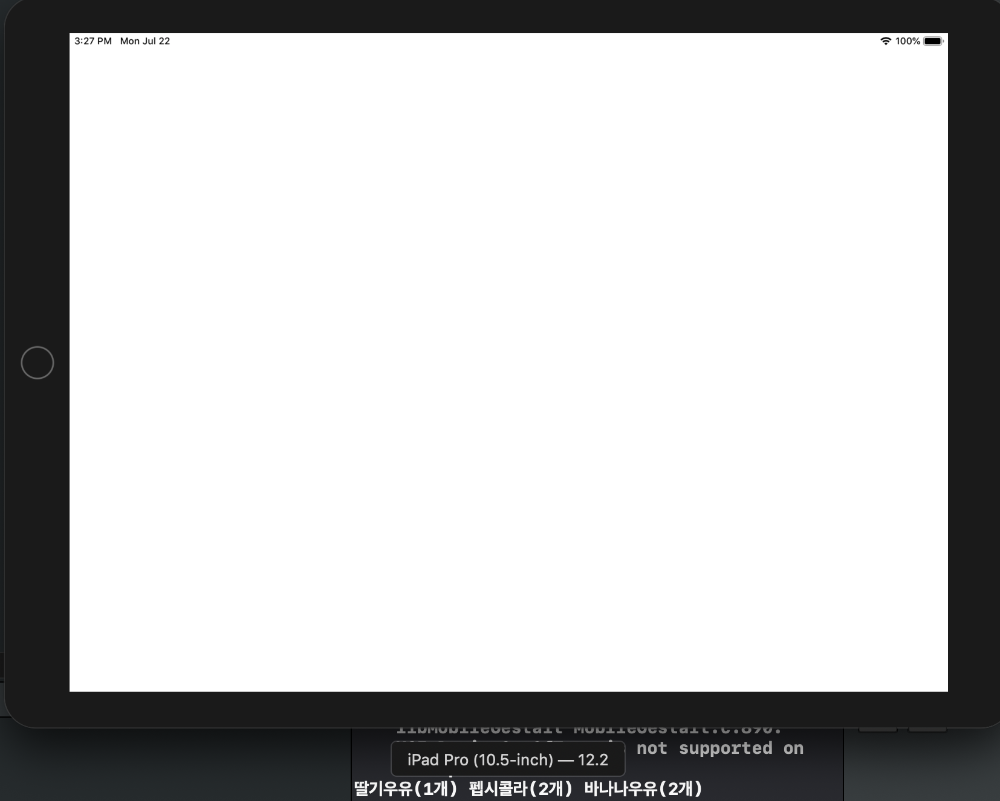
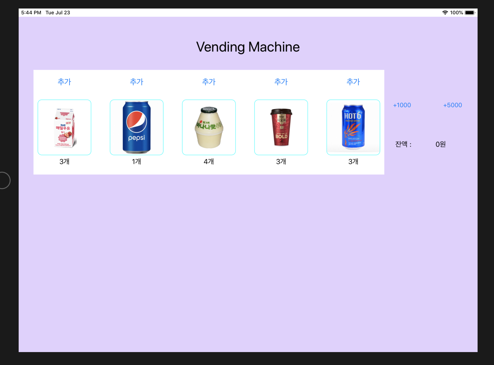
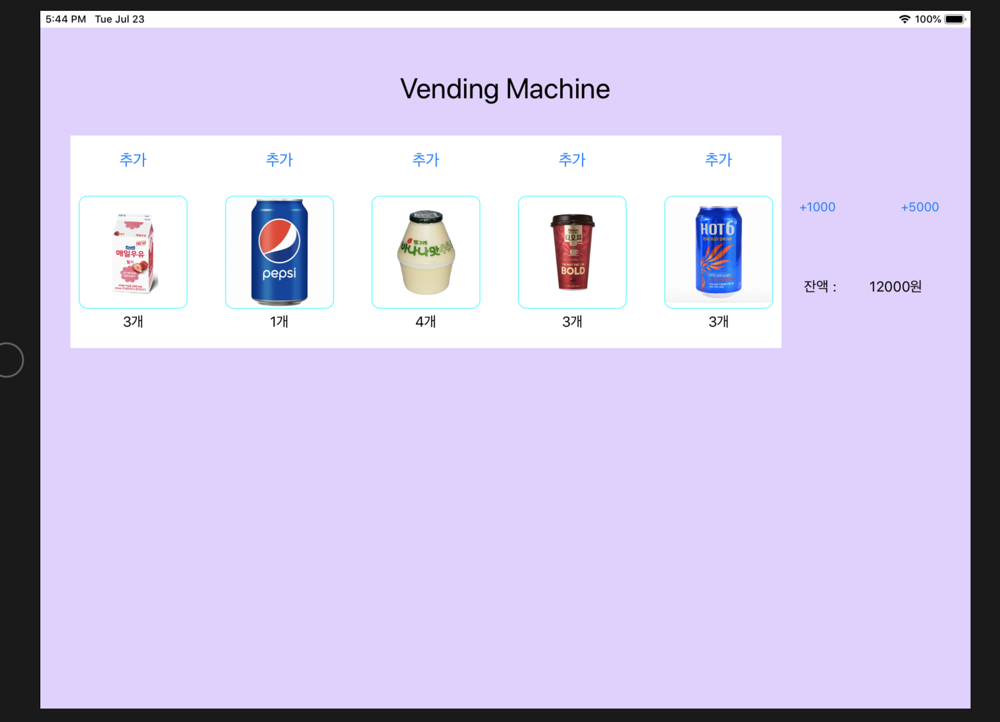
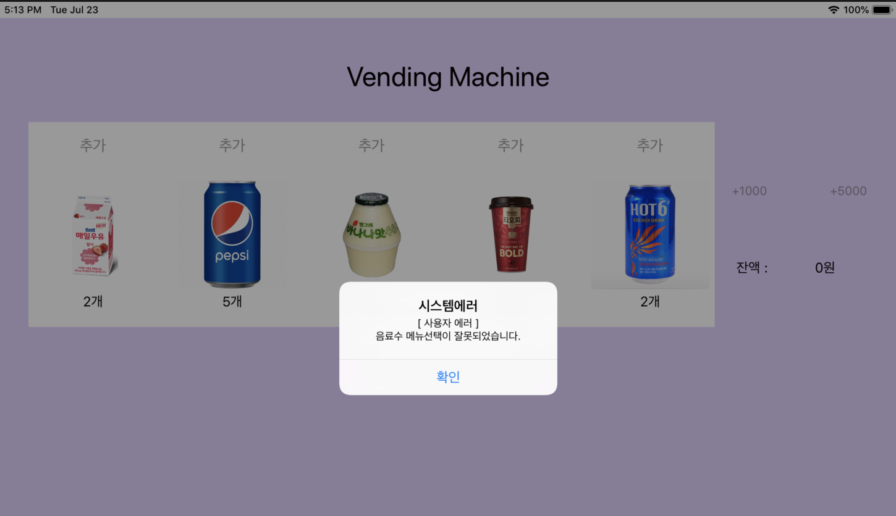

# STEP1

### 결과화면 




### 주의사항

main.swift 파일이 잔존해있으면 (설령 클래스 파일을 주석처리하여도) AppDelegate의 Attribute인 

**`@UIApplicationMain`**  의 사용이 불가능하다. 해당 어트리뷰트는 다음과 같은 코드로 대체 가능하다.


#### @UIApplicationMain의 역할

- main 클래스 역할
- AppDelegate와 UIApplication을 연결
  - AppDelegate 테스트시에 아래의 항등코드를 수동으로 작성가능하다.
- UIApplication도 UIResponder를 상속받는 대표적인 객체이나, UIApplication는 이벤트 처리를 위해 UIViewController, UIView 등으로 이벤트를 전달한다.
  - 기타 이벤트 처리 기능은 **event handling을 담당하는** **`UIResponder`** 프로토콜을 상속받은 다른 객체 인스턴스들이 수행한다.

```swift
UIApplicationMain{
  	CommandLine.argc,
  	CommandLine.unsafeArgv,
  	NSStringFromClass(UIApplication.self),
  	NSStringFromClass(AppDelegate.self)
}
```


----


### macOS vs iOS

> Cocoa 플랫폼에서 macOS 와 iOS를 다루는 메인 함수로 NSApplicationMain과 UIApplicationMain가 각각 존재한다. 

> 이들은 **AppDelegate 클래스**에 annotate하기 위해 사용되며, **컴파일러**는 이를 인식하여 자동으로 엔트리 포인트 메서드인 **main() 함수를 생성**한다.

macOS의 AppDelegate.swift 파일의 초기 상태는 다음과 같다

```swift
import Cocoa

//int NSApplicationMain(int argc, const char * _Nonnull *argv);
@NSApplicationMain
class AppDelegate: NSObject, NSApplicationDelegate {
    func applicationDidFinishLaunching(_ aNotification: Notification) {
        // Insert code here to initialize your application
    }
    func applicationWillTerminate(_ aNotification: Notification) {
        // Insert code here to tear down your application
    }
}

```

-  NSApplicationMain 은 Cocoa 애플리케이션을 생성하고 앱의 런칭을 실행하기 위해 메인함수에 의해 호출되는 함수를 의미한다. 앱 객체의 클래스는 무조건 `NSApplication`이며, 앱 델리게이트는 nib 파일 내에 정의되어 있어야 한다.
  - [출처](https://developer.apple.com/documentation/appkit/1428499-nsapplicationmain)
- `NSApplication` 은 앱의 메인 이벤트 루프와 앱의 객체들에서 사용하는 모든 리소스들을 관리한다 

마찬가지로 ViewController의 초기코드는 아래와 같다.

```swift
import Cocoa
class ViewController: NSViewController {
    override func viewDidLoad() {
        super.viewDidLoad()
    }

    override var representedObject: Any? {
        didSet {
        // Update the view, if already loaded.
        }
    }
}
```


# STEP 2

### 결과화면

- 초기화면



- 재고 및 잔액 버튼 추가시 IBAction 결과




---

### 추가구현내용 - CollectionView 사용하기

- 여러개의 리스트로 나열할 Label, Button, Image에 대해 CollectionView 적용

- Delegate와 DataSource 프로토콜 채택으로 준수할 메서드를 구현

- ```swift
  func collectionView(_ collectionView: UICollectionView, numberOfItemsInSection section: Int) -> Int 
  ```

  - 배치할 CollectionCell의 개수를 설정한다.

  ```swift
  func collectionView(_ collectionView: UICollectionView, cellForItemAt indexPath: IndexPath) -> UICollectionViewCell
  ```

  - 각 셀에 바인딩할 데이터를 설정한다.
  - TableView에서 **`.index`** 로 인덱스를 찾는 방법과는 달리 indexPath의 **`.item`** 으로 셀의 위치를 찾는다.
  - **`collectionView.dequeueReusableCell`** 메서드를 통해서 재사용가능한 셀로 화면을 렌더링한다.

- 커스텀 클래스인 GridCell은 `UICollectionViewCell` 를 상속한 클래스이다. 

  -  내부 프로퍼티로 UIImageView, UIButton, UILabel 등을 갖는다.
  - storyboard상 상위 계층 객체인 `VendingViewController`의 vendingMachine에 접근하기 위해 생성단계에서 `updateDrinkInfo`메서드를 통해 프로퍼티로 vendingMachine을 주입함

- 각 셀의 크기가 한 줄에 들어올 수 있도록 크기를 조정하기 위해서 **`UICollectionViewDelegateFlowLayout`** 프로토콜을 채택한다. 

  ```swift
  func collectionView(_ collectionView: UICollectionView, layout collectionViewLayout: UICollectionViewLayout, sizeForItemAt indexPath: IndexPath) -> CGSize
  ```

  - 위 메서드를 구현함으로써 컬렉션뷰의 크기에 알맞는 width와 height를 지닌 cell을 설정할 수 있다.

  

### 추가구현내용 - UIImageView 다듬기

- GridCell 클래스의  **@IBOutlet** **var** `imgView: UIImageView!` 에 대해 코드 레벨에서 다음의 메서드로 둥근 테두리로 다듬기

  ```swift
  private func setImageViewBorderRound(){
    	imgView.layer.cornerRadius = 10
    	imgView.layer.borderWidth = 1
    	imgView.layer.borderColor = UIColor.cyan.cgColor
  }
  ```

  

### 추가구현내용 - Alert using NotificationCenter

- 시스템 오류로 인한 재고추가 인덱스 설정 오류시, Alert을 띄우는 내용에 대해 고민해보았다.

  #### 문제상황

  - VendingMachineError를 Handling하기 위해, Alert을 띄워야하는데, GridCell은 UIViewController를 상속받지 못하므로, `present` 메서드를 쓸 수없다.

  #### 해결방법

  - 상위 뷰컨트롤러인 `VendingViewController` 에 알림을 전달하고, 해당 뷰컨트롤러에서 에러를 처리하기 위해 NotificationCenter를 활용한다.

  - 우선 GridCell의 IBAction에서 예외상황에 대한 catch 로직으로 아래와 같이 `NotificationCenter`에 `.post`로 관찰대상의 상황이 발생했음을 알린다.

    ```swift
    }catch let error as VendingMachineError{
      NotificationCenter.default.post(name: .addDrinkButtonError , object: error)
    }//....
    ```

  - hardCoding으로 Notification이름을 지정하는 것을 지양하고자, **해당 상황**에 대해 Notification.Name을 static 변수로 설정하였다.

    ```swift
    extension Notification.Name {
        static let addDrinkButtonError = Notification.Name(rawValue: "AddDrinkButtonError")
    }
    ```

  - 뷰컨트롤러에서는 해당 관찰대상을 관찰하는 옵저버를 등록한다. 일반적으로 viewDidLoad()에서 super.viewDidLoad() 이후에 옵저버를 등록한다.

    ```swift
    NotificationCenter.default.addObserver(self, selector: #selector(displayAlert(notification:)), name: .addDrinkButtonError, object: nil)
    ```

   **cf. 주의사항**

  - alert 테스트를 해보고자 viewDidLoad에 selector의 메서드로직을 집어넣어봤는데, 뷰 계층구조 상의 에러가 발생하여 앱 실행시 alert창이 실행되지 않았다.
  - **viewDidAppear()**를 오버라이드하여 메서드로직을 집어넣어본 결과, 정상적으로 alert 창이 뜬다.

  

  - 셀렉터로 설정된 함수는 NotificationCenter에 등록된 옵저버의 notify에 따라 실행될 핸들러이다.

    ```swift
    @objc func displayAlert(notification:Notification)
    ```

    실제 구현에서는 notification의  object로 error를 전달하도록 구현해보았다. object는 Any 타입의 데이터를 전달가능하나, userInfo는 부가적인 정보를 map의 형태로 전달하는 차이가 있었다.


### 	결과화면 예시	

### 		

- 캡쳐결과를 얻을 때, System Error와 userError를 혼용하여 이후 코드레벨에서 수정


### 참고 레퍼런스

https://zeddios.tistory.com/239

https://www.raywenderlich.com/9334-uicollectionview-tutorial-getting-started#toc-anchor-014

https://baked-corn.tistory.com/42

https://learnappmaking.com/notification-center-how-to-swift/

https://www.ioscreator.com/tutorials/collection-view-controller-ios-tutorial


# STEP3

### 결과화면


- 구현 내용 : 애플리케이션의 종료 후 다시 실행시켰을때, 인스턴스의 기존 상태를 보존한다.


### 구현 내용

- AppDelegate로 vendingMachine 프로퍼티 이동

  - 앱 종료/실행 시 UserDefaults로부터 Data를 저장/로드 할 수 있도록 변경

    

- Codable 프로토콜을 활용하여 클래스 인스턴스의 현재 상태를 저장

  

### 이론 학습내용 정리

- [ClassCopyAndArchiving](./study/ClassCopyAndArchiving.md)

- [Codable](./study/Codable.md)
- [UserDefaults](./study/UserDefaults.md)


### Trouble Shooting

- 개선점으로 피드백을 받았는데, 문제를 해결하다보니 아래와 같은 문제에 봉착하였다.

#### 1. How to inject properties in View Controller from AppDelegate?

- **문제 상황 :** AppDelegate에서 ViewController에 vendingMachine 프로퍼티를 주입할 때, 아래와 같은 방식으로 접근하였더니 문제가 발생하였다. 

  ```swift
  private func injectMachineToVendingViewController(){
  		let storyboard = UIStoryboard.init(name: "Main", bundle: nil)
  		let vc = storyboard.instantiateViewController(withIdentifier: “VendingViewController”)
  		vc.vendingMachine = self.vendingMachine
  }
  ```

- application() 메서드 이후에 ViewController의 viewDidLoad() 호출시 vendingMachine의 프로퍼티가 초기화되어있지 않는 것이다.

- **해결 방안 :** AppDelegate 내에 원래부터 존재하는 단일 프로퍼티인 rootViewController를 통해서 프로퍼티를 주입시켰다.

  ```swift
  private func injectMachineToVendingViewController(){
  	guard let vendingVC = self.window?.rootViewController! as? VendingViewController else {
  		return
  	}
  	vendingVC.vendingMachine = self.vendingMachine
  }
  ```

- **추후 개선책** : App 내에서 하나만 존재해야하는 인스턴스에 대해서 싱글턴 패턴을 적용시키는 것이 `데이터의 정합성` 을 위해 필요하다고 생각된다.


# STEP 4

### 요구사항 

- 싱글턴 패턴 적용

이론 학습내용 정리

- [Singleton Pattern](./study/SingletonPattern.md)

