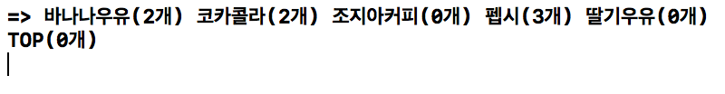
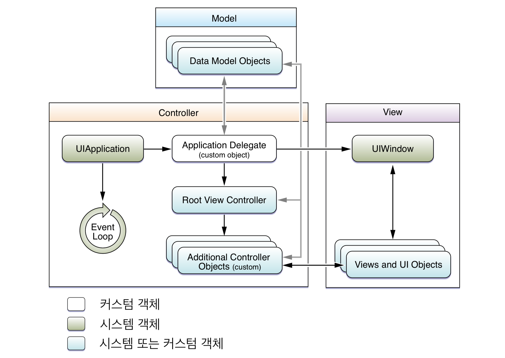
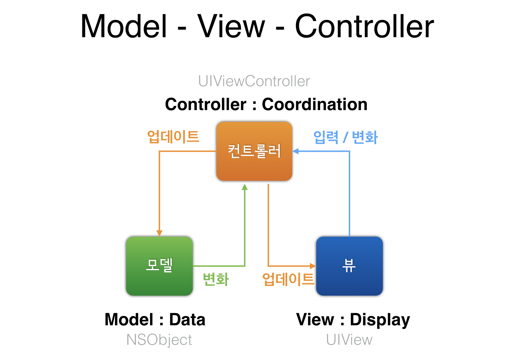
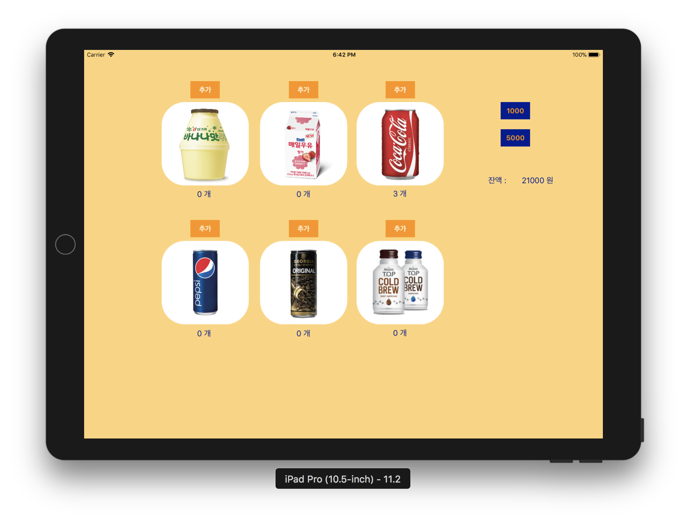
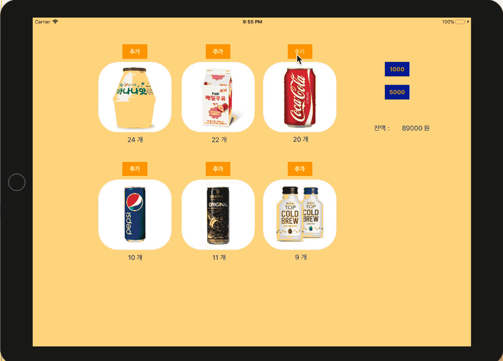
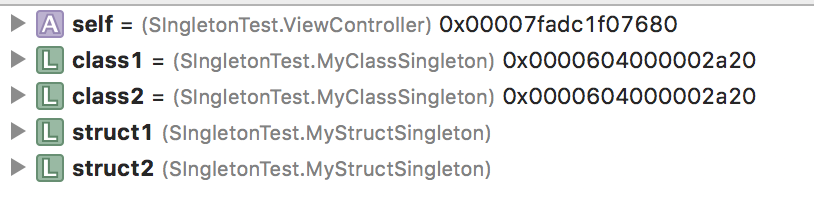
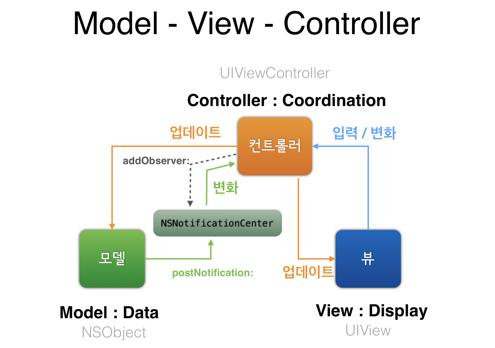
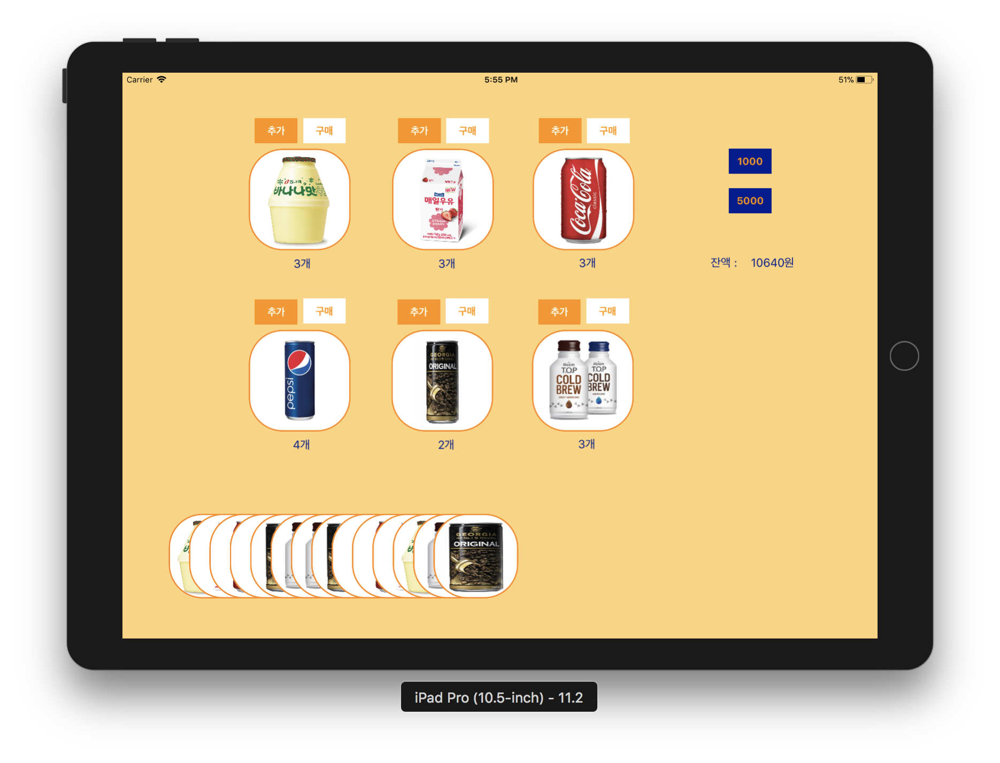
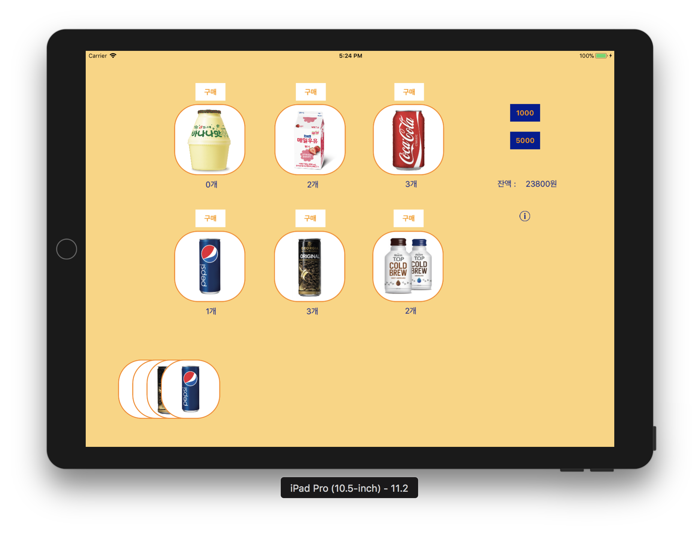
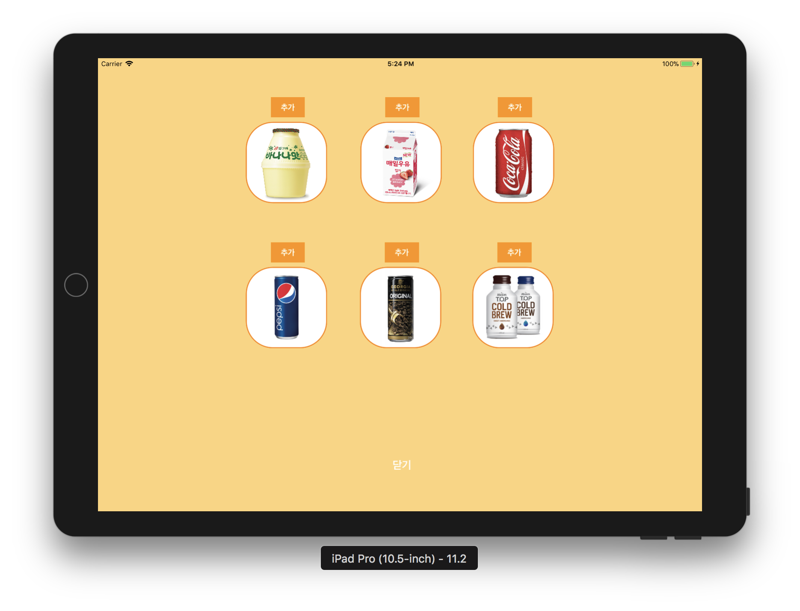

# VendingMachineApp

### 1. 아이패드 앱 - 시작하기
* 프로젝트에 대한 일반 설정 (General)에서 Devices 항목을 iPad로 변경하고, Device Orientation 항목을 가로(Landscape Left, Landscape Right)만 선택함

##### 실행결과 

</img>

##### App Programming Guide for iOS
* iOS 앱을 구성하는 핵심 객체들과 iOS 메인 런루프 동작 이해하기 위해서 [애플 앱 프로그래밍 가이드](https://developer.apple.com/library/content/documentation/iPhone/Conceptual/iPhoneOSProgrammingGuide/Introduction/Introduction.html#//apple_ref/doc/uid/TP40007072) 문서를 학습함
* macOS 프로젝트 템플릿과 iOS 프로젝트 템플릿 구조의 차이점을 학습함
    * iOS 프로젝트에는 main.swift 가 생략되어 있음
    * `UIApplicationMain() 함수의 역할` 에 대해 찾아보고 학습함

##### [UIDeviceOrientation](https://developer.apple.com/documentation/uikit/uideviceorientation)
* The physical orientation of the device.

### 2. MVC 패턴

##### 요구사항
* iOS 앱 프로젝트 기본 구조인 MVC 형태에 맞춰서 기존 레벨2에서 작성한 자판기 소스 파일을 적용함
* iOS 프로젝트와 앱을 구성 핵심 요소들을 MVC로 구분하면 다음과 같음
    * 레벨2 자판기에서 View에 해당하는 InputView와 OutputView는 스토리보드나 코드로 작성하는 화면요소로 대체함
    * 이제 특별한 요구사항이 없을 경우 `print() 함수로 출력하는 경우는 지양함`

</img>
</img>

##### 프로그래밍 요구사항
* 아이패드 앱을 구현함
    * 각 상품에 대한 재고 추가 버튼을 추가함
    * 각 상품에 대한 이미지를 추가함
    * 각 상품에 대한 재고 레이블을 추가함
    * 1000원, 5000원 금액을 입력하는 버튼을 추가함
    * 현재 잔액을 표시할 레이블을 추가함
    * 각 상품의 재고 추가 버튼을 누르면 각 상품 재고를 추가하도록 코드를 구현함
* 재고 추가 버튼을 누르고 나면 전체 레이블을 다시 표시함
* 금액 입력 버튼을 누르면 해당 금액을 추가하도록 코드를 구현함
* 금액을 추가하고 나면 잔액 레이블을 다시 표시함

##### 실행결과

</img>

##### [CALayer](https://developer.apple.com/documentation/quartzcore/calayer)
* 이미지 라운드 처리

```swift
private func setRoundedImages() {
    beverageImages.forEach({
        $0.layer.cornerRadius = 50.0
        $0.layer.masksToBounds = true
        $0.backgroundColor = UIColor.white
    })
}
```

### 3. 앱 생명주기와 객체 저장

##### 요구사항
* 앱 시작부터 종료까지 생명주기를 관리하는 방법을 학습함
* 앱 실행 이후 마지막 자판기 재고 상태와 잔액 등 VendingMachine 객체의 속성을 앱을 종료하더라도 저장하도록 개선함
* 앱을 다시 실행하면 마지막 재고 상태를 그대로 복원함
* 객체의 속성을 저장하기 위한 아카이브(Archive) 관련된 내용을 학습함

##### 프로그래밍 요구사항
* VendingMachine 변수를 ViewController에서 포함하지 않고 AppDelegate로 옮김
* AppDelegate에 선언한 변수를 ViewController에서 접근하기 위한 방법을 찾음
    * `Hint. UIApplication.delegate 객체가 AppDelegate의 인스터스임`
* 앱 종료(background) 시점 콜백 함수에서 VendingMachine 객체 인스턴스 속성을 저장한다.
    * 저장할 때는 VendingMachine을 아카이브해서 하나의 데이터 값으로 변형함
    * 값을 저장하고 복원하는 데에는 UserDefault 라는 파운데이션 라이브러리를 사용함
* 앱 시작(activate) 시점 콜백 함수에서 기존에 저장된 값에서 불러와서 VendingMachine 객체 인스턴스를 생성함
    * 복원할 때는 저장된 데이터 값을 언아카이브해서 VendingMachine 객체를 생성함

##### 실행결과
</img>

##### App Life Cycle
* [정리](https://wiki.yuaming.com/ios/app-programming-for-ios.html) 

##### 깊은 복사와 얕은 복사
* [정리](https://wiki.yuaming.com/ios/shallow-deep-copy.html) 

##### 아카이빙과 직렬화
* [정리](https://wiki.yuaming.com/ios/archives-serialization.html) 

##### SLAP
* [정리](https://wiki.yuaming.com/oop/slap.html)
* 피드백을 받고 프로그래밍의 정석 SLAP 개념이 생각나서 다시 정리함
* `awakeFromNib, layoutSubViews` 또는 [`인터페이스 빌더에서 실시간 렌더링을 통한 커스텀 뷰 만들기`](http://minsone.github.io/mac/ios/how-to-live-coding-using-ibdesignable-and-ibinspectable-in-swift) 참고

```swift
/*
    지금은 큰 상관없다고 느낄수 있지만, 이렇게 모든 객체에 속성을 변경하는 것도 UIImageView 상속을 받아서 (예를 들어 RoundImageView) 객체 내부에서 self.layer.cornerRadius 를 바꿀 수도 있습니다. 상위 모듈에서 하위 모듈의 속성을 모두 조정해야 하는 건 아닙니다.
*/

// # 1
// Before
class ViewController: UIViewController {
    @IBOutlet var beverageImages: [UIImageView]!

    // ...
    private func setRoundedImages() {
        beverageImages.forEach({
            $0.layer.cornerRadius = 50.0
            $0.layer.masksToBounds = true
            $0.backgroundColor = UIColor.white
        })
    }
    
    // ...
}

// # 2
// After
class RoundImageView: UIImageView {    
    func setRoundedImage() {
        self.layer.cornerRadius = 50.0
        self.layer.masksToBounds = true
        self.backgroundColor = UIColor.white
    }
}

class ViewController: UIViewController {
    @IBOutlet var beverageImages: [RoundImageView]!

    // ...
    
    override func viewDidLoad() {
        super.viewDidLoad()
    
        setImageViews()
    }
    
    private func setImageViews() {
        beverageImages.forEach({
            $0.setRoundedImage()
        })
    }

    // ...
}

/*
    RoundImageView 내부에서layoutSubviews 또는 awakeFromNib 이용해서 속성 바꾸기 
*/
// # 3
// View Life Cycle 에 대해 정리가 필요함!
class ViewController: UIViewController {
    @IBOutlet var beverageImages: [RoundImageView]!

    // ...
}

class RoundImageView: UIImageView {
    override func awakeFromNib() {
        setup()
        super.awakeFromNib()
    }
    
    func setup() {
        self.layer.cornerRadius = 50.0
        self.layer.masksToBounds = true
        self.backgroundColor = UIColor.white
    }
}
```

### 4. 싱글톤 객체

##### 프로그래밍 요구사항
* VendingMachine 객체를 싱글톤(Singleton)으로 접근할 수 있도록 개선함 
* VendingMachine 싱글톤으로 sharedInstance 인터페이스를 통해서 AppDelegate와 ViewController에서 접근하도록 코드를 수정함
* 모든 동작은 이전 단계와 동일하게 동작해야 함

##### 결과
* [How to set rootViewController with Swift?](https://stackoverflow.com/questions/24316966/how-to-set-the-rootviewcontroller-with-swift-ios-7)

```swift
// VendingMachine 객체를 직접 생성하는 것이 아니라 싱글톤 패턴으로 전역적으로 접근할 수 있게 바꿈

final class VendingMachine {
    // ...
    
    static func shared() -> VendingMachine {
        return shareInstance
    }
    
    static func stored(_ machine: VendingMachine) {
        shareInstance = machine
    }

    // ...
}

class AppDelegate: UIResponder, UIApplicationDelegate {
    // ...

    if let viewController = window?.rootViewController as? ViewController {
        viewController.vendingMachine = machineSetting.load()
    }

    // ...
}
```

##### 싱글톤 패턴
* [정리](https://github.com/yuaming/design-patterns)

##### struct, class 싱글톤 패턴
* class는 참조이기 때문에 같은 메모리 주소 값을 가짐. struct는 값이기 때문에 메모리 주소 값이 다름
* 싱글톤 패턴은 전역에서 유일무이한 객체인 것이 보장되어야 하기 때문에 class로 많이 사용함

</img>

```swift
class MyClassSingleton {
    static let sharedInstance = MyClassSingleton()
    private init(){}
    
    func helloClass() { print("hello from class Singleton") }
}

struct MyStructSingleton {
    static let sharedInstance = MyStructSingleton()
    private init() {}
    
    func helloStruct() { print("hello from struct Singleton") }
}

let class1 = MyClassSingleton.sharedInstance
let class2 = MyClassSingleton.sharedInstance
class1.helloClass()
class2.helloClass()

let struct1 =  MyStructSingleton.sharedInstance
let struct2 = MyStructSingleton.sharedInstance
struct1.helloStruct()
struct2.helloStruct()
```

### 5. 관찰자(Observer) 패턴

##### 요구사항
* MVC 패턴에서 Model과 Controller의 직접적인 참조 관계를 끊기 위해서 관찰자(Observer) 패턴을 적용함
* 찰자 패턴을 적용해서 재고가 추가될 때마다 화면을 갱신하도록 개선함



##### 프로그래밍 요구사항
* ViewController는 viewDidLoad에서 Observe를 등록함
* 음식 재고가 바뀌는 Notification을 받으면 화면에 Label을 업데이트함
* 추가 버튼을 누르면 해당 음식 재고를 모델에 추가할 때마다
* VendingMachine 모델 객체에서는 변화에 대해 NotificationCenter에 post함
* 모든 동작은 이전 단계와 동일하게 동작해야 함

##### 결과

```swift
class ViewController: UIViewController {
    // ...

    override func viewDidLoad() {
        super.viewDidLoad()
        
        NotificationCenter.default.addObserver(self, selector: #selector(updateMoney), name: NSNotification.Name.money, object: nil)    
        NotificationCenter.default.addObserver(self, selector: #selector(updateBeverageQuantity), name: NSNotification.Name.inventory, object: nil)
    }

    deinit {
        NotificationCenter.default.removeObserver(self)
    }

    // ...
}

final class VendingMachine {
    // ...

    private var money: Money {
        didSet {
            NotificationCenter.default.post(name: Notification.Name.money, object: nil)
        }
    }
    
    private var inventory: Inventory {
        didSet {
            NotificationCenter.default.post(name: Notification.Name.inventory, object: nil)
        }
    }

    // ...
}
```

##### Feedback
* `beverageQuantityLabels.indices`
    * [Collection > indices](https://developer.apple.com/documentation/swift/collection/1641719-indices)

```swift
var c = MyFancyCollection([10, 20, 30, 40, 50])
var i = c.startIndex
while i != c.endIndex {
    c[i] /= 5
    i = c.index(after: i)
}

// c == MyFancyCollection([2, 4, 6, 8, 10])
```

* 항상 override 하는 메소드에 super.xxxx 형태로 호출하는 코드가 넣어야 함

##### Observer 패턴
* [정리](https://wiki.yuaming.com/ios/observer.html)

##### MVC 패턴
* [정리](https://wiki.yuaming.com/ios/model-view-controller.html)

##### NSNotification
* [정리](https://wiki.yuaming.com/ios/nsnotificationcenter.html)

### 6. 구매목록 View 코드

##### 요구사항
* 구매 목록에 대한 제품 이미지뷰를 동적으로 코드로 직접 View에 추가함

##### 프로그래밍 요구사항
* 실행이후 구매 목록을 화면 아래 이미지로 추가함
* 구매 목록도 앱 종료 이후에 저장되도록 개선함
* 특정 제품을 구매할 때마다 해당 제품 이미지를 추가하도록 구현함
    * _NotificationCenter 이용하자!_
* 특정 시점에 self.view.addSubView() 메서드로 UIImageView를 수동 추가함
* 힌트
```swift
let cardImage : UIImageView = UIImageView(image:imageInstance)
cardImage.frame = CGRect(x: x, y: y, width: width, height: height)
```
* 모든 동작은 이전 단계와 동일하게 동작해야 함

##### 결과
* 항상 실수를 줄일 수 있도록 메소드를 만드는 것도 중요함
    * index가 Int가 아니라 Range라면 어떨까요? 왜냐하면 배열에 들어있는 범위에 맞춰서 넘겨야 하는데 Int 면 범위를 벗어날 가능성이 높음
* 새로 만든 초기화 메소드에서 awakeFromNib을 호출하는 구조는 좋지 않음
    * private init을 만들어서 awakeFromNib에서 만드거나
    * 지정 초기화 메서드로 만들면 awakeFromNib와 동일하게 setup 호출
    * 다른 초기화 메소드를 생성하는 경우가 있다면 다른 init에서 지정 초기화 메소드를 호출하도록 만드는 것도 좋음

```swift
// before
init(image: UIImage?, position: CGFloat) {
    super.init(image: image)
    self.position = position
    setSize()
    self.frame = cgRect
    self.awakeFromNib()
}

// after
init(image: UIImage?, position: CGFloat) {
    super.init(image: image)
    self.position = position
    movePoints()
    setup()
    self.frame = cgRect
}
```

</img>


##### Storyboard, Nib(Xib) Files, Custom Code
* Storyboard
    * 장점
        * View Controller 사이에서 이동이 주된 목적인 경우
        * Navigation 흐름(push, pop, present, dismiss 등)을 작업이 쉬움
        * View Controller가 자동으로 생성되므로 deinit이나 init을 해줄 필요 없음
        * 프로토타입을 만들 때 유용함
        * Table View Controller 사용할 때 장점이 있음
            * Cell과 함께 디자인해서 Table View와 함께 둘 수 있음
            * 여러 형태 Cell 템플릿을 디자인 할 수 있음
            * Static Cell 사용 가능함(스토리보드에서만 가능)
    * 단점
        * Storyboard를 한 덩어리로 만들지 말자
            * 기능, 주제, 메뉴 등 분류하여 여러 개 스토리보드로 구현해야 함
        * 여러 사람이 작업할 경우 출동이 발생할 수 있음. Merge 작업이 쉽지 않음
        * 재사용성. 스토리보드에 지나치게 의존되어 있음. 그렇기 때문에 모든 View Controller 복사 또는 옮겨야 함
* Nib(Xib) Files
    * 장점
        * 객체지향 관점에서 View를 분리된 모듈로 나눠서 개발, 테스트, 디버그를 쉽게 해줌
        * ModalView, 간단한 로그인, 회원가입 => 동일한 레이아웃을 공유하는 경우
        * 재사용 가능한 View, Table Cell => 재사용성
    * 단점    
        * 성능
        * Nib(Xib)는 필요할 때 로드함. 필요할 때 메모리로 사용하지 않으나 로드할 때 지연이 발생할 수 있음
* 코드로 작성
    * 장점
        * 스토리보드와 Nib(Xib) 으로 할 수 있는 모든 것이 코드로 가능함
        * 스토리보드나 Nib(Xib)로 만들 수 없는 동적인 View나 복잡한 레이아웃을 가진 View를 만들 수 있음
        * 코드를 작성하는 법을 알면 어떻게 움직이는지 이해할 수 있음
        * UI를 코드로 작성하면 더 많은 제어를 할 수 있고 이해할 수 있는 범위가 넓어짐
        * Merge 충돌을 해결하는 것이 어렵지 않음
        * 코드로 만든 UI는 결국 코드로 변화해야 하는 작업을 거치지 않기 때문에 성능이 좋음
        * 재사용성 가능한 디자인으로 구현할 수 있음
    * 단점
        * 프로토타입 제작이 스토리보드에 비해 시간이 오래 걸림
        * 리팩토링이 어려움 
* _결론은 3개를 적절히 사용하는 것이 좋음_
    * 연관있는 화면을 별도로 그룹으로 모으고 각각 그룹을 분리된 Storyboard로 구현함
    * Storyboard의 Table View Controller 내에 재사용성할 수 없는 Table Cell을 디자인함
    * Nib(Xib) 재사용 가능한 테이블 셀을 디자인함. Nib은 코드를 불러들임
    * Custom View, View Controller 사이에서 Nib으로 디자인함
    * Dynaimc View, 일반적으로 Storyboard, Nib(Xib)로 쉽게 구현할 수 없는 View를 코드로 구현함
* [iOS User Interfaces: Storyboards vs. NIBs vs. Custom Code](https://www.toptal.com/ios/ios-user-interfaces-storyboards-vs-nibs-vs-custom-code)
* [Storyboards vs NIBs vs Code: The Great Debate!](https://www.raywenderlich.com/51992/storyboards-vs-nibs-vs-code-the-great-debate)

##### [UIKit의 모든 화면 요소 Sample을 받아서 분석](https://developer.apple.com/library/content/samplecode/UICatalog/Introduction/Intro.html)

### 7. Frame과 Bounds

##### 프로그래밍 요구사항
* 스토리보드에서 Button을 추가하고, Attributes에서 Type을 Info Light로 설정함
* 새로운 ViewController를 옆에 추가하고, Button에서 Segue를 연결함
* Segue를 선택하고 Kind를 Present Modally로 지정하고, Transition을 Flip Horizontal로 설정함
* 새롭게 추가한 화면을 관리자 모드로 동작하도록 개선함
    * 이미지와 재고 추가 버튼을 복사해서 관리자 화면으로 복사하고, 동작하도록 코드를 수정함
    * 재고 추가 버튼은 기존 화면에서 삭제함
    * 관리자 화면에 [닫기] 버튼을 추가하고, 버튼을 누르면 dissmiss()를 호출함
* 다른 동작은 이전 단계와 동일하게 동작해야 함

##### 결과
* [다양한 화면 전환](https://wiki.yuaming.com/ios/view-segue.html)

</img>
</img>

