## VendingMachineApp 정리

### Step 1


**Device Orientation(화면 지원)**

 일반적으로 설정을 위한 방법이 두 가지 존재한다. 첫 번째는 코드로 구현하는 것이고 두 번째는 프로젝트 설정에서 항목을 설정하는 것이다.

   이번 Step1에서는 프로젝트 설정에서 `Device Orientation` 항목을 설정해주었다.
   1. 프로젝트 일반(General)에서 `Device Orientation`항목을 체크해준다.
   2. 4가지 옵션이 존재한다.
   * Portrait : 기본 모드이다. 기기가 손에 들려있을 때, 홈 버튼이 제일 아랫쪽으로 위치하는 화면모드이다.
   * PortraitUpsideDown : 위의 모드와는 반대되는 모드이다. 홈 버튼이 제일 윗쪽에 위치하는 모드이다.
   * LandscapeLeft : 기기가 들려있고 홈 버튼이 제일 오른쪽에 위치한다. 흔히 동영상을 볼 때 사용한다.
   * LandscapeRight: 위의 모드와 반대되는 모드이다. 홈 버튼이 제일 왼쪽에 위치한다.


**IOS 프로젝트 템플릿 구조**

 * App Lifecycle
    앱 생명주기는 홈 버튼을 눌렀을 때, 전화가 왔을 때와 같이 앱이 화면상에서 보이지 않는 상태, 화면에 실행되고 있는 상태들을 정의한 것이다. 제대로 된 앱을 만들기 이해서는 다양한 상황에서 작동하기 위해 앱 생명주기에 대한 이해가 중요하다.
   앱 생명주기를 이해하기 위해 먼저 Swift 앱을 실행했을 때, 실행되는 상황을 보겠다.
   - UIApplication 객체 생성 (싱글톤 객체 - 앱에 하나만 존재)
   - @UIApplicationMain 어노테이션이 있는 클래스를 찾아 AppDelegate 객체를 생성
   - Main Event Loop을 실행
   
    AppDelegate 객체는 UIApplication 객체로부터 메세지를 받았을 때, 해당 상황에서 실행될 함수들을 정의한다. 프로젝트를 생성할 때, 자동으로 AppDelegate.swift 파일이 생성된다. 이 파일이 AppDelegate 객체가 된다. 이 파일을 열어보면 클래스 선언부에 @UIApplicationMain 어노테이션이 붙어있는 것을 알 수 있다. AppDelegate.swift 파일에는 앱의 상태에 따라 실행되는 함수들이 정의되어 있다. 일반적으로 5개의 상태로 구분된다.
   
```
Not Running : 앱이 실행되지 않은 상태
Inactive : 앱이 실행중인 상태 그러나 아무런 이벤트를 받지 않는 상태
Active : 앱이 실행중이며 이벤트가 발생한 상태
Background : 앱이 백그라운드에 있는 상태 그러나 실행되는 코드가 있는 상태
Suspend : 앱이 백그라운드에 있고 실행되는 코드가 없는 상태
```

 AppDelegate.swift에는 아래와 같이 앱의 상태에 따라 실행되는 delegate 함수들이 정의되어 있다. 그렇기 때문에 앱의 특정 상태에서 동작하는 로직을 구현 할 수 있다.
```
application(_:didFinishLaunching:) - 앱이 처음 시작될 때 실행
applicationWillResignActive: - 앱이 active 에서 inactive로 이동될 때 실행
applicationDidEnterBackground: - 앱이 background 상태일 때 실행 
applicationWillEnterForeground: - 앱이 background에서 foreground로 이동 될때 실행
applicationDidBecomeActive: - 앱이 active상태가 되어 실행 중일 때
applicationWillTerminate: - 앱이 종료될 때 실행
```


### Step 2


**UIImageView 추가하기**
    
UIImageView에 그림을 추가하기 위해 두 가지 방법이 존재한다. 
1. 첫 번째 방법은 프로젝트 폴더에 `.png`파일이나 `.jpg`파일을 넣어준다.  그 후 UIImageView를 클릭 후 오른쪽 상단의 메뉴 중 4번째를 선택하여 Image 옵션에서 넣고싶은 사진 파일을 선택해준다.
2. 두 번째 방법은 `Assets.xcassets` 폴더에 들어가서 오른쪽 마우스를 클릭하여 `Import`를 선택 후 원하는 이미지들을 넣어준다. 이렇게 하면 프로젝트에서 이미지파일에 접근이 가능하게 된다. 이후는 아까 위의 우측상단의 메뉴로 들어가서 설정해준다. 여기서 코드로 설정하는 방법도 존재한다.
```
@IBOutlet weak var bananaMilkImage: UIImageView?
    
override func viewDidLoad() {
    super.viewDidLoad()
    // Do any additional setup after loading the view, typically from a nib.
    bananaMilkImage?.image = UIImage(named: "바나나우유.png")
    
    // 이 코드로 UIImageView의 속성도 조절할 수 있다.
    bananaMilkImage?.layer.cornerRadius = 30
    bananaMilkImage?.clipsToBounds = true
}
```

**IBOutletCollection 활용**

 비슷한 역할을 하는 `IBOutlet`끼리 묶어서 배열로 관리하는 `IBOutletCollection`타입을 활용할 수 있다. 기존에 `IBOutlet`을 사용하기 위해서는 `Ctrl + Drag`로 열결 후 `IBOutlet`을 선택하여 UI 요소들과 코드를 연결하였다. `IBOutletColletcion`도 역시 방법은 위와 동일하나 이후 만들어진 Colletcion 타입에 요소들을 추가하기 위해서는 추가할 요소위에 `Ctrl + Drag`로 추가하고 싶은 `IBOutletColletion`타입 위에 드래그해서 놓으면 된다. 그렇게하면 배열을 통해 UI요소들을 관리할 수 있다.


 **비슷한 동작을 하는 버튼들을 하나의 IBAction으로 묶어주기**

 기존에 `UIButton`을 IBAction으로 하나하나 연결했던 것과는 다르게 이 경우에는 Button들을 `IBOutlet`으로 선언해준다. 그 후 비슷한 동작을 하는 버튼들에 대해서 하나의 `IBAction`을 선언하고 버튼들이 레퍼런싱 할 수 있도록 묶어준다. 밑의 코드를 참조해보면 된다.

```
@IBOutlet var image: UIImageView!

@IBOutlet var redButton: UIButton!
@IBOutlet var yellowButton: UIButton!
@IBOutlet var blueButton: UIButton!

@IBAction func changeColor(_ sender: Any) {
    switch sender {
    case redButton: image.backgroundColor = UIColor.red
    case yellowButton: image.backgroundColor = UIColor.yellow
    case blueButton: image.backgroundColor = UIColor.blue
    case defualt: return
    }
}
```


   ### Step 3


   **AppDelegate.swift 역할**

   1. AppDelegate 클래스를 정의한다 - app delegate <--> AppDelegate는 다르다. app delegate는 인스턴스이고 AppDelegate는 레퍼런스이다. 즉 app delegate가 앱의 객체이다.
   2. entry point와 앱의 입력 이벤트를 전달하는 `run loop`를 생성한다. 밑의 그림을 보면 알 수 있듯이 `@UIApplicationMain` 어노테이션이 있는 클래스를 호출하고 AppDelegate 클래스를 delegate 클래스에 전달한다.
      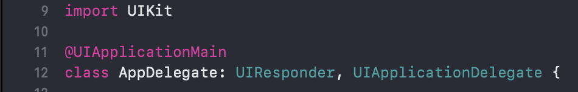


 **AppDelegate 변수 ViewController에서 접근**
```
// AppDelegate.swift 내 변수
var objcet: Object = Object

// ViewController 내 함수
let appDelegate = UIApplication.shared.delegate as? AppDelegate
let controllerObject = appDelegate.object

// UIApplication의 Delegate가 AppDelegate이다. 즉 앱이 실행될 때 UIApplication이 실행되면서 class AppDelegate를 Delegate로 지정한다.

```


**Archiver**

 `Archiver`란? (애플 개발문서에 나와있는 정의)
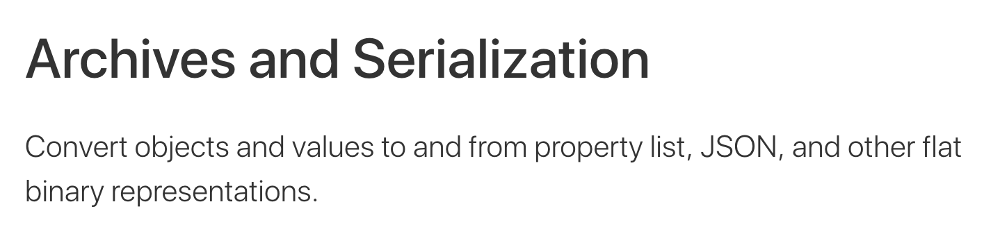
 Archiver을 사용해 정보를 저장하기 위해서는 저장할 데이터 타입에 두 가지 선언이 꼭 필요하다. `NSCoding`, `NSObject` 두 프로토콜을 구현하여야 한다.

 - `NSCoding` Protocol
    인스턴스를 Encoding, Decoding하기 위해선 `NSCoding`을 구현하여야한다. 구현하기 위해서 필요한 두 가지 메소드가 있다.
 1. `init?(coder aDecoder: NSCoder)` - Decode를 위해 구현하는 메소드 --> UnArchiver
 ```
 required init?(coder aDecoder: NSCoder) {
    self.name = aDecoder.decodeObject(forKey: "name") as! String
    self.brand = aDecoder.decodeObject(forKey: "brand") as! String
    self.volume = aDecoder.decodeInteger(forKey: "volume")
}
 ```
 2. `func encode(with aCoder: NSCoder)` - Encode를 위해 구현하는 메소드 --> Archiver
 ```
 func encode(with aCoder: NSCoder) {
     aCoder.encode(name, forKey: "name")
     aCoder.encode(brand, forKey: "brand")
     aCoder.encode(volume, forKey: "volume")
}
 ```
 - `NSObject` Protocol
 Objective-C 클래스의 최상위 클래스이다. 이 프로토콜을 구현함으로서 Objective-C 객체처럼 행동할 수 있는 능력(?)이 생긴다. Archive하기 위해서는 필요하다.


**UserDefault Class**

`UserDefault Class`란? (애플 개발문서에 나와있는 정의)
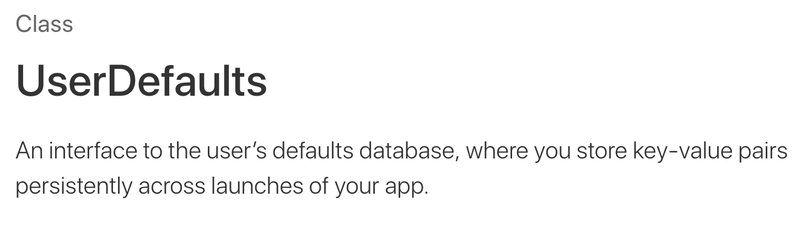

 `UserDefault` 객체를 사용하면 App에서 사용하는 유저의 Default database에 접근하여 값을 읽어오거나 저장할 수 있다. 단 값을 저장할 때, 모든 타입이 가능한 것은 아니다. 공식문서에 명시된 바로는 `NSData`, `NSString`, `NSNumber`, `NSDate`, `NSArray`, `NSDictionary`등이 있다. 이 외의 타입을 저장하기를 원하면 먼저 `Archive`하여 `NSData`형식으로 만들어야한다.

 이번 App에서는 `Vendingmachine`을  저장해야하기 때문에 먼저 Archive한 후 `UserDefault` 클래스로 데이터베이스에 저장하였다.
 ```
 let data = try? NSKeyedArchiver.archivedData(withRootObject: vendingMachine, requiringSecureCoding: false)
 UserDefaults.standard.set(data, forKey: "vendingMachine")
 // 저장 코드
 
 if let data = UserDefaults.standard.data(forKey: "vendingMachine") {
    let vendingMachine = try? NSKeyedUnarchiver.unarchiveTopLevelObjectWithData(data)
    return vendingMachine as? VendingMachine
 }
 // 불러오는 코드
 ```


 ### Step 4


 **싱글톤 패턴**
 - 매번 똑같은 하나의 인스턴스만을 반환하도록 하는 클래스 설계 방식이다.

 싱글톤 패턴은 프로그램 내에서 단 하나의 인스턴스로만 클래스를 관리하고 사용할 수 있다. 그러나 생성되고 나면 프로그램 종료시까지 항상 메모리에 올라가있으므로 적절하게 사용하여야한다.

  `Object-c`에서는 `Dispatch_once_t`를 사용하여 싱글톤 패턴을 구현하였다.

  `Dispatch_once_t` - App 라이프 사이클에서 단 한번만 실행되도록 보장해 주는 것을 뜻한다. Thread Safe를 보장받을 수 있다.

  `Thread Safe` - 여러 스레드로부터 동시 접근이 있을 수 있는데, 이 상황에서 함수의 결과가 올바르게 나오는 것을 말한다.

  Swift 4 싱글톤
  ```
  class SingleTon {
    // sharedInstance 변수를 통해서만 접근 가능
    static let sharedInstance = SingleTon()

    // 외부에서 생성 금지
    private init() {
    }
  }
  
  
  // 별도의 초기화가 필요한 경우
  class SingleTon {
    // sharedInstance 변수를 통해서만 접근 가능
    static let sharedInstance: SingleTon = {
        let instance = SingleTon()
        ...
        return instance
    }()
      
    // 외부에서 생성 금지
    private init() {
    }
  }
  
  
  ```


  ### Step 5


  **관찰자 패턴(Observer Pattern)**
  - 객체의 상태 변화를 관찰하는 관찰자들을 두고, 옵저버들이 객체의 상태 변화를 관찰하여 상태 변화가 있을 때마다 `메소드`를 통해 객체가 직접 관찰자들에게 통지하도록하는 **디자인 패턴**이다.
  
  - `MVC 패턴`에서 자주 사용한다. `MVC 패턴`에서 모델과 뷰 사이(꼭 모델과 뷰 사이가 아니더라도 객체와 객체의 관계)를 느슨히 연결하기 위해 사용한다. 보통 모델에서 일어나는 변화를 통보받아 ViewController에서 작동시킨다.
    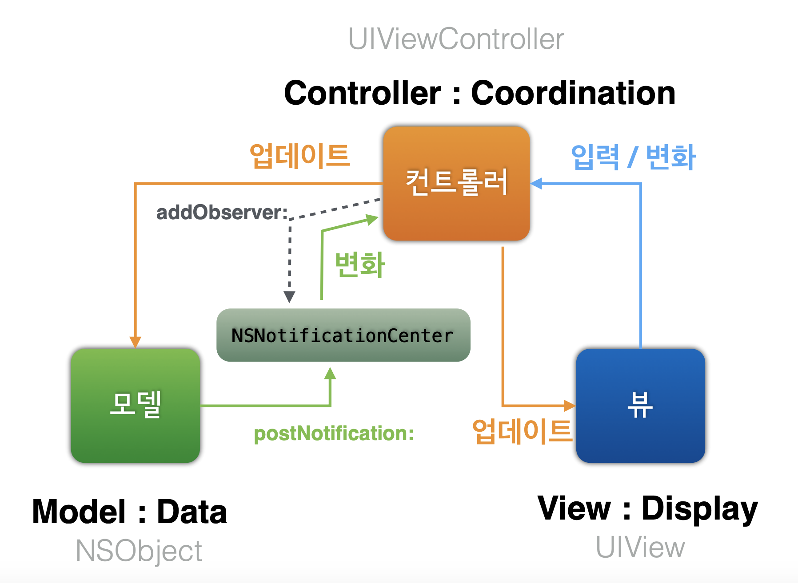


  동작원리
  * 특정 객체가 `NotificationCenter`에 `post`되어 있는 이벤트를 발생시키면 등록된 `Observer`들이 이벤트에 대한 동작들을 한다.

  사용법
  1. 이벤트를 발생시킬 객체를 `NotificationCenter`에 등록해준다. 즉 `Post`해준다. 코드를 보면 `VendingMachine`객체에서 add라는 이벤트가 일어나면 `.stockChanged`란 Notification을 `NotificationCenter`에 보내겠다는 의미이다.
  ```
  extension NSNotification.Name {
    static let stockChanged = NSNotification.Name(rawValue: "stockChanged")
    static let coinChanged = NSNotification.Name(rawValue: "coinChanged")
  }
  
  class VendingMachine {
    func add() {
        NotificationCenter.default.post(name: .stockChanged, object: nil)
    }
    
    func minus() {
        NotificationCenter.default.post(name: .coinChanged, object: nil)
    }
  }
  ```

  2. 이벤트가 발생했을 때, 행동할 취해줄 객체를 `Observer`로 등록해준다. `ViewController`을 `Observer`로 등록 후 name 부분에 해당하는 `Notification`이 왔을 때 `selector`에 해당하는 행동을 취하겠다는 의미이다. 여기서 `selector`은 Obj-c에서 사용되는 것이기 때문에 @objc로 선언해주어야한다.
  ```
  class ViewController: UIViewController {
    override func viewDidLoad() {
        super.viewDidLoad()
        NotificationCenter.default.addObserver(self, selector: #selector(updateDrinkLabel), name: .stockChanged, object: nil)
        NotificationCenter.default.addObserver(self, selector: #selector(updateCoinLabel), name: .coinChanged, object: nil)
    }
    
    @objc func updateDrinkLabel() {
        let commonMode: CommonAvailableMachine = VendingMachine.sharedInstance
        for menu in DrinkCategory.allCases {
            commonMode.markDrinkLabel(menu.rawValue) { drinkCounts in
            self.drinkLabels[menu.rawValue-1].text = "\(drinkCounts)개"
            }
        }
    }
    
    @objc func updateCoinLabel() {
        let commonMode: CommonAvailableMachine = VendingMachine.sharedInstance
        commonMode.markCoinLabel { coin in
            self.currentCoin.text = "잔액 : \(coin)원"
        }
    }
  }
  ```

 3. 이제 `stockChanged`, `coinChanged`에 대한 노티가 발생 시 `옵저버`로 등록된 객체에서 `selector`에 대한 행동을 수행하게 된다.

  


  ### Step7


  **Frame 과 Bounds**

  * Frame
      Super View(상위 뷰)의 좌표시스템안에서 View의 위치와 크기를 나타낸다.

  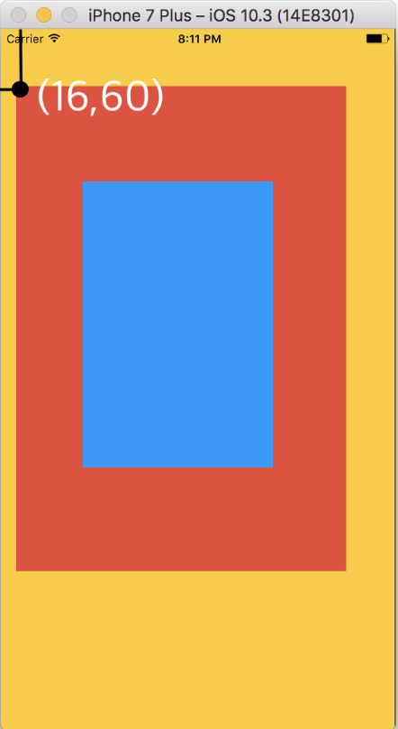 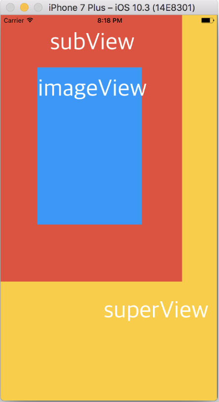
  - 이 그림에서 보면 왼쪽의 그림은 빨간색 화면이 노란색 화면을 기준으로 (16,60)에 그려진 것이다. 파란 화면은 상위 뷰인 빨간화면을 기준으로 (70,100)의 위치에 그려진 것이다.
  - 오른쪽 그림은 보면 빨간화면의 위치를 (0,0)으로 옮긴 것이다. 여기서 잘 보면 파란화면의 위치도 같이 변한 것을 확인할 수 있다. 즉 `Frame`이란 상위 뷰의 위치를 기준으로 위치를 정하는 것이다.

  * Bounds
    자신만의 좌표시스템안에서 View의 위치와 크기를 나타낸다.

  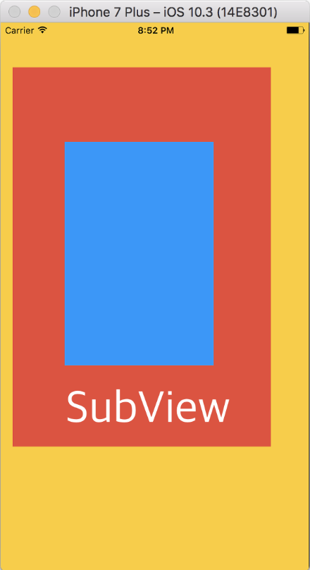 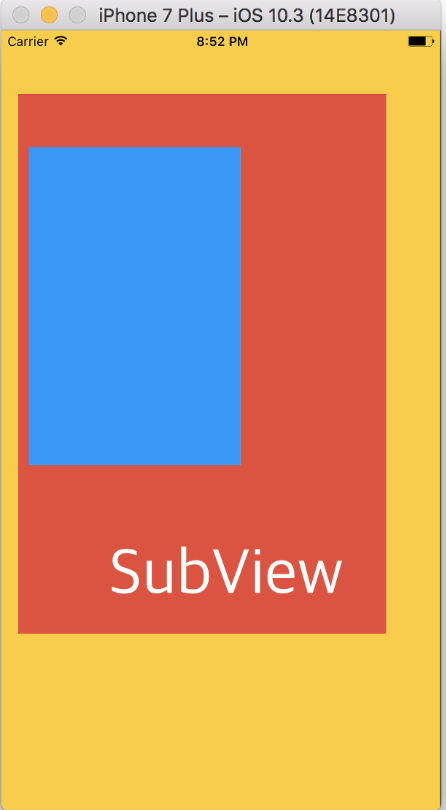
  - 왼쪽 그림은 원래 위치의 그림이고, 오른쪽 그림은 SubView의 위치를 바꾼 것이다. (subView.bounds.origin.x = 60, subView.bounds.origin.y = 50)
  - 예상했던 것과는 다르게 파란색 화면이 움직인 것을 확인할 수 있다. 즉 `Bounds`는  자신 만의 좌표시스템 내에서 움직이기 때문에, SubView 위치가 내려가면서 파란화면이 왼쪽으로 이동한 것처럼 보이는 것이다.


  **Segue로 데이터 전달하기**

  1. 우선 데이터 전달을 위해서 두 `ViewController`사이에 있는 `Segue`의 `Identifier` 설정을 우선 하여야한다.
    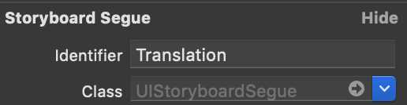
  
  2. Sender `ViewController`에서 그림과 같은 `prepare()`메소드를 오버라이딩하여 구현한다. 
    그림에서 segue.destination이란 Receiver 뷰컨트롤러를 의미한다.
    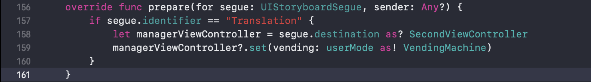


  **AppDelegate에서 ViewController로 데이터 전달**

  1. `ViewController`의 `Identifier` 설정을 해준다.
    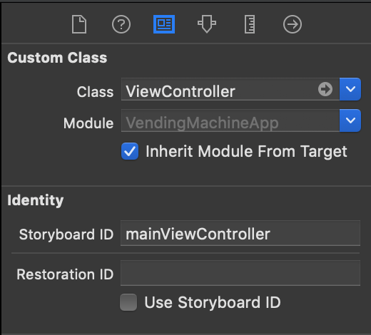
  
  2. `AppDelegate` 내 다음과 같은 코드를 구현한다.
    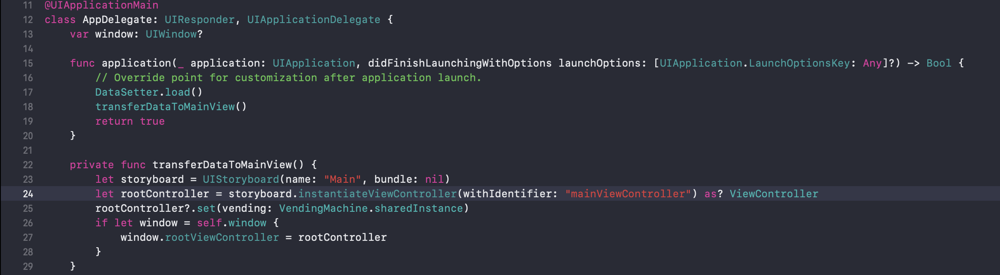

  

### Step8


  **Core Graphics API**

 애플 공식문서에 의한 코어 그래픽에 대한 정의는 아래와 같다.


 간단히 말해 2D를 이용한 그림을 그릴 때, path를 이용해 그리겠다는 것이다. 일러스트레이터 툴을 생각하면 편하다.

 우선 그림을 그리기 위해 도구도 필요하지만 그림을 그릴 도화지도 필요하다. 이전에는 이미지를 불러오기 위해 `UIImageView` 객체를 사용하였지만 Pie Graph를 그리기 위해 `UIView` 객체를 사용한다.

1. `File -> New -> File` 을 선택하여준다.

   

   

2. `Cocoa Touch Class` 를 선택한다.


3. `UIView` 를 선택한 후 파일을 생성한다.

이제 그림을 그릴 도화지는 만들어졌다. 이제 도구인 `UIBezierPath` 를 이용하여 그림을 그릴 것이다. 공식문서를 참조하면 여러 메소드들이 있다. 거기서 우선 기본적인 선먼저 그려보자.


- **+버튼 그리기**

```swift
override func draw(_ rect: CGRect) {
    let path = UIBezierPath()
        
    UIColor.black.setStroke()
    let lineCm = min(self.frame.width, self.frame.height) * 0.6
        
    path.move(to: CGPoint(x: self.frame.width * 0.5 - lineCm * 0.5, y: self.frame.height * 0.5))
    path.addLine(to: CGPoint(x: self.frame.width * 0.5 + lineCm * 0.5, y: self.frame.height * 0.5))
        
   	path.move(to: CGPoint(x: self.frame.width * 0.5, y: self.frame.height * 0.5 - lineCm * 0.5))
  	path.addLine(to: CGPoint(x: self.frame.width * 0.5, y: self.frame.height * 0.5 + lineCm * 0.5))
        
   	path.stroke()
}
```

 라인을 활용해서 + 버튼을 그린 코드이다. lineCm에 라인의 길이를 정해주고 ` path.move(to:)` 메소드로 라인이 시작할 위치로 점을 이동시켜준다. 그 후 그 점을 기준으로 라인의 길이만큼 `path.addLine(to:)` 메소드로 라인을 그려주었다.

- **사각형 그리기**

```swift
override func draw(_ rect: CGRect) {
    let pa = UIBezierPath(rect: rect)
    UIColor.black.setFill()
    pa.fill()
}
```


  

  
