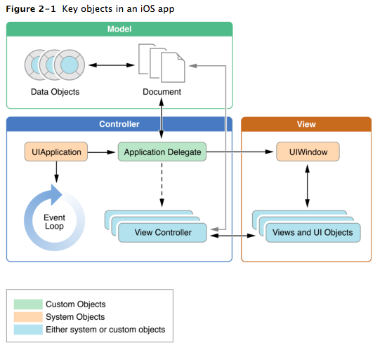
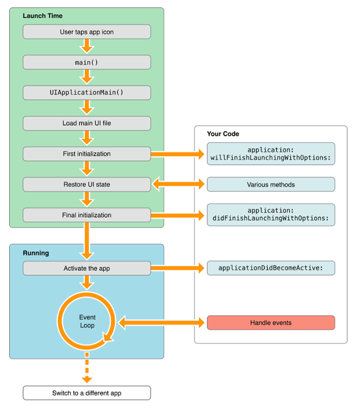
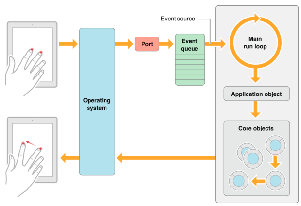
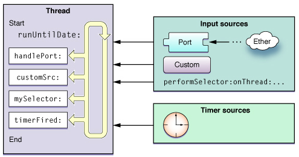
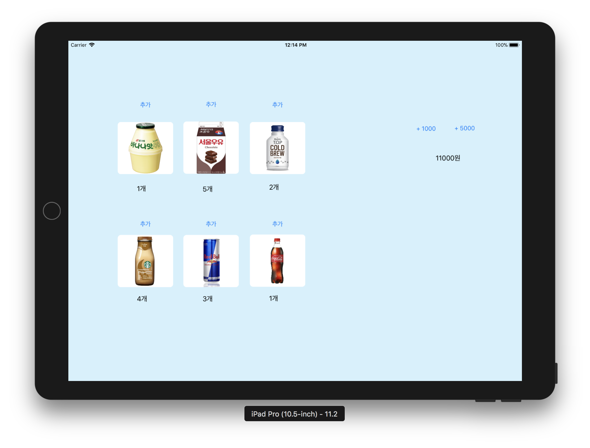
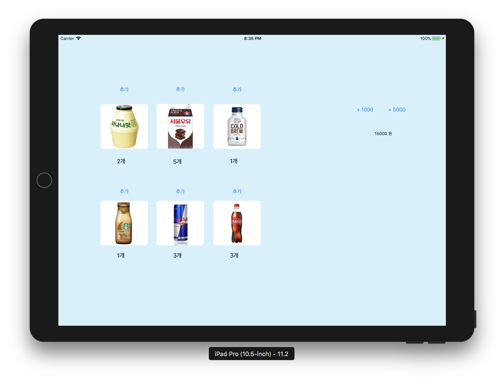
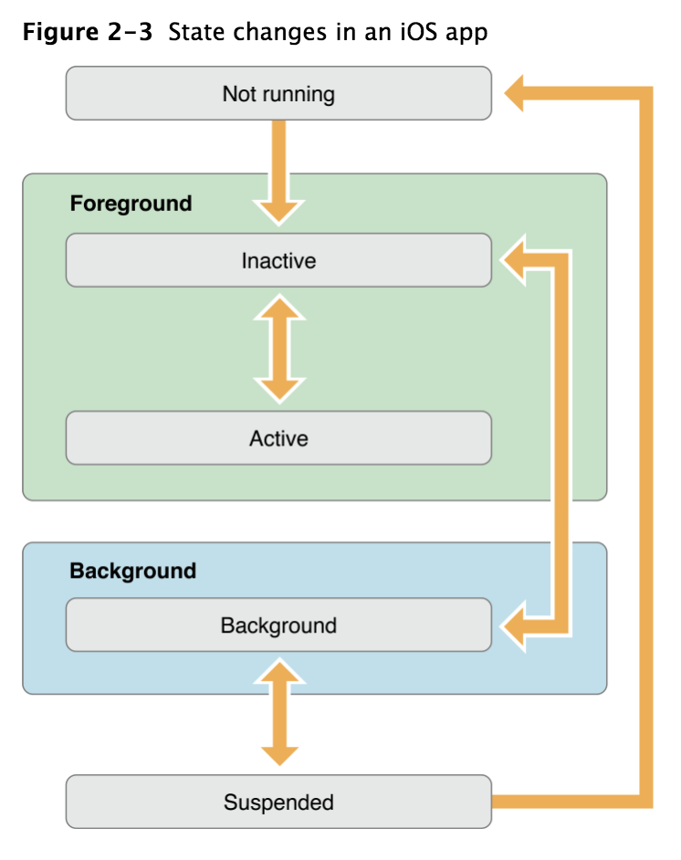
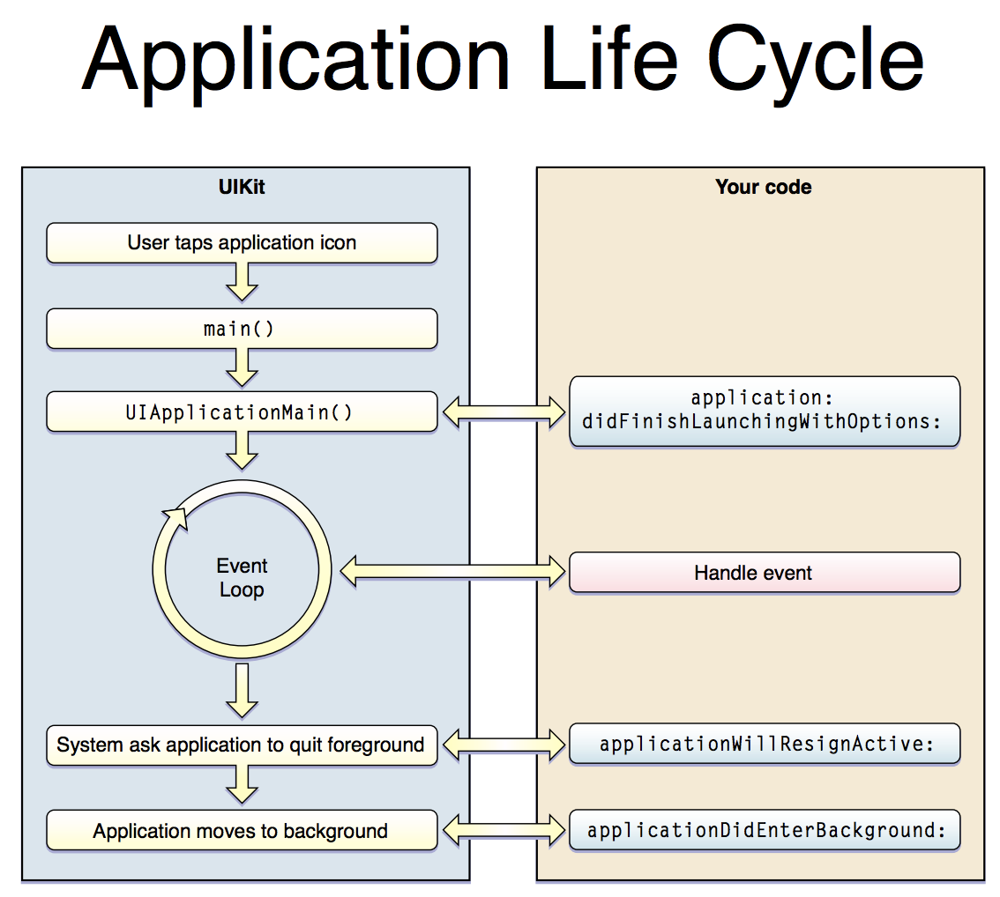

## Step1 - 아이패드 앱 시작
> iOS 앱 프로젝트 기본 구조인 MVC 형태에 맞춰서 기존 레벨2에서 작성한 자판기 소스 파일을 적용한다.

## iOS infrastructure
앱은 내가 작성한 커스텀 코드와 시스템 프레임워크 사이에서 상호작용한다. 시스템 프레임워크는 앱이 실행되는데 기본적인 인프라를 제공하고, 내 코드는 그 인프라를 커스텀하도록 설계하여 내가 원하는대로 앱이 보여지도록 만들 수 있다.
iOS프레임워크는 MVC패턴과 델리게이션 같은 디자인패턴을 기반으로 동작한다.  

## iOS앱을 구성하는 핵심객체(UIKit Framework의 핵심 객체)

앱이 시작되는동안, UIApplicationMain 함수는 주요 객체를 세팅하고 앱을 실행을 시작한다. 앱의 가장 핵심적인 역할을 하는 [UIApplication](https://developer.apple.com/documentation/uikit/uiapplication) 객체는 시스템과 앱 내부의 다른 객체들이 상호작용할 수 있도록 한다.
iOS앱은 MVC패턴을 사용하는데, 데이터와 로직을 데이터의 시각화로부터 분리해서 동작시키는 패턴이다.



- **UIApplication** : 앱의 가장 핵심적인 역할을 하는, 앱 그 자체를 의미하는 객체. 시스템으로부터 이벤트를 받아 Custom Objects로 이벤트를 전달하고 상위 레이어의 앱 동작을 조정
  - 앱 상태 변화나 푸시 메세지 도착처럼 특수한 형태의 이벤트를 우리가 정의한 델리게이트 객체에 전달하여 사전에 정의된 메소드를 호출할 수 있도록 한다.
  - UIApplication 객체는 대리인인 AppDelegate 객체를 내세워 커스텀 코드를 처리할 수 있도록 약간의 권한을 부여한다.
  - UIApplication은 앱의 생명주기나 이벤트 처리와 같이 중요한 일들을 담당하고, AppDelegate는 커스텀 코드를 처리하게 된다.
- **AppDelegate** : 위임받은 권한을 이용하여 App의 초기화(app initialization), 상태변화(state transitions), 다른 앱의 기타 이벤트를 핸들링
  - custom 객체로서 앱 런칭시점에 UIApplicationMain 함수에 의해 생성된다. (커스터마이징하거나 서브클래싱 할 수 있도록 오픈되어 있다.)
  - AppDelegate객체 내의 custom logic들은 UIApplication객체와 상호작용한다.
  - 앱이 시작되면 앱 델리게이트는 `application(_:didFinishLaunchingWithOptions:)` 메시지를 받게 되는데, 이 시점에 크리티컬한 데이터를 초기화하면 된다. 단, 앱이 화면에 나타나기 전이므로 시간이 많이 걸리는 작업은 하지 않는 것이 좋다.
  - 앱 내에서 오직 하나의 인스턴스만 생성되도록 보장받는다.
  - 앱 전체의 생명주기와 함께 한다. 앱이 처음 만들어질 때 객체가 생성되고, 앱이 실행되는동안 유지되다가, 앱이 종료되면 소멸한다.
  - AppDelegate 객체는 종종 앱의 초기 데이터 구조를 설정하기 위해 사용되기도 한다. (AppDelegate 객체에 데이터를 저장하면 앱 종료 전까지 데이터를 유지할 수 있으므로)
- **UIWindow** : 화면 그리기 지원 도구를 제공하는 객체.
  - 디바이스 스크린을 빈틈없이 채우기 위한 객체
  - 대부분의 앱은 하나의 윈도우를 가진다.
  - 항상 유저 인터페이스 표현 계층의 최상위에 위치한다.
  - 뷰의 일종이지만 직접 콘텐츠를 가지지 않는다. UIView들이 콘텐츠를 표현하면 디바이스 스크린에 이를 표현한다.
  - 화면이 전환되더라도 윈도우 객체는 전환되지 않는다.(내부에 배치된 뷰의 콘텐츠만 변경된다.) 뷰 컨트롤러를 조정해서 뷰를 변경해야한다.
  - 윈도우는 UIApplication과 상호작용하며, 특정 이벤트가 발생하면 그 이벤트를 뷰컨트롤러에 전달하는 역할을 한다.

- **View controller** : 앱의 컨텐츠가 화면에 보이게 하는 역할
  - 하나의 View Controller 객체는 하나의 뷰와 뷰의 서브뷰를 관리. View Controller 객체는 자신이 관리하는 뷰를 앱의 윈도우에 위치시킴으로써 뷰가 화면에 보여지도록 한다.
  - UIVIewController클래스는 모든 뷰 컨트롤러 객체의 부모클래스이다. 기본적인 시스템 상에서 일어날 수 있는 동작에 따라 뷰의 기본 동작들을 제공한다.

- **View and Control** : 앱의 콘텐츠를 시각적으로 표현
  - 뷰는 명시된 직사각형 내에서 컨텐츠를 draw하고 그 영역 내의 이벤트에 반응한다.
  - 컨트롤은 특수한 뷰인데 예를들어 버튼, 텍스트필드, 토글 스위치처럼 친숙한 인터페이스이다.

## App Loading Process(앱 초기화 과정)
> UIApplicationMain()함수의 역할

1. App 실행: main() 함수 실행
2. main(): main()는 UIApplicationMain() 호출
3. UIApplicationMain(): 앱의 본체에 해당하는 객체인 UIApplication 객체 생성
4. UIApplication 객체: Info.plist 파일을 바탕으로 앱에 필요한 데이터와 객체 로드
5. AppDelegate 객체 생성 및 UIApplication 객체와 연결
6. 이벤트 루프 생성 등 실행에 필요한 준비 진행
7. 실행 완료를 앞두고 UIApplication객체가 AppDelegate에 `application(_:didFinishLaunchingWithOptions:)` 메시지 전송




## The Main function
C를 기반으로 하는 앱과 동일하게 iOS앱도 main함수로부터 실행이 시작된다. 하지만 iOS프로젝트에는 main.swift가 생략되어있다. (Xcode가 기본으로 작성해준다. 99%의 iOS앱 프로젝트가 앱의 론칭 방식까지 변경할 이유는 없기 때문에 우리는 보통 앱이 실행되고 나서 커스텀 코드를 만나게 되는 첫 지점인 앱 델리게이트 파일부터 편집하게 된다.)
```swift
#import <UIKit/UIKit.h>
#import "AppDelegate.h"

int main(int argc, char * argv[])
{
    @autoreleasepool {
        return UIApplicationMain(argc, argv, nil, NSStringFromClass([AppDelegate class]));
    }
}
```
main함수를 보면 알 수 있지만, (함수의 리턴 부분을 보면)UIApplicationMain함수가 앱의 핵심 객체를 생성하고, 스토리보드로부터 앱의 UI를 로드하고, 커스텀 코드를 호출하며, 앱이 run loop 내에서 동작 할 수 있도록 만든다. *(GUI를 사용하기 위한 런루프를 돌려주는 작업)* 이 중에서 개발자가 해야 할 것은 스토리보드 파일과 custom initialization code이다.


## The Main Run Loop
> - UIApplication객체는 앱 런치 시 main run loop을 셋업하고, 이벤트를 다루고 뷰 인터페이스를 업데이트하기위해 사용한다.
> - 또한 main run loop은 앱의 메인 스레드이다.

- 메인 런 루프는 앱에 들어오는 이벤트들을 애플리케이션 객체가 처리할 수 있도록 계속해서 라우팅하고, 처리결과로서 UI와 상태를 업데이트한다.
- 발생한 이벤트의 좌표는 런루프에 추가된다.
  - 입력소스(input source): 다른 thread나 어플리케이션에서 전달되는 메시지 이벤트(비동기식)
  - 타이머소스(timer source): 예정시간이나 반복수행간격에 따라 발생하는 이벤트(동기식)

  - **사용자 이벤트 발생, 처리과정**
  
  1. 이벤트 발생(ex. 터치)
  2. 시스템에서 port를 통해 앱으로 전달(메인 런루프는 다른 런루프와 달리 사용자 액션으로 인한 이벤트를 Operating System으로부터 받는다.)
  3. 이벤트 queue에 등록
  4. 이벤트에 맞는 메소드 실행

- 애플리케이션 객체(Application Object)는 로우레벨 이벤트를 받아 UIEvent로 변환하여 해당하는 객체로 내보낸다.
  - 애플리케이션은 각 이벤트를 도착한 순서대로 처리해야 하기 때문에 로우레벨 이벤트는 FIFO 이벤트 큐에 들어간다.
  - 애플리케이션 객체는 이벤트 최상위에 있는 객체를 취해서 이벤트 객체(UIEvent)로 변환하고 유저 이벤트가 일어난 Window에 디스패치(dispatch)한다.
  - 전달한 이벤트가 돌아왔을 때 애플리케이션은 큐에서 다음 객체를 가져와서 디스패치한다. 앱이 종료될 때까지 이 과정을 반복한다.
  - 또한, 앱이 실행되었을 때 이벤트를 처리하는 책임을 가진 객체들을 코어 그룹으로 설정한다.
- 코어 객체(Core Objects)는 이벤트에 응답하고 UI를 업데이트한다.
  - 애플리케이션 객체에서 보낸 이벤트는 Window가 먼저 받고, Window는 이벤트를 처리하기에 가장 적절한 핸들러인 View에 보낸다.
  - 최초로 받은 뷰가 이벤트를 처리하지 않으면, 응답자 체인(Responder Chain)\*을 통해 다른 뷰로 전달된다.
  - 뷰는 종종 애플리케이션의 외관을 수정하고 상태나 데이터를 업데이트하는 일련의 액션을 수행한다. 이런 액션이 완료되면 애플리케이션 객체로 제어가 돌려지며, 애플리케이션 객체가 이벤트 큐의 다음 이벤트를 취한다.


- 전달받은 이벤트를 앱의 run loop에서 처리하는 과정


1. run loop 대기 중 이벤트 발생(주로 입력소스와 타이머소스 처리)
2. 정해진 메소드 호출(타이머에서 설정한 시간데 따라)
3. 메소드 완료 후 변경될 필요가 있는 사항 적용(뷰의 경우 setNeedsLayout, setNeedsDisplay)
4. runUntil- 메소드에서 정한 시간까지 유지, 할일 없으면 suspend 상태.


\* Responder chain : 뷰 요소들은 responder를 상속받아서 구현되어있다. Responder chain은 이벤트를 구성한다. linked list처럼 다음에 응답할 애 다음에 응답할 애 다음 다음 그다음...

***


### 앱 프로그래밍 가이드
- Apps Are Expected to Support Key Features
- Apps Follow Well-Defined Execution Paths
- Apps Must Run Efficiently in a Multitasking Environment
- Communication Between Apps Follows Specific Pathways
- Performance Tuning is Important for Apps

### 앱 번들
> 번들은 파일 시스템 내의 한 경로인데, 앱을 구성하는 리소스들을 묶어놓은 단위이다.  
> iOS 앱 번들은 앱 실행파일이나 앱 아이콘, 이미지, 로컬라이즈 콘텐츠를 포함한다.

#### 일반적으로 앱 번들에 포함되는 것들
- *App executable, Info.plist(information property list file), App icons, Launch images, Storyboard files (or nib files), \*Ad hoc distribution icon, \*Settings bundle, Nonlocalized resource files, \*Subdirectories for localized resources*

\* *Ad hoc distribution icon*: This icon is normally provided by the App Store from the materials you submit to iTunes Connect. However, because apps distributed ad hoc do not go through the App Store, your icon must be present in your app bundle instead. iTunes uses this icon to represent your app.
\* *Settings bundle*: If you want to expose custom app preferences through the Settings app, you must include a settings bundle.
\* *Subdirectories for localized resources*: An iOS app should be internationalized and have a language.lproj directory for each language it supports.<br/>
Localized resources must be placed in language-specific project directories, the names for which consist of an ISO 639-1 language abbreviation plus the .lproj suffix. (For example, the en.lproj, fr.lproj, and es.lproj directories contain resources localized for English, French, and Spanish.)


## Step2 - MVC 패턴
> - 각 상품의 재고 추가 버튼을 누르면 각 상품 재고를 추가하도록 코드를 구현한다.
> - 재고 추가 버튼을 누르고 나면 전체 레이블을 다시 표시한다.
> - 금액 입력 버튼을 누르면 해당 금액을 추가>하도록 코드를 구현한다.
> - 금액을 추가하고 나면 잔액 레이블을 다시 표시한다.

- 구현화면 : 2018.03.23 12:10



### IBOutlet Collection
- 특징
  - IBOutlet Collection을 사용하면 중복되는 outlet요소들을 합칠 수 있다.
  - 연결된 ViewController에는 NSArray형태로 저장된다.
  - 순서가 보장되지 않는다.
  - index대신에 tag로 요소를 구분한다.
- 사용방법
  - [참고링크 -  Abhimuralidharan](https://medium.com/@abhimuralidharan/what-is-an-iboutletcollection-in-ios-78cfbc4080a1)
  - [참고동영상 - Mitchell Hudson](https://www.youtube.com/watch?v=OoP1fEzH1F0)

### super.awakeFromNib()
[참고](https://developer.apple.com/documentation/objectivec/nsobject/1402907-awakefromnib)

## Step3 - 앱 생명주기와 객체 저장
> VendingMachine 변수를 ViewController에서 포함하지 않고 AppDelegate로 옮긴다.
> 앱 종료(background) 시점 콜백 함수에서 VendingMachine 객체 인스턴스 속성을 저장한다.
> 저장할 때는 VendingMachine을 아카이브해서 하나의 데이터 값으로 변형한다.
> 앱 시작(activate) 시점 콜백 함수에서 기존에 저장된 값에서 불러와서 VendingMachine 객체 인스턴스를 생성한다.
> 복원할 때는 저장된 데이터 값을 언아카이브해서 VendingMachine 객체를 생성한다.

- 구현 화면: 2018.03.26 20:00 *(앱 실행 후 재고 및 금액 추가, 종료 후 재시작 시 화면)*
 


### 간단한 iOS앱의 생명주기


*(왼쪽: iOS시스템 프레임워크 /// 오른쪽: 커스텀코드)*

- main함수 실행과 UIApplicationMain()호출
- 스위프트에서는 `@UIAnnotationMain`찾아서 실행
- 커스텀코드측(AppDelegate에 작성된 `application()`메소드가 시스템에 의해 자동호출
 - AppDelegate클래스에 `application()` 메소드에 원하는 코드를 작성해두면 앱이 처음 시작될때 해당 코드를 실행할 수 있다.
- 시스템 프레임워크의 이벤트 루프 실행되면서 이벤트 핸들에 의해 커스텀 코드로 연결됨
 - 커스텀 코드중 `@IBAction`으로 구현된 코드가 이벤트를 받아와서 메소드 내에 구현된 코드를 실행하므로 이벤트 핸들이라고 할 수 있다. **`@IBAction`메소드같이 사용자가 어떤 이벤트를 보냈을때 실행되도록 구현해놓은 메소드를 이벤트 핸들이라고 할 수 있다.**
 - (원하는 이벤트가 발생했을때 제어하도록 커스텀코드와 연결해놓으면 이벤트 루프에서는 특정 이벤트가 발생했을때 우리가 만든 핸들을 통해(`@IBAction`) 커스텀코드를 실행할 수 있도록 처리함)
- AppDelegate클래스의 `applicationWillTerminate()`호출하여 앱 메모리에서 제거하기 위한 준비


## The Main Run Loop
- 앱의 main run loop은 사용자 관련 프로세스를 받은 순서대로 처리한다.(터치이벤트와 같은)
- UIApplication객체는 앱이 launching되는 시점에 main run loop을 생성한 뒤 run loop로 이벤트를 처리
- main run loop은 앱의 메인 스레드에서 동작

### 사용자의 이벤트가 인식되는 구조
1. 사용자는 디바이스에서 특정 액션을 취함 (터치, 줌 등)
2. 그 액션에 해당하는 이벤트가 시스템에 의해 생성, UIKit에서 생성한 port를 통해 앱에 전달
3. 이벤트들은 앱 내부적으로 queue에 저장(FIFO)
4. UIApplication객체가 가장 먼저 이 이벤트를 받아서 어떤 동작이 취해질 지 결정
 - 터치 이벤트의 경우 main window객체가 인식하고 window객체가 다시 터치가 발생한 view로 이벤트를 전달함
 - 다른 이벤트들도 다양한 app객체에 따라 조금씩 다르게 동작

### 주로 발생되는 이벤트 처리에 대한 설명
- Touch이벤트: **터치 이벤트가 발생한 view객체** 로 전달
 - view는 응답을 할 줄 아는(Responder) 객체이므로 터치 이벤트가 발생한 뷰 객체로 전달됨. 만약 해당 뷰에서 처리되지 않는 터치이벤트는 Responder chain을 따라 계속 내려가게됨
- Remote control / Shake motion events: **First responder object객체**
 - 미디어콘텐츠의 재생이나 되감기 등과같은 remote control이벤트는 주로 헤드폰같은 악세사리에서 발생
- Accelerometer / Magnetometer / Gyroscope: **내가 정한 객체** 로 전달
 - 가속도계, 방향, 중력센서(자이로스코프)와 관련된 이벤트를 내가 지정한 객체로 전달됨
- Location: **내가 정한 객체**
 - Core location Framework를 사용해서 위치와 관련된 이벤트 등록
- Redraw: **업데이트가 필요한 객체**
 - Redraw 이벤트는 이벤트 객체를 갖지는 않고, 단순히 업데이트가 필요한 view객체에 요청
- **참고**, 이벤트 소스 종류
 - 입력소스(input source): 다른 thread나 어플리케이션에서 전달되는 메시지 이벤트(비동기식)
 - 타이머소스(timer source): 예정시간이나 반복수행간격에 따라 발생하는 이벤트(동기식)
- **Touch나 Remote Control** 같은 이벤트는 앱의 Responder객체를 통해 처리된다.
- Responder객체는 앱의 모든 곳에 존재
- UIApplication, 커스텀 view객체, ViewController객체 모두 Responder객체에 해당된다.
- 대부분의 이벤트는 특정 객체를 대상으로 전달되지만 다른 객체로 변경할 수도 있음
 - UIView의 hitTest나 pointInside사용 등
 - 이벤트를 받은 객체에서 해당 이벤트를 처리하지 않는다면 부모뷰로 이벤트를 전달 시킬 수 있다.
- **Control** 에서 발생하는 이벤트(ex. Button)는 보통 몇 가지로 제한된 이벤트만 존재한다. 그 이벤트들을 다시 Action메시지로 패키징하여 지정된 객체로 전달한다. (Target-action design pattern)

## 앱의 실행상태


시스템 내에서 일어나는 액션을 통해 시스템은 앱의 상태를 바꾸게 됨.
- Not running: 아직 실행되지 않거나 실행되다가 시스템에 의해 종료
- Inactive: 앱이 foreground에 올라와있지만 이벤트를 받지않고있는 상태(다른 코드를 실행 중일 수 있다) 앱에서는 보통 앱 상태변화가 일어나는 동안에 짧게 이 상태를 갖게됨
- Active: 앱이 foreground에서 실행중이고 이벤트를 받고 있는 상태
 - *(Inactive와 Active 상태를 합쳐서 Foreground 라고 함)*
- Background:
 - 앱이 background에 있고 코드를 실행하고있는상태.
 - 대부분의 앱은 suspended로 가는 도중에 잠깐 이 상태에 머무름.
 - 이외에도 background상태로 실행되는 앱의 경우에는 Inactive대신에 Background상태로 진입한다.
- Suspended:
 - 앱이 background에 있으면서 코드를 실행하고있지 않은 상태.
 - 시스템은 자동으로 suspended로 변경하고 따로 알려주지 않는다.
 - suspended상태에로 메모리에는 올라가 있음.
 - 메모리가 부족한 상황이 오면 시스템이 앱을 kill하기도 하는데, 이 때도 따로 알려주지 않는다.

### AppDelegate methods
> - 대부분의 상태변화는 AppDelegate객체의 메소드 호출을 거친다.
> - AppDelegate.swift 파일에는 앱의 상태에 따라 실행되는 함수들이 정의되어 있다.
> - 앱의 상태에 따라 실행되는 delegate 함수들이 정의되어 있기때문에 함수안에 코드를 작성 함으로써 앱의 특정 상태에서 동작하는 로직을 구현 할 수 있다.

- `application:willFinishLaunchingWithOptions:` 앱을 실행할 때 최초로 실행할 코드를 작성하면 좋음.
- `application:didFinishLaunchingWithOptions:` 앱의 화면이 사용자에게 보여지기 직전에 최종 초기화 작업을 진행
- `applicationDidBecomeActive:` 앱이 이제 Foreground로 갈 것. 최종 준비작업.
- `applicationWillResignActive:` 앱이 Foreground에서 다른 상태로 전환이 될것임을 알려줍니다. 앱이 잠잠한(quiescent) 상태로 변환되는 작업을 여기서 진행하세요.
- `applicationDidEnterBackground:` 앱이 Background로 돌아감. 그리고 언제든지 Suspended상태로 변환이 될 수 있다.
- `applicationWillEnterForeground:` 앱이 Background에서 다시 Foreground로 돌아오게 될 것임을 알려줌. 아직 앱이 Active상태는 아님.
- `applicationWillTerminate:` 앱이 종료될 것임을 알려줍니다. 만약 앱이 Suspended상태라면 이 메소드는 호출되지 않습니다.

```
application(_:didFinishLaunching:) - 앱이 처음 시작될 때 실행
applicationWillResignActive: - 앱이 active 에서 inactive로 이동될 때 실행
applicationDidEnterBackground: - 앱이 background 상태일 때 실행
applicationWillEnterForeground: - 앱이 background에서 foreground로 이동 될때 실행 (아직 foreground에서 실행중이진 않음)
applicationDidBecomeActive: - 앱이 active상태가 되어 실행 중일 때
applicationWillTerminate: - 앱이 종료될 때 실행
```
[참고-앱 생명주기(App Lifecycle) vs 뷰 컨트롤러 생명주기(ViewController Lifecycle) in iOS](https://medium.com/ios-development-with-swift/%EC%95%B1-%EC%83%9D%EB%AA%85%EC%A3%BC%EA%B8%B0-app-lifecycle-vs-%EB%B7%B0-%EC%83%9D%EB%AA%85%EC%A3%BC%EA%B8%B0-view-lifecycle-in-ios-336ae00d1855)
[참고-앱라이프사이클](http://rhammer.tistory.com/94)



## 아카이빙
- iOS앱은 기본적으로 사용자에게 데이터를 조작할 인터페이스를 제공함
- 모델 객체: 사용자가 조작하는 데이터를 보관하는 역할 (저장과 로딩)
- 뷰 객체: 단순히 그 데이터 반영
- 컨트롤러 객체: 뷰와 모델 객체의 동기화 책임
- **아카이빙은 iOS에서 모델 객체를 저장하는 가장 흔한 방법 중 하나임**
 - **아카이빙:** 객체의 아카이빙이란 그 객체의 프로퍼티를 모두 기록하고 파일 시스템에 그 내요을 저장한다는 뜻
 - **언아카이빙:** 아카이브한 데이터로부터 객체를 다시 만든다.
- **아카이빙/언아카이빙 할 클래스들은 반드시 NSCoding프로토콜을 따라야한다.**
 - `어떤 객체의 속성이 또 다른 객체, 그 객체의 속성은 또 다른 객체...`처럼 수직관계를 형성하는 구조라면 NSCoding이 저장 할 수 있는 스위프트value 단계까지 NSCoding프로토콜 구현을 해줘야한다.
 - 만약 아카이빙 할 필요는 없지만 수직구조 내에 위치해서 프로토콜 구현이 필요한 일부 속성(객체)은 NSCoding프로토콜을 준수하지만 메소드 선언만 해놓고 구현하지 않아도 된다. `(Shelf 객체)`
- 스토리같은 인터페이스 파일에 객체를 추가할때 객체들은 아카이빙 된다.
- 실행 중에 객체들은 인터페이스 파일에서 언아카이빙되어 메모리에 로드된다.
- UIView와 UIVIewController들은 모두 NSCoding 프로토콜을 따른다.
- 아카이빙하고싶은 모델객체를 NSCoding을 따르게 만들어준다.

```swift
// NSCoding구현 필수 메서드
class Robot: NSCoding {
 var name : String = ""
 var nemesis : Robot
 var model : Int

 func encode(with aCoder: NSCoder) {
   aCoder.encode(name, forKey: "name")
   aCoder.encode(nemesis, forKey: "nemesis")
   aCoder.encode(model, forKey: "model")
 }
 // 메시지를 받으면 인자로 전달된 NSCoder객체 안의 모든 프로퍼티들을 인코딩한다. 데이터 스트림은 키-값 쌍으로 구성되어 파일시스템에 저장된다.

 required init?(coder aDecoder: NSCoder) {
   name = aDecoder.decodeObject(forKey: "name") as! String
   nemesis = aDecoder.decodeObject(forKey: "nemesis") as! Robot?
   model = aDecoder.decodeInteger(forKey: “model")
 }
}
```
- `aCoder.encode(저장할 객체속성, forKey: "인코딩 프로퍼티를 식별할 키값이 될 문자열")`
- 아카이브에서 로드되는 객체들은 `init(coder:)`메시지를 받는다. 이 메서드는 `encode(with:)`에서 인코딩된 모든 객체를 꺼내와 해당 프로퍼티를 할당해야한다.

## UserDefaults
앱의 설정값을 저장하고 나중에 읽기위한 용도로 사용됨
[참고링크](https://qiita.com/KokiEnomoto/items/c79c7f3793a244246fcf#2-%E4%BF%9D%E5%AD%98)
[참고링크](http://seorenn.blogspot.kr/2017/01/userdefaults-nsuserdefaults.html)


## Step4 - 싱글톤 모델
> 싱글톤 Singleton : 인스턴스가 딱 하나만 있는 객체
> 싱글톤 Singleton패턴 : 프로그램 내에서 사용하는 특정 객체가 오직 하나의 인스턴스만 만들어지게 보장되도록 하는 디자인 패턴

앱 내부에서 공통적으로 사용하는 객체 인스턴스가 딱 하나만 있기 때문에 다른 객체들이 서로 공유해서 사용할 수 있다.
예를들어 NSFileManager나 UIApplication클래스의 객체는 싱글턴으로 공유 인스턴스를 사용한다.


[참고서적 - Cocoa Internals, 김정](http://www.kyobobook.co.kr/product/detailViewKor.laf?ejkGb=KOR&mallGb=KOR&barcode=9788966262076&orderClick=LAG&Kc=)
[참고링크1](https://blog.seotory.com/post/2016/03/java-singleton-pattern)

### 싱글톤모델의 장단점
- 멀티스레드 환경에서 안정적이지 않음
- 멀티스레드 환경이나 참조하는 객체가 너무 많은 경우 하나의 공유 인스턴스에 접근하는 것 자체가 과부하가 될 수도 있다.
- 싱글톤 패턴은 다른 객체와 과도한 결합성을 줄이는 데는 도움이 되지만 싱글턴 객체가 병목구간이 되거나 취약지점이 될 위험도있다.
- ex)멀티스레드 환경에서 NSFileManager클래스를 사용해서 동시에 여러 파일/디렉토리에 접근하는 경우에는 공유인스턴스를 사용하기보다는 각 스레드별로 NSFileManager객체 인스턴스를 생성해서 쓰도록 권장하고있다.


### 싱글톤 적용하면서 이슈
#### 문제상황
- 싱글톤 객체를 만들어놓고 사용하지 않음
- 싱글톤 객체를 앱델리게이트에서 사용하도록 수정했는데 앱 종료 후 다시 런칭했을때 초기화된 자판기 로드됨
- **의심상황1** : AppDelegate의 변수 `vending`을 만들때 언아카이빙된 객체가 지정되는게 아니라 싱글톤 객체 초기화 `init()`함수에서 새롭게 초기화된(빈 자판기)객체가 지정된다.
- **의심상황2** : 아카이빙이 제대로 되지 않는다. 아카이빙 할때 넘겨주는 vendingMachine데이터가 앱델리게이트의 `self.vending`으로, 의심상황1과 같이 싱글톤 객체 초기화 `init()`함수에서 새롭게 초기화된(빈 자판기)객체가 지정된다.
***

- **문제 원인1 :** `applicationWillTerminate()`에서 아카이빙할때 앱델리게이트의 `self.vending`을 저장하도록 넘김. static변수인 sharedInstance가 초기화되면서 초기값이 들어감
- 언아카이빙 시에는 `self.vending = loadedData`으로 객체를 바꿔버리면서, viewController에서 언아카이빙된 자판기를 사용하긴 하지만 *싱글톤을 사용하게 되지 않는다...*  
```swift
class AppDelegate: UIResponder, UIApplicationDelegate {

    var window: UIWindow?
    let vending = VendingMachine.sharedInstance

    // 언아카이빙
    func application(_ application: UIApplication, didFinishLaunchingWithOptions launchOptions: [UIApplicationLaunchOptionsKey: Any]?) -> Bool {
        guard let loadedData = DataStorage().loadVendingMachine() else {
            return true // 로드될 자판기가 없으면 초기화된 sharedInstance로 vending 세팅
        }
        self.vending = loadedData
        return true
    }

    func applicationWillTerminate(_ application: UIApplication) {
       DataStorage().saveVendingMachine(data: self.vending)
    }

// DataStorage.swift - 아카이빙과 언아카이빙 메소드 참고
class DataStorage {

    func loadVendingMachine() -> VendingMachine? {
        // 존재확인
        if UserDefaults.standard.object(forKey: "vendingMachine") != nil {
            // key값으로 데이터 가져옴
            let encodedVending = UserDefaults.standard.data(forKey: "vendingMachine")
            guard let archivedMachine = NSKeyedUnarchiver.unarchiveObject(with: encodedVending!) as? VendingMachine else { return nil }
            return archivedMachine
        }
        return nil
    }

    func saveVendingMachine(data: VendingMachine) {
        UserDefaults.standard.set(NSKeyedArchiver.archivedData(withRootObject: data), forKey: "vendingMachine")
    }
}

```
***
- **문제 원인1 추가:** AppDelegate에서 `let vending = VendingMachine.sharedInstance`로 접근하면 아래 코드에서 `static var sharedInstance = VendingMachine()`여기로 접근
  - `VendingMachine()`부분 때문에 모든 재고를 한 개씩 추가하는 init()이 실행되면서 싱글톤 객체의 자판기는 빈 자판기가 돼버림. 따라서 아래의 타입메소드를 추가했다.

- 싱글톤객체의 `init()`은 빈 자판기(음료수 재고가 하나씩 있는 초기 형태)생성
- `sharedVendingMachine()`: 현재 시점의 싱글톤객체 상태 그대로를 리턴함
  - (싱글톤객체를 호출하면서 빈 자판기로 초기화되는 문제 방지)
- `loadData()`: 싱글톤객체 생성 후 싱글톤 객체의 상태를 변경해주고싶을때 원하는 상태의 VendingMachine을 파라미터로 넘겨주면 싱글톤객체 상태를 바꿔준다. 대신에 외부에 접근해서 값을 바꾸지 않고 타입메서드를 통해서만 바꾸기 위해서 만듦.

```swift
class VendingMachine: NSObject, NSCoding {
    static var sharedInstance = VendingMachine()

    private override convenience init() {
        self.init(stockItems: Controller().setVendingMachineStock(unit: 1))
    }

    class func sharedVendingMachine() -> VendingMachine {
        return sharedInstance
    }

    class func loadData(_ data: VendingMachine) {
        sharedInstance = data
    }
```

***

- **문제 원인 2:** viewDidLoad에서 appDelegate의 `vending`을 불러오면서, AppDelegate의 `vending`변수에 접근하게되고 새로운 빈 `vending`인스턴스가 만들어짐
```swift
// ViewController.swift
override func viewDidLoad() {
    super.viewDidLoad()
    let appDelegate = UIApplication.shared.delegate as! AppDelegate
    vending = appDelegate.vending
    self.updateItemNumber()
    self.setBalance()
}
```
***

- **정리 및 해결:** 결국 원인은 싱글톤으로 만들어진 객체와 로드된 자판기객체가 따로 생성되고, 로드된 자판기 데이터가 싱글톤객체에 제대로 반영되지 않아서 생긴 문제였다. 또한 아카이빙할때도 데이터 값이 바뀐 자판기가 아니라 sharedInstance가 처음 초기화될때 의 자판기 데이터가 저장됐던 것이 문제.

```swift
class AppDelegate: UIResponder, UIApplicationDelegate {

    var window: UIWindow?
    // vending 변수 제거

    func application(_ application: UIApplication, didFinishLaunchingWithOptions launchOptions: [UIApplicationLaunchOptionsKey: Any]?) -> Bool {
        guard let loadedData = DataStorage().loadVendingMachine() else { return true } // 초기화된 sharedInstance로 vending 세팅
        VendingMachine.loadData(loadedData)
        // 로드된 vending 데이터를 싱글톤객체 sharedInstance에 대입
        return true
    }

    func applicationDidEnterBackground(_ application: UIApplication) {
    DataStorage().saveVendingMachine(data: VendingMachine.sharedVendingMachine())
    // 현재 싱글톤의 상태 데이터를 (그대로)리턴받아서 저장
}

// ViewController에서도 현재 상태 데이터를 가진 싱글톤 객체를 바탕으로 동작
override func viewDidLoad() {
     super.viewDidLoad()
     vending = VendingMachine.sharedVendingMachine()
     self.updateItemNumber()
     self.setBalance()
 }

```
