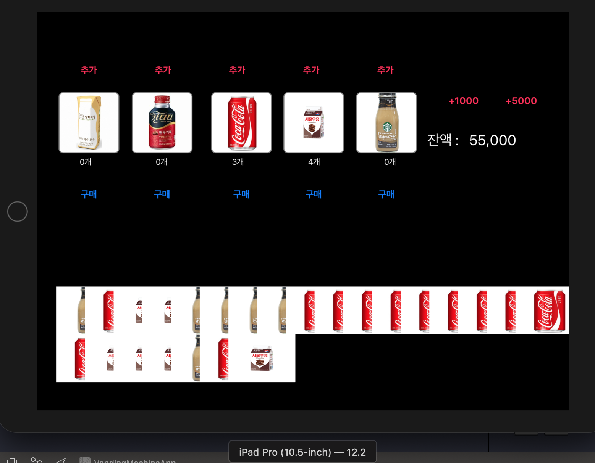
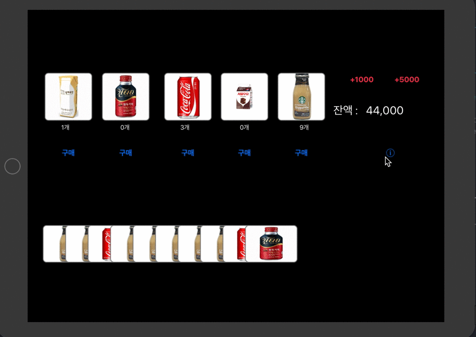

# 자판기 앱

## step1. 시작하기 - 아이패드 앱

- 실행화면


<br />
- 요구 사항
    - [자판기](https://github.com/conyconydev/swift-vendingmachine) 미션의 Main, InputView, OutputView를 제외하고 전체 클래스를 프로젝트로 복사 한다.
    - 프로젝트에 대한 일반 설정 (General)에서 Devices 항목을 iPad로 변경하고, Device Orientation 항목을 가로 (Landscape Left, Landscape Right)만 선택한다.
    -  아이패드 프로 10.5 시뮬레이터를 선택해서 실행

<br />

- 학습내용 정리

    *  [UIApplicationMain 과 UIApplication 학습](https://github.com/conyconydev/conyconydev.github.io/blob/master/_posts/ios/2019-05-09-UIApplicationMain.md)
    *  [iOS 앱을 구성하는 핵심 객체들과 iOS 메인 런루프 동작 이해]()


## step2. MVC 패턴

- 실행화면


<br />
- 학습내용 정리

    - UIImageView 에서 이미지를 표시할 때 사각형 코너를 둥글게하도록 변경

    >UIImageView 상속을 해서 RoundImageView 를 만들었다.


```
class RoundImageView: UIImageView{
    
    required init?(coder: NSCoder) {
        super.init(coder: coder)
        
        self.layer.borderColor = UIColor.gray.cgColor
        self.layer.borderWidth = 2
        self.layer.cornerRadius = 10
    }
    
}
```

​    

* [UIImageView학습 하면서 내용 정리](https://github.com/conyconydev/conyconydev.github.io/blob/master/_posts/ios/2019-05-18-UIImageView.md)

* [MVC 학습 하면서 내용 정리](https://github.com/conyconydev/conyconydev.github.io/blob/master/_posts/ios/2019-05-19-MVC.md)
* [IBOutletCollection 활용 학습 하면서 내용 정리](https://github.com/conyconydev/conyconydev.github.io/blob/master/_posts/ios/2019-05-22-IBOutlet.md)

* 여러가지 방법이 있었는데, borderColor를 넣을 수 있는 방법을 선택

- masksToBounds, clipsToBounds 두 개의 프로퍼티 기능이 비슷하다.

- 차이점 : 

  - 불러오는 곳이 다르다.

    ( View.layer.masksToBounds , View.clipsToBounds )

  - 뷰를 기준으로 뷰 밖에 있는 내용이 짤리게 된다. , 뷰의 테두리가 기준
  
  


## step3. 앱 생명주기와 객체 저장

- 실행화면


<br />

### 데이터를 저장하기 위해 아래의 것을 사용함
* 서브클래스의 타입을 유지하기 위해 NSSecureCoding 프로토콜과 NSKeyedArchiver, NSKeyedUnArchiver를  사용하여 Data Archive
* UserDefaults를 이용해 데이터 저장

### 어려웠던 점 정리

* VendingMachine  객체 정보를 저장하기 위해, 내부에 포함된 클래스 객체가 모두 encodable and decodable 하도록 만들어야 한다.

    - Codable  프로토콜을 사용하여, 적용을 해봤다. 
        - 적용을 하면서 기존 ObjectIdentifier 대신 KeyId 만들어서 변경을 하였다. 변경을 한 이유는 딕셔너리 Key를 Codable을 채택하려고 변경하였다.
        - 모든 객체가 Codable 프로토콜을 채택하도록 구현 했는데, 이 프로토콜로는 객체 내부에 포함된 하위 객체의 정보까지 저장하는데 실패하여 결국, NSSecureCoding 으로 변경하여 적용했다.

- NSSecureCoding
    - NSCoding 을 상속받은 NSSecureCoding 프로토콜을 채택하도록 수정했다. 
    
    ```swift
    required init?(coder aDecoder: NSCoder) {}
    static var supportsSecureCoding: Bool
    func encode(with aCoder: NSCoder) {}
    ```

- UserDefaults
    - 키-밸류 로 값을 저장한다.
    - 아카이브: NSKeyedArchiver 저장
    
    ```swift
    UserDefaults.standard.set(data, forKey:"vendingMachine")
    ```
    
    - 언아카이브 : NSKeyedUnarchiver 가져오기
    
    ```swift
    UserDefaults.standard.data(forKey: "vendingMachine")
    ```

## step4. 싱글톤 모델

- 매번 똑같은 하나의 인스턴스만을 반환하도록 하는 클래스 설계 방식
- 단 하나의 인스턴스로만 관리할 클래스에 대해 사용한다.

- 장점
- 한 번 생성된 이후에 하나를 사용하기 때문에 한번 생성된 메모리 영역만 사용하므로, 메모리가 낭비되는 것을 방지할 수 있다. 


## step5. 관찰자(Observer) 패턴

### 관찰자 패턴(Observer Pattern)

- 해당 프로퍼티가 변경 되는걸 관찰하고 있다가 변경 되는 시점에서 update가 수행 되게 되는 형태
- 언제 써야할까?  특정 값이 변경이 발생 할 때, 다른 연쇄적으로 그 값을 참조 하고, 참조하고 있는 값들이 자동 적으로 변경이 이루어 져야 할 때 사용 하면 유용한 패턴이다.
- MVC 패턴에서 Model과 Controller의 직접적인 참조 관계를 끊기 위해서 관찰자(Observer) 패턴을 적용한다

### 적용 해보기

1. 객체에서는 변화에 대해 NotificationCenter 에 Post 한다.

```swift
extension NSNotification.Name {
	static let addBeverage = NSNotification.Name(rawValue: "addBeverage")
	static let insertMoney = NSNotification.Name(rawValue: "insertMoney")
}

class VendingMachine {
  // 음료를 추가할때
	func add(beverage: Beverage) {
        list.add(beverage: beverage)
        NotificationCenter.default.post(name: .addBeverage, object: self)
    }
  
  // 돈을 넣었을때
  func isPut(cash: Int) -> Bool {
        NotificationCenter.default.post(name: .insertMoney, object: self)
        return money.addMoney(put: cash)        
    }
}

```

2. 변화에 대해 알려줄 객체를 Observer 등록
```swift
class ViewController: UIViewController {
  // MARK: - viewDidLoad
    override func viewDidLoad() {
        super.viewDidLoad()
        NotificationCenter.default.addObserver(self, selector: #selector(showQuantity), name: .addBeverage, object: nil)
        NotificationCenter.default.addObserver(self, selector: #selector(moneyFormat), name: .insertMoney, object: nil)
        
        showQuantity()
        vendingMachine?.showList(show: moneyFormat)

    }

  // MARK: - @objc
    @objc private func showQuantity() {
        for (index, count) in beverageLabel.enumerated() {
            if let number = vendingMachine?.count(beverage: index) {
                count.text = "\(number)개"
                continue
            }
            count.text = "0개"
        }
    }
    
    @objc private func moneyFormat(money: Int) {
        self.list.text = "\(money.commaRepresentation)"
    }
}
```

3. 노티가 발생하면 옵저버로 등록된 객체에서 행동을 수행한다.


## step6. 구매목록 View 코드

- 실행화면



### 기능 추가 내용
구매 버튼을 추가하여 구매목록을 하단에 이미지 출력하는것을 학습

#### NotificationCenter 를 활용하여 구매목록 ImageView 추가
Histroy에서 add 메소드를 호출하여 구매목록을 추가하고, 노티피케이션 Post 한다.
```swift
func add(purchase beverage: Beverage) {
    purchases.append(beverage)

    let historyData: [AnyHashable: Any] = [Notification.NotiKey.purchaseName: beverage.className,Notification.NotiKey.purchaseIndex: purchases.firstIndex(of: beverage) ?? (purchases.count-1)]
    NotificationPurchase(userData: historyData)
}
```
구매한 음료 클래스 이름과 , 구매목록 배열의 위치를 딕셔너리에 저장하여 Post 한다.
```swift
@objc func objcPurchaseListHistory(_ notification: Notification) {
    guard let imgName = notification.userInfo?[Notification.NotiKey.purchaseName] as? String else { return }
    guard let historyNumber = notification.userInfo?[Notification.NotiKey.purchaseIndex] as? Int else { return }
    let imageView = RoundImageView(imageName: imgName, form: .jpg)
    imageView.moveImageView(index: historyNumber)
    self.view.addSubview(imageView)
}
```


## step7. 관리자 ViewController

- 실행화면


### 기능 추가 내용

- AdminViewController 추가하여 관리자 모드와 사용자 모드로 구분
- 새로운 ViewController를 추가하고, Button에서 Segue를 연결
- Segue를 선택하고 Kind를 Present Modally로 지정하고, Transition을 Flip Horizontal로 설정

```swift
// MARK: - prepare
override func prepare(for segue: UIStoryboardSegue, sender: Any?) {
    guard let adminViewController = segue.destination as? AdminViewController else { return }
    adminViewController.set(vendingMachine: vendingMachine)
}
```
화면을 전환하면서 데이터를 전달하기 위해 prepare 구현
