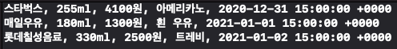
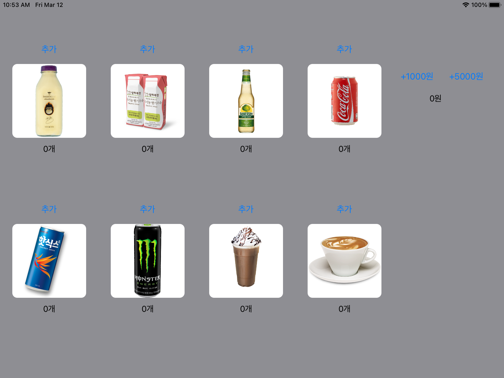

## step1 결과물


## step1 질문 자료
* 실제 코드
``` Swift
let coffee : Beverage = Beverage.init(brand: "스타벅스", volume: 255, price: 4100, name: "아메리카노", manufactured: Date().returnStringDate("20210101")
let milk : Beverage = Beverage.init(brand: "매일우유", volume: 180, price: 1300, name: "흰 우유", manufactured: Date().returnStringDate("20210102"))
let soda : Beverage = Beverage.init(brand: "롯데칠성음료", volume: 330, price: 2500, name: "트레비", manufactured: Date().returnStringDate("20210103"))
```

* 출력 결과




### Step2 작업 목록

* 음료수 관련
- [x] 음료를 상속하는 서브 클래스 설계
- [x] 하위 클래스의 속성 추가
- [x] 속성에 대한 인터페이스 작성

* 자판기 관련
- [x] 자판기 금액 증가 메소드
- [x] 특정 상품 증가 메소드
- [x] 현재 금액으로 구매 가능 음료 목록 반환하는 메소드
- [x] 음료수 구매 관련 메소드
- [x] 잔액 확인 메소드
- [x] 전체 상품 재고 반환하는 메소드
- [x] 유통기한이 지난 재고만 리턴하는 메소드
- [x] 따뜻한 음료만 리턴하는 메소드
- [x] 시작이후 구매 상품 이력을 배열로 리턴하는 메소드

* 테스트 함수 관련
- [x] 구매 가능한 음료수 목록 반환하는 메소드
- [x] 따뜻한 음료만 반환하는 메소드
- [x] 유통기한이 지나지 않은 음료수만 리턴하는 메소드

### 학습 키워드

* 클래스별 역할 책임 분배
* FactoryMethod 관련
* 다운 캐스팅 관련

### 고민과 해결

* vendingMachine에 추가할 때, 매개변수로 최상위 클래스만 넣으려고 노력했습니다. 처음엔 다운 캐스팅, 옵셔널 바인딩을 활용하여 최상위 클래스의 모든 하위 클래스를 한 함수에서 처리하도록 하였습니다. if문이 다수 나와서 부적절함을 느꼈고, 음료수를 자판기가 추가하는 것이 아닌 음료수가 자판기에 들어가는 방식으로 처리하였습니다.

* FactroyMethod에 대해서 학습하고 구현해봤는데, 제대로 구현했는지 모르겠습니다. 학습한 바로는 서브클래스가 생성되는 시기만 알뿐, 무엇이 생성되는지는 모르기 때문에, 생성 책임을 서브클래스에게 맡긴다. 라고 알고 있는데요. 서브클래스에서 init()이 이미 생성 책임을 담당하고 있는 것이 아닌 지 명확하게 판단이 안됐습니다. 일단 찾아보고 비슷하게는 만들어봤는데 잘 못 구현해서 그런지, 가져다 주는 이점이 무엇인지 잘 모르겠습니다. 

### 질문 사항

* FactoryMethod가 제대로 구현이 되었는 지 확인 부탁드립니다. 만약 제대로 구현한 것이라면 현 코드상에서 어떠한 이점이 있는 지, 구현이 제대로 안되었다면 어느 부분에 대한 개선이 필요한 지 힌트 부탁드립니다.

### step3 작업 목록

* 화면 관련
- [x] 각 상품의 재고 추가, 이미지, 재고 레이블 추가 금액 추가, 현재 잔액 레이블 추가
- [x] 재고 추가버튼 구현
- [x] 금액 추가 버튼 구현
- [ ] 재고 추가 전체 레이블 표시 -> 현재 레이블만 다시 표시
- [x] 잔액 레이블 다시 표시

### 학습 키워드

* ObjectIdentifier의 개념
* constraint 관련
* 버튼, 이미지, label 속성 관련
* IBOutlet Collection 개념 참고

### 고민과 해결

* 재고 Label 관련 -> ObjectIdentifier : Int로 구성한 딕셔너리에 전달한 매개변수의 objectidentifier를 탐색해서 해당 value값을 반환하여 한번 클릭할때 마다 모든 레이블을 다시 그러주려고 했으나, 아직 ObjectIdentifier의 이해도가 낮아 모든 레이블이 동일한 값을 가지게 되어서 sender.tag로 임시 해결했습니다.

### 질문사항

* objectidentifier의 사용 고민 -> 동일한 인스턴스를 참조하기 때문에 미리 인스턴스를 생성해두고 계속 재사용 해야겠다는 생각이 들고 레이블에 표시할 때 vendingmachine과 관계가 있으면 viewcontroller에서 자연스럽게 사용할 수 있다고 생각하여 vendingMachine의 내부 속성으로 미리 음료를 만들어 놓았는 데, 다소 어색한 것 같습니다. 마치 자판기가 스스로 자기의 음료를 채워넣는 듯한 느낌이 들었습니다. 어떻게 하는 것이 더 좋았을 지 잘 몰라서 질문 드립니다.

