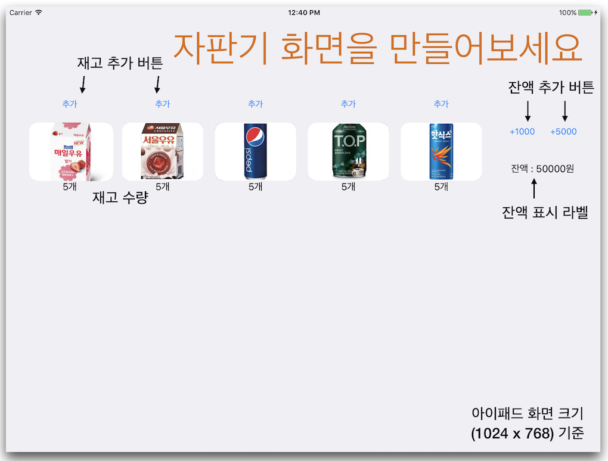
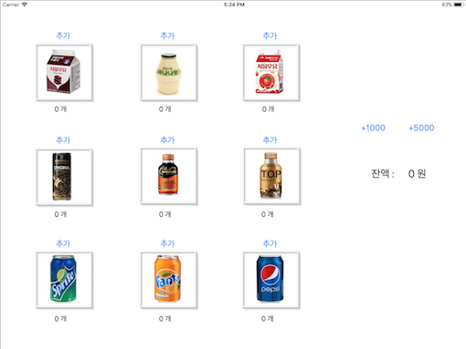
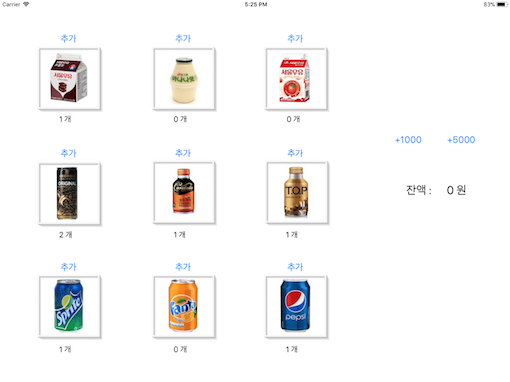

# 음료 자판기 앱

## Step1 (시작하기 - 아이패드 앱)
### 요구사항
- 음료 자판기 앱 프로젝트 저장소를 본인 저장소로 fork하고 로컬에 clone한다.
- iOS 프로젝트 Single View App 템플릿으로 하고 프로젝트 이름을 "VendingMachineApp"으로 지정하고, 위에 만든 로컬 저장소 경로에 생성한다.
- 프로젝트에 대한 일반 설정 (General)에서 Devices 항목을 iPad로 변경하고, Device Orientation 항목을 가로 (Landscape Left, Landscape Right)만 선택한다.
- 기본 상태로 아이패드 프로 10.5 시뮬레이터를 골라서 실행한다.
- iOS 앱 프로젝트 기본 구조인 MVC 형태에 맞춰서 기존 레벨2에서 작성한 자판기 소스 파일을 적용한다.
- readme.md 파일을 자신의 프로젝트에 대한 설명으로 변경한다.
    + 단계별로 미션을 해결하고 리뷰를 받고나면 readme.md 파일에 주요 작업 내용(바뀐 화면 이미지, 핵심 기능 설명)과 완성 날짜시간을 기록한다.
    + 실행한 화면을 캡처해서 readme.md 파일에 포함한다.

### 프로그래밍 요구사항
- 레벨2 VendingMachine 미션의 Main, InputView, OutputView를 제외하고 전체 클래스를 프로젝트로 복사한다.
- 기존 코드들은 MVC 중에서 대부분 Model의 역할을 담당한다.
- iOS 앱 구조는 MVC 중에서도 우선 ViewController-Model 사이 관계에 집중하고, ViewController-View 관계는 다음 단계에서 개선한다.
- ViewController 클래스에 VendingMachine 객체를 변수로 추가하고 viewDidLoad() 함수에서 음료수 객체 3종류를 추가하고 재고 목록을 print() 한다.

- 콘솔 화면
```
딸기우유(2개) 바나나우유(1개) 팹시콜라(3개)
```

### 결과
#### Console
```
죠지아커피 3000원(1개) 딸기우유 1000원(1개) 펩시콜라 2000원(1개)
```

---
## Step2 (MVC 패턴)
### 요구사항
- iOS 앱 프로젝트 기본 구조인 MVC 형태에 맞춰서 기존 레벨2에서 작성한 자판기 소스 파일을 적용한다.

- iOS 프로젝트와 앱을 구성 핵심 요소들을 MVC로 구분하면 다음과 같다.

    + 레벨2 자판기에서 View에 해당하는 InputView와 OutputView는 스토리보드나 코드로 작성하는 화면요소로 대체한다.
    + 이제 특별한 요구사항이 없을 경우 print() 함수로 출력하는 경우는 지양한다.
실행하고 새로운 화면을 캡처해서 readme.md 파일에 포함한다.

### 프로그래밍 요구사항
- 스토리보드에 다음과 같이 아이패드 앱 화면을 구현한다.

    + 각 상품에 대한 재고 추가 버튼을 추가한다.
    + 각 상품에 대한 이미지를 추가한다.
    + 각 상품에 대한 재고 레이블을 추가한다.
    + 1000원, 5000원 금액을 입력하는 버튼을 추가한다.
    + 현재 잔액을 표시할 레이블을 추가한다.
- 각 상품의 재고 추가 버튼을 누르면 각 상품 재고를 추가하도록 코드를 구현한다.
- 재고 추가 버튼을 누르고 나면 전체 레이블을 다시 표시한다.
- 금액 입력 버튼을 누르면 해당 금액을 추가하도록 코드를 구현한다.
- 금액을 추가하고 나면 잔액 레이블을 다시 표시한다.

### 결과
#### UI




---
## Step3 (앱 생명주기와 객체 저장)
### 요구사항
- 앱 시작부터 종료까지 생명주기를 관리하는 방법을 학습한다.
- 앱 실행 이후 마지막 자판기 재고 상태와 잔액 등 VendingMachine 객체의 속성을 앱을 종료하더라도 저장하도록 개선한다.
- 앱을 다시 실행하면 마지막 재고 상태를 그대로 복원한다.
- 객체의 속성을 저장하기 위한 아카이브(Archive) 관련된 내용을 학습한다.
- 실행하고 새로운 화면을 캡처해서 readme.md 파일에 포함한다.

### 프로그래밍 요구사항
- VendingMachine 변수를 ViewController에서 포함하지 않고 AppDelegate로 옮긴다.
- AppDelegate에 선언한 변수를 ViewController에서 접근하기 위한 방법을 찾는다.
    + 힌트. UIApplication.delegate 객체가 AppDelegate의 인스터스임
- 앱 종료(background) 시점 콜백 함수에서 VendingMachine 객체 인스턴스 속성을 저장한다.
    + 저장할 때는 VendingMachine을 아카이브해서 하나의 데이터 값으로 변형한다.
    + 값을 저장하고 복원하는 데에는 UserDefault 라는 파운데이션 라이브러리를 사용한다.
- 앱 시작(activate) 시점 콜백 함수에서 기존에 저장된 값에서 불러와서 VendingMachine 객체 인스턴스를 생성한다.
    + 복원할 때는 저장된 데이터 값을 언아카이브해서 VendingMachine 객체를 생성한다.

### 특이사항
Swift4에 새로 적용된 Codable 을 활용해서 구현

---
## Step4 (싱글톤 모델)
### 요구사항
- 앱 구조 개선을 위해서 VendingMachine 객체를 싱글톤으로 변경한다.
    + 앞단계 미션에서 사용했던 UserDefault도 싱글톤 객체
- readme.md 파일에 주요 작업 내용(바뀐 화면 이미지, 핵심 기능 설명)과 완성 날짜시간을 기록한다.

### 프로그래밍 요구사항
- VendingMachine 객체를 싱글톤(Singleton)으로 접근할 수 있도록 개선한다.
- VendingMachine 싱글톤으로 sharedInstance 인터페이스를 통해서 AppDelegate와 ViewController에서 접근하도록 코드를 수정한다.
- 모든 동작은 이전 단계와 동일하게 동작해야 한다.
