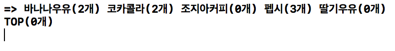
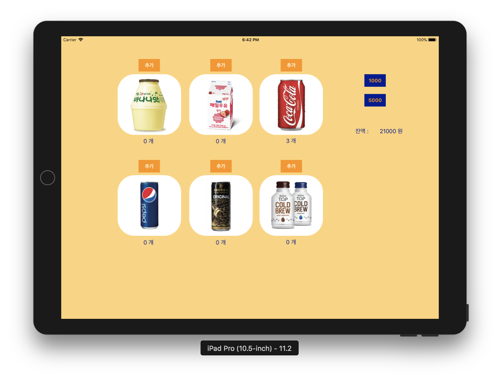
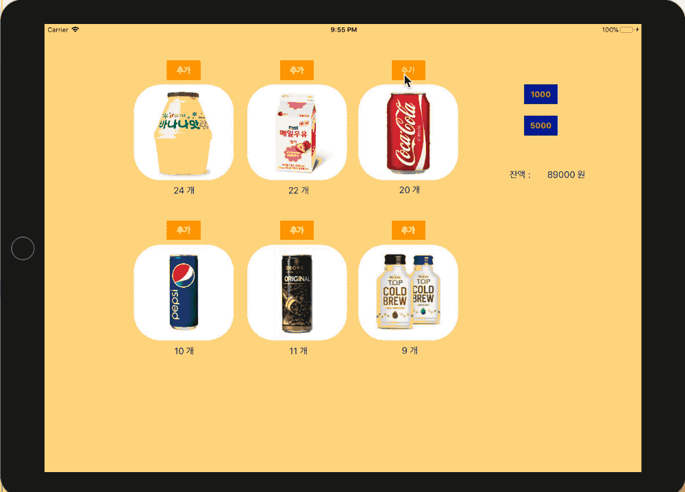

# VendingMachineApp

### 1. 아이패드 앱 - 시작하기
* 프로젝트에 대한 일반 설정 (General)에서 Devices 항목을 iPad로 변경하고, Device Orientation 항목을 가로(Landscape Left, Landscape Right)만 선택함

##### 실행결과 

</img>

##### App Programming Guide for iOS
* iOS 앱을 구성하는 핵심 객체들과 iOS 메인 런루프 동작 이해하기 위해서 [애플 앱 프로그래밍 가이드](https://developer.apple.com/library/content/documentation/iPhone/Conceptual/iPhoneOSProgrammingGuide/Introduction/Introduction.html#//apple_ref/doc/uid/TP40007072) 문서를 학습함
* macOS 프로젝트 템플릿과 iOS 프로젝트 템플릿 구조의 차이점을 학습함
    * iOS 프로젝트에는 main.swift 가 생략되어 있음
    * `UIApplicationMain() 함수의 역할` 에 대해 찾아보고 학습함

##### [UIDeviceOrientation](https://developer.apple.com/documentation/uikit/uideviceorientation)
* The physical orientation of the device.

### 2. MVC 패턴

##### 요구사항
* iOS 앱 프로젝트 기본 구조인 MVC 형태에 맞춰서 기존 레벨2에서 작성한 자판기 소스 파일을 적용함
* iOS 프로젝트와 앱을 구성 핵심 요소들을 MVC로 구분하면 다음과 같음
    * 레벨2 자판기에서 View에 해당하는 InputView와 OutputView는 스토리보드나 코드로 작성하는 화면요소로 대체함
    * 이제 특별한 요구사항이 없을 경우 `print() 함수로 출력하는 경우는 지양함`

</img>
</img>

##### 프로그래밍 요구사항
* 아이패드 앱을 구현함
    * 각 상품에 대한 재고 추가 버튼을 추가함
    * 각 상품에 대한 이미지를 추가함
    * 각 상품에 대한 재고 레이블을 추가함
    * 1000원, 5000원 금액을 입력하는 버튼을 추가함
    * 현재 잔액을 표시할 레이블을 추가함
    * 각 상품의 재고 추가 버튼을 누르면 각 상품 재고를 추가하도록 코드를 구현함
* 재고 추가 버튼을 누르고 나면 전체 레이블을 다시 표시함
* 금액 입력 버튼을 누르면 해당 금액을 추가하도록 코드를 구현함
* 금액을 추가하고 나면 잔액 레이블을 다시 표시함

##### 실행결과

</img>

##### [CALayer](https://developer.apple.com/documentation/quartzcore/calayer)
* 이미지 라운드 처리

```swift
private func setRoundedImages() {
    beverageImages.forEach({
        $0.layer.cornerRadius = 50.0
        $0.layer.masksToBounds = true
        $0.backgroundColor = UIColor.white
    })
}
```

### 3. 앱 생명주기와 객체 저장

##### 요구사항
* 앱 시작부터 종료까지 생명주기를 관리하는 방법을 학습함
* 앱 실행 이후 마지막 자판기 재고 상태와 잔액 등 VendingMachine 객체의 속성을 앱을 종료하더라도 저장하도록 개선함
* 앱을 다시 실행하면 마지막 재고 상태를 그대로 복원함
* 객체의 속성을 저장하기 위한 아카이브(Archive) 관련된 내용을 학습함

##### 프로그래밍 요구사항
* VendingMachine 변수를 ViewController에서 포함하지 않고 AppDelegate로 옮김
* AppDelegate에 선언한 변수를 ViewController에서 접근하기 위한 방법을 찾음
    * `Hint. UIApplication.delegate 객체가 AppDelegate의 인스터스임`
* 앱 종료(background) 시점 콜백 함수에서 VendingMachine 객체 인스턴스 속성을 저장한다.
    * 저장할 때는 VendingMachine을 아카이브해서 하나의 데이터 값으로 변형함
    * 값을 저장하고 복원하는 데에는 UserDefault 라는 파운데이션 라이브러리를 사용함
* 앱 시작(activate) 시점 콜백 함수에서 기존에 저장된 값에서 불러와서 VendingMachine 객체 인스턴스를 생성함
    * 복원할 때는 저장된 데이터 값을 언아카이브해서 VendingMachine 객체를 생성함

##### 실행결과
</img>

##### App Life Cycle
* [정리](https://wiki.yuaming.com/ios/app-programming-for-ios.html) 

##### 깊은 복사와 얕은 복사
* [정리](https://wiki.yuaming.com/ios/shallow-deep-copy.html) 

##### 아카이빙과 직렬화
* [정리](https://wiki.yuaming.com/ios/archives-serialization.html) 

##### SLAP
* [정리](https://wiki.yuaming.com/oop/slap.html)

```swift
/*
    지금은 큰 상관없다고 느낄수 있지만, 이렇게 모든 객체에 속성을 변경하는 것도 UIImageView 상속을 받아서 (예를 들어 RoundImageView) 객체 내부에서 self.layer.cornerRadius 를 바꿀 수도 있습니다. 상위 모듈에서 하위 모듈의 속성을 모두 조정해야 하는 건 아닙니다.
*/

// Before
class ViewController: UIViewController {
    @IBOutlet var beverageImages: [UIImageView]!

    // ...
    private func setRoundedImages() {
        beverageImages.forEach({
            $0.layer.cornerRadius = 50.0
            $0.layer.masksToBounds = true
            $0.backgroundColor = UIColor.white
        })
    }
    
    // ...
}

// After
class RoundImageView: UIImageView {    
    func setRoundedImage() {
        self.layer.cornerRadius = 50.0
        self.layer.masksToBounds = true
        self.backgroundColor = UIColor.white
    }
}

class ViewController: UIViewController {
    @IBOutlet var beverageImages: [RoundImageView]!

    // ...
    
    override func viewDidLoad() {
        super.viewDidLoad()
    
        setImageViews()
    }
    
    private func setImageViews() {
        beverageImages.forEach({
            $0.setRoundedImage()
        })
    }

    // ...
}
```


