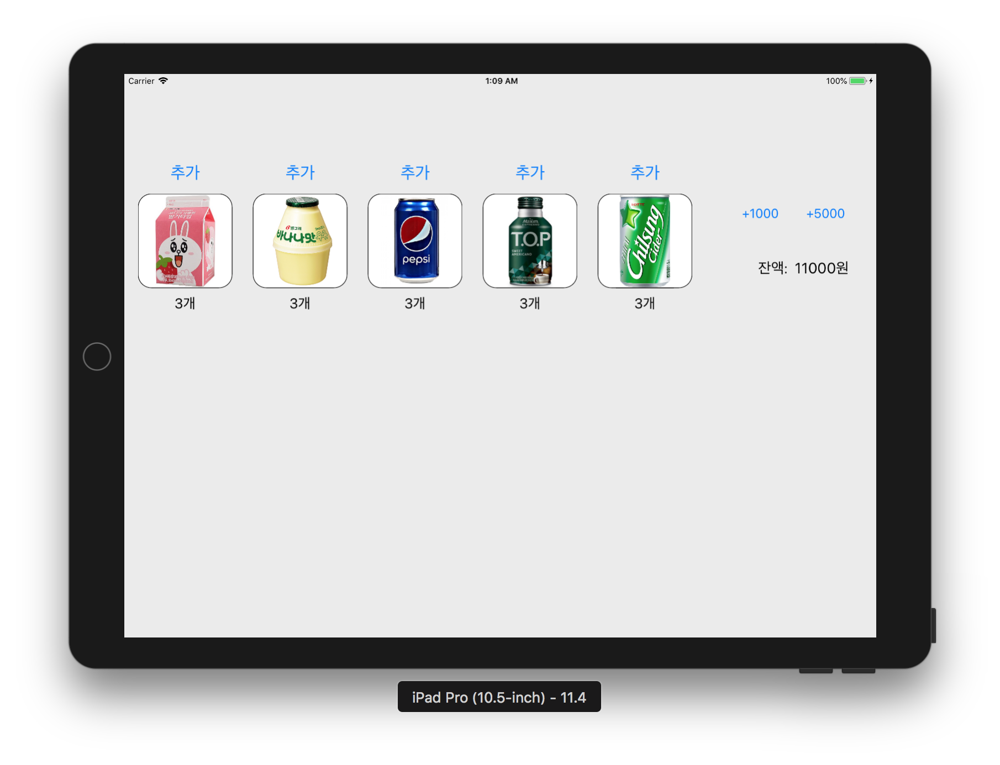
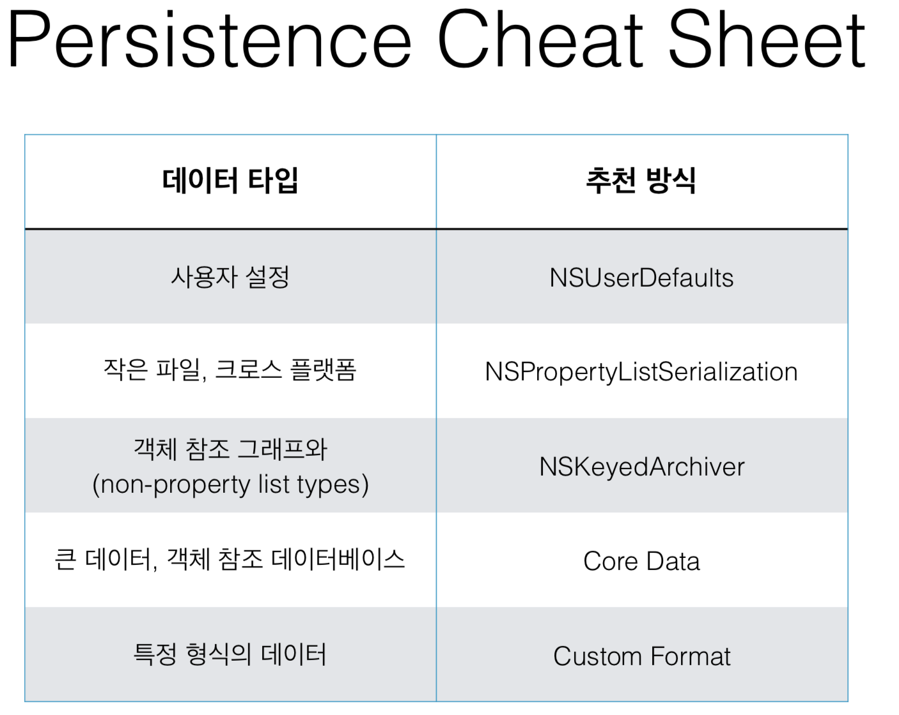
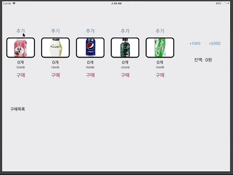

# 음료 자판기 앱

## Step. 1

* 주요 쟉업 내용
	- 기존 자판기 코드의 Model 역할 가져와서 활용하기 (전부 가져오지 않고 필요한 부분을 점진적으로 가져와서 개선할 예정)
	- 각 객체의 역할
		- VendingMachine: 자판기 객체
		- StockManager: 자판기에서 재고를 관리하는 객체
		- Stock: 같은 종류의 음료객체를 가진 배열을 추상화하기 위한 객체. StockManager가 가지고 있음.
		- MoneyManager: 자판기에서 잔액을 관리하는 객체
		- BeverageFactory: 입력받은 타입을 통해 타입에 맞는 음료수를 생성해주는 팩토리객체
		- DefaultData: 각 음료수가 default값으로 초기화 되어 생성될 때에 default값을 가지고 있는 객체
		- 그 외에 Beverage객체들...(타입과 이름과 가격을 가지고 있음)

* [앱프로그래밍 가이드 - 앱 라이프 사이클](https://developer.apple.com/library/archive/documentation/iPhone/Conceptual/iPhoneOSProgrammingGuide/TheAppLifeCycle/TheAppLifeCycle.html#//apple_ref/doc/uid/TP40007072-CH2-SW1)
* [앱의 초기화 UIApplicationMain()함수](docs/앱의초기화(main).md)

## Step. 2
* 요구사항
	- 각 상품에 대한 재고 추가 버튼을 추가한다.
	- 각 상품에 대한 이미지를 추가한다.
	- 각 상품에 대한 재고 레이블을 추가한다.
	- 1000원, 5000원 금액을 입력하는 버튼을 추가한다.
	- 현재 잔액을 표시할 레이블을 추가한다.
	- 각 상품의 재고 추가 버튼을 누르면 각 상품 재고를 추가하도록 코드를 구현한다.
	- 재고 추가 버튼을 누르고 나면 전체 레이블을 다시 표시한다.
	- 금액 입력 버튼을 누르면 해당 금액을 추가하도록 코드를 구현한다.
	- 금액을 추가하고 나면 잔액 레이블을 다시 표시한다.
* 구현화면

* 학습꺼리
	- IBOutlet Collection 기능에 대해 학습하고 중복되는 아웃렛을 제거한다.
		- 같은 속성의 뷰에 대해서 모아놓은 Outlet.
		- ex) 여러 개의 UIButton을 [UIButton]의 하나의 IBOutlet Collection으로 사용가능
		- StackView와의 차이점 : StackView는 Layout에 활용에 더 적합하다.
	- UIImageView 에서 이미지를 표시할 때 사각형 코너를 둥글게하도록 변경해본다.
		- `View.layer.cornerRadius`로 조절
* 문서정리
	- [MVC에 대한 간단한 정리](docs/MVC간단한개념.md)
	- [clipsToBoduns,maskToBounds](docs/clipsToBounds_maskToBounds.md)
	
## Step. 3
* 요구사항
	- 앱을 다시 실행하면 마지막 재고 상태를 그대로 복원한다.
	- 앱 실행 이후 마지막 자판기 재고 상태와 잔액 등 VendingMachine 객체의 속성을 앱을 종료하더라도 저장하도록 개선한다.
	- 저장할 때는 VendingMachine을 아카이브해서 하나의 데이터 값으로 변형한다.
	- 값을 저장하고 복원하는 데에는 UserDefault 라는 파운데이션 라이브러리를 사용한다.
	- 복원할 때는 저장된 데이터 값을 언아카이브해서 VendingMachine 객체를 생성한다.
* 구현화면 (앱을 종료하고 다시 실행해도 이전의 상태를 그대로 불러온다.)

#### 객체그래프 저장을 위해 선택한 방법
- NSSecureCoding / NSKeyedArchiver / NSKeyedUnarchiver / UserDefaults
- Codable을 이용하려 했으나 스위프트 버그로 인해 실패
	- 클래스 타입의 경우 배열 속성에서 하위객체의 타입정보가 사라짐.
	- [Swift 4 Decodable Loses Subclass Type Information](https://bugs.swift.org/browse/SR-5331)
- [WWDC 2018에서 발표한 Data You Can Trust 중 NSSecureCoding에 대한 발표영상](https://developer.apple.com/videos/play/wwdc2018/222/)

#### Keywords
- Swift 4.0 / 4.2
- Codable, NSCoding
- NSKeyedArchiver, NSKeyedUnarchiver, encoder, decoder
- 직렬화와 아카이빙
- 객체그래프
- NSCopying, NSMutable Copying, 가변과 불변
- 깊은 복사와 얕은 복사
- 깊은 복사를하는 구현방식
	1. 코어데이터
	2. NSCoding, keyed-archived(객체인코딩)아카이브 클래스
- [UserDefaults](https://developer.apple.com/documentation/foundation/userdefaults?changes=_9)
- [Archive and Serialization](https://developer.apple.com/documentation/foundation/archives_and_serialization)
- [Encoding & Decoding Custom type](https://developer.apple.com/documentation/foundation/archives_and_serialization/encoding_and_decoding_custom_types)

(출처: 코드스쿼드)

## Step. 4
* 요구사항
	- VendingMachine 객체를 싱글톤(Singleton)으로 변경
	- AppDelegate와 ViewController가 VendingMachine을 Singleton 인터페이스를 통해 접근하도록 변경
* 학습꺼리
	- 구조체 Struct를 싱글톤으로 생성하는 방식을 찾아서 학습한다.
	- 클래스 경우 싱글톤을 생성하는 방법과 어떻게 다른지 학습한다.
	- 싱글톤 객체의 장점과 단점에 대해 학습한다.
- 정리:
	- 싱글톤은 한번만 생성되기 때문에 객체가 메모리를 차지하는 부분에 있어서 이득을 취할 수 있다. 하지만 많은 곳에서 이를 계속 참조하게 될 떼 과부하가 올 수 있다.
	- 내부적으로 공통으로 사용하는 인스턴스가 하나만 존재하는 객체를 만들기 위해 싱글톤을 적용한다. 클래스의 경우 레퍼런스를 주는 것이기 때문에 사용하는 곳에서 객체의 정보가 변경될 경우 이를 참조하고 있는 다른 곳에서의 싱글톤 객체에 대한 상태가 달라진다. 이는 멀티스레딩 환경이나 참조의 관계를 명확하게 알고 있지 못할 때 원치 않는 결과를 가져올 수 있다.
	- 싱글톤에 대한 변경사항이 다른 곳에서 필요할 때 클래스의 싱글톤을 사용하면 좋다. 구조체를 사용하여 싱글톤을 생성할 경우 값 타입이므로 항상 복사가 이루어진다. 이 때문에 구조체 싱글톤 객체를 사용하는 곳에서는 항상 구조체 싱글톤의 상태를 다시 가져와야 한다. 하지만 멀티 스레딩 환경에서는 구조체보다 클래스가 안전하다. 
	
## Step. 5
- 요구사항
	- MVC 패턴에서 Model과 Controller의 직접적인 참조 관계를 끊기 위해서 관찰자(Observer) 패턴을 적용한다.
	- ViewController는 viewDidLoad에서 Observe를 등록한다.
	- 음식 재고가 바뀌는 Notification을 받으면 화면에 Label을 업데이트한다.
	- 추가 버튼을 누르면 해당 음식 재고를 모델에 추가할 때마다 VendingMachine 모델 객체에서는 변화에 대해 NotificationCenter에 post한다.
- 정리
	- Notification은 broadcast 시스템!
	- Default Notification Center를 통한 접근
	- Notification Observer를 addObserver로 등록 (누가 감시할 것이냐)
	- Posting Notification : NotificationCenter에 Notification을 보내겠다.
	- 주요 메서드 : `func post(name aName: NSNotification.Name, object anObject: Any?, userInfo aUserInfo: [AnyHashable : Any]? = nil)`
		- object를 통해 어떤 객체가 보낼 것인지 (보통 보내는 자신을 self로 보낸다.)
		- userInfo를 통해 데이터를 함께 전송할 수 있다.
	- 주요메서드 : `func addObserver(_ observer: Any, selector aSelector: Selector, name aName: NSNotification.Name?, object anObject: Any?)`
		- object를 통해 '나는 특정 객체에서 오는 Notification만 받을거야'(nil일 경우 객체 상관없이 명시한 Notification을 전부 수신하겠다.'
	- 느슨한연결(loosed coupled) 구조 : 모델과 컨트롤러가 직접 참조하지 않게!
		- 왜? 결국은 의존성과 재사용성이다. 내가 함께 일하는 객체가 누군지 알 필요 없이 어떤 인터페이스를 통해 일할지만 정해진다면, 그 객체가 무엇이든 상관없다. 이는 객체를 변경, 재사용하기에도 용이하고 특정 객체를 테스트하기에도 용이하다.
	
[NotificationCenter](https://developer.apple.com/documentation/foundation/notificationcenter), [Notification in Swift](https://medium.com/@dmytro.anokhin/notification-in-swift-d47f641282fa), [Notifications and userInfo](https://dev.iachieved.it/iachievedit/notifications-and-userinfo-with-swift-3-0/)

## Step. 6
* 요구사항
	- 구매 목록에 대한 이미지뷰를 동적으로 코드로 View에 추가한다.
	- 구매 목록도 앱 종료 이후에 저장되도록 개선한다.
	- NotificationCenter를 활용한 제품 이미지 추가
- 학습꺼리
	- 뷰를 코드로 생성해서 추가하는 것과 스토리보드 상에서 미리 생성하는 것의 차이에 대해 학습한다.
- 정리
	- 뷰를 코드로 생성할 경우 동적으로 추가할 수 있고 뷰에 대한 좀 더 정밀한 설정을 할 수 있다.
	- 스토리보드를 사용할 경우 동적인것보단 정적인 뷰에 대한 추가를 수행할 수 있다. 또한 눈으로 뷰를 확인하면서 추가할 수 있다.
	- 뷰를 코드로 작성할 경우와 스토리보드로 작성할 경우 사용되는 이니셜라이저가 다르다.
	- MVC패턴을 위한 NotificationCenter 활용
	- NotificationCenter의 userInfo를 이용한 데이터 전달

  
구매이력 추가  

  
구매이력 복원  

* 피드백 반영 개선사항
	- 음료이미지들이 Assets에 포함되어 이미지접근 이름 변경
	- ImageViewFactory의 이미지뷰 생성 메서드가 이미지뷰배열이 아닌 단일 이미지뷰를 생성하여 넘김.
	- 구매목록 변경 Notification이 HistoryManager에서 VendingMachine의 메서드에서 post하도록 변경
	- Notification을 받는 ViewController가 VendingMachine.shared() 객체가 보낸 Notification만을 받도록 수정
	- 이미지뷰가 전체구매이력을 addSubView하는 부분수정
	- 복원된 구매이력과 새로 구매한 것에 대한 구매이력 이미지 추가에 대한 중복코드 수정
	
## Step. 7
* 요구사항
	- 새로운 뷰컨트롤러를 추가하고 관리자 화면을 구현한다.
	- 스토리보드에서 Button을 추가하고, Attributes에서 Type을 Info Light로 설정한다.
	- 새롭게 추가한 화면을 관리자 모드로 동작하도록 개선한다.
	- 관리자 화면에 [닫기] 버튼을 추가하고, 버튼을 누르면 dissmiss()를 호출한다.
	- 재고 추가 버튼은 기존 화면에서 삭제한다.
	
