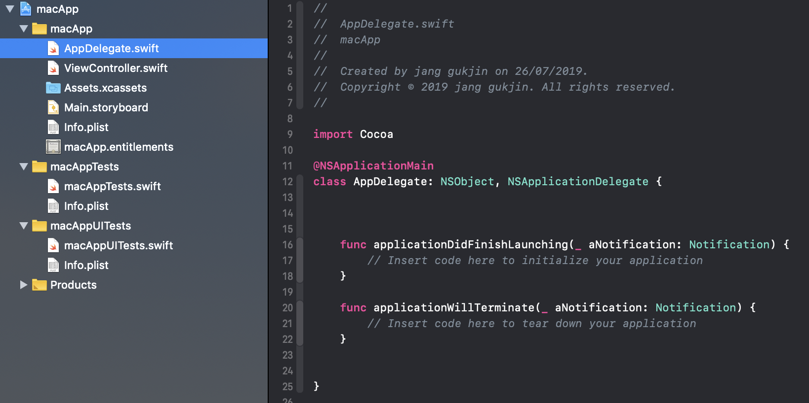
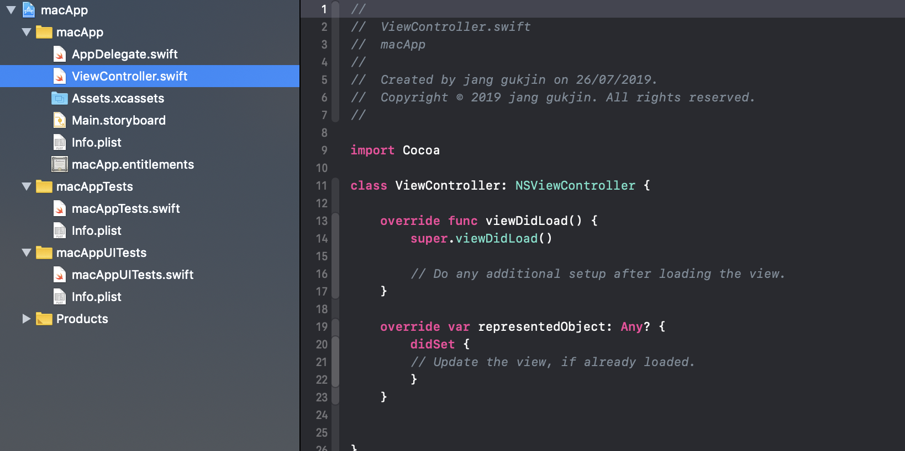
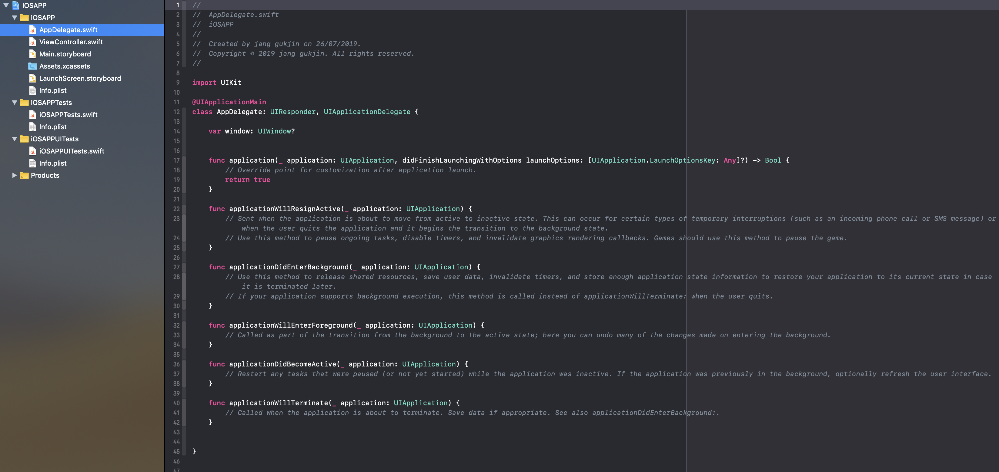
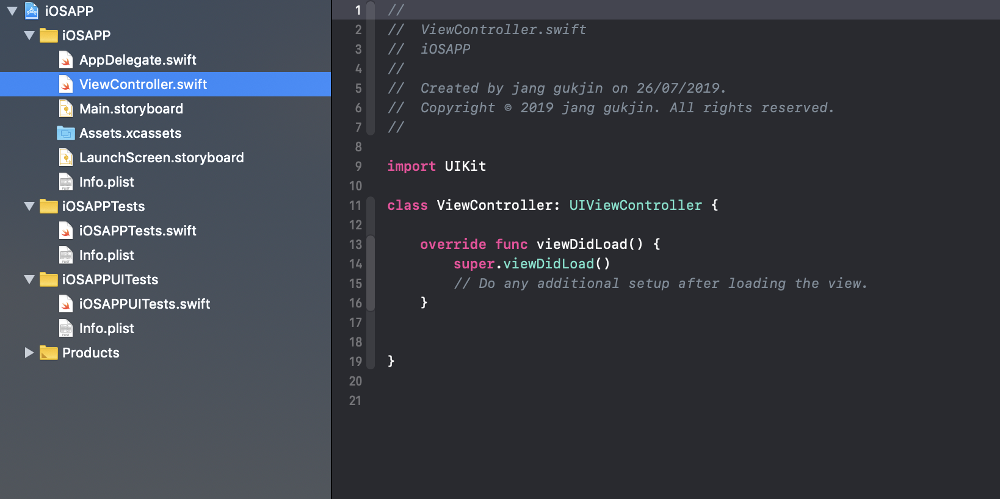
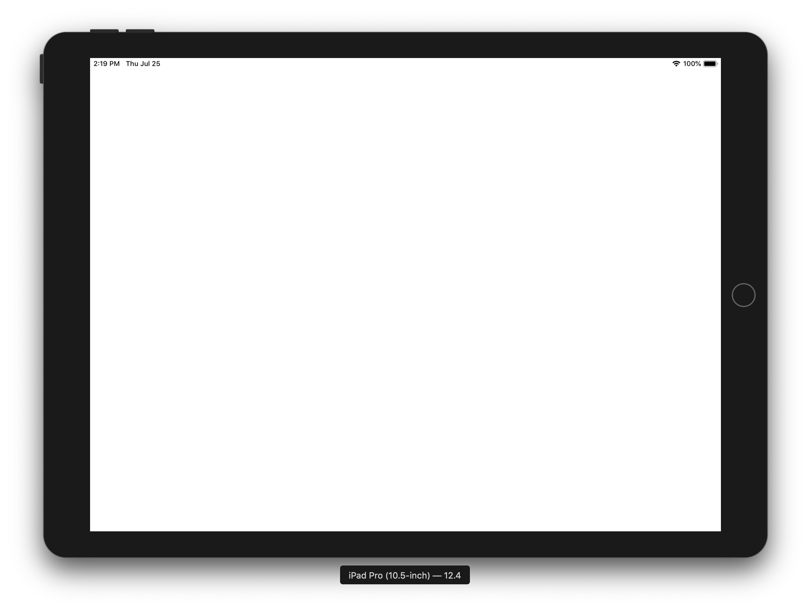
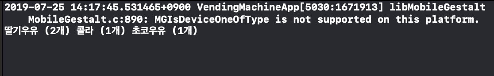

# Step1 - 아이패드앱 (25.7.19)

## 구조

- **DateUtil (struct):** date에 대한 데이터를 가지고 있는 구조체
- **Product (class):** 제품의 속성(brand, capacityl, price, name, date)을 가지는 클래스
- **Milk (class):** Product를 상속하고, brand를 "서울우유"로 가지는 클래스
- **Soda (class):** Product를 상속하고, brand를 "팹시"로 가지는 클래스
- **Coffee (class):** Product를 상속하고, brand를 "맥심"로 가지는 클래스
- **StrawberryMilk (class):** Milk를 상속받고 유통기한을 입력받는 클래스
- **ChocolateMilk (class):** Milk를 상속받고 유통기한을 입력받는 클래스
- **Coke (class):** Soda를 상속받고 칼로리를 입력받는 클래스
- **Sprite (class):** Soda를 상속받고 칼로리를 입력받는 클래스
- **TOPCoffee (class):** Coffee를 상속받고 온도를 입력받는 클래스
- **CantataCoffee (class):** Coffee를 상속받고 온도를 입력받는 클래스


## 해당 Step을 진행하면서 배운 내용

### iOS 메인 런루프 동작, UIApplicationMain()의 역할

[참조: 오늘의 Swift 상식 (앱 생명주기)](https://medium.com/@jgj455/오늘의-swift-상식-앱-생명주기-878dfe51d182)


### macOS, iOS의 프로젝트 템플릿 구조의 차이점

**macOS**

1. AppDelegate

   

   **Cocoa:** Apple에서 iOS, macOS 등의 애플 운영 체제용 앱을 제작할 때 사용하는 프레임워크

   - NSApplicationMain은 UIApllicationMain과 같은 역할을 한다고 보면 된다.

     ```
     int NSApplicationMain(int argc, const char * _Nonnull *argv); 
     // argc: argv의 갯수
     // argv: 앱 시작 시 앱으로 전달된 인자를 포함하는 포인터의 배열
     ```

   - macOS에서는 main()함수로 NSApplicationMain을 사용한다.

   - mac은 기본적으로 프로젝트를 생성하면 Cocoa를 import하며 NSApplicationMain이 호출된다. 그리고 AppDelegate는 NSObject 클래스를 상속받고, NSApplicationDelegate 프로토콜을 채택한다.

2. ViewController

   

   ViewController에서는 NSViewController 클래스를 상속받는다.

   **NSViewController:** nib파일에서 로드 된 View를 관리하는 Controller

   ```swift
   class NSViewController: NSResponder
   ```


**iOS**

1. AppDelegate

   

   프로젝트를 생성하면 UIKit를 import하고 UIApplicationMain이 호출된다. 그리고 AppDelegate 클래스는 UIResponder(UIResponder, NSResponder둘다 NSObject를 상속 받음)를 상속 받고, UIApplicationDelegate를 채택한다.

2. ViewController

   

   ViewController에서는 UIViewController 클래스를 상속받는다.

   UIViewController: UIKit 앱의 View들을 관리하는 객체

   ```swift
   class UIViewController: UIResponder
   ```

   


## 코드 및 결과화면






## 피드뱃에 대한 개선 내용

| ( 1 )                                                        |
| ------------------------------------------------------------ |
| **피드백 받은 사항:** ViewController에 들어가는 속성들을 접근 제어하지 않았다. |
| **피드백 내용:** private을 우선적으로 고려하는 습관을 가져라 |
| **수정한 내용:** 속성들을 private으로 접근 제어              |


