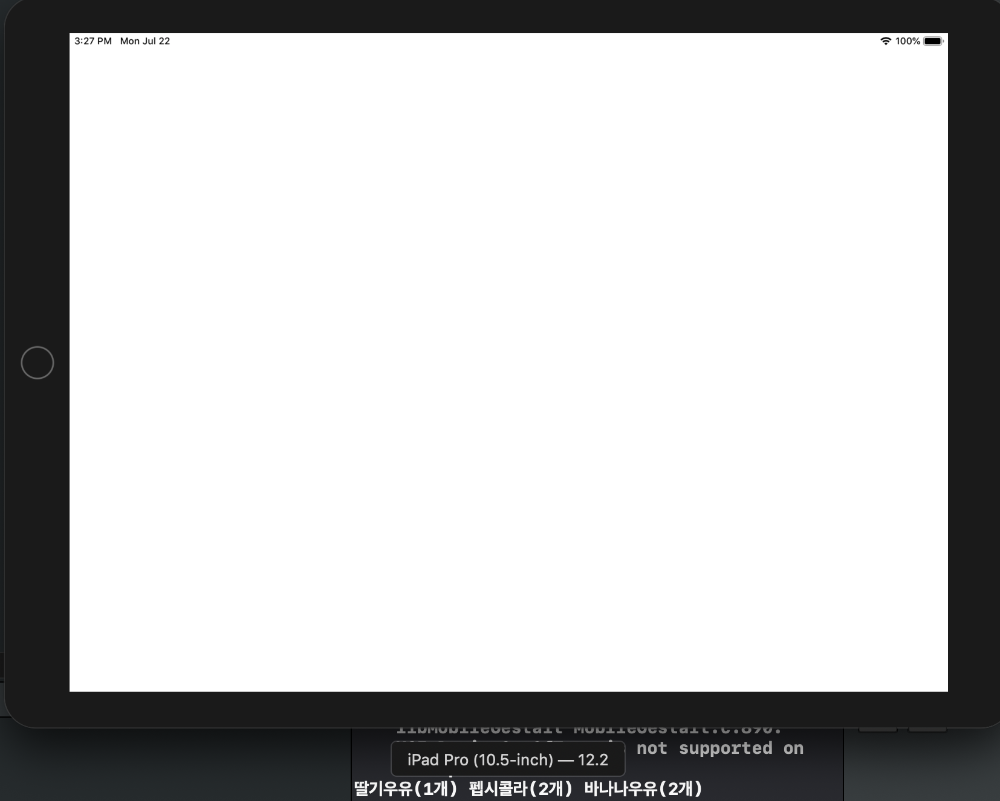

# STEP1

### 결과화면 




### 주의사항

main.swift 파일이 잔존해있으면 (설령 클래스 파일을 주석처리하여도) AppDelegate의 Attribute인 

**`@UIApplicationMain`**  의 사용이 불가능하다. 해당 어트리뷰트는 다음과 같은 코드로 대체 가능하다.


#### @UIApplicationMain의 역할

- main 클래스 역할
- AppDelegate와 UIApplication을 연결
  - AppDelegate 테스트시에 아래의 항등코드를 수동으로 작성가능하다.
- UIApplication도 UIResponder를 상속받는 대표적인 객체이나, UIApplication는 이벤트 처리를 위해 UIViewController, UIView 등으로 이벤트를 전달한다.
  - 기타 이벤트 처리 기능은 **event handling을 담당하는** **`UIResponder`** 프로토콜을 상속받은 다른 객체 인스턴스들이 수행한다.

```swift
UIApplicationMain{
  	CommandLine.argc,
  	CommandLine.unsafeArgv,
  	NSStringFromClass(UIApplication.self),
  	NSStringFromClass(AppDelegate.self)
}
```


----


### macOS vs iOS

> Cocoa 플랫폼에서 macOS 와 iOS를 다루는 메인 함수로 NSApplicationMain과 UIApplicationMain가 각각 존재한다. 

> 이들은 **AppDelegate 클래스**에 annotate하기 위해 사용되며, **컴파일러**는 이를 인식하여 자동으로 엔트리 포인트 메서드인 **main() 함수를 생성**한다.

macOS의 AppDelegate.swift 파일의 초기 상태는 다음과 같다

```swift
import Cocoa

//int NSApplicationMain(int argc, const char * _Nonnull *argv);
@NSApplicationMain
class AppDelegate: NSObject, NSApplicationDelegate {
    func applicationDidFinishLaunching(_ aNotification: Notification) {
        // Insert code here to initialize your application
    }
    func applicationWillTerminate(_ aNotification: Notification) {
        // Insert code here to tear down your application
    }
}

```

-  NSApplicationMain 은 Cocoa 애플리케이션을 생성하고 앱의 런칭을 실행하기 위해 메인함수에 의해 호출되는 함수를 의미한다. 앱 객체의 클래스는 무조건 `NSApplication`이며, 앱 델리게이트는 nib 파일 내에 정의되어 있어야 한다.
  - [출처](https://developer.apple.com/documentation/appkit/1428499-nsapplicationmain)
- `NSApplication` 은 앱의 메인 이벤트 루프와 앱의 객체들에서 사용하는 모든 리소스들을 관리한다 

마찬가지로 ViewController의 초기코드는 아래와 같다.

```swift
import Cocoa
class ViewController: NSViewController {
    override func viewDidLoad() {
        super.viewDidLoad()
    }

    override var representedObject: Any? {
        didSet {
        // Update the view, if already loaded.
        }
    }
}
```

