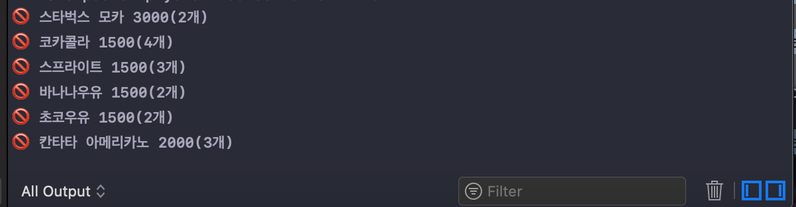
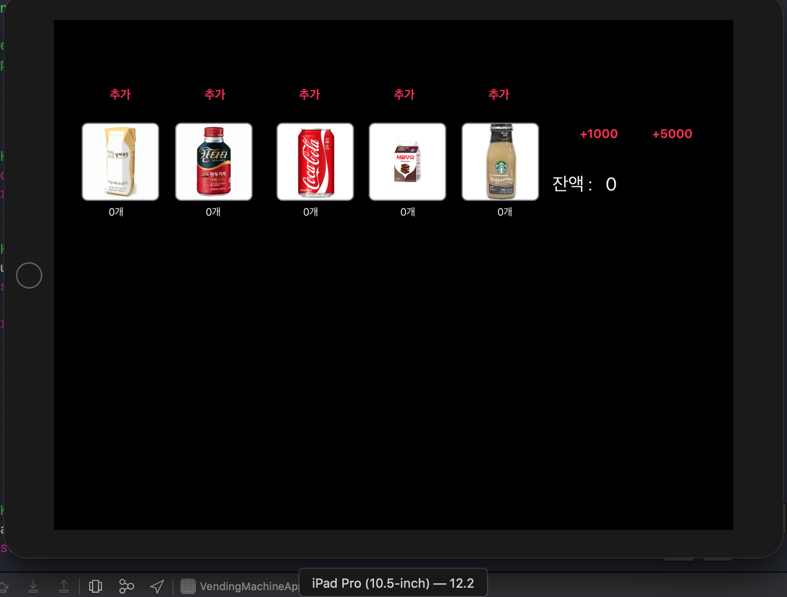

# 자판기 앱

## step1. 시작하기 - 아이패드 앱

- 실행화면


<br />
- 요구 사항
    - [자판기](https://github.com/conyconydev/swift-vendingmachine) 미션의 Main, InputView, OutputView를 제외하고 전체 클래스를 프로젝트로 복사 한다.
    - 프로젝트에 대한 일반 설정 (General)에서 Devices 항목을 iPad로 변경하고, Device Orientation 항목을 가로 (Landscape Left, Landscape Right)만 선택한다.
    -  아이패드 프로 10.5 시뮬레이터를 선택해서 실행

<br />
- 학습내용 정리
    - [UIApplicationMain 과 UIApplication 학습](https://github.com/conyconydev/conyconydev.github.io/blob/master/_posts/ios/2019-05-09-UIApplicationMain.md)


## step2. MVC 패턴

- 실행화면



<br />
- 학습내용 정리
    - UIImageView 에서 이미지를 표시할 때 사각형 코너를 둥글게하도록 변경

    > UIImageView 상속을 해서 RoundImageView 를 만들었다.

    ```swift
    class RoundImageView: UIImageView{
        
        required init?(coder: NSCoder) {
            super.init(coder: coder)
            
            self.layer.borderColor = UIColor.gray.cgColor
            self.layer.borderWidth = 2
            self.layer.cornerRadius = 10
        }
        
    }
    ```

    

    * 여러가지 방법이 있었는데 borderColor를 넣을 수 있는 방법을 선택
      	clipsToBounds, masksToBounds 


​             

