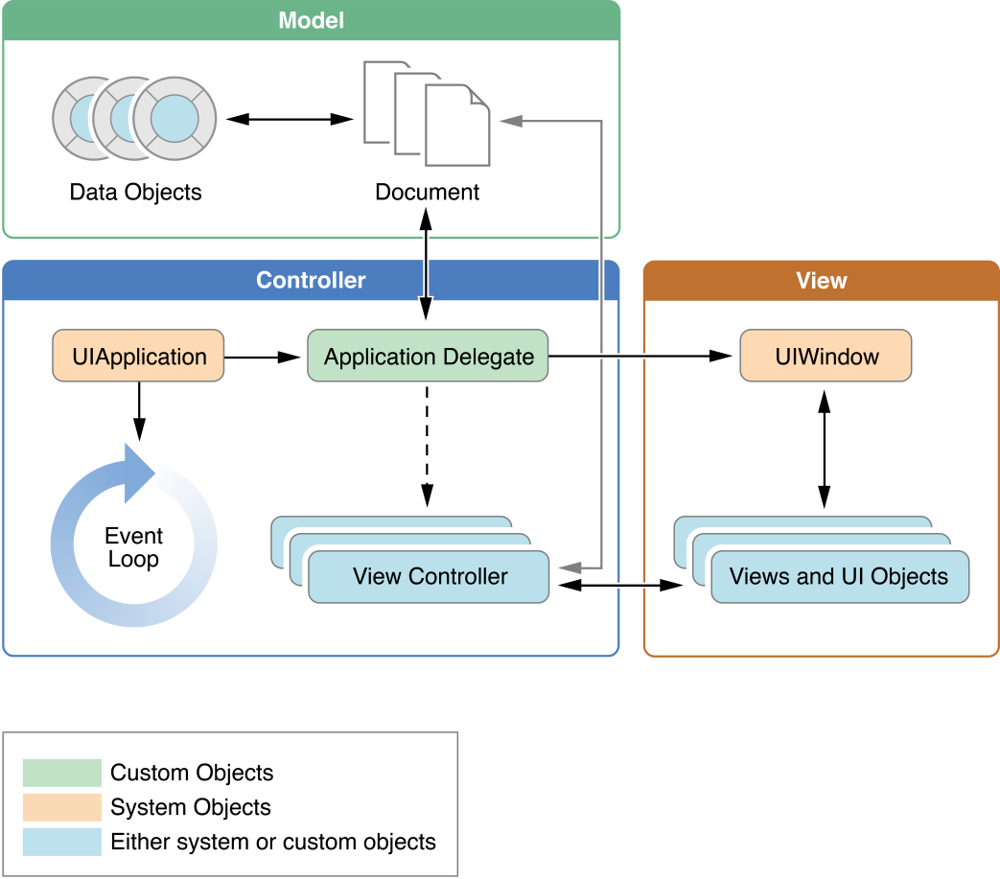

# 자판기 앱

1. <a href="#1-시작하기---아이패드-앱">시작하기 - 아이패드 앱</a>
2. <a href="#2-MVC-패턴">MVC 패턴</a>
3. <a href="#3-앱-생명주기와-객체-저장">앱 생명주기와 객체 저장</a>

<br>

## 1. 시작하기 - 아이패드 앱

### 추가내용

- Single View App 템플릿의 VendingMachineApp 프로젝트를 생성했습니다.

- 이전 <a href="https://github.com/popsmile/swift-vendingmachine/tree/popsmile">VendingMachine</a> 프로젝트 에서 View에 관련된 `InputView` 와 `OutputView`  그리고 `Main` 파일을 제외한 나머지 전체 소스파일을 해당 프로젝트로 복사했습니다. 복사한 파일의 코드는 대부분 MVC 중에서 Model의 역할을 담당합니다.
- `ViewController` 클래스에 `VendingMachine` 객체를 변수로 추가하고, `viewDidLoad()`  에서 음료 추가 및 재고 목록을 `print()` 했습니다.

<br>

### 실행결과

> 2018.12.24 11:00

```swift
✅ 언니몰래먹는딸기우유(2개)
✅ 스프라이트(3개)
✅ 칸타타 더치블랙(2개)
```

<br>

### 추가학습

#### The Structure of an App

`UIApplicationMain(_:_:_:_:)` 함수는 앱 시작 시,  핵심 객체인 application obejct 와 application delegate 객체를 생성하고 이벤트를 처리하는 run loop 도 시작시킵니다.

아래 이미지는 iOS 앱의 핵심 객체들의 관계입니다.



<a href="https://developer.apple.com/library/archive/documentation/iPhone/Conceptual/iPhoneOSProgrammingGuide/TheAppLifeCycle/TheAppLifeCycle.html#//apple_ref/doc/uid/TP40007072-CH2-SW1">이미지 출처</a>

<br>

#### The Main Run Loop

iOS 앱의 `main` 함수는 직접 작성하지 않고, Xcode에서 만들어줍니다. 대부분의 경우 이 함수를 수정하지않습니다.

아래 그림은 main run loop 의 구조와 앱에서 일어나는 유저 이벤트가 어떤 방식으로 처리되는지를 보여줍니다. 유저가 기기에 특정 액션을 취하면, 시스템에서 그 액션과 관련된 이벤트를 발생시키고 특정 포트를 통해서 앱으로 전달해줍니다. 전달된 이벤트는 큐에 쌓이고, **main run loop** 에 하나씩 보내져 실행됩니다. 이벤트를 가장 먼저 전달받는 객체는 **UIApplication** 으로, 이후에 무엇을 처리해야할지 결정합니다.


<a href="https://developer.apple.com/library/archive/documentation/iPhone/Conceptual/iPhoneOSProgrammingGuide/TheAppLifeCycle/TheAppLifeCycle.html#//apple_ref/doc/uid/TP40007072-CH2-SW1">이미지 출처</a>

<br>

## 2. MVC 패턴

### 추가내용

- `IBOutlet Collection` 으로 음료의 이미지 뷰와 이미지 레이블을 배열로 묶었습니다. 배열의 순서는  `VendingMachine`  의 `beverageTypes` 배열 순서와 동일하게 담았습니다.
- 아래의 `IBAction` 을 추가하여 각 음료 위의 모든 추가 버튼과 연결해주었습니다. `sender` 는 `UIButton` 으로 지정해주고, 각 버튼 `tag: Int` 에 위의 배열 인덱스와 동일한 값을 할당해주었습니다. 

```swift
@IBAction func addBeverage(_ sender: UIButton) {
    let selected = sender.tag
    guard vendingMachine.add(beverage: selected) else { return }
    showQuantities()
}
```

- 잔액 추가 버튼에 `IBAction`  으로 각각의 금액을 `VendingMachine.insert()` 하도록 추가했습니다.
- 음료 추가 및 금액 추가, 이 두 `IBAction` 실행 후 재고 및 잔액 레이블에 반영되도록 추가했습니다.

<br>

### 실행결과

> 2018.12.27 18:10


<br>

### 추가학습

1. 음료 이미지 뷰의 모서리를 둥글게 처리했습니다.

```swift
@IBOutlet var beverageImages: [UIImageView]!

private func roundImageViews() {
    for image in beverageImages {
        image.layer.cornerRadius = 15
        image.layer.masksToBounds = true
    }
}
```

layer의 아래 프로퍼티 값을 조정하여 모서리를 조정했습니다. `cornerRadius` 는 0.0이 디폴트 값이며, 값이 클 수록 모서리가 둥그렇게 처리됩니다. 

```swift
var cornerRadius: CGFloat { get set }
var masksToBounds: Bool { get set }
```

위의 `masksToBounds` 와 동일한 프로퍼티로 `UIView` 의 `var clipsToBounds: Bool { get set }` 가 있습니다. 

<br>

2. `UIView` 의 `ContentMode` 의 모든 케이스를 적용해보았습니다.

아래 `bottom` 부터 `right` 까지는 모두 컨텐츠가 보여지는 위치를 변경합니다. 컨텐츠의 비율은 모두 그대로 유지합니다.

- bottom


- bottomLeft


- bottomRight


- top


- topLeft


- topRight


- center


- left


- right


<br>


- redraw
  - `setNeedsDisplay()` 메소드를 통해 뷰의 경계가 바뀌었을 때 다시 보여줄 수 있습니다.
  - **뷰의 컨텐츠나 모양이 변경될 수 있는 경우**에만 사용합니다.


- scaleAspectFill
  - 뷰의 사이즈에 맞도록 조정합니다. 뷰의 경계를 모두 채우기 위해, **컨텐츠의 부분이 잘리는 경우**도 있습니다.


- scaleAspectFit
  - 뷰의 사이즈에 맞도록 컨텐츠를 조정합니다. 컨텐츠 측면 비율은 유지합니다. **뷰의 경계의 나머지 부분이 그대로 보여지기때문에** 모서리가 둥그렇게 보이지 않습니다.


- scaleToFill 
  - `ContentMode` 의 **default** 값입니다.
  - 필요한 경우에 뷰의 사이즈에 맞도록 컨텐츠의 측면 비율이 조정됩니다.


<br>

## 3. 앱 생명주기와 객체 저장

### 추가내용

1. `ViewController` 내에 있던 `VendingMachine` 변수를 `AppDelegate` 로 옮겼습니다.

   ```swift
   class ViewController: UIViewController {
   	private weak var appDelegate: AppDelegate?
       ...
       
       required init?(coder aDecoder: NSCoder) {
           self.appDelegate = UIApplication.shared.delegate as? AppDelegate
           ...
       }
       ...
   }
   ```

   `AppDelegate` 로 옮긴 `VendingMachine` 의 변수를 `ViewController` 에서 접근하기 위해, 위 처럼 **`AppDelegate?`** 변수를 선언하고 `UIApplication.shared.delegate` 인스턴스로 초기화해주었습니다.

   - UIApplication
     - `class var shared: UIApplication` : 앱 인스턴스를 반환합니다.
     - `var delegate: UIApplicationDelegate?` : 앱 인스턴스의 델리게이트 객체

   ```swift
   override func viewDidLoad() {
       ...
       appDelegate?.vendingMachine?.showBalance(with: balanceForm)
   }
   ```

   뷰 컨트롤러에서 위와 같이 `VendingMachine` 변수에 접근합니다.

<br>

2. 앱 종료 및 시작 시점에 콜백 함수에서  `VendingMachine` 을 아카이브/언아카이브하여, 앱이 다시 시작되더라도 자판기의 잔액 및 음료 재고 정보 등이 그대로 유지되도록 추가했습니다.

   **Archives and Serialization** <a href="https://developer.apple.com/documentation/foundation/archives_and_serialization">참고</a>

   - First Steps

     `VendingMachine` 객체 정보를 저장하기 위해, 내부에 포함된 구조체 및 클래스 객체가 모두 encodable and decodable 하도록 만들어주어야합니다.  

     - Codable

       구조체는 `NSCoding` 프로토콜을 채택할 수 없기때문에, 처음에는 모든 객체가 `Codable` 프로토콜을 채택하도록 구현했습니다. 하지만 여러차례 시도에도, 이 프로토콜로는 객체 내부에 포함된 하위 객체의 정보까지 저장하는데 실패하여... 결국, 아래의 `NSCoding` 으로 변경하여 적용했습니다.

     - NSSecureCoding

       모든 객체를 클래스로 변경하고,  `NSCoding` 을 상속받은 `NSSecureCoding` 프로토콜을 채택하도록 수정했습니다. 각각의 객체 내부에 아래의 프로퍼티와 메소드를 구현해주었습니다. 

       ```swift
       static var supportsSecureCoding: Bool
       func encode(with aCoder: NSCoder) {}
       required init?(coder aDecoder: NSCoder) {}
       ```

       추가로 문자열인 키 값을 저장하고 있는` enum Keys` 도 각각 추가해주었습니다.

       > **힘들었던 점**
       >
       > 인코딩 과정에서 자꾸 `NSKeyedArchiver warning: replacing existing value for key '\(encodingKey)'; probable duplication of encoding keys in class hierarchy` 에러가 발생하여 헤맸습니다. 스위프트 깃허브에서 <a href="https://github.com/apple/swift-corelibs-foundation/blob/master/Foundation/NSKeyedArchiver.swift#L424">해당 로그가 호출되는 부분</a>을 찾아보니, 인코딩 키 값이 이미 딕셔너리에 존재하는 키 값일 때 나타나는 에러였습니다. 모든 코드를 샅샅히 확인한 결과, `enum` 으로 키 값을 케이스별로 선언한 후, 하드 코딩 되어있던 키 값을 고치는 과정에서 두 번 중복하여 입력한 부분이 있었습니다. 작은 실수로 오랜 시간을 헤맸지만, `NSKeyedArchiver` 구현부를 확인하면서 더 자세히 들여다볼 수 있게해준 경험이었습니다.

   - Keyed Archivers

     `NSCoder` 의 하위 클래스로, 아카이브 시에 클래스 정보와 인스턴스 변수를 모두 저장합니다.

     - NSKeyedArchiver

       `withRootObject` 아규먼트도 전달된 루트 객체가 담고있는 object graph를 인코딩하여 `Data` 로 리턴합니다.

       ```swift
       let vendingMachineEncoded = try? NSKeyedArchiver.archivedData(
                   withRootObject: vendingMachine,
                   requiringSecureCoding: false)
       ```

     - NSKeyedUnarchiver

       위의 `NSKeyedArchiver` 로 인코딩되었던 `Data` 를 전달받아 디코딩하여 담고있던 object graph를 리턴합니다. 위 루트 객체로 전달해주었던 객체로 타입캐스팅이 필요합니다.

       ```swift
       let vendingMachine = try NSKeyedUnarchiver
                   .unarchiveTopLevelObjectWithData(data) as? VendingMachine
       ```

   <br>

   **UserDefaults**

   유저의 디폴트 데이터베이스로, 키-밸류 쌍으로 값을 저장합니다.

   - `class var standard: UserDefaults` : 해당 클래스 객체의 인스턴스에 접근할 수 있는 변수입니다.

   - Setting & Getting Default values

     ```swift
     // NSKeyedArchiver로 아카이브한 data: Data를 저장하기
     UserDefaults.standard.set(data, forKey:"vendingMachine")
     
     // NSKeyedUnarchiver로 언아카이브할 data: Data를 가져오기
     let data = UserDefaults.standard.data(forKey: "vendingMachine")
     ```

<br>

### 실행화면

> 2019.01.08 11:50

잔액 및 음료재고가 비어있는 초기상태에서 음료 추가/ 잔액 보충 액션을 취한 후의 실행화면입니다. 앱 종료 후 재시작에도 기존 자판기 데이터가 그대로 복원되어 실행되었습니다.

.gif)

<br>

### 추가학습

