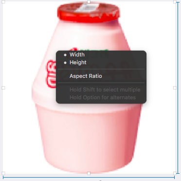

# Vending Machine App

## iPad 프로젝트 설정
- General - Deployment Info: 
	- Devices: iPad
	- Device Orientation: Landscape Left, Landscape Right 만 체크
- 시뮬레이터: 아이패드 프로 10.5

### 레벨2 VendingMachine 코드 복사
- **기존 코드**들은 대부분 **Model 역할**을 담당
- iOS 앱 구조는 MVC 중에서도 우선 **ViewController-Model 관계부터 집중**하고, ViewController-View 관계는 다음 단계에서 개선한다.

### 기본 자판기 모델 적용
- 레벨 2에서 구현한 ActivateMode 프로토콜, 프로토콜을 채택한 AdminMode, UserMode 구조체 제거
	- 모드 및 모드별 메뉴를 입력받아 선택된 메뉴의 기능 수행하고 출력(InputView, OutputView)하는 역할이었으나, UI로 대체할 수 있는 부분이므로 제거함
- ViewController 클래스에서 VendingMachine 객체를 사용하여 음료 객체를 추가하고 재고목록을 출력
	- ActivateMode 타입이 제거되어 VendingMachine의 함수를 그대로 사용함

### 학습 내용

>- **[앱 인터페이스와 구성요소](https://github.com/undervineg/swift-vendingmachineapp/blob/vending-step2/md/app_interfaces.md)**
>- **[시스템 프레임워크 - 1. 앱 초기화 과정](https://github.com/undervineg/swift-vendingmachineapp/blob/vending-step2/md/app_initialization.md)**
>- **[시스템 프레임워크 - 2. 메인 런 루프](https://github.com/undervineg/swift-vendingmachineapp/blob/vending-step2/md/main_run_loop.md)**
>- **[시스템 프레임워크 - 3. MVC 패턴구조](https://github.com/undervineg/swift-vendingmachineapp/blob/vending-step2/md/mvc_structure.md)**
>- **[시스템 프레임워크 - 4. 앱 생명주기](https://github.com/undervineg/swift-vendingmachineapp/blob/vending-step2/md/app_lifecycle.md)**
>- **[시스템 프레임워크 - 5. iOS와 코코아 터치 프레임워크](https://github.com/undervineg/swift-vendingmachineapp/blob/vending-step2/md/cocoatouch_framework.md)**

2017-01-09 (작업시간: 1일)

<br/>

## 자판기 앱 화면(view) 구현


### 화면 구성
>- 각 상품에 대한 이미지를 추가한다.
>- 각 상품에 대한 재고 추가 버튼을 추가한다.
>- 각 상품에 대한 재고 레이블을 추가한다.
>- 100원, 500원, 1000원 금액을 입력하는 버튼을 추가한다.
>- 현재 잔액을 표시할 레이블을 추가한다.

- 각 상품과 라벨 등을 Stack View에 넣어 오토레이아웃 적용
- 중복되는 아웃렛들을 IBOutletCollection으로 만들고 tag를 부여하여 사용

#### IBOutletCollection 사용하기
1. 중복되는 요소들 중 하나를 View Controller로 끌어서 IBOutletCollection 만듦
2. 만든 IBOutletCollection 옆의 동그라미(+) 버튼을 Main.storyboard의 중복되는 요소들로 드래그하여 UI 객체배열 완성
3. 각 요소를 구분하기 위한 tag 부여
4. IBAction을 하나 만들어서 각 요소와 연결
5. IBAction 내에서 IBOutletCollection으로 만든 배열 사용
	- 예시:

		```swift
		@IBAction func buttonTapped(_ sender: UIButton) {
			for button in starButtons {
				// 액션이 일어난 버튼의 태그와 같거나 작은 버튼들에
				if button.tag <= sender.tag {
					button.setImage(UIImage.init(named: “star_selected”), 				for: .normal)
				} else {
					button.setImage(UIImage.init(named: “star_normal”), for: .normal)
				}
			}
		}
		```

>- IBOutletCollection은 순서를 보장하지 않는다.
>- 연결된 ViewController에는 NSArray로 생성된다.

[참고: What is an IBOutletCollection in iOS](https://medium.com/@abhimuralidharan/what-is-an-iboutletcollection-in-ios-78cfbc4080a1)

#### 라벨 내 마진 주기
- UILabel에 배경색을 주면 콘텐츠(텍스트)와 배경색 사이에 공간이 없어 보기 좋지 않음.
- **UILabel에는 마진을 줄 수 없다.**
- **버튼을 라벨 대신 사용한다 :**
    - Accessibility > **User Interaction Enabled 체크 해제**
    - Accessibility > **Static Text 체크**
    - View > **User Interaction Enabled 체크 해제**
    - Size Inspector > **Content Insets** 값 정의


#### UI 요소에 테두리/색상테두리/둥근테두리 주기
- Identity Inspector > User Defined Runtime Attributes에 키 추가 :
    - 테두리: **layer.borderWidth** (Number)
    - 테두리색상: **layer.borderUIColor** (Color) 
    - 둥근테두리: **layer.cornerRadius** (Number)


#### StackView에 spacing을 주면 이미지가 올라감
- Baseline Relative 체크


#### 이미지뷰와 재고라벨에 Set vertical compression resistance priority to 123 에러가 남
- 문제원인: stackview에 spacing을 주면 콘텐츠가 무너질 수도 있기 때문에 나타나는 에러로 추정.
- 해결방법: 재고라벨에 Height 제약을 줌.

</img>

#### 이미지뷰 크기 동일하게 고정하기(150x150)
- 자기자신에게 제약조건 width, height를 주면 됨

</img>

<br/>

### 기능 구현
>- 각 상품의 재고 추가 버튼을 누르면 각 상품 재고를 추가하도록 코드를 구현한다.
>- 재고 추가 버튼을 누르고 나면 전체 레이블을 다시 표시한다.
>- 금액 입력 버튼을 누르면 해당 금액을 추가하도록 코드를 구현한다.
>- 금액을 추가하고 나면 잔액 레이블을 다시 표시한다.

#### 프로토콜 UserServable에 insertMoney(_ money: MoneyManager.Unit) 정의 시, MoneyManager 클래스에 제네릭 제약조건이 필요
- 문제사항: 
	- insertMoney() 함수의 파라미터로 쓰이는 MoneyManager 클래스가 (Machine을 제네릭으로 가지는) 제약조건을 가짐. 
	- 하지만, 프로토콜 정의 시 `MoneyManager<Machine>.Unit`으로 적으면 `Using 'Machine' as a concrete type conforming to protocol 'Machine' is not supported` 에러 발생. 
	- 하지만 따로 associatedtype을 정의해주기에는 부수적인 제약조건 문제가 생길 가능성이 큼.
- 해결방법: `insertMoney(_ money: MoneyManager<Self>.Unit)`로 정의. UserServable은 Machine 클래스를 상속받으므로, <Self>를 사용하여 자기자신 타입(Self)을 넣어줘도 됨.

#### Model 업데이트 시, NotificationCenter 사용
- MVC에 맞추어 함수 설계
    - **View ➔ Controller**: **IBAction** 사용
    - **Controller ➔ Model**: Model 객체의 메소드 사용
    - **Model ➔ Controller**: **NotificationCenter.default.post()** 사용
        - 처음에는 ViewController의 View 업데이트 함수를 직접 호출하도록 만듦
        - iOS에서 Model은 직접 ViewController에 메시지를 보내지 않음 ➔ NotificationCenter 를 사용하는 방법으로 변경
    - **Controller ➔ View**: **update 함수** 정의, **NotificationCenter.default.addObserver()**로 Model에서 post한 Notification.Name에 해당하는 노티 발생 시, update 함수에 연결.

##### 문제점: 뷰 업데이트가 안 됨
- 문제원인: NotificationCenter.default 메소드들의 **object 파라미터 값**을 잘못 넣음
	- **addObserver 메소드의 object**: 노티를 **받을** 객체. nil인 경우, 어느 객체에서 보내든 상관 안 함
	- **post 메소드의 object**: 노티를 **보내는** 객체. 보통 post를 보내는 객체인 자기자신, **self**를 넣는다. nil인 경우, 보내는 객체가 어딘지 전달하지 않음.
	- **addObserver의 object가 정의되면, post의 object도 같이 정의해야 한다. 아니면 둘 다 nil로 정의해야 한다.**

#### NSUnknownKeyException 에러발생
- 에러코드: VendingMachineApp[37705:2367314] *** Terminating app due to uncaught exception 'NSUnknownKeyException', reason: **'[<VendingMachineApp.ViewController 0x7fef47508040> setValue:forUndefinedKey:]: this class is not key value coding-compliant for the key productImages.'**
- 문제원인: 뷰컨트롤러에 연결한 IBOutlet을 지우고나서 연결을 끊지 않음

2017-01-14 (작업시간: 1일)

<br/>

### Feedback
#### 스토리보드보다 코드로 객체를 만들고 표현하는 연습을 하는 편이 동작 방식을 이해하는 데 좋다. 
- `layer.cornerRadius` 값을 디자인 타임에 적용해서 확인하는 것도 좋지만, 코드로 속성을 어디에 넣어야 바뀌는지 공부하고 동작 방식을 이해하는 게 더 중요함
- 개선사항: 기존에 스토리보드의 Identity Inspector > User Defined Runtime Attributes에 줬던 `layer.cornerRadius`를 viewController에서 작성

#### 하나의 파일로 extension을 합치면 어떤 장단점이 있을까요?
- 익스텐션을 각 타입에 따라 여러 파일로 분리해놓는게 필요한 경우에만 선택적으로 확장할 수 있는 장점이 있다.

#### Notification.Name(enum.rawValue) 형태보다는 Notification.Name() 자체를 만들어두고 활용한다.
- 기존: 

	```swift
	enum Notifications: CustomStringConvertible {
	    case didUpdateInventory = "didUpdateInventory"
	    case didUpdateBalance = "didUpdateBalance"
	    var name: Notification.Name {
	        return Notification.Name(self.description)
	    }
	    var description: String {
	        switch self {
	        case .didUpdateInventory: return
	        case .didUpdateBalance: return
	        }
	    }
	}
	```
	사용 시: `Notification.Name(NotificationNames.didUpdateBalance.description)`
- 개선: 

	```swift
	enum Notifications: String {
	    case didUpdateInventory
	    case didUpdateBalance
	    var name: Notification.Name {
	        return Notification.Name(self.rawValue)
	    }
	}
	```
	사용 시: `Notifications.didUpdateBalance.name`
	
#### ★ 화면 요소와 데이터를 매칭해야 하는 경우는 항상 발생한다.
- 직접적으로 스토리보드에서 태그값을 넣어놓고 sender.tag 에 접근하기 보다는 화면요소와 데이터를 매칭할 수 있는 데이터 구조를 갖고 있는 것이 좋다.
- 값을 바꾸거나 데이터 구조가 변경되면 이에 따라 화면 요소까지 바꿔야 하기 때문이다.
	
	``` swift
	@objc func insertMoney(_ sender: UIButton) {
		// 버튼 태그에 따라 특정 금액 삽입.
		machine.insertMoney(MoneyManager<VendingMachine>.Unit(rawValue: sender.tag)!)
	}	
	```
- 개선사항: Mapper 구조체를 작성하여 UI요소인 sender의 tag에 따라 특정 model 값을 리턴하는 함수들 추가
	- 개선 1: (여러 UI 요소 타입을 받으려면 **UIView** 사용)

	```swift
	struct Mapper {
	    static func mappingUnit(with sender: UIButton) -> MoneyManager<VendingMachine>.Unit? {
	        var unit = MoneyManager<VendingMachine>.Unit(rawValue: 100)
	        switch sender.tag {
	        case 1: unit = MoneyManager<VendingMachine>.Unit(rawValue: 100)
	        case 2: unit = MoneyManager<VendingMachine>.Unit(rawValue: 500)
	        case 3: unit = MoneyManager<VendingMachine>.Unit(rawValue: 1000)
	        default: break
	        }
	        return unit
    	}
   	 	...
    }
	```
	- 개선 2: 
	
	```swift
	static func mappingUnit(with sender: UIButton) -> MoneyManager<VendingMachine>.Unit? {
        return MoneyManager.Unit(rawValue: sender.tag)
    }
	```
	>- 이전처럼 직접 tag값을 사용하는 것 같지만, init?(rawValue:) 를 쓰면 sender.tag 를 넣더라도 범위에 들어가면 열거형 타입이 생성될꺼고 아니면 nil 값이 된다.
	>- 결과적으로는 동일하지만 switch-case 로 모든 값을 매칭해주지 않아도 init() 함수로 매칭할 수 있다.
	>- 이렇게 작성할 경우, 유지보수나 확장성 측면에서도 **Menu에 case가 추가되거나 삭제해도 이 부분을 수정할 필요가 없다**는 장점이 있다. 
	>- **개발자가 코드로 실수할 수 있는 부분을 컴파일러가 검사할 수 있도록 만드는 방식**이 있다면 그걸 선택하는 게 좋다.

#### 하드코딩해서 단위를 붙이지 않는다.
- 단위를 붙일 때, 여러 국가를 지원할 때를 고려해서 하드코딩 값을 넣기보다는 Formatter를 만드는 편이 좋다.
- 기존:

	```swift
	@objc func updateBalanceLabel() {
		if let balance = machine.showBalance().currency() {
			balanceLabel.text = balance + "원"
		}
	}	
	```
- 개선: Formatter 열거형 정의

	```swift
	enum Formatter {
	    case kor(Int)
	    case eng(Int)
	    var moneyUnit: String {
	        switch self {
	        case .kor(let value):
	            guard let valueInCurrencyFormat = value.currency() else { return "원" }
	            return valueInCurrencyFormat + "원"
	        case .eng(let value):
	            guard let valueInCurrencyFormat = value.currency() else { return "won" }
	            return valueInCurrencyFormat + "원"
	        }
    }
	```	
	사용 시: `Formatter.kor(machine.showBalance()).moneyUnit`
	
<br/>

## 앱 생명주기와 객체 저장


### 저장 가능한 모델 구현: Codable 사용
- 기존: NSObject, NSCoding 사용. class에만 적용 가능함
- 개선: swift4부터 Codable 프로토콜 지원됨. struct, enum 등에도 적용 가능함
- 에러코드: Ambiguous reference to member 'encode(_:forKey:)'
    - 문제원인: Codable 하지 않은 타입을 인코드 할 때 생기는 문제
    - 해결방법: enum, struct, class 등 원시타입이 아니라면 Codable 채택 및 구현

### 파일시스템에 저장할 공간 마련: 어플리케이션 샌드박스 or UserDefaults
#### 어플리케이션 샌드박스란
- 모든 iOS 앱은 어플리케이션 샌드박스(application sandbox)를 가진다. 이는 파일 시스템상의 디렉터리로, 앱은 반드시 자신의 샌드박스 안에 위치해야 하고 다른 앱들은 접근할 수 없다.
- 다음과 같은 디렉토리가 있다:
    - Documents/ : 앱이 실행 중에 생성한 데이터를 다시 실행 시에도 유지할 수 있도록 저장하는 디렉토리. 아이튠즈나 아이클라우드와 동기화할 때 백업되기 때문에 문제가 생겼을 시 복원 가능하다.
    - Library/Caches/ : Documents/와 비슷한 역할이지만, 아이튠즈나 아이클라우드와 동기화 시 백업되지 않는다. 시스템은 기기의 디스크 공간이 부족하면 이 디렉토리의 내용을 지울 수도 있다.
    - Library/Preferences/ : 설정 내용이 저장되고, Settings앱이 앱의 설정을 검색하는 디렉토리. UserDefaults 클래스가 자동으로 처리한다. 아이튠즈나 아이클라우드와 동기화 시 백업된다.
    - tmp/ : 앱 실행 중에 임시로 사용하는 데이터를 저장하는 디렉토리.  파일들을 더 이상 사용하지 않을 때는 지워야 한다. OS는 앱이 실행되지 않을 때 이 디렉토리의 파일들을 제거할 수도 있다.

### 데이터를 저장하고 로딩하는 과정 구현: 이름있는 아카이브
- 에러코드: 
    - VendingMachineApp[87522:3770545] Unrecognized selector -[VendingMachineApp.VendingMachine replacementObjectForKeyedArchiver:]
- Codable을 사용할 때는 꼭 PropertyListEncoder/PropertyListDecoder 로 encode/decode 해줘야 한다.

* 시뮬레이터로 아카이빙 테스트할 때는 시뮬레이터 내에서 앱을 끄지 말고 xocde에서 정지했다가 다시 켜는 식으로 확인한다.
* ViewController에서 AppDelegate를 받아와서 처리할 때, 
* let delegate = UIApplication.shared.delegate as? AppDelegate self.machine = delegate?.machineStore.machine
* 위 구문을 init에 넣지 말고 viewDidLoad에 넣어야 한다.
* 왜냐하면 AppDelegate보다 init 이 먼저 호출될 수도 있기 때문이다.
* 또, viewDidLoad에서 기존 데이터를 뷰에 표시하도록 update함수들을 한 번 호출해야 화면이 표시되자마자 이전 데이터가 표시된다.

#### 객체 복사
- 객체 인스턴스를 참조하지 않고, 새로운 객체 인스턴스로 복사해야 하는 경우 필요한 프로토콜 소개
- 얕은 복사가 아닌 깊은 복사를 위한 아카이브 방식 소개
1. NSCopying 계열 프로토콜
    - <NSCopying> : 읽기만 가능
    - <NSMutableCopying> : 읽고 쓰기 가능
2. 얕은 복사 vs. 깊은 복사
    - 얕은 복사: 참조하는 포인터에 있는 주소값만 복사하는 방식
        - NSArray 처럼 객체 내부에 다른 객체를 포함하는 경우에는 객체 복사 시 주의해야 한다.  내부 객체의 메모리 주소를 포인터 변수로 접근하는 것뿐이기 때문이다. 즉, NSArray 객체를 복사한다고 해서 내부 객체도 동일한 복사본이 생기는 것이 아니라, 참조하는 포인터에 있는 주소값만 복사한다.
    - 깊은 복사: 내부 객체까지 모두 새롭게 생성한다.
        - 우선 얕은 복사를 한 상태에서 형성된 객체 그래프의 하위 노드부터 탐색(DFS, 깊이우선 탐색)하며 새로운 객체를 만들어 복사하는 식으로 모든 객체를 복사한다.
        - 하지만 이렇게 깊이 우선 탐색(DFS) 시, 어떤 객체는 중간에 여러 객체에서 여러 번 참조될 수도 있고 특정 객체들은 순환참조 문제가 있을 수도 있기 때문에 복사 후에 약한 참조로 지정해야 하는 경우도 있다.
        - 따라서 객체 그래프가 복잡한 경우에는 단지 깊은 복사만으로 하위 객체들의 참조 관계가 완벽하게 복사되지는 않는다.
        - 1. 코어 데이터: 객체 그래프를 저장하기 위한 프레임워크
        - 2. 아카이브
3. 아카이브
    - 객체 직렬화(plist): 
        - 아카이브와 마찬가지로 객체 그래프를 따라 객체의 데이터 내용을 저장하는 방식 (NSPropertyList Serialization 클래스 참고)
        - 하지만 여러 곳에서 하나의 객체를 다중 참조하고 있으면, 참조마다 동일한 내용의 객체를 여러 개 저장하고, 다시 객체화 시 다중 참조하는 형태로 복원하는 게 아니라 각기 다른 객체로 만들어 버린다. 또한, 데이터 값만 저장하기 때문에 만들어진 객체가 가변 객체인지 불변 객체인지 판단해서 복원할 수 없다.
        - NSDictionary, NSArray, NSString, NSDate, NSData, NSNumber 타입으로 저장되어 있는 데이터 구조만  XML 기반 프로퍼티 목록(plist) 파일로 직렬화하여 저장한다.
        - NSUserDefaults 클래스: 사용자 설정을 저장하는 용도의 직렬화
            - NSUserDefaults 클래스는 내부적으로 NSPropertyListSerialization을 사용. 따라서 직렬화를 지원하는 객체 클래스가 제한적.
            - 예를 들어 UIColor, NSFont 같은 타입의 경우, 직렬화 시 NSData를 사용하여 바이너리로 바꿔야 함.
    - <NSCoding> 프로토콜
        - 가변객체나 다중 참조 관계 등을 원래대로 복원해야 하는 경우 사용
        - NSCoder 클래스: 메모리상에 있는 객체 인스턴스 변수를 다른 형태로 변환하기 위한 인터페이스를 선언한 추상화 클래스로, 일부 제한된 기능만 구현되어 있으며 실제로는 NSKeyedArchiver, NSKeyedUnarchiver, NSPortCoder 같은 하위 클래스 구현체를 사용한다.
        - 객체 그래프 복원 시 뿌리 객체(root object)와 조건부 객체(conditional objects) 개념을 사용
        - 뿌리객체: 아카이브를 시작하는 시점을 의미하며, 기존에 인코딩했던 객체를 다시 참조할 경우 인코딩한 기존 객체를 참조한다. (NSCoder.encodeRootObject)
        - 조건부객체: 반드시 아카이브하지 않아도 되는 참조객체로, 소유권 관계가 명확해서 어느 시점에 반드시 인코딩이 되는 특정한 객체를 참조하기 때문에 다시 인코딩 될 필요가 없는 객체이다. (encodeConditionalObject). 약한 참조 형태로 인코딩된다.
    - 이름있는 아카이브(Keyed Archives)
        - 인스턴스 변수를 인코딩할 때 사전 타입처럼 변수에 대한 키 값을 이름으로 지정해서 인코딩할 수 있다. 디코딩 시엔 키 값으로 저장한 값을 찾아 복원한다.
        - 고유한 키 값을 지정하기 위해 키 값 규칙을 정해야 한다: 단, NS, UI, $ 같은 코코아에서 쓰이는 접두어는 피한다.
        - 디코딩 시, 해당하는 키 값에 대한 데이터가 없을 수도 있다. 이 때는 nil 값을 반환한다.
        - 아카이브 델리게이트: NSKeyedArchiverDelegate나 NSKeyedUnarchiverDelegate 프로토콜로 정의하여 델리게이트를 지정해서 각 객체를 인코딩, 디코딩하는 시점에 알림을 받을 수 있다.
        - (참고) NSCoder 구현 클래스 중 NSArchiver, NSUnarchiver 클래스는 디코딩 시 인코딩한 순서와 동일하게 맞춰야 해서, 인스턴스 변수가 바뀌거나 삭제된 변경사항이 있으면 디코딩하지 못하는 경우가 있다. 따라서 인코딩/디코딩 시점에 이름을 키 값으로 사용할 수 있는 NSKeyedArchiver, NSKeyedUnarchiver 클래스를 사용하도록 권장한다.

[참고: Cocoa Internals]()

#### Dynamic Type
- 메타타입: String.Type처럼 타입자체를 나타냄
- 이런 타입 자체를 값으로 사용 가능 ex) let SType: String.Type = String.self
- 타입 자체를 비교할 경우 필요하다.
- Dynamic Type인 이유는, 인스턴스의 경우 프로토콜 타입을 쓸 수도 있으므로 여러 타입으로 이뤄질 수 있기 때문이다.
- Any Type은 사실상 아무 타입과 매칭되지 않으므로 쓰지 않는 편이 좋다.
<ObjectIdentifier>
- ‘클래스’와 관련있다.
- AnyClass는 AnyObject의 메타타입으로, 즉 모든 클래스들의 메타타입이다.
- 클래스만 AnyObject 타입으로 만들 수 있다.
- Metatype : Type : Value
- 위의 관계에서, Metatype과 Type을 비교할 때 일반적인 타입은 Any.Type이고 클래스인 경우엔 AnyClass를 사용
- ObjectIdentifier를 거치면 메타타입이 된다. 즉, ObjectIdentifier(값)을 넣으면 “타입” 이 나오고, ObjectIdentifier(타입)이 나오면 “메타타입”이 나온다.
- ObjectIdentifier는 Hashable을 채택한 타입이다. 클래스 자체 타입을 딕셔너리 키로 사용하고 싶으면 ObjectIdentifier 타입을 키 타입으로 넣으면 된다. ex) [ObjectIdentifier:Int] 이런 식으루..
- var v1 = VendingMachine()
- var v2 = VendingMachine()
- 일 때,
- var type1 = ObjectIdentifier(v1)
- var type2 = ObjectIdentifier(v2)
- 위 둘은 서로 다른 객체이기 때문에 다르지만,
- var type1 = ObjectIdentifier(type(of: v1))
- var type2 = ObjectIdentifier(type(of: v2))
- 위 둘은 VendingMachine으로 같다.