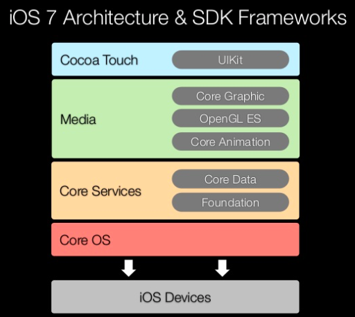

# Vending Machine App

## iPad 프로젝트 설정
- General - Deployment Info: 
	- Devices: iPad
	- Device Orientation: Landscape Left, Landscape Right 만 체크
- 시뮬레이터: 아이패드 프로 10.5

## 레벨2 VendingMachine 코드 복사
- **기존 코드**들은 대부분 **Model 역할**을 담당
- iOS 앱 구조는 MVC 중에서도 우선 **ViewController-Model 관계부터 집중**하고, ViewController-View 관계는 다음 단계에서 개선한다.

### 기본 자판기 모델 적용
- 레벨 2에서 구현한 ActivateMode 프로토콜, 프로토콜을 채택한 AdminMode, UserMode 구조체 제거
	- 모드 및 모드별 메뉴를 입력받아 선택된 메뉴의 기능 수행하고 출력(InputView, OutputView)하는 역할이었으나, UI로 대체할 수 있는 부분이므로 제거함
- ViewController 클래스에서 VendingMachine 객체를 사용하여 음료 객체를 추가하고 재고목록을 출력
	- ActivateMode 타입이 제거되어 VendingMachine의 함수를 그대로 사용함

<br/>

## 앱 인터페이스와 구성요소
### 화면을 구성하는 세 가지 주요객체
1. **UIScreen**: 기기에 연결되는 물리적인 화면을 정의하는 객체
2. **UIWindow**: 화면 그리기 지원 도구를 제공하는 객체. 
	- 디바이스 스크린을 빈틈없이 채우기 위한 객체
	- 항상 유저 인터페이스 표현 계층의 최상위에 위치한다. 
	- 뷰의 일종이지만 **직접 콘텐츠를 가지지 않는다**. **UIView들이 콘텐츠를 표현하면 디바이스 스크린에 이를 표현**한다.
	- **화면이 전환되더라도 윈도우 객체는 전환되지 않는다**. 내부에 배치된 뷰의 콘텐츠만 변경된다.
3. **UIView**: 그리기를 수행할 객체 세트
	- 콘텐츠를 담아 스크린상에 표시한다. 
	- 사용자의 입력에 반응한다. 
	- 윈도우의 일부를 자신의 영역으로 정의하고, 이에 필요한 콘텐츠를 채워넣는다.
	- **윈도우로부터 전달된 사용자 입력에 반응**하고 그에 맞는 결과를 처리한다.


<br/>

## 건드릴 수 없는 영역: System Framework
### 앱 초기화 과정 (App Loading Process)
1. 앱 실행: **main() 함수 실행됨**
2. main(): **UIApplicationMain() 호출**

	```objective-c
	// main.m
	int UIApplicationMain(
	    int argc, 
	    char *argv[], 
	    NSString *principalClassName, 
	    NSString * appDelegateClassName
	);
	```
	- 세 번째 인자인 `principalClassName`: 앱 객체가 될 클래스 이름. 보통 UIApplication이 들어간다.
	- 네 번째 인자인 `appDelegateClassName`: 앱 델리게이트 클래스 이름. 메인 nib 파일(MainWindow.xib) 내에 객체가 이미 만들어져 있기 때문에 넘겨줄 필요 없다.
	- 메인 nib 파일을 쓰지 않는 경우

	```objective-c
	#import <UIKit/UIKit.h>
	#import "MYAppDelegate.h"

	int main(int argc, const char ** argv) {
        @autoreleasepool{
            return UIApplicationMain(argc, argv, nil,   
                     // 앱 델리게이트를 만들 수 있는 힌트를 줘야 한다.
                     NSStringFromClass([MYAppDelegate class]));
        }
    }
	```

3. UIApplicationMain(): **UIApplication 객체 생성**
4. UIApplication 객체: Info.plist 파일을 바탕으로 앱에 필요한 데이터와 객체 로드
	- 앱 로딩 과정에서 참조해야 하는 수많은 정보들은 소스코드가 아니라 Info.plist에 정의된다.
5. **AppDelegate 객체 생성** 및 UIApplication 객체와 연결

	------------ **스위프트는 C 기반 언어가 아니기 때문에, 엔트리 포인트가 없으며 어노테이션 표기로 대체함: @UIApplicationMain** (1~5 과정은 생략된다) ------------

6. 이벤트 루프 생성 등 실행에 필요한 준비 진행
7. 실행 완료 직전, **AppDelegate의 application(_:didFinishLaunchingWithOptions:) 메소드 호출**

[참고: Wireframe](https://soooprmx.com/archives/4454)

#### 엔트리 포인트: main()
- Xcode 프로젝트 생성 시 main(int argc, char* arg[])함수가 자동으로 생성됨.
- 실행 시 시스템으로부터 받은 2개의 인자값과 AppDelegate 클래스를 이용하여 UIApplicationMain() 함수 호출 -> UIApplication 객체 반환.

#### 앱 그 자체를 의미하는 객체: UIApplication
- UIAppliaction 객체는 이벤트 루프나 다른 높은 수준의 앱 동작을 관리하거나 푸시알림 등의 특수 이벤트를 델리게이트에게 알려주는 등의 일을 한다. 
- 이 때, **UIApplication을 서브 클래싱하지 않고 그대로 사용하기에는 한계가 있는데**, 특정 의도나 목적에 맞게 특별한 일을 처리해야 할 때가 많기 때문이다.
- 따라서 UIApplication 객체는 **대리인인 AppDelegate 객체를 내세워 커스텀 코드를 처리할 수 있도록 약간의 권한을 부여**한다.
- 이에 따라 UIApplication은 앱의 생명주기나 이벤트 처리와 같이 중요한 일들을 담당하고, AppDelegate는 커스텀 코드를 처리하게 된다.

#### 위임받은 권한을 이용하여 커스텀코드와 상호작용하는 객체: AppDelegate
- 앱이 시작되면 앱 델리게이트는 `application(_:didFinishLaunchingWithOptions:)` 메시지를 받게 되는데, 이 시점에 **크리티컬한 데이터를 초기화**하면 된다. 단, 앱이 화면에 나타나기 전이므로 시간이 많이 걸리는 작업은 하지 않는 것이 좋다.
- AppDelegate 객체는 커스터마이징하거나 서브클래싱 할 수 있도록 오픈되어 있다. 
- 앱 내에서 **오직 하나의 인스턴스**만 생성되도록 보장받는다.
- **앱 전체의 생명주기와 함께 한다**. 앱이 처음 만들어질 때 객체가 생성되고, 앱이 실행되는동안 유지되다가, 앱이 종료되면 소멸한다.
- 따라서 AppDelegate 객체는 **종종 앱의 초기 데이터 구조를 설정하기 위해 사용되기도 한다**. (AppDelegate 객체에 데이터를 저장하면 앱 종료 전까지 데이터를 유지할 수 있으므로)


<br/>

### 메인 런 루프(Main Run Loop)
- 메인 런 루프는 앱에 들어오는 이벤트들을 애플리케이션 객체가 처리할 수 있도록 계속해서 라우팅하고, 처리결과로 UI와 상태를 업데이트한다.
- 발생한 여러 이벤트들의 좌표들은 런루프에 추가된다. 
	- 전달받는 이벤트 종류:
		- **입력소스(input source)**: 다른 쓰레드나 애플리케이션에서 **전달**되는 **메시지 이벤트**(**비동기식**)
		- **타이머소스(timer source)**: **예정시간**이나 **반복수행간격**에 따라 **발생**하는 이벤트(**동기식**)
- 모든 쓰레드에서 런루프는 반드시 설정되고 코드에서 수동적으로 실행돼야 하는데, 메인쓰레드를 위한 **메인 런 루프는 애플리케이션 객체에 의해 자동으로 실행**된다. 
- **메인 런루프는 다른 런루프와 달리** 사용자 액션으로 인한 **이벤트를 OS로부터 받는다**.

[참고: Inboon's Story](http://inboony.tistory.com/21)

#### 애플리케이션 객체(Application Object)는 로우레벨 이벤트를 받아 UIEvent로 변환하여 해당하는 객체로 내보낸다.
- 애플리케이션은 각 이벤트를 도착한 순서대로 처리해야 하기 때문에 **로우레벨 이벤트**는 **FIFO 이벤트 큐**에 들어간다.
- 애플리케이션 객체는 **이벤트 최상위에 있는 객체를 취해서 이벤트 객체(UIEvent)로 변환**하고 유저 이벤트가 일어난 **Window에 디스패치**(dispatch)한다.
- 전달한 이벤트가 돌아왔을 때 애플리케이션은 큐에서 다음 객체를 가져와서 디스패치한다. **앱이 종료될 때까지 이 과정을 반복**한다.
- 또한, 앱이 실행되었을 때 **이벤트를 처리하는 책임을 가진 객체들**을 **코어 그룹**으로 설정한다.

#### 코어 객체(Core Objects)는 이벤트에 응답하고 UI를 업데이트한다.
- 애플리케이션 객체에서 보낸 이벤트는 **Window가 먼저 받고**, Window는 이벤트를 처리하기에 가장 적절한 핸들러인 **View에 보낸다**.
- 최초로 받은 뷰가 이벤트를 처리하지 않으면, **응답자 체인(Responder Chain)**을 통해 다른 뷰로 전달된다.
- 뷰는 종종 애플리케이션의 외관을 수정하고 상태나 데이터를 업데이트하는 일련의 액션을 수행한다. 이런 **액션이 완료되면 애플리케이션 객체로 제어가 돌려지며**, 애플리케이션 객체가 이벤트 큐의 다음 이벤트를 취한다.


[참고: App Programming Guide for iOS](https://developer.apple.com/library/content/documentation/iPhone/Conceptual/iPhoneOSProgrammingGuide/TheAppLifeCycle/TheAppLifeCycle.html#//apple_ref/doc/uid/TP40007072-CH2-SW14)

[참고: Github codeport - ios](https://github.com/codeport/ios/wiki/Run-loop)

#### 타이머
- **모든 쓰레드는 런루프에 접근 가능**하다. 
- 메인 쓰레드에서 생성되는 메인 런 루프 외에 모든 쓰레드는 사용자가 직접 추가해야 한다.
- **지속적인 상호작용이 필요한 경우에는 쓰레드와 런루프를 반드시 사용해야** 한다. (예: 통신, 타이머 등)
- 타이머는 스스로 동작기한을 가지고 있어 그 상태로 런루프에 등록된다.
- 런루프는 보통 이벤트가 발생하면 정해진 메소드를 호출하는데, 타이머의 경우 **설정한 기한이 지나는 시점에 타이머를 지켜보다가 호출**한다.
- **NSTimer는 실시간 타이머가 아니다**. 따라서 타이머에 반복되는 작업이 필요할 때, 런루프는 많은 종류의 이벤트를 처리해야 하기 때문에 이를 놓칠 수 있다. 따라서 지연된 작업이나 반복작업은 **실제 시간과 다소 차이가 있을 수 있다**.

[참고: Wireframe](https://soooprmx.com/archives/2362)

<br/>

### MVC 패턴 구조


<br/>

### 앱 생명주기
###태 iOS는 모든 앱의 상태 변화를 제어하여 실행시키거나 종료시키는 등 다양한 처리를 한다.
#### iOS에서 앱이 가질 수 있는 상태값:
- **Not Running** - 앱이 시작되지 않았거나 시스템에 의해 종료된 상태
- **Inactive** - 앱이 전면에서 실행 중이지만 **아무런 이벤트를 받지 않고 있는** 상태
- **Active** - 앱이 전면에서 실행 중이며, 이벤트를 받고 있는 상태
- **Background** - 앱이 **백그라운드**에 있지만 **여전히 코드가 실행**되고 있는 상태. 대부분의 앱은 **Suspended 상태로 이행하는 도중 일시적으로 Background 상태에 진입**한다. 파일 다운로드, 업로드, 연산 처리 등 **여분의 실행시간이 필요한 앱인 경우, 특정 시간동안 이 상태로 남아 있는** 경우도 있다.
- **Suspended** - 앱이 **메모리에 유지**되지만 **실행되는 코드가 없는** 상태. **메모리가 부족한 상황**이 오면 **시스템은 특별한 알림 없이 Suspended 상태의 앱들을 정리**한다.

<center></img></center>

- 앱 실행상태가 변할 때마다 AppDelegate에 정의된 특정 메소드가 호출됨
	- **application(_:willFinishLaunchingWithOptions:)**: 앱이 구동되어 필요한 **초기 실행 과정이 완료되기 직전**에 호출된다.
	- **application(_:didFinishLaunchingWithOptions:)**: 앱이 사용자에게 **화면으로 표시되기 직전**에 호출된다. 앱이 실행된 후 진행할 커스터마이징이나 초기화를 위한 코드를 작성한다.
	- **applicationDidBecomeActive()**: **실행된 앱이 전면(foreground)에 표시될 때** 호출된다. 앱이 **Inactive 상태에서 재시작하는 코드**를 넣어주면 일시중지된 작업을 갱신할 수 있다.
	- **applicationDidEnterBackground()**: **앱이 백그라운드 상태에 진입했을 때** 호출된다. 어느 순간 종료될 가능성이 있으므로, **잃어선 안되는 사용자 데이터를 종료 전에 미리 저장**하거나, **공유자원이 있다면 해제**하는 코드를 작성한다. **종료된 앱이 다시 실행될 때 현재 상태를 복구하기 위한 상태 정보를 저장**하는 코드도 작성하면 좋다.
	- **applicationWillTerminate()**: **앱이 종료되기 직전**에 호출된다. 사용자 데이터 등을 종료 전에 **한 번 더 저장**한다.
- 이 외에도 더 다양한 상태 변화에 대응하기 위한 메소드를 구현할 수 있다. [UIAppDelegateProtocol 공식문서](https://developer.apple.com/documentation/uikit/uiapplicationdelegate)를 참고한다.

<br/>

### iOS와 코코아 터치 프레임워크
#### 네이티브 앱과 웹 앱의 차이점
- **네이티브 앱**: iOS 시스템 프레임워크를 기반으로 하고 스위프트/오브젝티브-C 언어로 개발되며 iOS를 통해 직접 실행되는 앱
- **웹 앱**: 사파리 브라우저를 통해 실행되는 앱으로, 네이티브 앱과 유사한 UI, 기능을 제공할 수 있도록 제작하는 앱
- 네이티브 앱은 기기에 물리적으로 설치되기 때문에 네트워크 없이도 실행 가능하나, 웹 앱은 네트워크가 연결되지 않은 상태에서는 이용할 수 없다.
- 또한, **iOS는 기기와 네이티브 앱 사이를 중계**하는 반면, 웹 앱은 하드웨어 기능 사용에 제약이 많기 때문에 대체재로 사용되기엔 무리가 있다.

#### 하드웨어와 앱 사이를 중계해주는 iOS 인터페이스: 코코아 터치 프레임워크
- 애플 환경에서 터치 기반의 앱 제작을 위한 도구로, 용도에 따라 여러 개의 하위 프레임워크로 나뉜다.
- 주요 프레임워크:
	- **Foundation** - 어플리케이션 핵심 객체, 네트워크, 문자열 처리 등의 서비스 제공
	- **UIKit** - 유저 인터페이스 제공 (아이폰, 아이패드, 애플워치, 애플TV 등 지원)
	- GameKit - 게임 센터 연동, 근거리 P2P 연결 제공
	- iAd - 앱 내 배너 형태 또는 팝업 형태의 광고 삽입 가능
	- MapKit - 위치 정보, 지도 관련 서비스 이용 가능
	- Address Book UI - 주소록 앱의 인터페이스 및 기능을 커스텀 앱에서도 그대로 사용할 수 있도록 지원
	- EventKit UI - 이벤트 처리에 필요한 유저 인터페이스 제공
	- Message UI - 메시지 앱의 인터페이스 및 기능을 커스텀 앱에서도 그대로 사용할 수 있도록 지원
	- UserNotifications - 사용자 알림을 처리하기 위해 필요한 객체들 제공
- 코코아 프레임워크?
	- macOS에서 쓰이는 프레임워크로, 코코아 터치 프레임워크는 이를 바탕으로 만들어졌다.
	- 코코아 프레임워크도 동일한 Foundation 프레임워크를 가지며, UIKit 대신 데스크톱용 유저 인터페이스를 담당하는 AppKit 프레임워크를 가진다.
	- macOS 외에 iOS, watchOS, tvOS 모두 코코아 터치 프레임워크를 사용한다.

#### 프레임워크의 계층 관계
- 보통은 상위 프레임워크만 가지고 앱을 만들 수 있으나, 상위 프레임워크가 제공하지 않는 기능을 구현해야 할 때는 하위 프레임워크를 알아야 한다.
- iOS 프레임워크 계층 구조:

[출처: slideshare](https://www.slideshare.net/vutlam9083/session-1-introduction-to-i-os-7-and-sdk)
	- 코어 OS 계층: iOS가 운영체제로서 기능하기 위한 핵심 영역으로, 커널, 파일시스템, 네트워크, 보안, 전원관리, 디바이스 드라이브 등이 포함된다.
	- 코어 서비스 계층: 핵심 서비스 기능(Foundation), 데이터 저장 기능(Core Data), 센서 기반 서비스 제공. Foundation이 의존하는 CoreFoundation도 포함되며, Core Location, Core Motion, Core Animation 등이 포함돼 있다.
	- 미디어 계층: 그래픽 또는 멀티미디어 관련 서비스 제공. Core Graphics, Core Text, Core Audio, Core Animation, AVFoundation, OpenGL ES 등이 포함된다.
	- 코코아 터치 계층: 어플리케이션을 직접 지원하는 역할. UIKit, Game Kit, Map Kit 등이 포함된다.
- 주요 프레임워크들은 자신에게 속해있는 객체 이름에 특정 접두어를 붙이는 경향이 있다.
	- Foundation: NS-
	- UIKit: UI-
	- UserNotifications: UN-
	- MapKit: MK-
	- Core Foundation: CF-
	- Core Graphics: CG-
	- AVFoundation: AV-

**[출처: 꼼꼼한 재은씨의 스위프트3](http://www.kyobobook.co.kr/product/detailViewKor.laf?ejkGb=KOR&barcode=9791186710104)**

<br/>

## 주요 작업 내용 1


### 핵심 기능 1

##### YYYY.MM.DD (OO 시간 소요)

<br/>