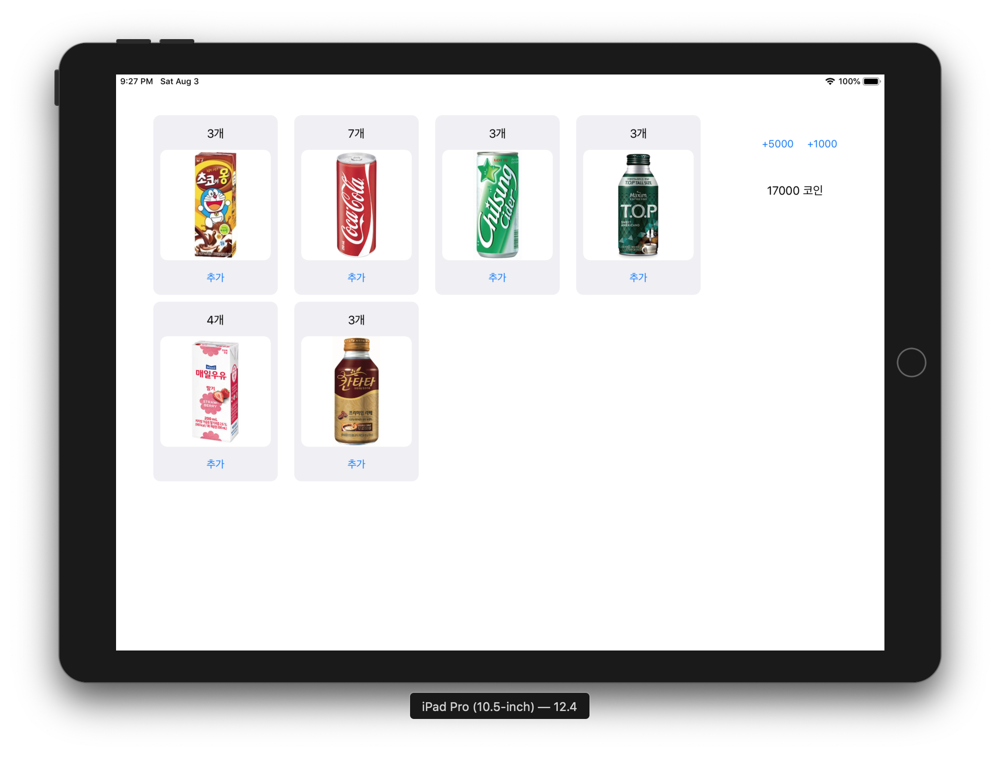

# 음료 자판기 앱

기존 커맨드라인 음료 자판기 모델을 재사용하여 제작하는 음료 자판기 아이패드 앱입니다.

## Step1 (2019-07-16)

ViewController에 모델을 연결함.

## Step2 (2019-08-03)

MVC 패턴을 적용하여 음료 재고 추가 및 잔액 추가를 구현함.

Collection View를 사용하여 음료 객체를 표시함.



## Step3 (2019-08-19)

Codable 프로토콜을 준수하도록 하여 객체를 UserDefaults에 저장하도록 함.
Codable을 준수하면 PropertyListEncoder/Decoder 및 JSONEncoder/Decoder 등에서 인코딩/디코딩을 할 수 있음.
```swift
// 인코딩 시 호출되는 메소드
func encode(to encoder: Encoder) throws

// 디코딩 시 호출되는 이니셜라이저
required init(from decoder: Decoder) throws
```

### Codable로 UIImage 저장하기
```swift
// 인코딩
func encode(to encoder: Encoder) throws {

    // CodingKeys로부터 컨테이너를 생성합니다.
    var container = encoder.container(keyedBy: CodingKeys.self)
    
    // photo 프로퍼티로부터 Data 유형의 객체를 생성합니다.
    let photoData = photo?.jpegData(compressionQuality: 1)
    
    // 적합한 CodingKey에 인코딩합니다.
    try container.encode(photoData, forKey: .photo)
}

// 디코딩
required init(from decoder: Decoder) throws {

    // CodingKeys로부터 컨테이너를 생성합니다.
    let container = try decoder.container(keyedBy: CodingKeys.self)
    
    // Data 유형의 객체를 적합한 CodingKey를 통해 디코딩하여 생성합니다.
    let photoData = try container.decode(Data.self, forKey: .photo)
    
    // Data 유형으로부터 UIImage를 초기화합니다.
    self.photo = UIImage(data: photoData)
}
```


### NSCoding 사용하기
클래스에 NSObject를 상속받고 NSCoding 프로토콜을 채택해야 한다. 그리고 두 개의 메소드를 구현해야 한다.
```swift
// 인코딩
encode(with coder: NSCoder)
// 디코딩
required init?(coder: NSCoder)
```
### 구현 방법
```swift
func encode(with coder: NSCoder) {
    coder.encode(myProperty, forKey: "myProperty")
}

required convenience init?(coder aDecoder: NSCoder) {
		// 필요하다면 as?를 사용하여 조건부 캐스트를 해줍니다.
    let myProperty = coder.decodeObject(forKey: "myProperty")
    // 지정 이니셜라이저를 호출하여 초기화를 마칩니다. 또는 직접 프로퍼티에 값을 넣어도 됩니다(convenience 키워드 필요 없음).
    self.init(myProperty: myProperty)
}
```

```swift
// UserDefaults에 저장하기
UserDefaults.standard.set(value, forKey: String)

// UserDefaults에서 로드하기
UserDefaults.standard.data(forKey: String)
// data의 경우 bool 및 interger 등 적합한 유형으로 변경하여 사용할 수 있음
```
`UserDefaults` - 사용자의 기본 정보 저장소입니다.
`.standard` - `UserDefaults`의 싱글톤 객체입니다.

## Step4 (2019-08-21)

자판기 인스턴스를 싱글톤 인스턴스로 만들어 사용함.