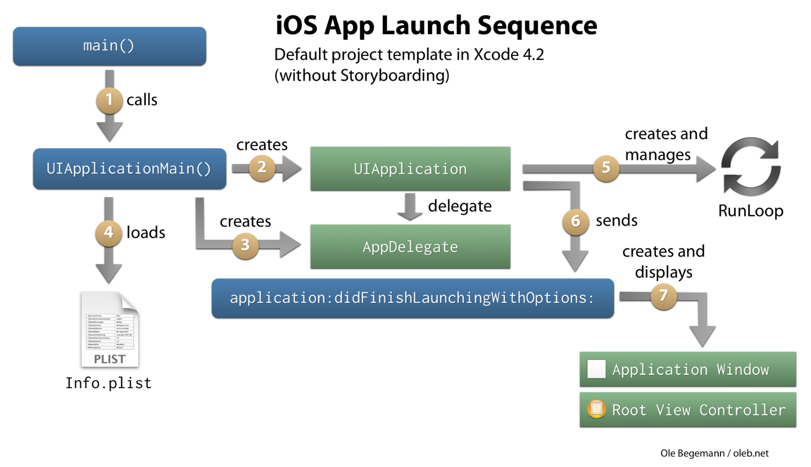

#### The main function of an iOS app




```swift
#import <UIKit/UIKit.h>
#import "AppDelegate.h"
 
int main(int argc, char * argv[])
{
    @autoreleasepool {
        return UIApplicationMain(argc, argv, nil, NSStringFromClass([AppDelegate class]));
    }
}
```

```swift
// main.swift
let argc = CommandLine.argc
let argv = UnsafeMutableRawPointer(CommandLine.unsafeArgv).bindMemory(to: UnsafeMutablePointer<Int8>.self, capacity: Int(CommandLine.argc))
UIApplicationMain(argc, argv, nil, NSStringFromClass(AppDelegate.self))
```

1. main 함수 호출.
2. UIApplicationMain() 함수 호출.
	- UIApplicationMain()함수
		- iOS앱의 엔트리 포인트
		- UIApplication이라는 핵심객체를 생성하고, 스토리보드파일로부터 UI를 읽고, 작성한 커스텀 코드를 호출하여 앱 생성 초기에 필요한 설정을 구현할 수 있게 해준다. -> Info.plist를 바탕으로 필요한 데이터와 객체 로드
		- 이벤트 루프를 실행 시킨다.
3. UIApplicationMain함수에서 UIApplication 객체를 생성하여 반환.
	- UIApplication 객체
		- 앱 자체를 의미.
		- 이벤트 루프나 다른 높은 수준의 앱 동작을 관리.
		- 푸시 알림과 같은 특수한 이벤트를 델리게이트 객체에게 알려줌.
4. AppDelegate객체 생성
		- AppDelegate 와 UIApplication객체
			- UIApplication객체는 앱의 생명주기 관리라든지 이벤트 처리를 담당하고, AppDelegate는 커스텀 코드를 처리한다.
			- AppDelegate는 초기 데이터 구조를 설정하기 위해 좋다.
4. 앱 델리게이트의 메소드 호출.


#### 스위프트에선..
> 스위프트에서는 앱 델리게이트 역할을 할 클래스에 @UIApplicationMain 어노테이션이 있는 델리게이트 클래스를 시스템에 전달.