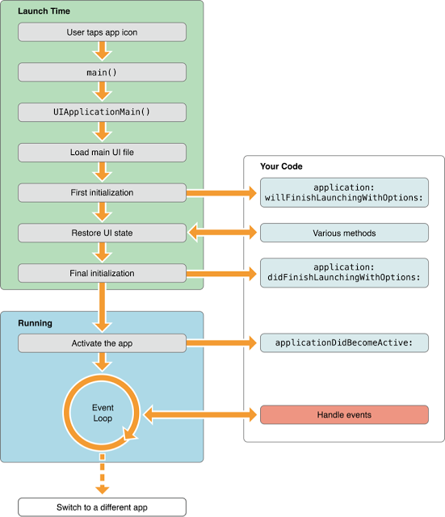

## 건드릴 수 없는 영역: System Framework
### 1. 앱 초기화 과정 (App Loading Process)
1. 앱 실행: **main() 함수 실행됨**
2. main(): **UIApplicationMain() 호출**

	```objective-c
	// main.m
	int UIApplicationMain(
	    int argc, 
	    char *argv[], 
	    NSString *principalClassName, 
	    NSString * appDelegateClassName
	);
	```
	- 세 번째 인자인 `principalClassName`: 앱 객체가 될 클래스 이름. 보통 UIApplication이 들어간다.
	- 네 번째 인자인 `appDelegateClassName`: 앱 델리게이트 클래스 이름. 메인 nib 파일(MainWindow.xib) 내에 객체가 이미 만들어져 있기 때문에 넘겨줄 필요 없다.
	- 메인 nib 파일을 쓰지 않는 경우

	```objective-c
	#import <UIKit/UIKit.h>
	#import "MYAppDelegate.h"

	int main(int argc, const char ** argv) {
        @autoreleasepool{
            return UIApplicationMain(argc, argv, nil,   
                     // 앱 델리게이트를 만들 수 있는 힌트를 줘야 한다.
                     NSStringFromClass([MYAppDelegate class]));
        }
    }
	```

3. UIApplicationMain(): **UIApplication 객체 생성**
4. UIApplication 객체: Info.plist 파일을 바탕으로 앱에 필요한 데이터와 객체 로드
	- 앱 로딩 과정에서 참조해야 하는 수많은 정보들은 소스코드가 아니라 Info.plist에 정의된다.
5. **AppDelegate 객체 생성** 및 UIApplication 객체와 연결

	------------ **스위프트는 C 기반 언어가 아니기 때문에, 엔트리 포인트가 없으며 어노테이션 표기로 대체함: @UIApplicationMain** (1~5 과정은 생략된다) ------------

6. 이벤트 루프 생성 등 실행에 필요한 준비 진행
7. 실행 완료 직전, **AppDelegate의 application(_:didFinishLaunchingWithOptions:) 메소드 호출**

[참고: Wireframe](https://soooprmx.com/archives/4454)

#### 엔트리 포인트: main()
- Xcode 프로젝트 생성 시 main(int argc, char* arg[])함수가 자동으로 생성됨.
- 실행 시 시스템으로부터 받은 2개의 인자값과 AppDelegate 클래스를 이용하여 UIApplicationMain() 함수 호출 -> UIApplication 객체 반환.

#### 앱 그 자체를 의미하는 객체: UIApplication
- UIAppliaction 객체는 이벤트 루프나 다른 높은 수준의 앱 동작을 관리하거나 푸시알림 등의 특수 이벤트를 델리게이트에게 알려주는 등의 일을 한다. 
- 이 때, **UIApplication을 서브 클래싱하지 않고 그대로 사용하기에는 한계가 있는데**, 특정 의도나 목적에 맞게 특별한 일을 처리해야 할 때가 많기 때문이다.
- 따라서 UIApplication 객체는 **대리인인 AppDelegate 객체를 내세워 커스텀 코드를 처리할 수 있도록 약간의 권한을 부여**한다.
- 이에 따라 UIApplication은 앱의 생명주기나 이벤트 처리와 같이 중요한 일들을 담당하고, AppDelegate는 커스텀 코드를 처리하게 된다.

#### 위임받은 권한을 이용하여 커스텀코드와 상호작용하는 객체: AppDelegate
- 앱이 시작되면 앱 델리게이트는 `application(_:didFinishLaunchingWithOptions:)` 메시지를 받게 되는데, 이 시점에 **크리티컬한 데이터를 초기화**하면 된다. 단, 앱이 화면에 나타나기 전이므로 시간이 많이 걸리는 작업은 하지 않는 것이 좋다.
- AppDelegate 객체는 커스터마이징하거나 서브클래싱 할 수 있도록 오픈되어 있다. 
- 앱 내에서 **오직 하나의 인스턴스**만 생성되도록 보장받는다.
- **앱 전체의 생명주기와 함께 한다**. 앱이 처음 만들어질 때 객체가 생성되고, 앱이 실행되는동안 유지되다가, 앱이 종료되면 소멸한다.
- 따라서 AppDelegate 객체는 **종종 앱의 초기 데이터 구조를 설정하기 위해 사용되기도 한다**. (AppDelegate 객체에 데이터를 저장하면 앱 종료 전까지 데이터를 유지할 수 있으므로)


