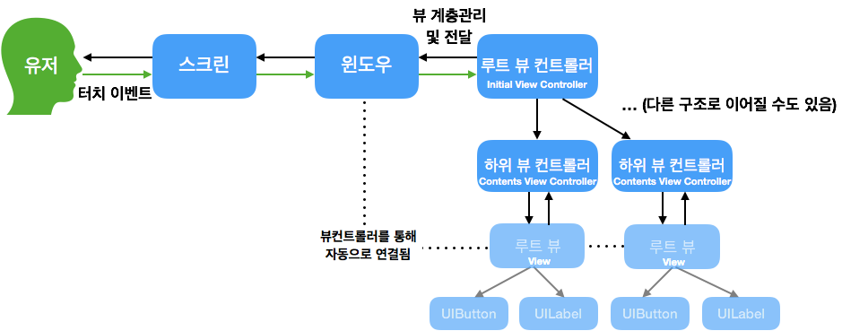

## 앱 인터페이스와 구성요소
### 화면을 구성하는 세 가지 주요객체
1. **UIScreen**: 기기에 연결되는 물리적인 화면을 정의하는 객체
2. **UIWindow**: 화면 그리기 지원 도구를 제공하는 객체. 
	- 디바이스 스크린을 빈틈없이 채우기 위한 객체
	- 항상 유저 인터페이스 표현 계층의 최상위에 위치한다. 
	- 뷰의 일종이지만 **직접 콘텐츠를 가지지 않는다**. **UIView들이 콘텐츠를 표현하면 디바이스 스크린에 이를 표현**한다.
	- **화면이 전환되더라도 윈도우 객체는 전환되지 않는다**. 내부에 배치된 뷰의 콘텐츠만 변경된다.
3. **UIView**: 그리기를 수행할 객체 세트
	- 콘텐츠를 담아 스크린상에 표시한다. 
	- 사용자의 입력에 반응한다. 
	- 윈도우의 일부를 자신의 영역으로 정의하고, 이에 필요한 콘텐츠를 채워넣는다.
	- **윈도우로부터 전달된 사용자 입력에 반응**하고 그에 맞는 결과를 처리한다.

