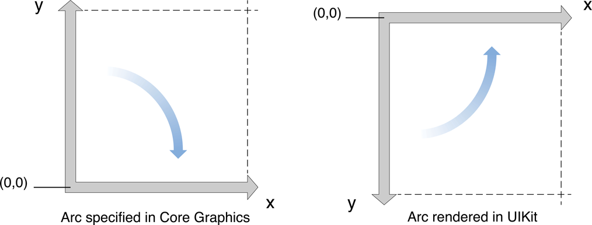

## Arcs and Rotations
- **CGContextAddArc**나 **CGPathAddArc**를 사용해서 곡선을 그리게 되면 **LLO 좌표시스템을 사용**하기 때문에, CTM을 UIKit 뷰에 맞게 flip해줘야 한다.
- CG 함수를 이용해 호를 그리게 되면 **endpoint가 UIBezierPath 클래스를 통해 만든 원호와 반대방향에 표시될 것**이다. 예를 들어, 아래쪽을 가리키는 화살표가 위쪽을 가리키고, 호의 굴절이 있는 방향도 다르다. 
- 따라서 CG를 사용해 그려진 **호의 방향을 ULO 좌표 시스템에 맞게 변경해줘야** 한다. 이 방향은 startAngle과 endAngle 파라미터로 변경할 수 있다.
- **startAngle**: **디폴트값은 0도**이며, 원의 오른쪽 수평. ios에서는 **시계방향이 positive angle**이다. (따라서 -90도는 top을 가리킴)



### Drawing Shapes using Bezier Paths
#### path 구축 과정
    1. path 객체 생성
    2. path에 드로잉 속성 세팅: lineWidth 등
    3. 시작점 세팅: moveToPoint
    4. 선 및 곡선 세그먼트 추가: subpath 정의
    5. 곡선 닫기: closePath (옵션)
    6. 3~5 단계 반복:  추가적인 subpath 정의 (옵션)

- path를 구축할 때 원점(0,0)을 기준으로 점들을 배치해야 한다. 이렇게 해야 나중에 path를 이동하는 것이 쉽다. 그리는 동안 path의 점이 현재 그래픽 컨텍스트의 좌표계에 적용된다. 경로가 원점에 비례하여 지정된 경우에는 translation factor를 사용하여 affine 변환을 현재 그래픽 환경에 적용하기만 하면 된다. path 객체 자체를 변경하지 않고, 그래픽 컨텍스트를 수정하면 그래픽 상태를 저장하고 복원하여 변환을 쉽게 실행취소 할 수 있는 이점이 있다. (그래픽 컨텍스트를 변경하는 방법이 더 선호된다. - CGContextTranslateCTM 메소드)
- path 그리기: stroke 및 fill 메소드 사용

### 렌더링
#### UIBezierPath 객체 생성 후, stroke이나 fill 메소드를 호출하기 전 스텝:
    1. UIColor 클래스를 사용하여 stroke, fill 색상 지정
    2. 위치시키기: (0,0) 기준으로 path를 생성한 경우, 현재 드로잉 컨텍스트에 affine 변환을 적용할 수 있다. 예를 들어, (10,10) 기준으로 도형을 그리고 싶으면 CGContextTranslateCTM 메소드를 호출해서 (10, 10)을 주면 된다.
        - 일반적으로 그래픽 컨텍스트를 변경하는 것이 path 객체의 점을 변경하는 것보다 선호된다.
    3. 갱신하기

#### Bezier path는 렌더링될 컨텍스트가 필요하다. (혼자서는 렌더링되지 않음) 컨텍스트를 가져오는 3가지 방법:
    - CGContext 사용
    - UIView를 서브클래싱하여 draw() 를 호출하면 컨텍스트가 자동으로 제공됨
    - CAShapeLayer 객체 생성하여 사용
[출처: APPCODA](https://www.appcoda.com/bezier-paths-introduction/)

```swift
- (void)drawRect:(CGRect)rect
{
	// UIBezierPath 객체 생성
	UIBezierPath *aPath = [UIBezierPath bezierPathWithOvalInRect: CGRectMake(0, 0, 200, 100)];
	
	// 색상 세팅
	[[UIColor blackColor] setStroke];
	[[UIColor redColor] setFill];

	// UIKit으로 설정한 현재 컨텍스트를 CG 컨텍스트로 가져옴
	CGContextRef aRef = UIGraphicsGetCurrentContext();

	// 이 도형 이후에 더 그릴 것이 있으면, 변형되기 전에 현재 상태를 저장
	//CGContextSaveGState(aRef);

	// 원점을 일시적으로 변경 - (50, 50)
	CGContextTranslateCTM(aRef, 50, 50);

	// 추가적인 드로잉 옵션
	aPath.lineWidth = 5;

	// Fill을 Stroke보다 먼저 해야 Stroke의 색상이 Fill 색상에 먹히지 않는다.
	[aPath fill];
	[aPath stroke];

	// 다른 콘텐츠를 그리기 전에 현재 상태를 저장
	//CGContextRestoreGState(aRef);
```

[출처: Apple Developer Documents - Drawing Shapes Using Bezier Paths](https://developer.apple.com/library/content/documentation/2DDrawing/Conceptual/DrawingPrintingiOS/BezierPaths/BezierPaths.html#//apple_ref/doc/uid/TP40010156-CH11-SW1)