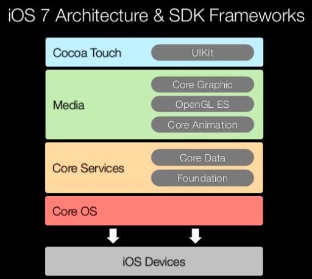

## 건드릴 수 없는 영역: System Framework
### 5. iOS와 코코아 터치 프레임워크
#### 네이티브 앱과 웹 앱의 차이점
- **네이티브 앱**: iOS 시스템 프레임워크를 기반으로 하고 스위프트/오브젝티브-C 언어로 개발되며 iOS를 통해 직접 실행되는 앱
- **웹 앱**: 사파리 브라우저를 통해 실행되는 앱으로, 네이티브 앱과 유사한 UI, 기능을 제공할 수 있도록 제작하는 앱
- 네이티브 앱은 기기에 물리적으로 설치되기 때문에 네트워크 없이도 실행 가능하나, 웹 앱은 네트워크가 연결되지 않은 상태에서는 이용할 수 없다.
- 또한, **iOS는 기기와 네이티브 앱 사이를 중계**하는 반면, 웹 앱은 하드웨어 기능 사용에 제약이 많기 때문에 대체재로 사용되기엔 무리가 있다.

#### 하드웨어와 앱 사이를 중계해주는 iOS 인터페이스: 코코아 터치 프레임워크
- 애플 환경에서 터치 기반의 앱 제작을 위한 도구로, 용도에 따라 여러 개의 하위 프레임워크로 나뉜다.
- 주요 프레임워크:
	- **Foundation** - 어플리케이션 핵심 객체, 네트워크, 문자열 처리 등의 서비스 제공
	- **UIKit** - 유저 인터페이스 제공 (아이폰, 아이패드, 애플워치, 애플TV 등 지원)
	- GameKit - 게임 센터 연동, 근거리 P2P 연결 제공
	- iAd - 앱 내 배너 형태 또는 팝업 형태의 광고 삽입 가능
	- MapKit - 위치 정보, 지도 관련 서비스 이용 가능
	- Address Book UI - 주소록 앱의 인터페이스 및 기능을 커스텀 앱에서도 그대로 사용할 수 있도록 지원
	- EventKit UI - 이벤트 처리에 필요한 유저 인터페이스 제공
	- Message UI - 메시지 앱의 인터페이스 및 기능을 커스텀 앱에서도 그대로 사용할 수 있도록 지원
	- UserNotifications - 사용자 알림을 처리하기 위해 필요한 객체들 제공
- 코코아 프레임워크?
	- macOS에서 쓰이는 프레임워크로, 코코아 터치 프레임워크는 이를 바탕으로 만들어졌다.
	- 코코아 프레임워크도 동일한 Foundation 프레임워크를 가지며, UIKit 대신 데스크톱용 유저 인터페이스를 담당하는 AppKit 프레임워크를 가진다.
	- macOS 외에 iOS, watchOS, tvOS 모두 코코아 터치 프레임워크를 사용한다.

#### 프레임워크의 계층 관계
- 보통은 상위 프레임워크만 가지고 앱을 만들 수 있으나, 상위 프레임워크가 제공하지 않는 기능을 구현해야 할 때는 하위 프레임워크를 알아야 한다.
- iOS 프레임워크 계층 구조:

[출처: slideshare](https://www.slideshare.net/vutlam9083/session-1-introduction-to-i-os-7-and-sdk)
	- 코어 OS 계층: iOS가 운영체제로서 기능하기 위한 핵심 영역으로, 커널, 파일시스템, 네트워크, 보안, 전원관리, 디바이스 드라이브 등이 포함된다.
	- 코어 서비스 계층: 핵심 서비스 기능(Foundation), 데이터 저장 기능(Core Data), 센서 기반 서비스 제공. Foundation이 의존하는 CoreFoundation도 포함되며, Core Location, Core Motion, Core Animation 등이 포함돼 있다.
	- 미디어 계층: 그래픽 또는 멀티미디어 관련 서비스 제공. Core Graphics, Core Text, Core Audio, Core Animation, AVFoundation, OpenGL ES 등이 포함된다.
	- 코코아 터치 계층: 어플리케이션을 직접 지원하는 역할. UIKit, Game Kit, Map Kit 등이 포함된다.
- 주요 프레임워크들은 자신에게 속해있는 객체 이름에 특정 접두어를 붙이는 경향이 있다.
	- Foundation: NS-
	- UIKit: UI-
	- UserNotifications: UN-
	- MapKit: MK-
	- Core Foundation: CF-
	- Core Graphics: CG-
	- AVFoundation: AV-

**[출처: 꼼꼼한 재은씨의 스위프트3](http://www.kyobobook.co.kr/product/detailViewKor.laf?ejkGb=KOR&barcode=9791186710104)**
