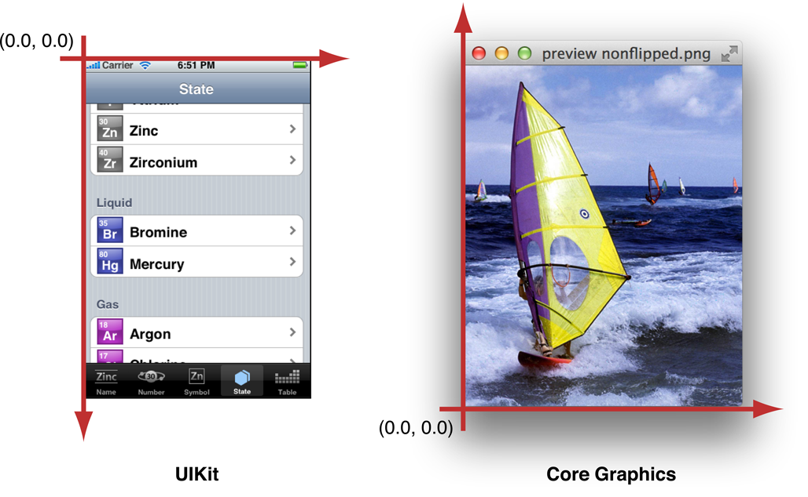
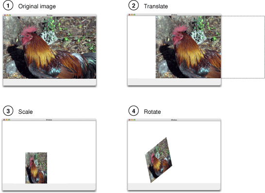

## View Drawing Cycle
- UIView 클래스는 업데이트 과정을 쉽고 효율적으로 해줌
    - 뷰가 처음 표시되거나 뷰의 특정 부분이 새로 그려져야 할 때, iOS는 뷰에게 **drawRect 메소드**를 써서 콘텐츠를 그려달라고 요청한다.
    - **뷰 업데이트를 유도하는 몇 가지 액션들**: 
        * **Moving or removing another view** that was partially obscuring your view
        * Making a previously **hidden view visible again** by setting its hidden property to NO
        * **Scrolling a view off** of the screen and then back onto the screen
        * Explicitly calling the **setNeedsDisplay** or setNeedsDisplayInRect: method of your view
    - **위의 경우, 시스템은 자동으로 뷰를 새로 그린다.**
    - 커스텀 뷰의 경우, 반드시 drawRect 메소드를 오버라이드해서 실행해줘야 한다.

## 좌표시스템 in iOS
- **모든 드로잉은 그래픽 컨텍스트 안에서 일어난다**. 그래픽 컨텍스트는 어디에 어떻게 그려야 할지를 설명하는 객체이다.
- 각 그래픽 컨텍스트는 각자의 좌표시스템(Coordinate System)을 가진다.
    - The Drawing (User) Coodinate system: 우리가 드로잉 명령을 수행할 때 사용하는 좌표계
    - The View Coordinate system (base space): view에 상대적인 고정 좌표계
    - The Device Coordinate system: 물리적 화면의 픽셀들을 나타내는 좌표계
- 각 iOS 드로잉 프레임워크들은 현재 그래픽 컨텍스트를 기반으로 기본 좌표계를 형성한다.
- iOS에는 두 가지 메인 좌표 시스템이 있다:
    - **upper-left-origin coordinate system (ULO)**: 좌상단이 시작점인 좌표 시스템. ex. **UIKit, Core Animation**
    - **lower-left-origin coordinate system (LLO)**: 좌하단이 시작점인 좌표 시스템. ex. **Core Graphics 프레임워크**



- **drawRect 메소드가 호출되기 전**에 UIKit은 드로잉 할 그**래픽 컨텍스트를 만들기 위한 기본 좌표계를 형성**한다. 뷰의 drawRect() 메서드 내에서, 앱은 그래픽 컨텍스트를 **명시적으로 참조할 필요 없이** 그래픽 상태 파라미터(예: fill color)를 설정하고 현재 그래픽 컨텍스트로 그릴 수 있다. 이런 **암시적인 그래픽 컨텍스트**는 **ULO 기본 좌표계**를 설정한다.

### Flipping the Default Coordinate System
- UIKit 드로잉의 Flipping은 **CALayer를 수정**하여 드로잉 환경을 **LLO 좌표 시스템과 UIKit의 기본 좌표 시스템(ULO)을 맞추는 역할**을 한다.
- 예를 들어, Core Graphics 함수를 사용해서 그리는 경우, 객체는 view의 컨텍스트에서 뒤집혀서 렌더링된다. 따라서 CTM을 수정하여 객체를 flip해야 한다. 
	- Core Graphics CTM Affine Transform

	
	[출처: Apple Developer Guides - Quarz2D Transforms](https://developer.apple.com/library/content/documentation/GraphicsImaging/Conceptual/drawingwithquartz2d/dq_affine/dq_affine.html)
	
    - 다음과 같이 원점을 영역의 좌상단으로 변환한 후 scale translation을 적용하여 y 좌표를 -1로 수정할 수 있다. (좌하단이 원점)

	```swift
	CGContextSaveGState(graphicsContext);
	CGContextTranslateCTM(graphicsContext, 0.0, imageHeight);
	CGContextScaleCTM(grahpicsContext, 1.0, -1.0);
	CGContextDrawImage(graphicsContext, image, CGRectMake(0, 0, imageWidth, imageHeight);
	CGContextRestoreGState(graphicsContext);
	```

- UIImage 객체를 CG 이미지 객체로 초기화 시: UIKit이 flip transform을 수행해준다. 

### Graphics Context 얻기
- 각각의 뷰 객체들은 **자동으로 그래픽 컨텍스트를 생성**한다.
- 하지만 만약 현재 뷰가 아닌 **다른 뷰에 그리고 싶거나** context 객체를 필요로 하는 **Core Graphics 함수들을 사용해야 한다면**, context를 얻어야 한다.
- **Core Graphics 함수를 사용해야 할 때**: **UIGraphicsGetCurrentContext**를 통해 drawRect()에서 얻을 수 있는 context를 명시적으로 얻을 수 있다.
    - UIKit 뷰에서 Core Graphics 함수를 사용하고 싶으면 UIKit의 ULO 좌표시스템을 이용해야 한다. 또는 CTM에 플립 변환을 적용한 다음, Core Graphics의 LLO 기본좌표계를 사용하여 UIKit 뷰에 객체를 그릴 수 있다.

### Quartz와 UIKit으로 그리기
- Quartz는 iOS의 네이티브 드로잉 기술로 쓰이는 일반적인 이름이다. **Core Graphics 프레임워크는 Quartz의 중심**에 있으며, 컨텐츠를 그리는 데 사용하는 주요 인터페이스이다. 이 프레임워크는 다음을 처리하기 위한 데이터 타입과 기능을 제공한다: 
    * Graphics contexts
    * Paths
    * Images and bitmaps
    * Transparency layers
    * Colors, pattern colors, and color spaces
    * Gradients and shadings
    * Fonts
    * PDF content
- UIKit은 Quartz의 기본적인 특징을 기반으로 하여 주요 그래픽 관련 함수들을 제공한다. 포괄적인 드로잉 세트는 이미 Core Graphics가 제공하고 있기 때문에 **UIKit Graphic 클래스들은 다른 UIKit 클래스들의 드로잉을 지원**한다:
    * **UIImage**, which implements an immutable class for displaying images
    * **UIColor**, which provides basic support for device colors
    * **UIFont**, which provides font information for classes that need it
    * **UIScreen**, which provides basic information about the screen
    * **UIBezierPath**, which enables your app to draw lines, arcs, ovals, and other shapes.
    * Functions for **generating a JPEG or PNG** representation of a UIImage object
    * Functions for **drawing to a bitmap** graphics context
    * Functions for **generating PDF data** by drawing to a PDF graphics context
    * Functions for **drawing rectangles and clipping** the drawing area
    * Functions for changing and getting the **current graphics context**

[출처: Apple Developer Documents - iOS Drawing Concepts](https://developer.apple.com/library/content/documentation/2DDrawing/Conceptual/DrawingPrintingiOS/GraphicsDrawingOverview/GraphicsDrawingOverview.html)