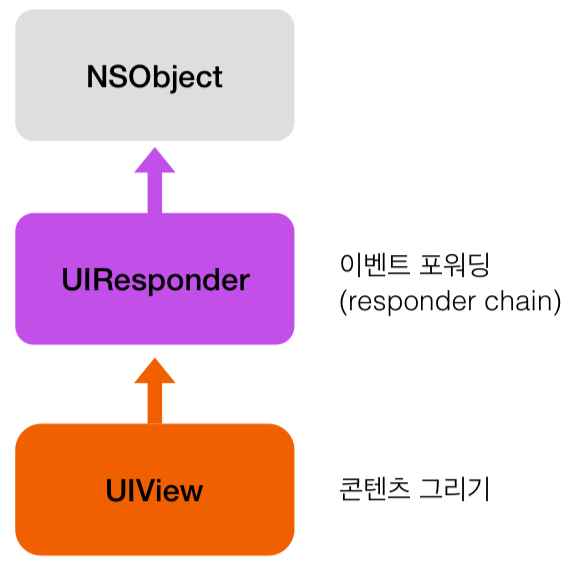

## View Class Hierarchy
- **NSObject > UIResponder > UIView 이다.**

</img>

- 앱은 responder 객체를 통해 이벤트를 받아서 처리하는데, responder 객체는 **UIResponder** 클래스나 서브 클래스인 **UIView**, **UIViewController**, **UIApplication** 클래스의 인스턴스를 말한다.
- responder들은 원시 이벤트 데이터를 받아서 처리하거나 다른 responder 객체에게 포워딩해야 한다.
- 앱이 이벤트를 받으면 UIKit은 해당 이벤트를 가장 적합한 responder 객체에게 주는데, 이것을 **first responder**라고 한다.
- 처리되지 않은 이벤트들은 responder chain을 통해 responder에서 responder로 전달된다.
- UIKit은 이미 responder 객체들이 어떻게 전달되는지 어느정도 정의해뒀지만, 객체 내부의 프로퍼티(next)를 오버라이드하여 룰을 바꿀 수 있다.

## Responder Chain 변경하기
- resonder 객체의 **next** 프로퍼티를 오버라이드하면 변경할 수 있다. 이렇게 하면 next responder는 직접 선정한 객체가 된다.
- 많은 UIKit 클래스들이 이미 next 프로퍼티를 오버라이드해서 특정 객체를 넘기게 되어있다. 대표적으로:
    - UIView 객체의 next: 
        - 기본적으로 next는 상위 뷰이다.
        - 뷰가 뷰 컨트롤러의 루트 뷰이면, next는 뷰 컨트롤러이다.
    - UiViewController 객체의 next:
        - 뷰 컨트롤러의 뷰가 window의 루트 뷰이면, window 객체
        - 뷰 컨트롤러가 다른 뷰 컨트롤러에 의해 표시된 경우, next는 ‘다른 뷰 컨트롤러’
    - UIWindow 객체의 next: UIApplication 객체
    - UIApplication 객체: UIApplicationDelegate. 단, App Delegate 객체가 UIResponder의 인스턴스이면서 뷰나 뷰컨트롤러, 또는 앱 객체 자체가 아닌 경우에면 해당한다.

[참고: Apple Developer Document - Understanding Event Handling, Responders, and the Responder Chain](https://developer.apple.com/documentation/uikit/touches_presses_and_gestures/understanding_event_handling_responders_and_the_responder_chain)

## First Responder
- Responder Chain의 첫 주자. UIKit은 이벤트를 받으면 우선적으로 **first responder 객체를 지정**하고 해당 responder 객체에게 먼저 보낸다. 
- first responder 객체는 **이벤트 타입에 따라 달라진다**.
    - **Touch events**: 터치 이벤트가 발생한 view
    - **Press events**: 포커스를 가진 responder
    - **Shake-motion events**: 직접 혹은 UIKit이 first resonder로 지정한 객체
    - **Remote-control events**: 직접 혹은 UIKit이 first resonder로 지정한 객체 
    - **Editing menu messages**: 직접 혹은 UIKit이 first resonder로 지정한 객체

>- 모션 이벤트 중, **accelerometers, gyroscopes, magnetometer** 이벤트들은 **responder chain에 연결되지 않는다**. 대신, **Core Motion**이 내가 지정한 객체에게 직접 이벤트를 보낸다. [참고: Core Motion](https://developer.apple.com/documentation/coremotion)
>- **Controls**는 직접 타깃에 액션 메시지를 보낼 수 있다. **액션 메시지는 이벤트가 아니다**. 하지만 **responder chain을 사용할 수 있다**. 만약 컨트롤의 타깃 객체가 nil인 경우, UIKit은 타깃 객체부터 시작하여 적합한 액션 메소드를 구현한 객체를 발견할 때까지 responder chain을 따라 간다.
>- 뷰가 **gesture recognizer**를 가지고 있는 경우, gesture recognizer는 **뷰보다 먼저 이벤트를 받는다**. 
>- 만약 gesture recognizer가 인식되지 않으면 이벤트는 뷰에게 전달된다. 뷰도 이벤트를 처리하지 않으면, UIKit은 responder chain에 이벤트를 보낸다. (즉, gesture recognizer > view > responder chain > to other views…)