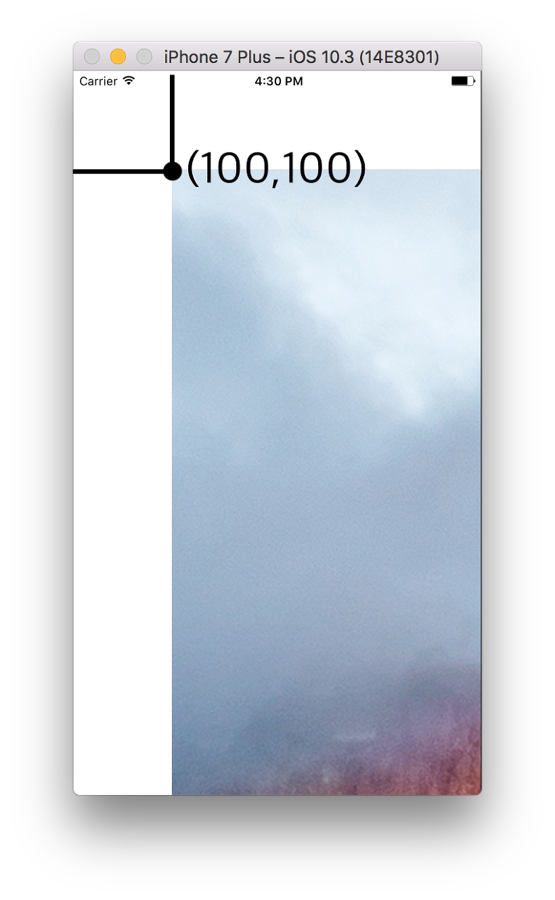

## Frame vs. Bounds
- Geometry: 뷰의 **위치**, **크기**를 표시
- **Frame**: **Superview(상위뷰)의 좌표시스템** 내에서 view의 위치, 크기를 나타냄
- **Center**: **Superview(상위뷰)의 좌표시스템** 내에서 view의 중심 위치를 나타냄
- **Bounds**: **자기자신의 좌표시스템** 내에서 view의 위치, 크기를 나타냄
    - Bounds를 변경하는 것은 **해당 위치에서 view를 다시 그리라**는 의미가 된다. **Bounds는 상위 뷰와 아무런 관련이 없으므로**,  view의 origin을 변경하더라도 내부의 subview가 움직이는 것처럼 보일 수 있다. 
- **Bounds**는 **Scroll View의 핵심**이다.
	- 여기에서 ImageView의 상위 뷰의 Bounds는 화면에 보이는 영역이고, ImageView의 Frame은 이미지 전체영역이다.
	
    - Bounds 변경 시: scrollview **내부에서 특정 위치로 이동하는 것**과 같다.
	
    - Frame 변경 시: **상위 뷰를 기준**으로 scrollview **자체를 이동**
	
**[참고: Zedd0202의 블로그](http://zeddios.tistory.com/203)**