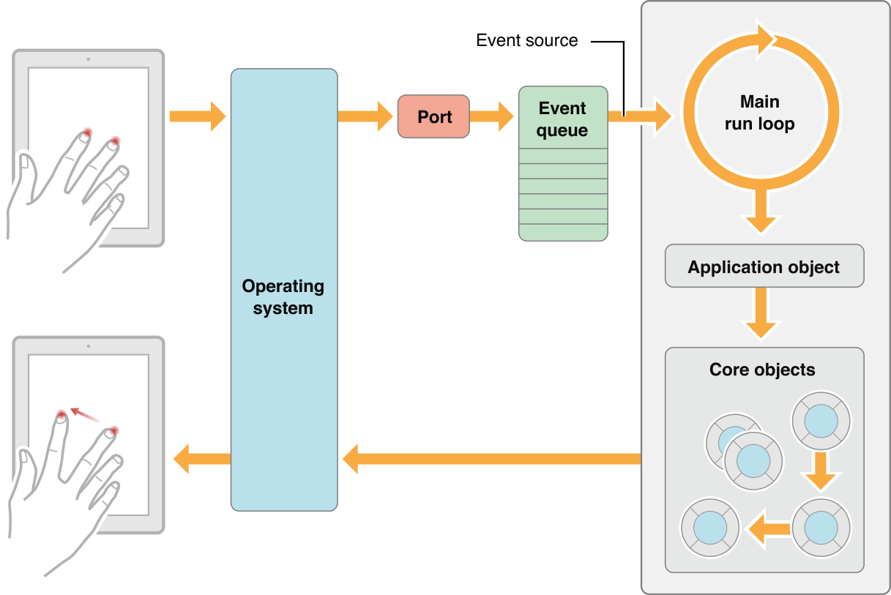
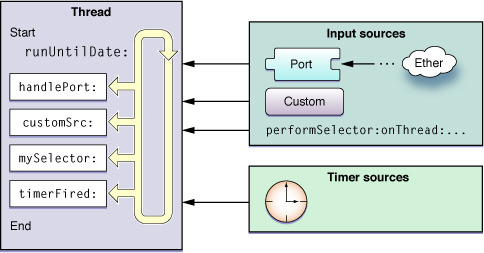

## 건드릴 수 없는 영역: System Framework
### 2. 메인 런 루프(Main Run Loop)
- 메인 런 루프는 앱에 들어오는 이벤트들을 애플리케이션 객체가 처리할 수 있도록 계속해서 라우팅하고, 처리결과로 UI와 상태를 업데이트한다.
- 발생한 여러 이벤트들의 좌표들은 런루프에 추가된다. 
	- 전달받는 이벤트 종류:
		- **입력소스(input source)**: 다른 쓰레드나 애플리케이션에서 **전달**되는 **메시지 이벤트**(**비동기식**)
		- **타이머소스(timer source)**: **예정시간**이나 **반복수행간격**에 따라 **발생**하는 이벤트(**동기식**)
- 모든 쓰레드에서 런루프는 반드시 설정되고 코드에서 수동적으로 실행돼야 하는데, 메인쓰레드를 위한 **메인 런 루프는 애플리케이션 객체에 의해 자동으로 실행**된다. 
- **메인 런루프는 다른 런루프와 달리** 사용자 액션으로 인한 **이벤트를 OS로부터 받는다**.

[참고: Inboon's Story](http://inboony.tistory.com/21)

#### 애플리케이션 객체(Application Object)는 로우레벨 이벤트를 받아 UIEvent로 변환하여 해당하는 객체로 내보낸다.
- 애플리케이션은 각 이벤트를 도착한 순서대로 처리해야 하기 때문에 **로우레벨 이벤트**는 **FIFO 이벤트 큐**에 들어간다.
- 애플리케이션 객체는 **이벤트 최상위에 있는 객체를 취해서 이벤트 객체(UIEvent)로 변환**하고 유저 이벤트가 일어난 **Window에 디스패치**(dispatch)한다.
- 전달한 이벤트가 돌아왔을 때 애플리케이션은 큐에서 다음 객체를 가져와서 디스패치한다. **앱이 종료될 때까지 이 과정을 반복**한다.
- 또한, 앱이 실행되었을 때 **이벤트를 처리하는 책임을 가진 객체들**을 **코어 그룹**으로 설정한다.

#### 코어 객체(Core Objects)는 이벤트에 응답하고 UI를 업데이트한다.
- 애플리케이션 객체에서 보낸 이벤트는 **Window가 먼저 받고**, Window는 이벤트를 처리하기에 가장 적절한 핸들러인 **View에 보낸다**.
- 최초로 받은 뷰가 이벤트를 처리하지 않으면, **응답자 체인(Responder Chain)**을 통해 다른 뷰로 전달된다.
- 뷰는 종종 애플리케이션의 외관을 수정하고 상태나 데이터를 업데이트하는 일련의 액션을 수행한다. 이런 **액션이 완료되면 애플리케이션 객체로 제어가 돌려지며**, 애플리케이션 객체가 이벤트 큐의 다음 이벤트를 취한다.

[참고: App Programming Guide for iOS](https://developer.apple.com/library/content/documentation/iPhone/Conceptual/iPhoneOSProgrammingGuide/TheAppLifeCycle/TheAppLifeCycle.html#//apple_ref/doc/uid/TP40007072-CH2-SW14)

[참고: Github codeport - ios](https://github.com/codeport/ios/wiki/Run-loop)

#### 타이머
- **모든 쓰레드는 런루프에 접근 가능**하다. 
- 메인 쓰레드에서 생성되는 메인 런 루프 외에 모든 쓰레드는 사용자가 직접 추가해야 한다.
- **지속적인 상호작용이 필요한 경우에는 쓰레드와 런루프를 반드시 사용해야** 한다. (예: 통신, 타이머 등)
- 타이머는 스스로 동작기한을 가지고 있어 그 상태로 런루프에 등록된다.
- 런루프는 보통 이벤트가 발생하면 정해진 메소드를 호출하는데, 타이머의 경우 **설정한 기한이 지나는 시점에 타이머를 지켜보다가 호출**한다.
- **NSTimer는 실시간 타이머가 아니다**. 따라서 타이머에 반복되는 작업이 필요할 때, 런루프는 많은 종류의 이벤트를 처리해야 하기 때문에 이를 놓칠 수 있다. 따라서 지연된 작업이나 반복작업은 **실제 시간과 다소 차이가 있을 수 있다**.

[참고: Wireframe](https://soooprmx.com/archives/2362)
