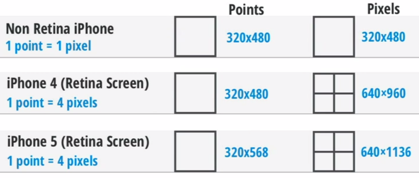

## PPI vs. DPI
- **PPI**: Pixel per Inch, **인쇄물**에 사용되는 단위
- **DPI**: Dot per Inch, **모니터**에 사용되는 단위
- 거의 동일하게 사용된다.

## Point vs. Pixel
- Point: **MAC에서 사용하는 단위**(다른 OS에도 있다)로, **절대적**인 값.
    - 1 pt = 1/72 inch = 약 0.3527
- Pixel: **모니터 해상도를 나타내는 단위**로, **상대적**인 값.
    - 더 이상 쪼개지지 않는 최소 단위

## Original vs. Retina vs. Retina HD
- 1 포인트는 1 픽셀 인가?
    - OS에 따라 다르지만, MAC에서는 같다.
    - 포인트 개념은 **iPhone 4**의 **Retina Display에서 도입**되었다.
- 애플은 **Original Display**에서 **포인트와 픽셀이 같다**고 정의함.
- 하지만 **Retina Display**에서는 **1포인트가 2픽셀**이라고 정의.
- 이에 따라 각 방향마다 픽셀 수가 2배 많아짐
- 도입 이유: 레티나 디스플레이에서 픽셀이 2배로 적용되면 개발자들이 혼란이 올 수 있기 때문에 포인트 개념을 도입하였다. **포인트에 따라 개발을 하면, iOS가 디바이스에 따라 자동으로 포인트를 각 픽셀에 적용 가능하기 때문**이다.
- 또한, **iPhone 6S**부터 **Retina HD Display**가 적용되면서 **1포인트에 3배의 픽셀**을 적용하게 됨.

> Original Display: 1pt = 1px
> Retinal Display: 1pt = 4px
> Retinal HD Display: 1pt = 9px

[참고: Zedd0202의 블로그](http://zeddios.tistory.com/6)

## 세대별 해상도
- 아이폰~아이폰3GS (**Original Display**, **@1x**)
	- 320x480 **px**
	- 320x480 **pt**
- 아이폰4~4S (**Retina Display**, **@2x**)
	- 640x960 **px**
	- 320x480 **pt**
- 아이폰5~5S, SE (**Retina Display**, **@2x**)
	- 640x1136 **px**
	- 320x568 **pt**
- 아이폰6~7 plus (Retina HD Display, @3x)
	- 750x1334 **px**
	- 375x667 **pt**
	- plus: 1080x1920 **px** (540x960 **pt**)

[참고: 위키백과-아이폰](https://ko.wikipedia.org/wiki/아이폰)
