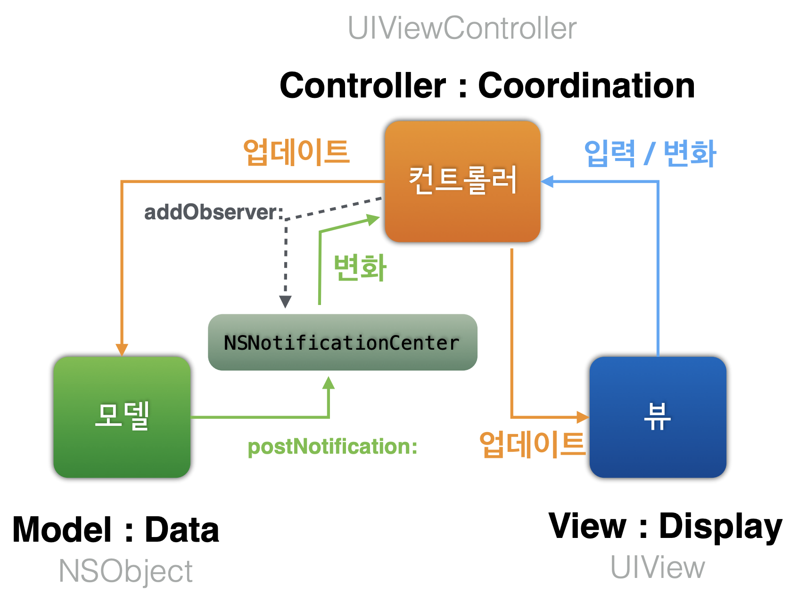

# MVC Pattern 

## 1. Introduction

일반적으로 iOS에서 버튼 등의 컨트롤의 상호작용에 대해서는 Target-Action 디자인패턴을 통해서 구현할 수 있다. 

**Target**은 이벤트 발생시 메시지를 전송할, 즉 Action이 호출될 객체를 의미한다.

- Target을 지정하는 이유? 
  - 특정 이벤트 발생시 어떠한 메소드 `funcA` 를 호출한다고 가정해보자. 이 때, `funcA` 는 A클래스에도, B클래스에도 정의되어 있을 수 있다. 
  - 이렇게 같은 메서드가 여러 클래스에서 정의되어 있는 경우도 있고, 여러 인스턴스가 존재하는 상황도 있다. 
  - 따라서 원하는 객체를 콕 찝어서 Target으로 지정해야 액션 `funcA` 를 실행할 객체를 상황에 따라 선택이 가능하다.

**Action**은 특정 이벤트가 발생시 호출할 메서드를 의미한다.

- IBAction은 컨트롤에 이벤트가 발생할 때 호출하는 대표적인 메서드이다. (sender는 보통 Control 객체 자신을 의미한다.)

- 아래와 같이 Objective-C style의 코드나 Swift의 인터페이스 방식으로 메서드를 구현할 수 있다.

  - @Objective-C 언어로 작성된 코드를 스위프트와 호환하기 위해서는 Attribute @objc를 붙여준다.

  ```swift
  ///objective-c style programming
  @objc func funcA(_sender: UIButton){
    //do something
  }
  
  ///Interface Builder
  @IBAction func funcA(_ sender: UIButton){
    //do soemthing as above
  }
  ```

객체는 이벤트 발생시 다른 객체에 메시지를 보내는데, 메시지는 수신객체에서 이벤트 핸들링을 위해 필요한 정보를 포함한다.

- sender에 들어오는 객체에 따라 다양한 정보를 갖는다.

컨트롤 이벤트는 여러 가지가 존재한다

- 1) **touchDown** (UIControlEvents.touchDown)
  - 컨트롤 터치 시 발생하는 이벤트
- 2) **touchDownRepeat** (UIControlEvents.touchDownRepeat)
  - 컨트롤 연속 터치 시 발생하는 이벤트

- 3) **touchDragInside** (UIControlEvents.touchDragInside)

- - 컨트롤 범위 내에서 터치한 영역을 드래그 시 발생하는 이벤트

- 4) **touchDragOutside** (UIControlEvents.touchDragOutside)

- - 터치 영역이 컨트롤의 바깥쪽에서 드래그 할 때 발생하는 이벤트

- 5) **touchDragEnter** (UIControlEvents.touchDragEnter)

- - 터치 영역이 컨트롤의 일정 영역 바깥쪽으로 나갔다가 다시 들어왔을 때 발생하는 이벤트

- 6) **touchDragExit** (UIControlEvents.touchDragExit)

- - 터치 영역이 컨트롤의 일정 영역 바깥쪽으로 나갔을 때 발생하는 이벤트

- 7) **touchUpInside** (UIControlEvents.touchUpInside)

- - 컨트롤 영역 안쪽에서 터치 후 뗐을때 발생하는 이벤트

- 8) **touchUpOutside **(UIControlEvents.touchUpOutside)

- - 컨트롤 영역 안쪽에서 터치 후 컨트롤 밖에서 뗐을때 이벤트

- 9) **touchCancel** (UIControlEvents.touchCancel)

- - 터치를 취소하는 이벤트 (touchUp 이벤트가 발생되지 않음)

- 10) **valueChanged** (UIControlEvents.valueChanged)

- - 터치를 드래그 및 다른 방법으로 조작하여 값이 변경되었을때 발생하는 이벤트

- 11) **primaryActionTriggered** (UIControlEvents.primaryActionTriggered)

- - 버튼이 눌릴때 발생하는 이벤트 (iOS보다는 tvOS에서 사용)

- 12) **editingDidBegin** (UIControlEvents.editingDidBegin)

- - `UITextField`에서 편집이 시작될 때 호출되는 이벤트

- 13) **editingChanged** (UIControlEvents.editingChanged)

- - `UITextField`에서 값이 바뀔 때마다 호출되는 이벤트

- 14) **editingDidEnd** (UIControlEvents.editingDidEnd)

- - `UITextField`에서 외부객체와의 상호작용으로 인해 편집이 종료되었을 때 발생하는 이벤트

- 15) **editingDidEndOnExit** (UIControlEvents.editingDidEndOnExit)

- - `UITextField`의 편집상태에서 키보드의 `return` 키를 터치했을 때 발생하는 이벤트

- 16) **allTouchEvents** (UIControlEvents.allTouchEvents)

- - 모든 터치 이벤트

- 17) **allEditingEvents** (UIControlEvents.allEditingEvents)

- - `UITextField`에서 편집작업의 이벤트

- 18) **applicationReserved** (UIControlEvents.applicationReserved)

- - 각각의 애플리케이션에서 프로그래머가 임의로 지정할 수 있는 이벤트 값의 범위

- 19) **systemReserved** (UIControlEvents.systemReserved)

- - 프레임워크 내에서 사용하는 예약된 이벤트 값의 범위

- 20) **allEvents** (UIControlEvents.allEvents)

- - 시스템 이벤트를 포함한 모든 이벤트

- 

[참고자료 출처](https://www.edwith.org/boostcourse-ios/lecture/16854/) 

[공식문서 - Target-Action](https://developer.apple.com/library/archive/documentation/General/Conceptual/Devpedia-CocoaApp/TargetAction.html)

[UIControlEvents](https://developer.apple.com/documentation/uikit/uicontrolevents)

[HIG - controls](https://developer.apple.com/design/human-interface-guidelines/ios/controls/buttons/)

[uikit - uicontrol](https://developer.apple.com/documentation/uikit/uicontrol)


---


## 2. MVC Pattern

> **Model / View / Controller 구조의 아키텍처 디자인 패턴을 의미한다.**

- Model : 사용자에게 보여줄 데이터나 서비스로직을 담당한다.
  - Data / Service logic(algorithms) / Network / Proxy ..

- View : 모델을 서비스로직에 맞게 표현하고, 사용자와의 상호작용을 담당하는 역할을 한다.
  - Display / Event Capture / Visualize / Widget ..

- Controller : Model과 View 사이를 조정하는 역할을 한다.
  - compose / delegation / specific works


### MVC in iOS

- stanford iOS 강의 중 MVC 구조 참고

  

- View와 Model은 절대로 서로에게 직접 접근하지 않습니다.	

  - 서로에게 독립적입니다.

- 컨트롤러는 모델과 뷰에 접근하여 값을 전달/받아옵니다. 

  - 단, Model > Controller로의 접근, View > Controller로의 접근은 MVC 패턴에 어긋납니다.
    - 모델은 데이터의 값의 변경/관리가 역할입니다.
    - 뷰는 화면 갱신하고 사용자의 상호작용을 전달하는 것이 주 역할입니다.
  - 어디까지나 Controller가 접근의 주체가 됩니다.

### Model —x—> Controller...**Then, how to nofity Model's update to Controller?** 

> **Observer Pattern을 사용한 NotificationCenter를 사용**

- **`Notification (or KVO)를 사용`** 해서 모델의 값이 바뀌었을 때, 이를 Controller에게 전달합니다.
- Notification은 Model의 값이 바뀌었을때, Controller에게 바뀐 값을 직접 전달하지 않고, 그냥 자신의 값이 바뀌었다는 사실을 통보만 합니다.
- Controller는 자기에게 등록된 옵저버를 통해서 해당 Notification이 자신에게 해당되는 것이라면, 해당 Noti를 보낸 Model에 접근합니다. 


### View —x—> Controller… Then, how to nofity ? 

> **Delegate Pattern을 사용한 Delegate/DataSource 사용**

- iOS에서는 **`Delegate(or DataSource)`** 를 사용하여 해결합니다.
- Delegate는 화면에 대한 유저의 상호작용으로 이벤트 발생시 프로그램에서 해야 할 일들을 `Controller` 에게 위임합니다.
- 이를 통해서 View의 변화에 대응하는 로직을 Controller에 위치시킬 수 있다. 
- 나중에 TableView나 CollectionView 등을 정리하면서 Delegate/DataSource에 대해 정리하여 링크를 추가할 예정입니다.


###  MVC 특징

- 역할 분담을 고려한 구조

- 각자의 역할에 집중하면 되므로 생산성이 향상됨

  

### loose coupling추구로 인한 장점

-  유연하고, 모델-뷰-컨트롤러 사이의 결합도를 낮춘다. 
- 특정 모델/뷰/컨트롤러에 프로그램이 의존성이 심화되지 않도록 한 설계


### iOS MVC의 특징 (단점)

- MVC 분리가 완전하지 않아서 (특히 뷰와 컨트롤러), View의 생명주기, 네트워크 통신 등을 컨트롤러가 담당하여 **컨트롤러의 역할이 지나치게 커지는 경향**이 있다. 
  - (Web framework인  Spring에서는 Controller의 역할이 이에 비하면 상당히 적었던 기억이 있다.)
-  cf. MVC 구조는 Test에 적합한가?


### MVC 보완(대체) 아키텍처 

- MVC-N
- MVP
- MVVN
- VIPER


## 3. NotificationCenter

- NSNotification을 중계해주는 역할을 하는 객체이다. 
- 인스턴스를 직접 생성하지 않고, 앱 프로젝트에 싱글턴 인스턴스로 존재한다. 
  - `NSNotificationCenter.default`
- NSNotificationCenter는 앱에 전역으로 존재한다.




### 작동 방식 예

- **addObserver**메서드를 통해 옵저버를 등록한다.

  -  [addObserver(_:selector:name:object:)](apple-reference-documentation://hszAPoyDAF) or [addObserver(forName:object:queue:using:)](apple-reference-documentation://hsY3HocvnR) 

  - addObserver에서 object는 Notification을 보낼 Sender를 지칭하는 것이다. nil 로 설정하는 경우 모든 Sender로부터 오는 해당 Notification.Name에 대해 다 수신하겠다는 의미가 된다.

    

- **post Notification**

  - NotificationCenter.default.**post** 메서드로 Notification이 발생했음을 센터에 전송할 수 있다.

- 등록된 옵저버의 **selector(handler 함수)**로 Notification을 전달한다.
  - 이때, post시에 NSNotification에 등록한 name에 맞는 옵저버로 Notification이 전달된다.
  - post시에 object, userInfo 등 부수적인 정보를 Notification으로 전달할 수 있고, selector 메서드에서 이를 받아서 사용할 수 있다.

- **removeObserver**를 통해 소속된 인스턴스가 사라졌을 때, NSNC에서도 옵저버를 제거해주어야 한다.
  - removeObserver:name:object: 등으로 필요한 특정 옵저버만 제거할 수 있다.


### 참고자료

[iOS에서 MVC 사용하기](https://medium.com/ios-development-with-swift/mvc-패턴-in-ios-7751911f8ca8)

코드스쿼드 강의자료

